# Definição

## 1 Definição {.unnumbered .unlisted}

::: {style="border-style: solid; border-width: 3px; padding-bottom: 0px; padding-right: 12px; padding-left: 12px; font-size:70%;"}

**Exemplo 1:** Uma amostra de $n$ componentes é submetida a testes para verificar os defeituosos e os não defeituosos. Nesse experimento, podemos definir o espaço amostral
$$
\newcommand{\invisible}[1]{\color{white}{#1}}
\Omega = \{\omega = (z_1, \ldots, z_n) : z_i \in \{S,F\} \},
$$
em que $S =$ "componente defeituoso" e $F =$ "componente não defeituoso".

::: 

::: {.callout-caution}
## Observação

Como visto acima, o espaço amostral pode assumir formas bem abstratas. No entanto, em muitos casos, é de interesse associar um valor numérico a cada resultado de $\Omega$.
:::

## 1 Definição {.unnumbered .unlisted}

::: {style="border-style: solid; border-width: 3px; padding-bottom: 0px; padding-right: 12px; padding-left: 12px; font-size:70%;"}

**Exemplo 1 (cont.):** No exemplo anterior, suponha $n=3$, então
$$
\Omega = \{(FFF),(SFF),(FSF),(FFS),(SSF),(SFS),(FSS),(SSS)\}.
$$
Pode ser interesse registrar apenas o número de componentes defeituosos e não as falhas individuais (se $n$ grande por exemplo). Assim, teríamos $X(\omega) =$ "número de componentes defeituosos em $\omega$" e:

::: incremental

-   $X(FFF) = 0$;
-   $X(SFF) = X(FSF) = X(FFS) = 1$;
-   $X(SSF) = X(SFS) = X(FSS) = 2$; e
-   $X(SSS) = 3$.

:::

:::

::: fragment

::: {.callout-caution}
## Observação

O tipo de situação acima nos leva a definição de [**variáveis aleatórias**]{style="color:red;"}.
:::

:::

## 1 Definição {.unnumbered .unlisted}

::: {.callout-note}
## Definição - Variáveis Aleatórias

Seja $\Omega$ espaço amostral de um experimento aleatório. Uma **variável aleatória** (va) é qualquer regra que associe um valor numérico real a cada resultado de $\Omega$.
:::

::: {.callout-caution}
## Observações

Da definição de va, podemos fazer os seguintes apontamentos:

1.    Variáveis aleatórias normalmente são denotadas por letras maiúsculas do final do alfabeto, tais como $X$, $Y$, $Z$, entre outras;
2.    Matematicamente, podemos definir $X$ como va se $X : \Omega \to \mathbb{R}$;
3.    Podemos também escrever $X(\omega) = x$ para dizer que $x$ é o valor atribuído a $\omega$ pela va $X$.
:::

## 1 Definição {.unnumbered .unlisted}

::: columns

::: {.column #vcenter width=55%}

::: {style="border-style: solid; border-width: 3px; padding-bottom: 0px; padding-right: 12px; padding-left: 12px; font-size:70%;"}

**Exemplo 1 (cont.):**

<figure>
  
</figure>

:::

:::

::: {.column #vcenter width=45%}

:::

:::

## 1 Definição {.unnumbered .unlisted}

::: columns

::: {.column #vcenter width=55%}

::: {style="border-style: solid; border-width: 3px; padding-bottom: 0px; padding-right: 12px; padding-left: 12px; font-size:70%;"}

**Exemplo 1 (cont.):**

<figure>
  
</figure>

:::

:::

::: {.column #vcenter width=45%}

:::

:::

## 1 Definição {.unnumbered .unlisted}

::: columns

::: {.column #vcenter width=55%}

::: {style="border-style: solid; border-width: 3px; padding-bottom: 0px; padding-right: 12px; padding-left: 12px; font-size:70%;"}

**Exemplo 1 (cont.):**

<figure>
  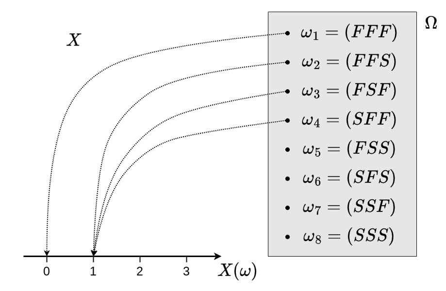
</figure>

:::

:::

::: {.column #vcenter width=45%}

:::

:::

## 1 Definição {.unnumbered .unlisted}

::: columns

::: {.column #vcenter width=55%}

::: {style="border-style: solid; border-width: 3px; padding-bottom: 0px; padding-right: 12px; padding-left: 12px; font-size:70%;"}

**Exemplo 1 (cont.):**

<figure>
  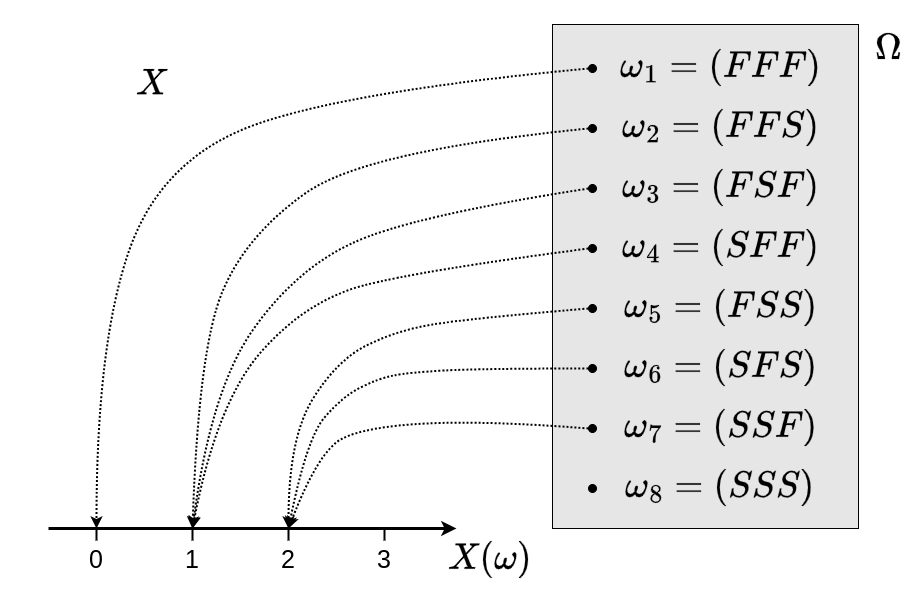
</figure>

:::

:::

::: {.column #vcenter width=45%}

:::

:::

## 1 Definição {.unnumbered .unlisted}

::: columns

::: {.column #vcenter width=55%}

::: {style="border-style: solid; border-width: 3px; padding-bottom: 0px; padding-right: 12px; padding-left: 12px; font-size:70%;"}

**Exemplo 1 (cont.):**

<figure>
  
</figure>

:::

:::

::: {.column #vcenter width=45%}

:::

:::

## 1 Definição {.unnumbered .unlisted}

::: columns

::: {.column #vcenter width=55%}

::: {style="border-style: solid; border-width: 3px; padding-bottom: 0px; padding-right: 12px; padding-left: 12px; font-size:70%;"}

**Exemplo 1 (cont.):**

<figure>
  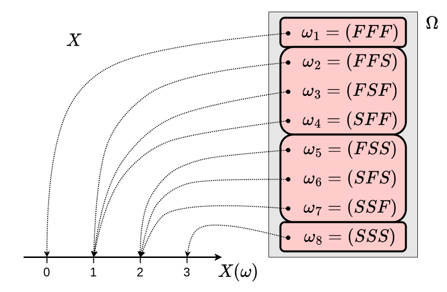
</figure>

:::

:::

::: {.column #vcenter width=45%}
::: {.callout-caution}
## Observação

Os valores de $\text{Im}(X)$ induzem uma partição de $\Omega$. No exemplo, vimos:

-   $[X=0] = \{(FFF)\}$;
-   $[X=1] = \{(FFS), (FSF), (SFF)\}$;
-   $[X=2] = \{(FSS), (SFS), (SSF)\}$; e
-   $[X=3] = \{(SSS)\}$.

:::
:::

:::


## 1 Definição {.unnumbered .unlisted}

::: {.callout-caution}
## Observação

A qualquer va $X$, podemos associar um contradomínio (normalmente o conjunto $\mathbb{R}$) e uma [**imagem**]{style="color:red;"}, que denotaremos por $\text{Im}(X)$.

:::

::: {.callout-note}
## Definição

O conjunto de todos possíveis valores que uma va $X$ pode assumir é denominado **imagem** de $X$ e é denotado por $\text{Im}(X)$.

:::

::: {.callout-caution}
## Observação

No exemplo anterior, temos que $\text{Im}(X) = \{0,1,2,3\}$.
:::

## 1 Definição {.unnumbered .unlisted}

::: {.callout-caution}
## Observação

Similarmente a estatística descritiva, podemos classificar as va's de acordo com o seu conjunto imagem.

:::

::: {.callout-note}
## Definição

Dada uma va $X$, dizemos que:

-   $X$ é va **discreta** (vad) se $\text{Im}(X)$ for conjunto finito ou infinito enumerável;
-   $X$ é va **contínua** (vac) se $\text{Im}(X)$ for conjunto não enumerável.

:::

::: {.callout-caution}
## Observação

Agora, fica claro que a va $X$ do exemplo anterior se trata de uma **vad**.

:::

## 1 Definição {.unnumbered .unlisted}

::: {style="border-style: solid; border-width: 3px; padding-bottom: 0px; padding-right: 12px; padding-left: 12px; font-size:70%;"}

**Exemplo 2:** Uma linha de produção é observada até a produção da primeira peça defeituosa. Seja $S =$ "Peça defeituosa" e $F =$ "Peça normal". Então temos que
$$
\Omega = \{(S), (FS), (FFS), (FFFS), \ldots\}.
$$

::: columns

::: {.column #vcenter width=60%}

A este experimento, podemos associar a va $X =$ "Número de peças produzidas". Nesse caso, teríamos
$$
\text{Im}(X) = \{1, 2, 3, \ldots\}.
$$

:::

::: {.column #vcenter width=40%}

<figure>
  
</figure>

:::

:::

:::

::: {.callout-caution}
## Observação

Embora $\text{Im}(X)$ seja infinito, ele é um conjunto enumerável, de modo que $X$ é **vad**.

:::

## 1 Definição {.unnumbered .unlisted}

::: {style="border-style: solid; border-width: 3px; padding-bottom: 0px; padding-right: 12px; padding-left: 12px; font-size:70%;"}

::: columns

::: {.column #vcenter width=60%}

**Exemplo 3:** Um ponto de uma região circular de raio unitário é sorteado. Nesse caso, podemos definir $\Omega = \{\omega = (z_1,z_2) : z_1^2 + z_2^2 \leq 1\}$.

[Nesse espaço amostral, um evento $A$, é uma [**região**]{style="color:red;"} de pontos, $A\subset\Omega$.]{style="visibility:hidden;"}

[A este experimento, poderíamos associar a variável aleatória $X =$ "Distância de $\omega$ à origem". Isto é $X(\omega) = (z_1^2 - z_2^2)^{1/2}$. Note que, nesse caso $\text{Im}(X) = [0,1]$.]{style="visibility:hidden;"}

:::

::: {.column #vcenter width=40%}

<figure>
  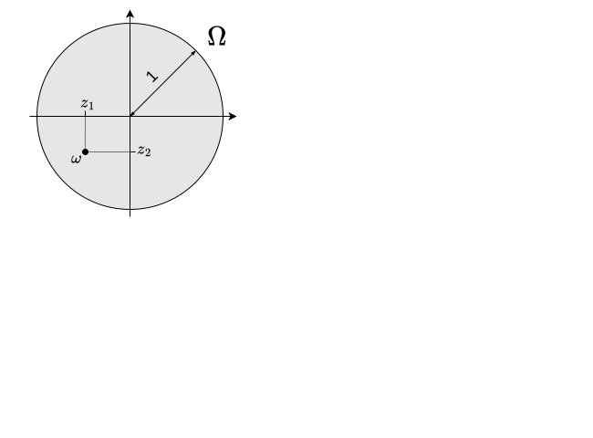
</figure>

:::

:::

:::

::: {style="visibility:hidden"}

::: {.callout-caution}
## Observação

Como $\text{Im}(X)$ é conjunto não enumerável, classificamos $X$ como uma **vac**.

:::

:::

## 1 Definição {.unnumbered .unlisted}

::: {style="border-style: solid; border-width: 3px; padding-bottom: 0px; padding-right: 12px; padding-left: 12px; font-size:70%;"}

::: columns

::: {.column #vcenter width=60%}

**Exemplo 3:** Um ponto de uma região circular de raio unitário é sorteado. Nesse caso, podemos definir $\Omega = \{\omega = (z_1,z_2) : z_1^2 + z_2^2 \leq 1\}$.

Nesse espaço amostral, um evento $A$, é uma [**região**]{style="color:red;"} de pontos, $A\subset\Omega$.

[A este experimento, poderíamos associar a variável aleatória $X =$ "Distância de $\omega$ à origem". Isto é $X(\omega) = (z_1^2 - z_2^2)^{1/2}$. Note que, nesse caso $\text{Im}(X) = [0,1]$.]{style="visibility:hidden;"}

:::

::: {.column #vcenter width=40%}

<figure>
  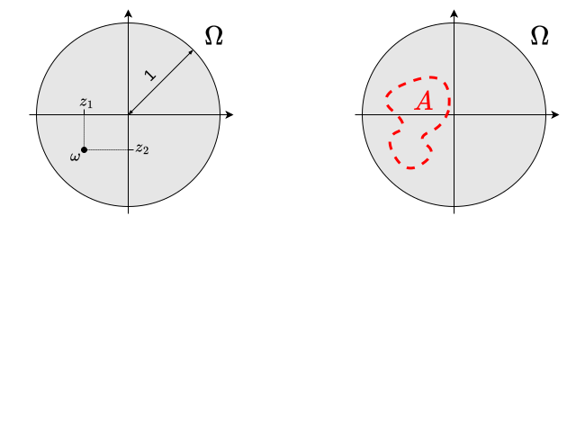
</figure>

:::

:::

:::

::: {style="visibility:hidden"}

::: {.callout-caution}
## Observação

Como $\text{Im}(X)$ é conjunto não enumerável, classificamos $X$ como uma **vac**.

:::

:::

## 1 Definição {.unnumbered .unlisted}

::: {style="border-style: solid; border-width: 3px; padding-bottom: 0px; padding-right: 12px; padding-left: 12px; font-size:70%;"}

::: columns

::: {.column #vcenter width=60%}

**Exemplo 3:** Um ponto de uma região circular de raio unitário é sorteado. Nesse caso, podemos definir $\Omega = \{\omega = (z_1,z_2) : z_1^2 + z_2^2 \leq 1\}$.

Nesse espaço amostral, um evento $A$, é uma [**região**]{style="color:red;"} de pontos, $A\subset\Omega$.

A este experimento, poderíamos associar a variável aleatória $X =$ "Distância de $\omega$ à origem". Isto é $X(\omega) = (z_1^2 + z_2^2)^{1/2}$. Note que, nesse caso $\text{Im}(X) = [0,1]$.

:::

::: {.column #vcenter width=40%}

<figure>
  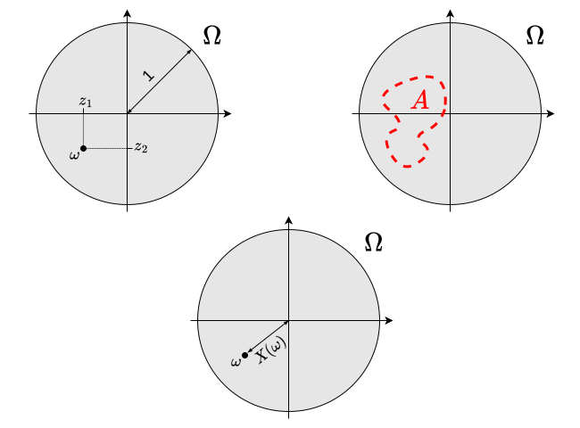
</figure>

:::

:::

:::

::: fragment

::: {.callout-caution}
## Observação

Como $\text{Im}(X)$ é conjunto não enumerável, classificamos $X$ como uma **vac**.

:::

:::

## Função de distribuição acumulada

::: {.callout-caution}
## Observação

Um evento aleatório muito importante para modelagem de va's é $[X \leq x]$. A probabilidade deste evento nos diz o quanto de probabilidade a va $X$ acumula até o valor $x$.

:::

::: {.callout-note}
## Definição

A **função de distribuição acumulada** (fda) é definida por $F_X(x) = P(X \leq x)$
:::

::: {.callout-caution}
## Observação

Ao se partir de uma medida de probabilidade definida em $\Omega$, para o calcular $F_X(x)$, devemos encontrar a probabilidade (em $\Omega$) do evento $A_x = \{\omega \in \Omega: X(\omega) \leq x\}$. Isto é, $F_X(x) = P(X \leq x) = P(A_x)$.

:::

## {.unnumbered .unlisted .smaller}

### Exemplo 1 (cont.) {.unnumbered .unlisted}

Se supomos que $\Omega$ é equiprovável. Teremos que

$$
F_X(x) = \begin{cases}
0, & x < 0;\\
P(X=0) = \frac{1}{8}, & 0 \leq x < 1;\\
P(X=0) + P(X=1) = \frac{1}{8} + \frac{3}{8} = \frac{4}{8}, & 1 \leq x < 2;\\
P(X=0) + P(X=1) + P(X=2) = \frac{1}{8} + \frac{3}{8} + \frac{3}{8} = \frac{7}{8}, & 2 \leq x < 3;\\
P(X=0) + P(X=1) + P(X=2) + P(X=3) = \frac{1}{8} + \frac{3}{8} + \frac{3}{8} + \frac{1}{8} = 1, & x \geq 3;\\
\end{cases}
$$

## {.unnumbered .unlisted}

### Exemplo 1 (cont.) {.unnumbered .unlisted}

<figure>
  
</figure>

## {.unnumbered .unlisted}

### Exemplo 1 (cont.) {.unnumbered .unlisted}

<figure>
  
</figure>

## {.unnumbered .unlisted}

### Exemplo 1 (cont.) {.unnumbered .unlisted}

<figure>
  
</figure>

## {.unnumbered .unlisted}

### Exemplo 1 (cont.) {.unnumbered .unlisted}

<figure>
  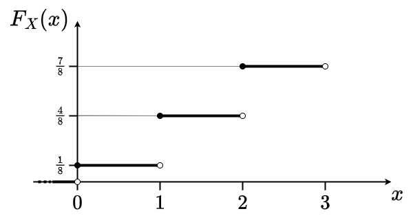
</figure>

## {.unnumbered .unlisted}

### Exemplo 1 (cont.) {.unnumbered .unlisted}

<figure>
  
</figure>


## {.unnumbered .unlisted}

### Exemplo 1 (cont.) {.unnumbered .unlisted}

<figure>
  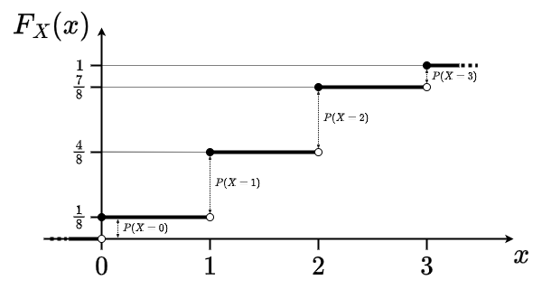
</figure>

::: {.callout-caution}
## Observação

No caso discreto, os tamanhos dos saltos de $F_X(x)$ nos dá os valores de $P(X=x)$.
:::

## 1.1 Função de distribuição acumulada {.unnumbered .unlisted}

::: {.callout-note}
## Definição

Se $X$ é vad, a função $p_X(x) = P(X=x)$, $x \in \text{Im}(X)$, é chamada [**função massa de probabilidade**]{style="color:red;"} (fmp).
:::

::: fragment

::: {.callout-warning}
## Propriedades

A fmp $p_X(x)$ de um uma vad $X$ satisfaz:

::: incremental

1.    $p_X(x) \geq 0$;
2.    $\textstyle \sum_{x} p_X(x) = 1$.

:::

:::

:::

::: fragment

::: {.callout-caution}
## Observação

Assim, vemos que, para variáveis aleatórias discretas, a fda $F_X(x)$ nos fornece a fmp $p_X(x)$ e vice-versa.
:::

:::

## 1.1 Função de distribuição acumulada {.unnumbered .unlisted}

::: {.callout-caution}
## Observação

A fmp é um modelo teórico para as **frequências relativas** vistas em estatística descritiva.
:::

::: fragment


<figure>
  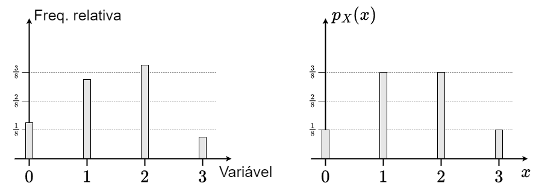
</figure>


:::

## {.unnumbered .unlisted .smaller}

### Exemplo 3 (cont.) {.unnumbered .unlisted}

Supondo que nenhum ponto de $\Omega$ é privilegiado, podemos definir a medida de probabilidade de $A$ como
$$\textstyle P(A) = \frac{\text{Área}(A)}{\text{Área}(\Omega)} = \frac{\text{Área}(A)}{\pi}.$$
Nesse caso, as probabilidades de dois eventos de mesma área serão as mesmas (equiprobabilidade).  

::: columns

::: {.column #vcenter width=65%}

[Usando essa medida de probabilidade, para calcular a fda de $X$, precisamos encontrar a área da região $[X \leq x]$. Veja na ilustração ao lado.]{style="visibility:hidden;"}

[Logo, a fda de $X$ é dada por
$$
\textstyle F_X(x) = P(X \leq x) = \begin{cases}
0, & x < 0;\\
\frac{\text{Área}(X \leq x)}{\pi} = \frac{\pi x^2}{\pi} = x^2, & 0\leq x < 1;\\
1, & x \geq 1.
\end{cases}
$$
]{style="visibility:hidden;"}

:::

::: {.column #vcenter width=35%}

<figure>
  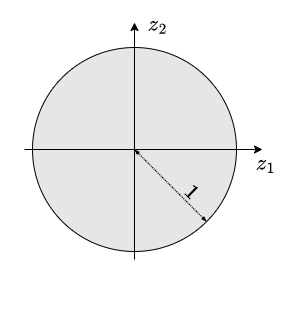
</figure>

:::

:::

## {.unnumbered .unlisted .smaller}

### Exemplo 3 (cont.) {.unnumbered .unlisted}

Supondo que nenhum ponto de $\Omega$ é privilegiado, podemos definir a medida de probabilidade de $A$ como
$$\textstyle P(A) = \frac{\text{Área}(A)}{\text{Área}(\Omega)} = \frac{\text{Área}(A)}{\pi}.$$
Nesse caso, as probabilidades de dois eventos de mesma área serão as mesmas (equiprobabilidade).  

::: columns

::: {.column #vcenter width=65%}

Usando essa medida de probabilidade, para calcular a fda de $X$, precisamos encontrar a área da região $[X \leq x]$. Veja na ilustração ao lado.

[Logo, a fda de $X$ é dada por
$$
\textstyle F_X(x) = P(X \leq x) = \begin{cases}
0, & x < 0;\\
\frac{\text{Área}(X \leq x)}{\pi} = \frac{\pi x^2}{\pi} = x^2, & 0\leq x < 1;\\
1, & x \geq 1.
\end{cases}
$$
]{style="visibility:hidden;"}

:::

::: {.column #vcenter width=35%}

<figure>
  
</figure>


:::

:::


## {.unnumbered .unlisted .smaller}

### Exemplo 3 (cont.) {.unnumbered .unlisted}

Supondo que nenhum ponto de $\Omega$ é privilegiado, podemos definir a medida de probabilidade de $A$ como
$$\textstyle P(A) = \frac{\text{Área}(A)}{\text{Área}(\Omega)} = \frac{\text{Área}(A)}{\pi}.$$
Nesse caso, as probabilidades de dois eventos de mesma área serão as mesmas (equiprobabilidade).  

::: columns

::: {.column #vcenter width=65%}

Usando essa medida de probabilidade, para calcular a fda de $X$, precisamos encontrar a área da região $[X \leq x]$. Veja na ilustração ao lado.

[Logo, a fda de $X$ é dada por
$$
\textstyle F_X(x) = P(X \leq x) = \begin{cases}
0, & x < 0;\\
\frac{\text{Área}(X \leq x)}{\pi} = \frac{\pi x^2}{\pi} = x^2, & 0\leq x < 1;\\
1, & x \geq 1.
\end{cases}
$$
]{style="visibility:hidden;"}

:::

::: {.column #vcenter width=35%}

<figure>
  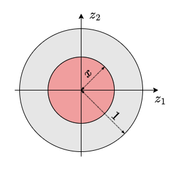
</figure>


:::

:::


## {.unnumbered .unlisted .smaller}

### Exemplo 3 (cont.) {.unnumbered .unlisted}

Supondo que nenhum ponto de $\Omega$ é privilegiado, podemos definir a medida de probabilidade de $A$ como
$$\textstyle P(A) = \frac{\text{Área}(A)}{\text{Área}(\Omega)} = \frac{\text{Área}(A)}{\pi}.$$
Nesse caso, as probabilidades de dois eventos de mesma área serão as mesmas (equiprobabilidade).  

::: columns

::: {.column #vcenter width=65%}

Usando essa medida de probabilidade, para calcular a fda de $X$, precisamos encontrar a área da região $[X \leq x]$. Veja na ilustração ao lado.

[Logo, a fda de $X$ é dada por
$$
\textstyle F_X(x) = P(X \leq x) = \begin{cases}
0, & x < 0;\\
\frac{\text{Área}(X \leq x)}{\pi} = \frac{\pi x^2}{\pi} = x^2, & 0\leq x < 1;\\
1, & x \geq 1.
\end{cases}
$$
]{style="visibility:hidden;"}

:::

::: {.column #vcenter width=35%}

<figure>
  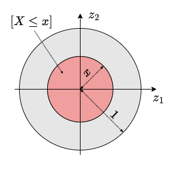
</figure>


:::

:::

## {.unnumbered .unlisted .smaller}

### Exemplo 3 (cont.) {.unnumbered .unlisted}

Supondo que nenhum ponto de $\Omega$ é privilegiado, podemos definir a medida de probabilidade de $A$ como
$$\textstyle P(A) = \frac{\text{Área}(A)}{\text{Área}(\Omega)} = \frac{\text{Área}(A)}{\pi}.$$
Nesse caso, as probabilidades de dois eventos de mesma área serão as mesmas (equiprobabilidade).  

::: columns

::: {.column #vcenter width=65%}

Usando essa medida de probabilidade, para calcular a fda de $X$, precisamos encontrar a área da região $[X \leq x]$. Veja na ilustração ao lado.

[Logo, a fda de $X$ é dada por
$$
\textstyle F_X(x) = P(X \leq x) = \begin{cases}
0, & x < 0;\\
\frac{\text{Área}(X \leq x)}{\pi} = \frac{\pi x^2}{\pi} = x^2, & 0\leq x < 1;\\
1, & x \geq 1.
\end{cases}
$$
]{style="visibility:hidden;"}

:::

::: {.column #vcenter width=35%}

<figure>
  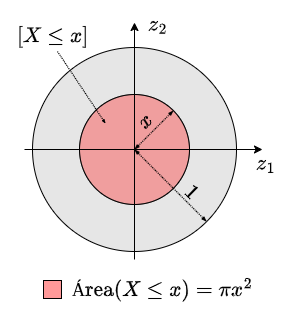
</figure>


:::

:::

## {.unnumbered .unlisted .smaller}

### Exemplo 3 (cont.) {.unnumbered .unlisted}

Supondo que nenhum ponto de $\Omega$ é privilegiado, podemos definir a medida de probabilidade de $A$ como
$$\textstyle P(A) = \frac{\text{Área}(A)}{\text{Área}(\Omega)} = \frac{\text{Área}(A)}{\pi}.$$
Nesse caso, as probabilidades de dois eventos de mesma área serão as mesmas (equiprobabilidade).  

::: columns

::: {.column #vcenter width=65%}

Usando essa medida de probabilidade, para calcular a fda de $X$, precisamos encontrar a área da região $[X \leq x]$. Veja na ilustração ao lado.

Logo, a fda de $X$ é dada por
$$
\textstyle F_X(x) = P(X \leq x) = \begin{cases}
0, & x < 0;\\
\frac{\text{Área}(X \leq x)}{\pi} = \frac{\pi x^2}{\pi} = x^2, & 0\leq x < 1;\\
1, & x \geq 1.
\end{cases}
$$

:::

::: {.column #vcenter width=35%}

<figure>
  
</figure>


:::

:::

## {.unnumbered .unlisted}

### Exemplo 3 (cont.) {.unnumbered .unlisted}

<figure>
  
</figure>


## {.unnumbered .unlisted}

### Exemplo 3 (cont.) {.unnumbered .unlisted}

<figure>
  
</figure>


## {.unnumbered .unlisted}

### Exemplo 3 (cont.) {.unnumbered .unlisted}

<figure>
  
</figure>


::: {.callout-caution}
## Observação

Observe que não há pontos de descontinuidade para a fda de uma va contínua. Portanto, a fda de uma vac não fornece probabilidades diretamente.
:::

## 1.1 Função de distribuição acumulada {.unnumbered .unlisted}

::: {.callout-caution}
## Observação

Tomando a derivada da fda de uma vac, obtemos a chamada [**função densidade de probabilidade**]{style="color:red;"}.
:::

::: fragment

::: {.callout-note}
## Definição

Se $X$ é vac com fda $F_X(x)$, a sua **função densidade de probabilidade** (fdp) é definida por $f_X(x) = \frac{dF_X(x)}{dx}$.
:::

:::

::: fragment

::: {.callout-warning}
## Propriedades

A fdp $f_X(x)$ de uma vac $X$ satisfaz:

::: incremental

1.    $f_X(x) \geq 0$, $x\in \mathbb{R}$;
2.    $\int_{-\infty}^\infty f_X(x)dx = 1$.

:::

:::

:::

## 1.1 Função de distribuição acumulada {.unnumbered .unlisted}

::: {.callout-caution}
## Observação

A fdp é um modelo teórico para as **densidades** de faixas vistas em estatística descritiva.
:::

::: fragment

<figure>
  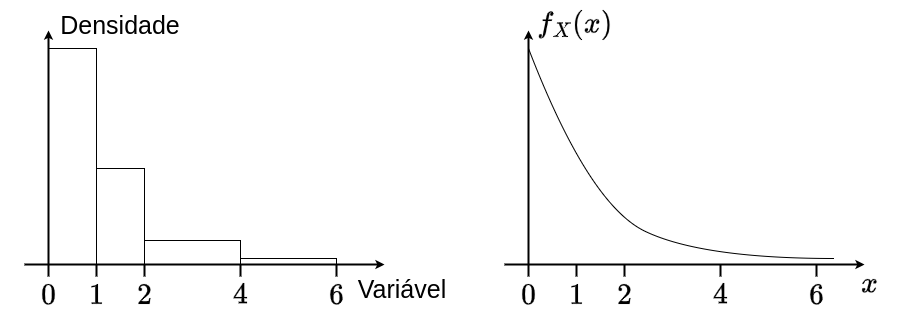
</figure>

:::

## 1.1 Função de distribuição acumulada {.unnumbered .unlisted}

::: {.callout-caution}
## Observação

Note que o tratamento probabilístico para obter a fda, bem como o seu comportamento, dependem do tipo de va em questão.
:::

::: fragment

::: {.callout-warning}
## Propriedades

Seja $F_X(x)$ fda de uma va $X$, então

::: incremental

1.    $\lim_{x\to-\infty} F_X(x) = 0$ e $\lim_{x\to\infty} F_X(x) = 1$;
2.    $x < x' \Rightarrow F_X(x) \leq F_X(x')$, isto é, $F_X(\cdot)$ é não decrescente; e
3.    se $X$ é vad, $P(X=x) = F_X(x) - \lim_{x'\uparrow x} F_X(x')$, isto é, a fmp $p_X(x)$ é o tamanho do salto de $F_X(\cdot)$ em $x$.
4.    se $X$ é vac, $f_X(x) = \frac{dF_X(x)}{dx}$, isto é, a fdp $f_X(x)$ é a derivada de $F_X(\cdot)$ em $x$.

:::

:::

:::

# Variáveis aleatórias discretas

## 2 Variáveis aleatórias discretas {.unnumbered .unlisted}

::: {.callout-caution}
## Observações

::: incremental

1. Vimos que, se o modelo probabilístico é concebido sobre um espaço amostral $\Omega$ abstrato e $X : \Omega \to \mathbb{R}$, então a fmp pode ser obtida por
$$p_X(x) = P(X = x) = P(A_x),$$
em que $A_x = \{\omega \in \Omega : X(\omega) = x\}$. Isto é, a fmp de $X$ é **induzida** pela medida de probabilidade em $\Omega$;
2. Muito frequentemente, a construção de um modelo probabilístico em $\Omega$ é muito complicada, o que dificultaria a determinação da fmp induzida.
3. Para contornar esse problema, levando em consideração o comportamento da vad em estudo, podemos especificar diretamente uma fmp para a vad, desde que atenda as propriedades já vistas:
    + $p_X(x) \geq 0$;
    + $\sum_{x\in\text{Im}(X)} p_X(x) = 1$.

:::

:::

## {.unnumbered .unlisted .smaller}

### Exemplo 4 {.unnumbered .unlisted}

Suponha que em um estoque existem seis lotes de um produto: três com $0$ itens defeituosos; dois com $1$ defeituoso; e um com $2$ defeituosos. Um lote será sorteado entre os seis e será enviado a um cliente. Seja $X=$ "número de itens defeituosos no lote recebido pelo cliente". [Nesse caso, podemos especificar]{.fragment fragment-index=1}

::: {.fragment fragment-index=1}

::: columns

::: {.column #vcenter width=45%}

<div style="text-align: center;">
<table>
  <tr style="border-top:solid;">
    <td style="border-right:solid 1pt;">$x$</td>
    <td style="text-align: center;">$0$</td>
    <td style="text-align: center;">$1$</td>
    <td style="text-align: center;">$2$</td>
    <td style="text-align: center;border-left:solid 1pt;">Total</td>
  </tr>
  <tr style="border-top:solid 1pt;border-bottom:solid;">
    <td style="border-right:solid 1pt;">$p_X(x)$ </td>
    <td style="text-align: center;">$\frac{3}{6}$</td>
    <td style="text-align: center;">$\frac{2}{6}$</td>
    <td style="text-align: center;">$\frac{1}{6}$</td>
    <td style="text-align: center;border-left:solid 1pt;">$1$</td>
  </tr>
</table>
</div>

:::

::: {.column #vcenter width=10%}

<p style="text-align:center;">
ou ainda
</p>

:::

::: {.column #vcenter width=45%}

<div style="text-align: center;">
<table>
  <tr style="border-top:solid;">
    <td style="border-right:solid 1pt;">$x$</td>
    <td style="text-align: center;">$0$</td>
    <td style="text-align: center;">$1$</td>
    <td style="text-align: center;">$2$</td>
    <td style="text-align: center;border-left:solid 1pt;">Total</td>
  </tr>
  <tr style="border-top:solid 1pt;border-bottom:solid;">
    <td style="border-right:solid 1pt;">$p_X(x)$ </td>
    <td style="text-align: center;">$\frac{1}{2}$</td>
    <td style="text-align: center;">$\frac{1}{3}$</td>
    <td style="text-align: center;">$\frac{1}{6}$</td>
    <td style="text-align: center;border-left:solid 1pt;">$1$</td>
  </tr>
</table>
</div>

:::

:::

:::

::: {.fragment fragment-index=2}

Se não sabemos a quantidade de lotes em estoque, a especificação acima não é praticável, pois não sabemos o comportamento probabilístico do experimento ($\Omega$ é equiprovável, mas desconhecido).

:::

::: {.fragment fragment-index=3}

Nesse caso, se ainda assumirmos que os lotes tem no máximo 2 itens defeituosos, podemos especificar uma fmp arbitrária para a vad $X$, como, por exemplo

<div style="text-align: center;">
<table>
  <tr style="border-top:solid;">
    <td style="border-right:solid 1pt;">$x$</td>
    <td style="text-align: center;">$0$</td>
    <td style="text-align: center;">$1$</td>
    <td style="text-align: center;">$2$</td>
    <td style="text-align: center;border-left:solid 1pt;">Total</td>
  </tr>
  <tr style="border-top:solid 1pt;border-bottom:solid;">
    <td style="border-right:solid 1pt;">$p_X(x)$ </td>
    <td style="text-align: center;">$0.7$</td>
    <td style="text-align: center;">$0.2$</td>
    <td style="text-align: center;">$0.1$</td>
    <td style="text-align: center;border-left:solid 1pt;">$1$</td>
  </tr>
</table>
</div>

:::

::: {.fragment fragment-index=4}

Note que $p_X(0), p_X(1), p_X(2) \geq 0$ e que $\sum_{x=0}^2 p_X(x) = 1$, de modo que $p_X(x)$ é uma fmp válida.

:::

## 2 Variáveis aleatórias discretas {.unnumbered .unlisted}

::: {.callout-caution}
## Observação

No exemplo anterior, especificamos de maneira arbitrária uma fmp $p_X(x)$ para a vad $X$. No entanto, podemos ser mais flexíveis e propor uma [**família**]{style="color:red;"} de fmp's que dependa de [**parâmetros**]{style="color:red;"}.

:::

::: {.fragment fragment-index=1 style="border-style: solid; border-width: 3px; padding-bottom: 0px; padding-right: 12px; padding-left: 12px; font-size:70%;"}

**Exemplo 4 (cont.):** 

Para flexibilizar o nosso modelo probabilístico, podemos especificar a seguinte [**forma**]{style="color:red;"} para a fmp:

::: columns

::: {.column #vcenter width=30%}

<div style="text-align: center;">
<table>
  <tr style="border-top:solid;">
    <td style="border-right:solid 1pt;">$x$</td>
    <td style="text-align: center;">$0$</td>
    <td style="text-align: center;">$1$</td>
    <td style="text-align: center;">$2$</td>
    <td style="text-align: center;border-left:solid 1pt;">Total</td>
  </tr>
  <tr style="border-top:solid 1pt;border-bottom:solid;">
    <td style="border-right:solid 1pt;">$p_X(x)$ </td>
    <td style="text-align: center;">$\alpha$</td>
    <td style="text-align: center;">$\beta$</td>
    <td style="text-align: center;">$\gamma$</td>
    <td style="text-align: center;border-left:solid 1pt;">$1$</td>
  </tr>
</table>
</div>

:::

::: {.column #vcenter width=70%}

::: {.fragment fragment-index=2}

Para $p_X(x)$ ser uma fmp, precisamos impor as seguintes restrições:

::: incremental
- $0 \leq \alpha \leq 1$;
- $0 \leq \beta \leq 1-\alpha$; e
- $\gamma = 1-\alpha-\beta$ (isto é, $\gamma$ é fixo).
:::

:::

:::

:::

::: fragment

Nesse caso, dizemos que $\alpha$ e $\beta$ são **parâmetros** (livres) da família de fmp's $p_X(x)$.

:::

::: 

## 2 Variáveis aleatórias discretas {.unnumbered .unlisted}

::: {.callout-note}
## Definição

Se a forma de $p_X(x)$ depende de um valor (ou vetor de valores) $\theta$, dizemos que $\theta$ é um **parâmetro** (ou vetor paramétrico) da família $p_X(x)$.
:::

::: fragment

::: {.callout-caution}
## Observação

Nesse caso, podemos escrever $p_X(x; \theta)$ para enfatizar que se trata de uma família de fmp's e que sua forma só é completamente conhecida se soubermos o valor do parâmetro $\theta$ que indexa a família.

:::

:::

::: {.fragment style="border-style: solid; border-width: 3px; padding-bottom: 0px; padding-right: 12px; padding-left: 12px; font-size:70%;"}

**Exemplo 4 (cont.):** Nesse exemplo, podemos agrupar os parâmetros no vetor $\theta = (\alpha, \beta)$. Note que, a fmp induzida pela medida equiprovável em $\Omega$ e a fmp arbitrariamente especificada posteriormente são membros particulares dessa família, em que $\theta = (\frac{1}{2}, \frac{1}{3})$ e $\theta = (0.7, 0.2)$, respectivamente.

:::

## 2 Variáveis aleatórias discretas {.unnumbered .unlisted}

::: {.callout-caution}
## Observação

Como já visto anteriormente, a fda pode ser obtida acumulando as probabilidades da fmp.
:::

::: {.fragment style="border-style: solid; border-width: 3px; padding-bottom: 0px; padding-right: 12px; padding-left: 12px; font-size:70%;"}

::: columns

::: {.column #vcenter width=50%}

**Exemplo 4 (cont.):** A fda para a família de fmp's neste caso é
$$
F_X(x) = F_X(x; \theta) = \begin{cases}
0, & x < 0;\\
\alpha, & 0\leq x < 1;\\
\alpha + \beta, & 1\leq x < 2;\\
1, & x \geq 2;\\
\end{cases}
$$

:::

::: {.column #vcenter width=50%}

<figure>
  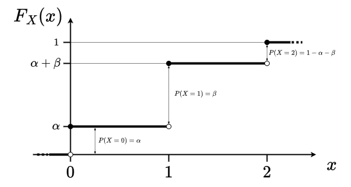
</figure>

:::

:::

:::

## 2 Variáveis aleatórias discretas {.unnumbered .unlisted}

::: {.callout-tip}
## Exercício

Considere a seguinte função de $x$ que depende de um vetor de parâmetros $\theta = (\theta_1, \theta_2, \theta_3, \theta_4)$:
$$
p_X(x;\theta) = \begin{cases}
\theta_1, & x=0;\\
\theta_2, & x=1;\\
\theta_3, & x=2;\\
\theta_4, & x=3.
\end{cases}
$$

Pede-se:

1. Quais restrições necessitamos impor sobre $\theta = (\theta_1, \theta_2, \theta_3, \theta_4)$ para garantir que $p_X(x;\theta)$ seja de fato família de fmp's?
2. Qual a condição adicional sobre $\theta$ para que $p_X(x;\theta)$ seja simétrica? Qual é o ponto de simetria?
3. Determine e esboce a fda associada a família $p_X(x;\theta)$.
:::


## Esperança e variância de vad's

::: {.callout-caution}
## Observação

Vimos que a fmp é um modelo teórico para as frequências relativas vistas em estatística descritiva. Assim, fazendo uso da fmp, é natural calcularmos valores teóricos para a média e a variância de uma vad $X$.
:::

::: {.callout-note}
## Definição

Seja $X$ vad com imagem $\text{Im}(X)$ e fmp $p_X(x;\theta)$, sua **média**, também chamada de **esperança** ou **valor esperado**, é definida por 
$$\mu = \mu_X = E(X) = \sum_{x\in\text{Im}(X)} x\cdot p_X(x;\theta).$$
:::

## 2.1 Esperança e variância de vad's {.unnumbered .unlisted}

::: {.callout-caution}
## Observações

::: incremental

1. A fórmula para o cálculo de $\mu$ é muito similar àquela vista em estatística descritiva, no entanto, agora a fmp $p_X(x;\theta)$ toma o lugar da frequência relativa que teria sido efetivamente observada;
2. De maneira similar a estatística descritiva, $\mu$ é calculada como uma média **ponderada** com pesos dados por $p_X(x;\theta)$;
3. Naturalmente, para famílias de fmp's, pelo fato de $p_X(x;\theta)$ ser indexada por $\theta$, a sua esperança também será função de $\theta$.

:::

:::

::: {.fragment style="border-style: solid; border-width: 3px; padding-bottom: 0px; padding-right: 12px; padding-left: 12px; font-size:70%;"}

**Exemplo 4 (cont.):** Utilizando a fórmula de esperança, obtemos
$$\mu_X = 0p_X(0;\theta) + 1p_X(1;\theta) + 2p_X(2;\theta) = \beta + 2(1-\alpha-\beta) = 2-2\alpha - \beta.$$

Se $\alpha = \frac{1-\beta}{2}$, vemos que a fmp é simétrica em torno de $1$ e $\mu_X = 1$.

:::

## 2.1 Esperança e variância de vad's {.unnumbered .unlisted}

::: {.callout-caution}
## Observações

::: incremental

1. Quando está claro a que va $X$ a esperança se refere, usaremos $\mu$ em vez de $\mu_X$;
2. No Exemplo 4, se hipotetizarmos uma população em que a vad $X$ com valores $0, 1$ e $2$ associados as frequências relativas $\alpha$, $\beta$, $1-\alpha-\beta$, respectivamente, então $\mu = 2-2\alpha - \beta$ será a média populacional. Por isso podemos nos referir a $\mu$ por média populacional ou teórica;
3. No Exemplo 4, tomando $\theta = (\frac{1}{2}, \frac{1}{3})$, obtemos $\mu = 2-2\frac{1}{2} - \frac{1}{3} = \frac{2}{3} \approx 0.67$, que não é um valor possível de $X$. A palavra esperado deve ser interpretada com cautela porque uma pessoa não espera ver um valor de $X = 0.67$ quando um único estoque é selecionado.

:::

:::


## 2.1 Esperança e variância de vad's {.unnumbered .unlisted}

::: {style="border-style: solid; border-width: 3px; padding-bottom: 0px; padding-right: 12px; padding-left: 12px; font-size:70%;"}

**Exemplo 5:** Seja $X$ o número de entrevistas que um estudante faz para conseguir um emprego e suponha que a sua seja $p_X(x) = \frac{k}{x^2}$, $x = 1, 2, 3, \ldots$, e $p_X(x) = 0$ caso contrário. A constante $k$ deve ser tal que $k^{-1} = \sum_{x=1}^\infty\frac{1}{x^2}$. É possível mostrar que $\sum_{x=1}^\infty\frac{1}{x^2} < +\infty$, portanto $p_X(x)$ é de fato uma fmp.

::: {.fragment fragment-index=1}

Agora, o seu valor esperado é
$$
\textstyle \mu = \sum_{x=1}^\infty x \cdot p_X(x) = \sum_{x=1}^\infty x\cdot\frac{k}{x^2} = k\sum_{x=1}^\infty \frac{1}{x}.
$$
O último termo é a soma harmônica, que diverge, isto é, $\mu = +\infty$.

:::

:::

::: {.fragment fragment-index=2}

::: {.callout-caution}
## Observação

Dizemos que $p_X(x)$ tem **caudas longas** (as probabilidades da cauda decrescem muito lentamente). Ao selecionar uma amostra dessa variável, a média amostras tenderá a crescer indefinidamente com o tamanho da amostra.

:::

:::

## 2.1 Esperança e variância de vad's {.unnumbered .unlisted}

::: {.callout-caution}
## Observação

Frequentemente, temos interesse na esperança de $Y = h(X)$, em vez de $X$. Pela definição poderíamos obter $\mu_Y = \sum_y y \cdot p_Y(y)$, necessitando da fmp de $Y$. No entanto, existe uma maneira mais direta.
:::

::: {.fragment fragment-index=1 style="border-style: solid; border-width: 3px; padding-bottom: 0px; padding-right: 12px; padding-left: 12px; font-size:70%;"}

**Exemplo 6:** Seja $X$ vad e $Y = X^2$. [Por exemplo: ]{.fragment fragment-index=2}

::: columns

::: {.column #vcenter width=50%}

::: {.fragment fragment-index=2}
<div style="text-align: center;">
Se a fmp de $X$ for:
<table>
  <tr style="border-top:solid;">
    <td style="border-right:solid 1pt;">$x$</td>
    <td style="text-align: center;">$-2$</td>
    <td style="text-align: center;">$0$</td>
    <td style="text-align: center;">$2$</td>
    <td style="text-align: center;border-left:solid 1pt;">Total</td>
  </tr>
  <tr style="border-top:solid 1pt;border-bottom:solid;">
    <td style="border-right:solid 1pt;">$p_X(x)$ </td>
    <td style="text-align: center;">$p_{-2}$</td>
    <td style="text-align: center;">$p_{0}$</td>
    <td style="text-align: center;">$p_{2}$</td>
    <td style="text-align: center;border-left:solid 1pt;">$1$</td>
  </tr>
</table>
</div>

:::

:::

::: {.column #vcenter width=50%}

::: {.fragment fragment-index=3}

<div style="text-align: center;">
A fmp de $Y$ será:
<table>
  <tr style="border-top:solid;">
    <td style="border-right:solid 1pt;">$x$</td>
    <td style="text-align: center;">$0$</td>
    <td style="text-align: center;">$4$</td>
    <td style="text-align: center;border-left:solid 1pt;">Total</td>
  </tr>
  <tr style="border-top:solid 1pt;border-bottom:solid;">
    <td style="border-right:solid 1pt;">$p_Y(y)$ </td>
    <td style="text-align: center;">$p_{0}$</td>
    <td style="text-align: center;">$p_{-2}+p_{2}$</td>
    <td style="text-align: center;border-left:solid 1pt;">$1$</td>
  </tr>
</table>
</div>

:::

:::

:::

[Logo,
$$\textstyle \mu_Y = \sum_y y\cdot p_Y(y) = 0p_0 + 4(p_{-2} + p_2) = (-2)^2p_{-2} + 0^2p_{0} + 2^2p_{2} = \sum_x h(x)\cdot p_X(x) = E[h(X)].$$
]{.fragment fragment-index=4}

:::

## 2.1 Esperança e variância de vad's {.unnumbered .unlisted}

::: {.callout-caution}
## Observação

Assim, se $X$ for vad com fmp $p_X(x)$ e $Y = h(X)$, então a esperança de $Y$ é
$$\mu_Y = E[h(X)] = \sum_x h(x)\cdot p_X(x).$$
Isto é, substituímos os $x$ pelos $h(x)$ no cálculo.

:::

::: fragment

::: {.callout-warning}
## Propriedade

Seja $X$ vad com esperança $\mu_X$ e $Y = aX+b$, com $a, b$ constantes, então
$$\mu_{Y} = \mu_{aX+b} = E(aX + b) = a E(X) + b = a\mu_X + b.$$
:::

:::

## 2.1 Esperança e variância de vad's {.unnumbered .unlisted}

::: {.callout-caution}
## Observação

É verdade que $E(aX + b) = a E(X) + b$. Mas, não necessariamente vale que  $E[h(X)] = h[E(X)]$.

:::

::: {.fragment style="border-style: solid; border-width: 3px; padding-bottom: 0px; padding-right: 12px; padding-left: 12px; font-size:70%;"}

**Exemplo 6 (cont.):** Sejam $p_{-2} = p_2 = \frac{1}{4}$ e $p_0 = \frac{1}{2}$. [Então, temos
$$\textstyle E(X) = -2\frac{1}{4} + 0\frac{1}{2} + 2\frac{1}{4} = 0$$]{.fragment}
[e
$$\textstyle E(X^2) = (-2)^2\frac{1}{4} + 0^2\frac{1}{2} + 2^2\frac{1}{4} = 2.$$]{.fragment}

::: fragment

Assim, $E(X^2) = 2 \neq [E(X)]^2 = 0$.

:::

:::


## 2.1 Esperança e variância de vad's {.unnumbered .unlisted}

::: {.callout-note}
## Definição

Seja $X$ vad com fmp $p_X(x)$ e esperança $\mu$. A variância de $X$, denotada por $V(X)$, é definida por
$$\textstyle V(X) = \sum_{x}(x - \mu)^2\cdot p_X(x) = E[(X - \mu)^2].$$
O desvio padrão (DP) de $X$ é definido por $DP(X) = \sqrt{V(X)}.$ A variância pode ser denotada por $\sigma^2_X$, ou apenas $\sigma^2$, e o DP por $\sigma_X$, ou apenas $\sigma$.

:::

::: fragment

::: {.callout-caution}
## Observação

Note que a variância é definida como a esperança de $h(X) = (X-\mu)^2$. Isto é, quanto **esperamos** que a variável $X$ se desvie de sua esperança $\mu$.
:::

:::

## 2.1 Esperança e variância de vad's {.unnumbered .unlisted}

::: {style="border-style: solid; border-width: 3px; padding-bottom: 0px; padding-right: 12px; padding-left: 12px; font-size:70%;"}

**Exemplo 6 (cont.):** Suponha agora que $p_2 = \frac{\alpha}{2}$, $p_{-2} = \frac{1-\alpha}{2}$ e $p_0 = \frac{1}{2}$, com $0 < \alpha < 1$. [Então,
$$\textstyle E(X) = \mu = -2\frac{1-\alpha}{2} + 2\frac{\alpha}{2} = 2\alpha - 1.$$]{.fragment}
[Então, a variância é dada por
$$\textstyle V(X) = \sigma^2 = \sum_{x}(x - \mu)^2\cdot p_X(x) = \sum_{x}[x-(2\alpha - 1)]^2 p_X(x).$$]{.fragment}
[Depois de algumas álgebras obtemos $\sigma^2_X = 1+4\alpha(1-\alpha)$.]{.fragment}

:::

::: fragment

::: {.callout-caution}
## Observação

O cálculo dos desvios quadráticos $(x-\mu)^2$ para obter $\sigma^2$ pode ser tedioso. Felizmente, temos uma fórmula que pode simplificar a sua determinação.

:::

:::

## 2.1 Esperança e variância de vad's {.unnumbered .unlisted}

::: fragment

::: {.callout-warning}
## Propriedades

::: incremental

1. Seja $X$ vad com fmp $p_X(x)$ e esperança $\mu$. Então
$$\begin{align*}
\sigma^2 &= \textstyle \sum_{x}(x - \mu)^2\cdot p_X(x) = \sum_{x}(x^2 - 2\mu x + \mu^2)\cdot p_X(x)\\
&= \textstyle \sum_{x}x^2p_X(x) - 2\mu \sum_{x}x p_X(x) + \mu^2 \sum_{x}p_X(x) = E(X^2) - 2\mu\mu + \mu^2 = E(X^2) - \mu^2.
\end{align*}$$
2. Seja $X$ vad com esperança $\mu_X$ e $Y = aX+b$, com $a, b$ constantes, então
$$\sigma_{Y}^2 = \sigma_{aX+b}^2 = a^2 \sigma_X^2.$$
:::

:::

:::

::: fragment

::: {.callout-caution}
## Observações

::: incremental
- A Propriedade 1 pode ser utilizada para facilmente se chegar a variância do exemplo anterior;
- A Propriedade 2 mostra que a variância só é afetada por mudanças em $a$ (escala), e não em $b$ (locação).
:::

:::

:::

## 2.1 Esperança e variância de vad's {.unnumbered .unlisted}

::: {style="border-style: solid; border-width: 3px; padding-bottom: 0px; padding-right: 12px; padding-left: 12px; font-size:70%;"}

**Exemplo 7:** Seja $X$ o número obtido no arremesso de um dado honesto. Um jogo consiste de você pagar $Y = \frac{1}{X}$ e receber um prêmio de $\frac{1}{\mu_X}$ independente do resultado do dado. [Será que o jogo é vantajoso para o jogador?]{.fragment fragment-index=1}

[Note que $\mu_X = (1+2+\cdots+6)\frac{1}{6} = 3.5$, de onde vem que o prêmio é sempre $\frac{1}{3.5} \approx 0.2857$.]{.fragment fragment-index=2}

[Por outro lado, temos
$$\textstyle \mu_Y = E(Y) = E(\frac{1}{X}) = (1+\frac{1}{2}+\cdots+\frac{1}{6})\frac{1}{6} = \frac{1}{6}\frac{(60+30+20+15+12+10)}{60} = \frac{147}{360} = 0.4083.$$]{.fragment fragment-index=3}

[Assim, isso significa, em média, pagar $0.4083$ para jogar um jogo que oferece prêmio fixo de $0.2857$.]{.fragment fragment-index=4}

:::

::: fragment

::: {.callout-tip}
## Exercícios

Qual seria a variância do valor pago?
:::

:::

## {.unnumbered .unlisted .smaller}

### Exemplo 8 {.unnumbered .unlisted}

Uma loja de computadores comprou 3 computadores de certo tipo a R\$ $1000$ cada. Eles serão vendidos a R\$
$1500$ cada. Após um período, o fabricante aceita os não vendidos por R\$ 400 cada. Seja $X$ o número de computadores vendidos e suponha que $p_X(0) = 0.1$, $p_X(1) = 0.2$, $p_X(2)=0.3$ e $p_X(3) = 0.4$. [Note que
$$\mu_X = 0\cdot0.1 + 1\cdot0.2 + 2\cdot0.3 + 3\cdot0.4 = 2$$
e
$$\sigma^2_X = 0^2\cdot0.1 + 1^2\cdot0.2 + 2^2\cdot0.3 + 3^2\cdot0.4 - 2^2 = 0.2 + 4\cdot0.3 + 9\cdot0.4 - 4 = 5 - 4 = 1.$$]{.fragment}

[Por sua vez, o lucro no período seria de
$$L = h(X) = 1500X - 3000 + 400(3-X) = 1100X - 1800.$$]{.fragment}

[Logo, o lucro esperado será $\mu_L = 1100\mu_x-1800 = 1100\cdot 2 - 1800 = 400$ e a variância do lucro será de $\sigma_L = 1100^2\sigma^2_X = 1100^2\cdot 1 = 1100^2$. O desvio-padrão do lucro é de $\sigma_L = \sqrt{1100^2} = 1100$.]{.fragment}

## Modelos probabilísticos discretos

::: {.callout-caution}
## Observação

Em muitas situações, lidamos com experimentos cujo resultado é dicotômico (possui apenas dois resultados) ou pode ser dicotomizado.
:::

::: {.fragment style="border-style: solid; border-width: 3px; padding-bottom: 0px; padding-right: 12px; padding-left: 12px; font-size:70%;"}

**Exemplo 9:** Um exercício possui 5 alternativas de resposta. Um estudante decide responder o exercício aleatoriamente. Duas possíveis formas de escrever o espaço amostral são:

<table>
<tr class=fragment><td>$\Omega = \{a, b, c, d, e\}$</td> <td>(do ponto de vista de todas alternativas possíveis)</td></tr>
<tr class=fragment style="border-bottom:none;"><td>$\Omega = \{s,f\}$</td> <td>(do ponto de vista de se a alternativa está correta ($s$) ou errada $f$)</td></tr>
</table>

[Note que o segundo espaço amostral é escrita de maneira dicotomizada.]{.fragment}
:::

## 2.2 Modelos probabilísticos discretos {.unnumbered .unlisted}

::: {.callout-note}
## Definição

Dizemos que um experimento aleatório é um experimento de Bernoulli se seu espaço amostral é dicotômico e pode ser escrito como $\Omega = \{s,f\}$, em que costumamos denominar $s =$ sucesso e $f =$ fracasso. Normalmente, denotamos a probabilidade de sucesso por $P(\{s\}) = p$, $0\leq p\leq 1$.
:::

::: fragment

::: {.callout-note}
## Definição

Num experimento de Bernoulli com $P(\{s\}) = p$, podemos definir a vad
$$X = \begin{cases}
1, & \text{ se } \ \ s;\\
0, & \text{ se } \ \ f.
\end{cases}$$
Nesse caso, dizemos que $X$ tem distribuição **Bernoulli** com probabilidade de sucesso $p$ e usamos a notação $X \sim \text{Ber}(p)$.
:::

:::

## 2.2 Modelos probabilísticos discretos {.unnumbered .unlisted}

::: {.callout-warning}
## Propriedade

Se $X \sim \text{Ber}(p)$, então

<table>
  <tr style="border-bottom:none;text-align:center;">
    <td>$\mu = E(X) = p$</td> <td>e</td> <td>$\sigma^2 = V(X) = p(1-p).$</td>
  </tr>
</table>

:::

::: {.fragment style="border-style: solid; border-width: 3px; padding-bottom: 0px; padding-right: 12px; padding-left: 12px; font-size:70%;"}

**Exemplo 9 (cont.):** Defina a vad $X$ como $X = 1$, se a alternativa está correta, e $X = 0$, se a alternativa está errada. Então $X \sim \text{Ber}(p)$, com $p = \frac{1}{5}$.

:::

::: fragment

::: {.callout-caution}
## Observações

::: incremental

1. No Exemplo 9, definimos como sucesso o aluno acertar a questão, mas esse não precisa ser o caso. A classificação do que será entendido como **sucesso** dependerá do problema em questão.
2. O experimento de Bernoulli pode ser utilizado para construção de vad's mais complexas.

:::

:::

:::

## {.unnumbered .unlisted .smaller}

### Exemplo 9 (cont.) {.unnumbered .unlisted}

Se o estudante responde aleatoriamente uma prova com 4 exercícios de 5 alternativas cada, tratam-se de 4 realizações **independentes** de um experimento de Bernoulli com $P(\{s\}) = p = \frac{1}{5}$. 

::: {.fragment fragment-index=1}

Defina $X =$ "número de exercícios respondidos corretamente". Note que $\text{Im}(X) = \{0,1,2,3,4\}$. A fmp de $X$ é dada por

<table>
  <tr>
    <td style="border-top:solid;border-bottom:solid;">$\omega$</td>
    <td style="text-align:center;border-top:solid;border-bottom:solid">$X(\omega)$</td>
    <td style="text-align:center;border-top:solid;border-bottom:solid">$P(\{\omega\})$</td>
    <td style="text-align:center;border-top:none;border-bottom:none;visibility:hidden;">$P(X = x)$</td>
  </tr>
  <tr>
    <td>[$(ffff)$]{.fragment fragment-index=2}</td>
    <td style="text-align:center;">[$0$]{.fragment fragment-index=2}</td>
    <td style="text-align:center;">[$p^0(1-p)^4$]{.fragment fragment-index=2}</td>
    <td style="text-align:center;visibility:hidden;">$p^0(1-p)^4$</td>
  </tr>
  <tr>
    <td>[$(sfff)$, $(fsff)$, $(ffsf)$, $(fffs)$]{.fragment fragment-index=3}</td>
    <td style="text-align:center;">[$1$]{.fragment fragment-index=3}</td>
    <td style="text-align:center;">[$p^1(1-p)^3$]{.fragment fragment-index=3}</td>
    <td style="text-align:center;visibility:hidden;">$4p^1(1-p)^3$</td>
  </tr>
  <tr>
    <td>[$(ssff)$, $(sfsf)$, $(sffs)$, $(fssf)$, $(fsfs)$, $(ffss)$]{.fragment fragment-index=4}</td>
    <td style="text-align:center;">[$2$]{.fragment fragment-index=4}</td>
    <td style="text-align:center;">[$p^2(1-p)^2$]{.fragment fragment-index=4}</td>
    <td style="text-align:center;visibility:hidden;">$6p^2(1-p)^2$</td>
  </tr>
  <tr>
    <td>[$(sssf)$, $(ssfs)$, $(sfss)$, $(fsss)$]{.fragment fragment-index=5}</td>
    <td style="text-align:center;">[$3$]{.fragment fragment-index=5}</td>
    <td style="text-align:center;">[$p^3(1-p)^1$]{.fragment fragment-index=5}</td>
    <td style="text-align:center;visibility:hidden;">$4p^3(1-p)^1$</td>
  </tr>
  <tr style="border-bottom:none">
    <td style="border-bottom:solid">[$(ssss)$]{.fragment fragment-index=6}</td>
    <td style="text-align:center;border-bottom:solid">[$4$]{.fragment fragment-index=6}</td>
    <td style="text-align:center;border-bottom:solid">[$p^4(1-p)^0$]{.fragment fragment-index=6}</td>
    <td style="text-align:center;border-bottom:none;visibility:hidden;">$p^4(1-p)^0$</td>
  </tr>
</table>

:::

[Nesse caso, dizemos que $X$ tem distribuição **Binomial** com $4$ repetições e probabilidade de sucesso $\frac{1}{5}$.]{style="visibility:hidden"}

## {.unnumbered .unlisted .smaller}

### Exemplo 9 (cont.) {.unnumbered .unlisted}

Se o estudante responde aleatoriamente uma prova com 4 exercícios de 5 alternativas cada, tratam-se de 4 realizações **independentes** de um experimento de Bernoulli com $P(\{s\}) = p = \frac{1}{5}$. 

Defina $X =$ "número de exercícios respondidos corretamente". Note que $\text{Im}(X) = \{0,1,2,3,4\}$. A fmp de $X$ é dada por

<table>
  <tr>
    <td style="border-top:solid;border-bottom:solid;">$\omega$</td>
    <td style="text-align:center;border-top:solid;border-bottom:solid">$X(\omega)$</td>
    <td style="text-align:center;border-top:solid;border-bottom:solid">$P(\{\omega\})$</td>
    <td style="text-align:center;border-top:solid;border-bottom:solid;background-color:lightgray;">$P(X = x)$</td>
  </tr>
  <tr>
    <td>$(ffff)$</td>
    <td style="text-align:center;">$0$</td>
    <td style="text-align:center;">$p^0(1-p)^4$</td>
    <td style="text-align:center;background-color:lightgray;">$p^0(1-p)^4$</td>
  </tr>
  <tr>
    <td>$(sfff)$, $(fsff)$, $(ffsf)$, $(fffs)$</td>
    <td style="text-align:center;">$1$</td>
    <td style="text-align:center;">$p^1(1-p)^3$</td>
    <td style="text-align:center;background-color:lightgray;">$4p^1(1-p)^3$</td>
  </tr>
  <tr>
    <td>$(ssff)$, $(sfsf)$, $(sffs)$, $(fssf)$, $(fsfs)$, $(ffss)$</td>
    <td style="text-align:center;">$2$</td>
    <td style="text-align:center;">$p^2(1-p)^2$</td>
    <td style="text-align:center;background-color:lightgray;">$6p^2(1-p)^2$</td>
  </tr>
  <tr>
    <td>$(sssf)$, $(ssfs)$, $(sfss)$, $(fsss)$</td>
    <td style="text-align:center;">$3$</td>
    <td style="text-align:center;">$p^3(1-p)^1$</td>
    <td style="text-align:center;background-color:lightgray;">$4p^3(1-p)^1$</td>
  </tr>
  <tr style="border-bottom:none">
    <td style="border-bottom:solid">$(ssss)$</td>
    <td style="text-align:center;border-bottom:solid">$4$</td>
    <td style="text-align:center;border-bottom:solid">$p^4(1-p)^0$</td>
    <td style="text-align:center;border-bottom:solid;background-color:lightgray;">$p^4(1-p)^0$</td>
  </tr>
</table>

::: fragment

Nesse caso, dizemos que $X$ tem distribuição **Binomial** com $4$ repetições e probabilidade de sucesso $\frac{1}{5}$.

:::

## 2.2 Modelos probabilísticos discretos {.unnumbered .unlisted}

::: {.callout-note}
## Definição

Considere $n$ repetições independentes de um experimento de Bernoulli com probabilidade de sucesso $p$ e seja $X =$ "número de sucessos nas $n$ repetições". Dizemos que $X$ tem distribuição **Binomial** com $n$ repetições e probabilidade de sucesso $p$, denotada por $X \sim \text{Bin}(n,p)$. A fmp de $X$ é
$$p_X(x) = P(X = x) = {n \choose x} p^x (1-p)^{n-x}, \ \ x=0,1,2,\ldots,n.$$
:::

::: {.callout-caution}
## Observação

Note que, se $X_i \sim \text{Ber}(p)$ é a va Bernoulli associada à $i$-ésima repetição, então podemos escrever $X = \sum_{i=1}^nX_i$. Isto é, a va Binomial pode ser vista como soma de $n$ va's Bernoulli indendentes com a mesma probabilidade de sucesso.
:::

## 2.2 Modelos probabilísticos discretos {.unnumbered .unlisted}

::: {.callout-warning}
## Propriedade

Se $X \sim \text{Bin}(n,p)$, então

<table>
  <tr style="border-bottom:none;text-align:center;">
    <td>$\mu = E(X) = np$</td> <td>e</td> <td>$\sigma^2 = V(X) = np(1-p).$</td>
  </tr>
</table>

:::

::: {.fragment style="border-style: solid; border-width: 3px; padding-bottom: 0px; padding-right: 12px; padding-left: 12px; font-size:70%;"}

**Exemplo 9 (cont.):** Como a prova tem $n=4$ questões, cada uma com $5$ alternativas ($p=\frac{1}{5}$), temos que $\mu = E(X) = np = 4 \cdot \frac{1}{5} = 0.8$ e $\sigma^2 = V(X) = np(1-p) = 4 \cdot \frac{1}{5} \cdot \frac{4}{5} = 0.64$. Logo, $\sigma = 0.8$. Portanto, em média, o estudante acerta menos do que 1 das 4 questões.

::: fragment

A probabilidade de ele acertar mais da metade da prova é
$$\textstyle P(X > 2) = P(X = 3) + P(X = 4) = {4 \choose 3} (\frac{1}{5})^3 (\frac{4}{5})^{1} + {4 \choose 4} (\frac{1}{5})^4 (\frac{4}{5})^{0} = 0.0256 + 0.0016 = 0.0272.$$

:::

:::

## 2.2 Modelos probabilísticos discretos {.unnumbered .unlisted}

```{r fig.width=10, fig.align='center'}
n <- 20; x <- 0:n; p <- 0.2
par(family = "serif")
plot(x, dbinom(x = x, size = n, prob = p), type='h', xlab='', ylab='', main='', lwd=3)
mtext(text = expression(italic(x)), side = 1, line = 2, cex=1.5)
mtext(text = expression(italic(p)[italic(X)]*"("*italic(x)*")"), side = 2, line = 2, cex=1.5)
mtext(text = bquote(paste("Bin(",italic(n)==.(n),', ',italic(p)==.(p),")")), side = 3, line = 1.3, cex = 2)
```


## 2.2 Modelos probabilísticos discretos {.unnumbered .unlisted}

```{r fig.width=10, fig.align='center'}
n <- 20; x <- 0:n; p <- 0.5
par(family = "serif")
plot(x, dbinom(x = x, size = n, prob = p), type='h', xlab='', ylab='', main='', lwd=3)
mtext(text = expression(italic(x)), side = 1, line = 2, cex=1.5)
mtext(text = expression(italic(p)[italic(X)]*"("*italic(x)*")"), side = 2, line = 2, cex=1.5)
mtext(text = bquote(paste("Bin(",italic(n)==.(n),', ',italic(p)==.(p),")")), side = 3, line = 1.3, cex = 2)
```

## 2.2 Modelos probabilísticos discretos {.unnumbered .unlisted}

```{r fig.width=10, fig.align='center'}
n <- 20; x <- 0:n; p <- 0.8
par(family = "serif")
plot(x, dbinom(x = x, size = n, prob = p), type='h', xlab='', ylab='', main='', lwd=3)
mtext(text = expression(italic(x)), side = 1, line = 2, cex=1.5)
mtext(text = expression(italic(p)[italic(X)]*"("*italic(x)*")"), side = 2, line = 2, cex=1.5)
mtext(text = bquote(paste("Bin(",italic(n)==.(n),', ',italic(p)==.(p),")")), side = 3, line = 1.3, cex = 2)
```


## 2.2 Modelos probabilísticos discretos {.unnumbered .unlisted}

::: {style="border-style: solid; border-width: 3px; padding-bottom: 0px; padding-right: 12px; padding-left: 12px; font-size:70%;"}

**Exemplo 10:** Um lote contém 10 peças, sendo 3 defeituosas. Serão sorteadas para inspeção 4 peças do lote. Seja $X =$ "número de peças defeituosas na amostra". Se a amostra resulta em no máximo 1 peça defeituosa, o lote é classificado como conforme.

Se a seleção é feita [**com reposição**]{style='color:red;'}, então estamos contando o número de sucessos (peças defeituosas) em 4 repetições independentes de um experimento de Bernoulli. Assim, $X \sim \text{Bin}(n=4, p=\frac{3}{10})$. Logo, a probabilidade do lote ser conforme é
$$\textstyle P(X \leq 1) = P(X = 0) + P(X = 1) = {4 \choose 0}(\frac{7}{10})^4 + {4 \choose 1}(\frac{3}{10})(\frac{7}{10})^3 = 0.2401 + 0.4116 = 0.6517.$$

:::

::: fragment

::: {.callout-caution}
## Observação

No Exemplo 10, a distribuição Binomial só foi apropriada para a variável $X$ pelo fato da seleção ser **com reposição**. Como veremos a seguir, $X$ terá outra distribuição quando a seleção é **sem reposição**.
:::

:::

## {.unnumbered .unlisted .smaller}

### Exemplo 11 {.unnumbered .unlisted}

Uma urna contém $M$ objetos do Tipo 1 e $N-M$ do Tipo 2. Desses, serão selecionados $n$ [**sem reposição**]{style="color:red;"}. Seja $X =$ "objetos do Tipo 1 nos $n$ selecionados". [Vamos determinar $p_X(x) = P(X=x)$.]{.fragment fragment-index=1} [Abaixo são apresentadas a quantidade de maneiras que observamos $x$ objetos do Tipo 1 e $n-x$ do Tipo 2:]{.fragment fragment-index=2}

::: {.fragment fragment-index=2}

<table>
  <tr style='border-top:solid;border-bottom:solid'>
    <td style='border-right:solid 1pt'>Objeto</td>
    <td style='border-right:solid 1pt;text-align:center' colspan=4>Tipo 1</td>
    <td style='text-align:center' colspan=4>Tipo 2</td>
  </tr>
  <tr>
    <td style='border-right:solid 1pt'>Retirada</td>
    <td style='border-right:dotted 1pt;text-align:center'>$1$</td>
    <td style='border-right:dotted 1pt;text-align:center'>$2$</td>
    <td style='border-right:dotted 1pt;text-align:center'>$\cdots$</td>
    <td style='border-right:solid 1pt;text-align:center'>$x$</td>
    <td style='border-right:dotted 1pt;text-align:center'>$x+1$</td>
    <td style='border-right:dotted 1pt;text-align:center'>$x+2$</td>
    <td style='border-right:dotted 1pt;text-align:center'>$\cdots$</td>
    <td style='text-align:center'>$n$</td>
  </tr>
  <tr style='border-top:solid 1pt;border-bottom:solid'>
    <td style='border-right:solid 1pt'>Maneiras</td>
    <td style='border-right:dotted 1pt;text-align:center'>$M$</td>
    <td style='border-right:dotted 1pt;text-align:center'>$M-1$</td>
    <td style='border-right:dotted 1pt;text-align:center'>$\cdots$</td>
    <td style='border-right:solid 1pt;text-align:center'>$M-x+1$</td>
    <td style='border-right:dotted 1pt;text-align:center'>$N-M$</td>
    <td style='border-right:dotted 1pt;text-align:center'>$N-M-1$</td>
    <td style='border-right:dotted 1pt;text-align:center'>$\cdots$</td>
    <td style='text-align:center'>$N-M-n+x+1$</td>
  </tr>
</table>

:::

[Da regra do produto, temos $\frac{M!}{(M-x)!}\frac{(N-M)!}{(N-M-(n-x))!}$.]{.fragment fragment-index=3} [Como a ordem em que os objetos são selecionados não importa, precisamos dividir esse valor pelas $x!$ permutações dos objetos do Tipo 1 e pelas $(n-x)!$ do Tipo 2, resultando em ${M \choose x} {N-M \choose n-x}$ maneiras favoráveis a $\{X = x\}$.]{.fragment fragment-index=4} [Sem nenhuma restrição, obtemos $N(N-1)\cdots(N-n+1) = \frac{N!}{(N-n)!}$.]{.fragment fragment-index=5} [Descontando as $n!$ permutações, há ${N \choose n}$ elementos em $\Omega$.]{.fragment fragment-index=6} [Assim,
$$p_X(x) = P(X = x) = \frac{ {M \choose x} {M-M \choose n-x} }{ {N \choose n} }, \ \ \max\{0, n-(N-M)\} \leq x \leq \min\{n,M\}.$$]{.fragment fragment-index=7}

## 2.2 Modelos probabilísticos discretos {.unnumbered .unlisted}

::: {.callout-note}
## Definição

Sejam $N$ itens, $M$ do Tipo 1 e $N-M$ do Tipo 2, dos quais $n$ são selecionados **sem reposição**. Seja $X =$ "itens do Tipo 1 na amostra". Dizemos que $X$ tem distribuição hipergeométrica com parâmetros $N$ (total), $M$ (itens do Tipo 1) e $n$ (tamanho da amostra) e denotamos por $X \sim \text{Hip}(N,M,n)$. A fmp de $X$ é
$$p_X(x) = \frac{ {M \choose x} {N-M \choose n-x} }{ {N \choose n} }, \ \ \max\{0, n-(N-M)\} \leq x \leq \min\{n,M\}.$$
:::

::: fragment

::: {.callout-warning}
## Propriedade

Se $X \sim \text{Hip}(N,M,n)$ e $p = \frac{M}{N}$ é a proporção de itens do Tipo 1, então

<table>
  <tr style="border-bottom:none;text-align:center;">
    <td>$\mu = E(X) = np$</td> <td>e</td> <td>$\sigma^2 = V(X) = np(1-p)(\frac{N-n}{N-1}).$</td>
  </tr>
</table>

:::

:::

## 2.2 Modelos probabilísticos discretos {.unnumbered .unlisted}

::: {style="border-style: solid; border-width: 3px; padding-bottom: 0px; padding-right: 12px; padding-left: 12px; font-size:70%;"}

**Exemplo 10 (cont.):** Se a seleção fosse realizada [**sem reposição**]{style="color:red;"}, então $X \sim \text{Hip}(N=10, M=3, n=4)$, logo a probabilidade do lote ser conforme é
$$P(X \leq 1) = P(X=0) + P(X=1) = \frac{ {3 \choose 0} {7 \choose 4} }{ {10 \choose 4} } + \frac{ {3 \choose 1} {7 \choose 3} }{ {10 \choose 4} } = 0.1667 + 0.5 = 0.6667.$$

:::

::: fragment

::: {.callout-caution}
## Observação

Note o efeito do tipo de seleção em algumas características da vad $X$:

<table style="margin-bottom: 12pt !important;">
  <tr style='border-top:solid;border-bottom:solid'>
    <td style='border-right:solid 1pt;'>Seleção</td>
    <td>$P(X \leq 1)$</td>
    <td>$E(X)$</td>
    <td>$V(X)$</td>
  </tr>
  <tr>
    <td style='border-right:solid 1pt;'>Com reposição</td>
    <td>$0.6517$</td>
    <td>$1.2\ \ [np]$</td>
    <td>$0.84\ \ [np(1-p)]$</td>
  </tr>
  <tr style='border-bottom:solid;'>
    <td style='border-right:solid 1pt;'>Sem reposição</td>
    <td>$0.6667$</td>
    <td>$1.2 \ \ [np]$</td>
    <td>$0.56 \ \ [np(1-p)(\frac{N-n}{N-1})]$</td>
  </tr>
</table>

:::

:::

## 2.2 Modelos probabilísticos discretos {.unnumbered .unlisted}


```{r fig.width=6, fig.height=4.5, fig.align='center', fig.ncol=2}
M <- 3; N <- 10; n <- 4; x <- 0:n
y1 <- dbinom(x, n, M/N)
y2 <- dhyper(x, M, N-M, n)
MM <- max(y1,y2)
par(family = "serif")
plot(x, y1, type='h', xlab='', ylab='', main='', lwd=3, ylim=c(0,MM))
mtext(text = expression(italic(x)), side = 1, line = 2, cex=1.5)
mtext(text = expression(italic(p)[italic(X)]*"("*italic(x)*")"), side = 2, line = 2, cex=1.5)
mtext(text = bquote(paste("Bin(",italic(n)==.(n),', ',italic(p)==.(M/N),")")), side = 3, line = 1.3, cex = 2)
plot(x, y2, type='h', xlab='', ylab='', main='', lwd=3, ylim=c(0,MM))
mtext(text = expression(italic(x)), side = 1, line = 2, cex=1.5)
mtext(text = expression(italic(p)[italic(X)]*"("*italic(x)*")"), side = 2, line = 2, cex=1.5)
mtext(text = bquote(paste("Hip(",italic(N)==.(N),', ',italic(M)==.(M),', ',italic(n)==.(n),")")), side = 3, line = 1.3, cex = 2)
```

## {.unnumbered .unlisted .smaller}

### Exemplo 12 {.unnumbered .unlisted}

Um sistema de transações **independentes** possui 3 computadores que operam de modo redundante:

- se o 1º apresenta falha de transação (com probabilidade $p$), o 2º entra em operação;
- se o 2º apresenta falha de transação (com probabilidade $p$), o 3º entra em operação;
- se o 3º apresenta falha de transação (com probabilidade $p$), o sistema é interrompido;

[Tratam-se de repetições independentes de um experimento de Bernoulli com $P(\{s\}) = p$ até obter o 3º sucesso.]{.fragment fragment-index=1} [Seja $X =$ "número de transações realizadas". Note que $\text{Im}(X) = \{3,4,\ldots\}$.]{.fragment fragment-index=2} [Veja a seguinte tabela:]{.fragment fragment-index=3}

::: {.fragment fragment-index=3}

<table>
  <tr style="border-top:solid;border-bottom:solid">
    <td style="text-align:left;border-right:solid 1pt;">$\omega$</td>
    <td style="text-align:center;border-right:solid 1pt;">$x$</td>
    <td style="text-align:center;border-right:solid 1pt;">$P(\{\omega\})$</td>
    <td style="text-align:center;">$P(X=x)$</td>
  </tr>
  <tr>
    <td style="text-align:left;border-right:solid 1pt;">$(sss)$</td>
    <td style="text-align:center;border-right:solid 1pt;">$3$</td>
    <td style="text-align:center;border-right:solid 1pt;">$p^3$</td>
    <td style="text-align:center;">$p^3$</td>
  </tr>
  <tr>
    <td style="text-align:left;border-right:solid 1pt;">$(ssfs)$, $(sfss)$, $(fsss)$</td>
    <td style="text-align:center;border-right:solid 1pt;">$4$</td>
    <td style="text-align:center;border-right:solid 1pt;">$(1-p)p^3$</td>
    <td style="text-align:center;">$3(1-p)p^3$</td>
  </tr>
  <tr>
    <td style="text-align:left;border-right:solid 1pt;">$(ssffs)$, $(sfsfs)$, $(fssfs)$, $(sffss)$, $(fsfss)$, $(ffsss)$</td>
    <td style="text-align:center;border-right:solid 1pt;">$5$</td>
    <td style="text-align:center;border-right:solid 1pt;">$(1-p)^2p^3$</td>
    <td style="text-align:center;">$6(1-p)^2p^3$</td>
  </tr>
  <tr style="border-bottom:solid">
    <td style="text-align:left;border-right:solid 1pt;">$\vdots$</td>
    <td style="text-align:center;border-right:solid 1pt;">$\vdots$</td>
    <td style="text-align:center;border-right:solid 1pt;">$\vdots$</td>
    <td style="text-align:center;">$\vdots$</td>
  </tr>
</table>

:::

## {.unnumbered .unlisted .smaller}

### Exemplo 12 (cont.) {.unnumbered .unlisted}

Assim, notando que a última repetição tem que ser $s$, um exemplo de $\omega$ favorável a $[X = x]$ é
$$\omega = (\underbrace{ssff\ldots f}_{x-1}s),$$
cuja probabilidade é $P(\{\omega\}) = (1-p)^{x-3}p^3$. [Os outros resultados favoráveis a $[X=x]$ têm a mesma probabilidade e são contados verificando de quantas formas podemos posicionar os dois sucessos dentre as primeiras $x-1$ repetições.]{.fragment fragment-index=1} [Para o 1º $s$, temos $x-1$ posições e, para o 2º $s$, temos $x-2$ posições.]{.fragment fragment-index=2}

[Pela regra da multiplicação teríamos $(x-1)(x-2) = \frac{(x-1)!}{(x-3)!}$ maneiras possíveis.]{.fragment fragment-index=3} [Como a ordem que escolhemos a posição não importa (escolher 1 e 2 é o mesmo que 2 e 1, por exemplo), precisamos descontar as $2!$ permutações possíveis entre as duas, o que resulta em $\frac{(x-1)!}{2!(x-3)!} = { x-1 \choose 2 }$ maneiras possíveis.]{.fragment fragment-index=4} [Assim
$$P(X = x) = { x-1 \choose 2 } (1-p)^{x-3} p^x, \ \ \ x = 3, 4, 5, \ldots.$$]{.fragment fragment-index=5}

## 2.2 Modelos probabilísticos discretos {.unnumbered .unlisted}

::: {.callout-note}
## Definição

Um experimento de Bernoulli com $P(\{s\}) = p$ é repetido **independentemente** até a ocorrência do $k$-ésimo sucesso. Seja $X =$ "número de repetições realizadas". Dizemos que $X$ tem distribuição Binomial Negativa com $k$ sucessos e probabilidade de sucesso $p$, denotada por $X \sim \text{BN}(k,p)$. A fmp de $X$ é
$$p_X(x) = P(X = x) = { x-1 \choose k-1 } (1-p)^{x-k} p^k, \ \ \ x = k, k+1, k+2, \ldots.$$
:::

::: fragment

::: {.callout-warning}
## Propriedade

Se $X \sim \text{BN}(k,p)$, então

<table>
  <tr style="border-bottom:none;text-align:center;">
    <td>$\mu = E(X) = \frac{k}{p}$</td> <td>e</td> <td>$\sigma^2 = V(X) = k\frac{(1-p)}{p^2}.$</td>
  </tr>
</table>
:::

:::

## 2.2 Modelos probabilísticos discretos {.unnumbered .unlisted}

::: {.callout-caution}
## Observações

::: incremental

1. No Exemplo 12, temos que $X \sim \text{BN}(k=3, p)$. Se $p = 0.01$, por exemplo, teríamos $\mu = E(X) = \frac{3}{0.01} = 300$, $\sigma^2 = V(X) = 3\frac{0.99}{0.01^2} = 29700$ e $\sigma \approx 172.34$. Em média, são realizadas $300$ transações até a terceira falha com DP de $172.34$. Além disso, $P(X > \mu) = P(X > 300) \approx 0.4221$;
2. A distribuição BN também pode ser definida como a distribuição do número de fracassos (em vez de repetições) até o $k$-ésimo sucesso. Nesse caso, sua fmp é
$$\textstyle p_X(x) = { x + k -1 \choose k-1 } (1-p)^{x} p^k, \ \ \ x = 0, 1, 2, \ldots,$$
e sua esperança e variância são, respectivamente, $\mu = k\frac{(1-p)}{p}$ e $\sigma^2 = k\frac{(1-p)}{p^2}$;
3. Se $X \sim \text{BN}(k = 1, p)$, dizemos que $X$ tem distribuição geométrica, cuja notação é $X \sim \text{Geo}(p)$;
4. Se $X \sim \text{BN}(k, p)$, então $X = \sum_{j=1}^k X_j$, em que $X_1,\ldots,X_k \sim \text{Geo}(p)$ independentes.
5. Bin: repetições fixas e sucessos aleatórios; BN: sucessos fixos e repetições aleatórias.

:::

:::

# Variáveis aleatórias contínuas

## 3 Variáveis aleatórias contínuas {.unnumbered .unlisted}

::: {.callout-caution}
## Observação

Anteriormente, definimos uma vac $X$ como sendo aquelas cuja imagem $\text{Im}(X)$ é não enumerável. De agora em diante, as vac's serão restringidas àquelas em que a fda é [**absolutamente contínua**]{style="color:red"}.
:::

::: {.callout-note}
## Definição

Diremos que $X$ é va **contínua** (vac) se sua imagem $\text{Im}(X)$ é não enumerável e se sua fda $F_X(x) = P(X \leq x)$ é **absolutamente contínua**. Neste caso, podemos escrever
$$F_X(x) = \int_{-\infty}^x f_X(t)dt,$$
em que $f_X(\cdot)$ é denominada **função densidade de probabilidade** (fdp).
:::

## 3 Variáveis aleatórias contínuas {.unnumbered .unlisted}

::: {.callout-warning}
## Propriedades
Seja $X$ vac com fda $F_X(\cdot)$ e fdp $f_X(\cdot)$, então:

::: incremental

1. sua fdp satisfaz:
    + $f_X(\cdot) \geq 0$;
    + $\int_{-\infty}^\infty f_X(x)dx = 1$.
2. a probabilidade do intervalo $(a,b]$, $a<b$, é dada por
$$\textstyle P(a < X \leq b) = F_X(b) - F_X(a) = \int_a^b f_X(x) dx;$$
3. a probabilidade de um ponto $x$ é $P(X=x) = 0$;
4. valem as igualdades $P(a < X \leq b) = P(a \leq X \leq b) = P(a \leq X < b) = P(a < X < b)$, sendo que o mesmo não é válido no caso discreto.

:::

:::

## {.unnumbered .unlisted .smaller}

### Exemplo 13 {.unnumbered .unlisted}

Tempo de avanço é a diferença entre o instante em que um carro termina de passar por um ponto e o instante em que o próximo carro começa a passar por esse ponto. Seja $X =$ "tempo de avanço para dois carros escolhidos ao acaso". O artigo "*The Statistical Properties of Freeway Traffic*" sugeriu a fdp
$$f_X(x) = 0.15e^{-0.15(x-0.5)} \mathbb{I}(x \geq 0.5) = \begin{cases}
0.15e^{-0.15(x-0.5)}, & x \geq 0.5;\\
0, & x < 0.5,
\end{cases}$$
em que $\mathbb{I}(A) = 1$, se a condição $A$ é válida, e $\mathbb{I}(A) = 0$, caso contrário.

::: fragment

Note que $f_X(x) \geq 0$ e que $\int_{-\infty}^\infty f_X(x)dx = 1$. Vamos encontrar $P(X > 5)$. Note que
$$P(X > 5) = \int_{5}^\infty f_X(x) dx = \int_{5}^\infty 0.15e^{-0.15(x-0.5)} dx = \left[\left.-e^{-0.15(x-0.5)}\right|_5^\infty\right] = e^{-0.675} \approx 0.5092.$$

:::

## {.unnumbered .unlisted .smaller}

### Exemplo 13 (cont.) {.unnumbered .unlisted}

Veja abaixo a representação da fdp e a da probabilidade $P(X > 5)$:

```{r fig.width=8, fig.height=4.5, fig.align='center'}
MM <- 25
x <- seq(-1,MM,0.01)
y <- as.numeric(x >= 0.5)*0.15*exp(-0.15*(x-0.5))
par(family = "serif", mar=c(5,4,1,2))
plot(x[x<0.5], y[x<0.5], type='n', xlab='', ylab='', main='', lwd=3,
     ylim=range(y)+c(-.1*diff(range(y)),.13*diff(range(y))),
     xlim=range(x)+c(-.02*diff(range(x)),.08*diff(range(x))))
polygon(x=c(5, 5, x[x > 5], MM),
        y=c(0, 0.15*exp(-0.675), y[x > 5], 0), col='lightblue', border=NA)
arrows(y0 = min(y)-.1*diff(range(y)), y1 = max(y)+.13*diff(range(y)), x0=0, x1=0, length = .1)
arrows(x0 = min(x)-.02*diff(range(x)), x1 = max(x)+.08*diff(range(x)), y0=0, y1=0, length = .1)
arrows(x0 = 10, x1 = 15, y0=0.02, y1=0.075, length = .1)
text(x=15, y=.075, labels=expression(italic(P)(italic(X) > 5)%~~%0.5092), pos = 4, cex=1.5)
lines(x[x >= 0.5], y[x >= 0.5], lwd=3)
lines(x[x < 0.5], y[x < 0.5], lwd=3)
lines(c(5, 5), c(0, 0.15*exp(-0.675)), lty=3, lwd=1.5)
lines(c(.5, .5), c(0, 0.15), lty=3, lwd=1.5)
lines(c(.5, .5), c(0, -0.005), lwd=1.5)
text(x=0.5, y=-0.007, labels = '0.5', adj=c(0.3,1), cex=.8)
lines(c(5, 5), c(0, -0.005), lwd=1.5)
text(x=5, y=-0.007, labels = '5', adj=c(0.5,1), cex=.8)
points(x=c(0.5, 0.5), y=c(0, 0.15), pch=c(21,21), bg=c('white','black'))
mtext(text = expression(italic(x)), side = 1, line = 2, cex=1.5)
mtext(text = expression(italic(f)[italic(X)]*"("*italic(x)*")"), side = 2, line = 2, cex=1.5)
```

## 3 Variáveis aleatórias contínuas {.unnumbered .unlisted}

::: {.callout-caution}
## Observação

É importante reforçar que podemos obter a fdp $f_X(\cdot)$ da fda $F_X(\cdot)$ e vice-versa, por meio de
$$\textstyle f_X(x) = \frac{d}{dx}F_X(x)\ \ \ \ \text{e} \ \ \ \ F_X(x) = \int_{-\infty}^x f_X(t)dt.$$
:::

::: {.fragment style="border-style: solid; border-width: 3px; padding-bottom: 12px; padding-right: 12px; padding-left: 12px; font-size:70%;"}

**Exemplo 13 (cont.):** No caso, dada a fdp, podemos obter a fda como a antiderivada de $f_X(x)$
[$$\textstyle F_X(x) = \int_{-\infty}^{0.5}0dt + \int_{0.5}^x 0.15e^{-0.15(t-0.5)}dt = 0 + \left[\left.-e^{-0.15(t-0.5)}\right|_{0.5}^x\right] = 1-e^{-0.15(x-0.5)}.$$]{.fragment}
[Agora, a fda pode ser utilizada para obter a probabilidade anterior:
$$\textstyle P(X > 5) = 1- P(X \leq 5) = 1- F_X(5) = 1-[1-e^{-0.15(5-0.5)}] = e^{-0.675} \approx 0.5092.$$]{.fragment}
:::

## 3 Variáveis aleatórias contínuas {.unnumbered .unlisted}


::: {.callout-caution}
## Observação

A inversa de $F_X(x)$ pode ser utilizada para encontrar os quantis.
:::

::: {.fragment style="border-style: solid; border-width: 3px; padding-bottom: 12px; padding-right: 12px; padding-left: 12px; font-size:70%;"}

**Exemplo 13 (cont.):** Vimos que $F_X(x) = 1-e^{-0.15(x-0.5)}$. Vamos determinar a mediana de $X$, denotada por $\tilde{\mu}_X$. Para $\tilde{\mu}_X$ ser a mediana, devemos ter $F_X(\tilde{\mu}_X) = 0.5$. [Logo
$$1-e^{-0.15(\tilde{\mu}_X-0.5)} = 0.5 \Rightarrow e^{-0.15(\tilde{\mu}_X-0.5)} = 0.5 \Rightarrow \tilde{\mu}_X = 0.5 -\frac{20}{3}\log(0.5) \approx 5.121.$$]{.fragment}
:::

::: fragment

::: {.callout-tip}
## Exercício

Encontre o quantil de ordem $p$, denotado por $Q_p$, isto é, o valor tal que $F_X(Q_p) = p$.
:::

:::

## Esperança e variância de vac's

::: {.callout-caution}
## Observação

Em Estatística Descritiva, ao tratar de distribuições intervalares, uma aproximação para a média era
$$\textstyle \bar{x} \approx \sum_{i}x_i^{(m)} f_i = \sum_{i}x_i^{(m)} d_i h_i,$$
em que $x_i^{(m)}$, $f_i$, $d_i$ e $h_i$ são, respectivamente, o ponto médio, a frequência relativa, a [**densidade**]{style="color:red"} e o [**comprimento**]{style="color:red"} do intervalo $i$. Como a fdp $f_X(x)$ é um modelo teórico para as densidades $d_i$ no intervalo de comprimento infinitesimal $dx$ em torno de $x$, isso motiva a seguinte definição de esperança.
:::

::: fragment

::: {.callout-note}
## Definição

Seja $X$ vac com fdp $f_X(x)$, então a sua esperança é definida por
$$\textstyle \mu = \mu_X = E(X) = \int_{-\infty}^\infty xf_X(x)dx.$$
:::

:::

## 3.1 Esperança e variância de vac's {.unnumbered .unlisted}

::: {.callout-warning}
## Propriedade

Da mesma forma que no caso discreto, se $X$ é vac e $Y = h(X)$, então
$$\textstyle \mu_Y = E(Y) = E[h(X)] = \int_{-\infty}^\infty h(x) f_X(x) dx.$$
:::

::: fragment

::: {.callout-caution}
## Observação

A propriedade acima contorna a necessidade de obter $f_Y(y)$ para calcular $\mu_Y$ via $\mu_Y = \int_{-\infty}^\infty y f_Y(y)dy$.
:::

:::

::: fragment

::: {.callout-note}
## Definição

Seja $X$ vac com fdp $f_X(x)$, então a sua variância é definida por
$$\textstyle \sigma^2 = \sigma^2_X = V(X) = E[(X-\mu)^2] = \int_{-\infty}^\infty (x-\mu)^2f_X(x)dx.$$
:::

:::

## 3.1 Esperança e variância de vac's {.unnumbered .unlisted}

::: {.callout-warning}
## Propriedade

Da mesma forma que no caso discreto, se $X$ é vac, temos a seguinte forma alternativa para a variância:
$$\textstyle \sigma^2 = E(X^2) - \mu^2, \ \ \ \ \  E(X^2) = \int_{-\infty}^\infty x^2 f_X(x) dx.$$
:::

:::fragment

::: {.callout-warning}
## Propriedades

Da mesma forma que no caso discreto, se $X$ é vac e $a$ e $b$ são constantes, então:

::: incremental

1. $\mu_{aX+b} = E(aX + b) = aE(X) + b = a\mu_X + b$;
2. $\sigma_{aX+b}^2 = V(aX + b) = a^2V(X) = a^2\sigma_X^2$;
3. $\sigma_{aX+b} = DP(aX + b) = aDP(X) = a\sigma_X$.

:::

:::

:::

## 3.1 Esperança e variância de vac's {.unnumbered .unlisted}

::: {style="border-style: solid; border-width: 3px; padding-bottom: 12px; padding-right: 12px; padding-left: 12px; font-size:70%;"}

**Exemplo 13 (cont.):**

Vamos calcular $\mu$. [Tomando $s = 0.15(x - 0.5)$, então $0.15x = s+0.15\cdot0.5$ e $ds = 0.15dx$.]{style='color:white'} [Portanto,]{style='color:white'}
$$\begin{align*}
\color{white}{\mu} &\color{white}{=}{\textstyle \color{white}{\int_{-\infty}^{0.5} x\cdot 0 dx + \int_{0.5}^{\infty} x\cdot 0.15e^{-0.15(x-0.5)} dx}\color{white}{=\int_{0}^\infty (s+0.15\cdot0.5)e^{-s}\frac{ds}{0.15}}}\\
&\color{white}{=}{\textstyle \color{white}{\frac{1}{0.15}\int_{0}^\infty se^{-s}ds + 0.5\int_{0}^\infty e^{-s}ds}\color{white}{= \frac{1}{0.15}\int_{0}^\infty se^{-s}ds + 0.5.}}\\
\end{align*}$$

[Na integral após a última igualdade, fazendo $u = s$ e $dv = e^{-s}ds$, vem que $du=ds$ e $v = -e^{-s}$.]{style='color:white;'} [Logo,]{style='color:white;'}
$${\textstyle\color{white}{\mu = 0.5 + \frac{1}{0.15}\{[-\frac{s}{e^s}|_0^\infty] + \int_0^{\infty}e^{-s}ds\}}\color{white}{= 0.5 + \frac{20}{3}[0 + 1]}\color{white}{= \frac{3 + 40}{6} = \frac{43}{6} \approx 7.1667.}}$$

[Note que obtivemos $\mu = 7.1667 > \tilde\mu = 5.121$, o que reflete a assimetria à direita da fdp.]{style='color:white;'}

:::

::: {style='visibility:hidden;'}

::: {.callout-tip}
## Exercícios

Calcule $\sigma^2$ para a vac $X$ do Exemplo 13.
:::

:::


## 3.1 Esperança e variância de vac's {.unnumbered .unlisted}

::: {style="border-style: solid; border-width: 3px; padding-bottom: 12px; padding-right: 12px; padding-left: 12px; font-size:70%;"}

**Exemplo 13 (cont.):**

Vamos calcular $\mu$. Tomando $s = 0.15(x - 0.5)$, então $0.15x = s+0.15\cdot0.5$ e $ds = 0.15dx$. [Portanto,]{style='color:white'}
$$\begin{align*}
\color{white}{\mu} &\color{white}{=}{\textstyle \color{white}{\int_{-\infty}^{0.5} x\cdot 0 dx + \int_{0.5}^{\infty} x\cdot 0.15e^{-0.15(x-0.5)} dx}\color{white}{=\int_{0}^\infty (s+0.15\cdot0.5)e^{-s}\frac{ds}{0.15}}}\\
&\color{white}{=}{\textstyle \color{white}{\frac{1}{0.15}\int_{0}^\infty se^{-s}ds + 0.5\int_{0}^\infty e^{-s}ds}\color{white}{= \frac{1}{0.15}\int_{0}^\infty se^{-s}ds + 0.5.}}\\
\end{align*}$$

[Na integral após a última igualdade, fazendo $u = s$ e $dv = e^{-s}ds$, vem que $du=ds$ e $v = -e^{-s}$.]{style='color:white;'} [Logo,]{style='color:white;'}
$${\textstyle\color{white}{\mu = 0.5 + \frac{1}{0.15}\{[-\frac{s}{e^s}|_0^\infty] + \int_0^{\infty}e^{-s}ds\}}\color{white}{= 0.5 + \frac{20}{3}[0 + 1]}\color{white}{= \frac{3 + 40}{6} = \frac{43}{6} \approx 7.1667.}}$$

[Note que obtivemos $\mu = 7.1667 > \tilde\mu = 5.121$, o que reflete a assimetria à direita da fdp.]{style='color:white;'}

:::

::: {style='visibility:hidden;'}

::: {.callout-tip}
## Exercícios

Calcule $\sigma^2$ para a vac $X$ do Exemplo 13.
:::

:::


## 3.1 Esperança e variância de vac's {.unnumbered .unlisted}

::: {style="border-style: solid; border-width: 3px; padding-bottom: 12px; padding-right: 12px; padding-left: 12px; font-size:70%;"}

**Exemplo 13 (cont.):**

Vamos calcular $\mu$. Tomando $s = 0.15(x - 0.5)$, então $0.15x = s+0.15\cdot0.5$ e $ds = 0.15dx$. Portanto, 
$$\begin{align*}
\mu &={\textstyle \int_{-\infty}^{0.5} x\cdot 0 dx + \int_{0.5}^{\infty} x\cdot 0.15e^{-0.15(x-0.5)} dx\color{white}{=\int_{0}^\infty (s+0.15\cdot0.5)e^{-s}\frac{ds}{0.15}}}\\
&\color{white}{=}{\textstyle \color{white}{\frac{1}{0.15}\int_{0}^\infty se^{-s}ds + 0.5\int_{0}^\infty e^{-s}ds}\color{white}{= \frac{1}{0.15}\int_{0}^\infty se^{-s}ds + 0.5.}}\\
\end{align*}$$

[Na integral após a última igualdade, fazendo $u = s$ e $dv = e^{-s}ds$, vem que $du=ds$ e $v = -e^{-s}$.]{style='color:white;'} [Logo,]{style='color:white;'}
$${\textstyle\color{white}{\mu = 0.5 + \frac{1}{0.15}\{[-\frac{s}{e^s}|_0^\infty] + \int_0^{\infty}e^{-s}ds\}}\color{white}{= 0.5 + \frac{20}{3}[0 + 1]}\color{white}{= \frac{3 + 40}{6} = \frac{43}{6} \approx 7.1667.}}$$

[Note que obtivemos $\mu = 7.1667 > \tilde\mu = 5.121$, o que reflete a assimetria à direita da fdp.]{style='color:white;'}

:::

::: {style='visibility:hidden;'}

::: {.callout-tip}
## Exercícios

Calcule $\sigma^2$ para a vac $X$ do Exemplo 13.
:::

:::


## 3.1 Esperança e variância de vac's {.unnumbered .unlisted}

::: {style="border-style: solid; border-width: 3px; padding-bottom: 12px; padding-right: 12px; padding-left: 12px; font-size:70%;"}

**Exemplo 13 (cont.):**

Vamos calcular $\mu$. Tomando $s = 0.15(x - 0.5)$, então $0.15x = s+0.15\cdot0.5$ e $ds = 0.15dx$. Portanto, 
$$\begin{align*}
\mu &={\textstyle \int_{-\infty}^{0.5} x\cdot 0 dx + \int_{0.5}^{\infty} x\cdot 0.15e^{-0.15(x-0.5)} dx = \int_{0}^\infty (s+0.15\cdot0.5)e^{-s}\frac{ds}{0.15}}\\
&\color{white}{=}{\textstyle \color{white}{\frac{1}{0.15}\int_{0}^\infty se^{-s}ds + 0.5\int_{0}^\infty e^{-s}ds}\color{white}{= \frac{1}{0.15}\int_{0}^\infty se^{-s}ds + 0.5.}}\\
\end{align*}$$

[Na integral após a última igualdade, fazendo $u = s$ e $dv = e^{-s}ds$, vem que $du=ds$ e $v = -e^{-s}$.]{style='color:white;'} [Logo,]{style='color:white;'}
$${\textstyle\color{white}{\mu = 0.5 + \frac{1}{0.15}\{[-\frac{s}{e^s}|_0^\infty] + \int_0^{\infty}e^{-s}ds\}}\color{white}{= 0.5 + \frac{20}{3}[0 + 1]}\color{white}{= \frac{3 + 40}{6} = \frac{43}{6} \approx 7.1667.}}$$

[Note que obtivemos $\mu = 7.1667 > \tilde\mu = 5.121$, o que reflete a assimetria à direita da fdp.]{style='color:white;'}

:::

::: {style='visibility:hidden;'}

::: {.callout-tip}
## Exercícios

Calcule $\sigma^2$ para a vac $X$ do Exemplo 13.
:::

:::


## 3.1 Esperança e variância de vac's {.unnumbered .unlisted}

::: {style="border-style: solid; border-width: 3px; padding-bottom: 12px; padding-right: 12px; padding-left: 12px; font-size:70%;"}

**Exemplo 13 (cont.):**

Vamos calcular $\mu$. Tomando $s = 0.15(x - 0.5)$, então $0.15x = s+0.15\cdot0.5$ e $ds = 0.15dx$. Portanto, 
$$\begin{align*}
\mu &={\textstyle \int_{-\infty}^{0.5} x\cdot 0 dx + \int_{0.5}^{\infty} x\cdot 0.15e^{-0.15(x-0.5)} dx = \int_{0}^\infty (s+0.15\cdot0.5)e^{-s}\frac{ds}{0.15}}\\
&={\textstyle \frac{1}{0.15}\int_{0}^\infty se^{-s}ds + 0.5\int_{0}^\infty e^{-s}ds\color{white}{= \frac{1}{0.15}\int_{0}^\infty se^{-s}ds + 0.5.}}\\
\end{align*}$$

[Na integral após a última igualdade, fazendo $u = s$ e $dv = e^{-s}ds$, vem que $du=ds$ e $v = -e^{-s}$.]{style='color:white;'} [Logo,]{style='color:white;'}
$${\textstyle\color{white}{\mu = 0.5 + \frac{1}{0.15}\{[-\frac{s}{e^s}|_0^\infty] + \int_0^{\infty}e^{-s}ds\}}\color{white}{= 0.5 + \frac{20}{3}[0 + 1]}\color{white}{= \frac{3 + 40}{6} = \frac{43}{6} \approx 7.1667.}}$$

[Note que obtivemos $\mu = 7.1667 > \tilde\mu = 5.121$, o que reflete a assimetria à direita da fdp.]{style='color:white;'}

:::

::: {style='visibility:hidden;'}

::: {.callout-tip}
## Exercícios

Calcule $\sigma^2$ para a vac $X$ do Exemplo 13.
:::

:::


## 3.1 Esperança e variância de vac's {.unnumbered .unlisted}

::: {style="border-style: solid; border-width: 3px; padding-bottom: 12px; padding-right: 12px; padding-left: 12px; font-size:70%;"}

**Exemplo 13 (cont.):**

Vamos calcular $\mu$. Tomando $s = 0.15(x - 0.5)$, então $0.15x = s+0.15\cdot0.5$ e $ds = 0.15dx$. Portanto, 
$$\begin{align*}
\mu &={\textstyle \int_{-\infty}^{0.5} x\cdot 0 dx + \int_{0.5}^{\infty} x\cdot 0.15e^{-0.15(x-0.5)} dx = \int_{0}^\infty (s+0.15\cdot0.5)e^{-s}\frac{ds}{0.15}}\\
&={\textstyle \frac{1}{0.15}\int_{0}^\infty se^{-s}ds + 0.5\int_{0}^\infty e^{-s}ds = \frac{1}{0.15}\int_{0}^\infty se^{-s}ds + 0.5.}\\
\end{align*}$$

[Na integral após a última igualdade, fazendo $u = s$ e $dv = e^{-s}ds$, vem que $du=ds$ e $v = -e^{-s}$.]{style='color:white;'} [Logo,]{style='color:white;'}
$${\textstyle\color{white}{\mu = 0.5 + \frac{1}{0.15}\{[-\frac{s}{e^s}|_0^\infty] + \int_0^{\infty}e^{-s}ds\}}\color{white}{= 0.5 + \frac{20}{3}[0 + 1]}\color{white}{= \frac{3 + 40}{6} = \frac{43}{6} \approx 7.1667.}}$$

[Note que obtivemos $\mu = 7.1667 > \tilde\mu = 5.121$, o que reflete a assimetria à direita da fdp.]{style='color:white;'}

:::

::: {style='visibility:hidden;'}

::: {.callout-tip}
## Exercícios

Calcule $\sigma^2$ para a vac $X$ do Exemplo 13.
:::

:::


## 3.1 Esperança e variância de vac's {.unnumbered .unlisted}

::: {style="border-style: solid; border-width: 3px; padding-bottom: 12px; padding-right: 12px; padding-left: 12px; font-size:70%;"}

**Exemplo 13 (cont.):**

Vamos calcular $\mu$. Tomando $s = 0.15(x - 0.5)$, então $0.15x = s+0.15\cdot0.5$ e $ds = 0.15dx$. Portanto, 
$$\begin{align*}
\mu &={\textstyle \int_{-\infty}^{0.5} x\cdot 0 dx + \int_{0.5}^{\infty} x\cdot 0.15e^{-0.15(x-0.5)} dx = \int_{0}^\infty (s+0.15\cdot0.5)e^{-s}\frac{ds}{0.15}}\\
&={\textstyle \frac{1}{0.15}\int_{0}^\infty se^{-s}ds + 0.5\int_{0}^\infty e^{-s}ds = \frac{1}{0.15}\int_{0}^\infty se^{-s}ds + 0.5.}\\
\end{align*}$$

Na integral após a última igualdade, fazendo $u = s$ e $dv = e^{-s}ds$, vem que $du=ds$ e $v = -e^{-s}$. [Logo,]{style='color:white;'}
$${\textstyle\color{white}{\mu = 0.5 + \frac{1}{0.15}\{[-\frac{s}{e^s}|_0^\infty] + \int_0^{\infty}e^{-s}ds\}}\color{white}{= 0.5 + \frac{20}{3}[0 + 1]}\color{white}{= \frac{3 + 40}{6} = \frac{43}{6} \approx 7.1667.}}$$

[Note que obtivemos $\mu = 7.1667 > \tilde\mu = 5.121$, o que reflete a assimetria à direita da fdp.]{style='color:white;'}

:::

::: {style='visibility:hidden;'}

::: {.callout-tip}
## Exercícios

Calcule $\sigma^2$ para a vac $X$ do Exemplo 13.
:::

:::


## 3.1 Esperança e variância de vac's {.unnumbered .unlisted}

::: {style="border-style: solid; border-width: 3px; padding-bottom: 12px; padding-right: 12px; padding-left: 12px; font-size:70%;"}

**Exemplo 13 (cont.):**

Vamos calcular $\mu$. Tomando $s = 0.15(x - 0.5)$, então $0.15x = s+0.15\cdot0.5$ e $ds = 0.15dx$. Portanto, 
$$\begin{align*}
\mu &={\textstyle \int_{-\infty}^{0.5} x\cdot 0 dx + \int_{0.5}^{\infty} x\cdot 0.15e^{-0.15(x-0.5)} dx = \int_{0}^\infty (s+0.15\cdot0.5)e^{-s}\frac{ds}{0.15}}\\
&={\textstyle \frac{1}{0.15}\int_{0}^\infty se^{-s}ds + 0.5\int_{0}^\infty e^{-s}ds = \frac{1}{0.15}\int_{0}^\infty se^{-s}ds + 0.5.}\\
\end{align*}$$

Na integral após a última igualdade, fazendo $u = s$ e $dv = e^{-s}ds$, vem que $du=ds$ e $v = -e^{-s}$. Logo
$${\textstyle \mu = 0.5 + \frac{1}{0.15}\{[-\frac{s}{e^s}|_0^\infty] + \int_0^{\infty}e^{-s}ds\}\color{white}{= 0.5 + \frac{20}{3}[0 + 1]}\color{white}{=\frac{3 + 40}{6} = \frac{43}{6} \approx 7.1667.}}$$

[Note que obtivemos $\mu = 7.1667 > \tilde\mu = 5.121$, o que reflete a assimetria à direita da fdp.]{style='color:white;'}

:::

::: {style='visibility:hidden;'}

::: {.callout-tip}
## Exercícios

Calcule $\sigma^2$ para a vac $X$ do Exemplo 13.
:::

:::


## 3.1 Esperança e variância de vac's {.unnumbered .unlisted}

::: {style="border-style: solid; border-width: 3px; padding-bottom: 12px; padding-right: 12px; padding-left: 12px; font-size:70%;"}

**Exemplo 13 (cont.):**

Vamos calcular $\mu$. Tomando $s = 0.15(x - 0.5)$, então $0.15x = s+0.15\cdot0.5$ e $ds = 0.15dx$. Portanto, 
$$\begin{align*}
\mu &={\textstyle \int_{-\infty}^{0.5} x\cdot 0 dx + \int_{0.5}^{\infty} x\cdot 0.15e^{-0.15(x-0.5)} dx = \int_{0}^\infty (s+0.15\cdot0.5)e^{-s}\frac{ds}{0.15}}\\
&={\textstyle \frac{1}{0.15}\int_{0}^\infty se^{-s}ds + 0.5\int_{0}^\infty e^{-s}ds = \frac{1}{0.15}\int_{0}^\infty se^{-s}ds + 0.5.}\\
\end{align*}$$

Na integral após a última igualdade, fazendo $u = s$ e $dv = e^{-s}ds$, vem que $du=ds$ e $v = -e^{-s}$. Logo
$${\textstyle \mu = 0.5 + \frac{1}{0.15}\{[-\frac{s}{e^s}|_0^\infty] + \int_0^{\infty}e^{-s}ds\} = 0.5 + \frac{20}{3}[0 + 1]\color{white}{=\frac{3 + 40}{6} = \frac{43}{6} \approx 7.1667.}}$$

[Note que obtivemos $\mu = 7.1667 > \tilde\mu = 5.121$, o que reflete a assimetria à direita da fdp.]{style='color:white;'}

:::

::: {style='visibility:hidden;'}

::: {.callout-tip}
## Exercícios

Calcule $\sigma^2$ para a vac $X$ do Exemplo 13.
:::

:::


## 3.1 Esperança e variância de vac's {.unnumbered .unlisted}

::: {style="border-style: solid; border-width: 3px; padding-bottom: 12px; padding-right: 12px; padding-left: 12px; font-size:70%;"}

**Exemplo 13 (cont.):**

Vamos calcular $\mu$. Tomando $s = 0.15(x - 0.5)$, então $0.15x = s+0.15\cdot0.5$ e $ds = 0.15dx$. Portanto, 
$$\begin{align*}
\mu &={\textstyle \int_{-\infty}^{0.5} x\cdot 0 dx + \int_{0.5}^{\infty} x\cdot 0.15e^{-0.15(x-0.5)} dx = \int_{0}^\infty (s+0.15\cdot0.5)e^{-s}\frac{ds}{0.15}}\\
&={\textstyle \frac{1}{0.15}\int_{0}^\infty se^{-s}ds + 0.5\int_{0}^\infty e^{-s}ds = \frac{1}{0.15}\int_{0}^\infty se^{-s}ds + 0.5.}\\
\end{align*}$$

Na integral após a última igualdade, fazendo $u = s$ e $dv = e^{-s}ds$, vem que $du=ds$ e $v = -e^{-s}$. Logo
$${\textstyle \mu = 0.5 + \frac{1}{0.15}\{[-\frac{s}{e^s}|_0^\infty] + \int_0^{\infty}e^{-s}ds\} = 0.5 + \frac{20}{3}[0 + 1] = \frac{3 + 40}{6} = \frac{43}{6} \approx 7.1667.}$$

[Note que obtivemos $\mu = 7.1667 > \tilde\mu = 5.121$, o que reflete a assimetria à direita da fdp.]{style='color:white;'}

:::

::: {style='visibility:hidden;'}

::: {.callout-tip}
## Exercícios

Calcule $\sigma^2$ para a vac $X$ do Exemplo 13.
:::

:::


## 3.1 Esperança e variância de vac's {.unnumbered .unlisted}

::: {style="border-style: solid; border-width: 3px; padding-bottom: 12px; padding-right: 12px; padding-left: 12px; font-size:70%;"}

**Exemplo 13 (cont.):**

Vamos calcular $\mu$. Tomando $s = 0.15(x - 0.5)$, então $0.15x = s+0.15\cdot0.5$ e $ds = 0.15dx$. Portanto, 
$$\begin{align*}
\mu &={\textstyle \int_{-\infty}^{0.5} x\cdot 0 dx + \int_{0.5}^{\infty} x\cdot 0.15e^{-0.15(x-0.5)} dx = \int_{0}^\infty (s+0.15\cdot0.5)e^{-s}\frac{ds}{0.15}}\\
&={\textstyle \frac{1}{0.15}\int_{0}^\infty se^{-s}ds + 0.5\int_{0}^\infty e^{-s}ds = \frac{1}{0.15}\int_{0}^\infty se^{-s}ds + 0.5.}\\
\end{align*}$$

Na integral após a última igualdade, fazendo $u = s$ e $dv = e^{-s}ds$, vem que $du=ds$ e $v = -e^{-s}$. Logo
$${\textstyle \mu = 0.5 + \frac{1}{0.15}\{[-\frac{s}{e^s}|_0^\infty] + \int_0^{\infty}e^{-s}ds\} = 0.5 + \frac{20}{3}[0 + 1] = \frac{3 + 40}{6} = \frac{43}{6} \approx 7.1667.}$$

Note que obtivemos $\mu = 7.1667 > \tilde\mu = 5.121$, o que reflete a assimetria à direita da fdp.

:::

::: {style='visibility:hidden;'}

::: {.callout-tip}
## Exercícios

Calcule $\sigma^2$ para a vac $X$ do Exemplo 13.
:::

:::


## 3.1 Esperança e variância de vac's {.unnumbered .unlisted}

::: {style="border-style: solid; border-width: 3px; padding-bottom: 12px; padding-right: 12px; padding-left: 12px; font-size:70%;"}

**Exemplo 13 (cont.):**

Vamos calcular $\mu$. Tomando $s = 0.15(x - 0.5)$, então $0.15x = s+0.15\cdot0.5$ e $ds = 0.15dx$. Portanto, 
$$\begin{align*}
\mu &={\textstyle \int_{-\infty}^{0.5} x\cdot 0 dx + \int_{0.5}^{\infty} x\cdot 0.15e^{-0.15(x-0.5)} dx = \int_{0}^\infty (s+0.15\cdot0.5)e^{-s}\frac{ds}{0.15}}\\
&={\textstyle \frac{1}{0.15}\int_{0}^\infty se^{-s}ds + 0.5\int_{0}^\infty e^{-s}ds = \frac{1}{0.15}\int_{0}^\infty se^{-s}ds + 0.5.}\\
\end{align*}$$

Na integral após a última igualdade, fazendo $u = s$ e $dv = e^{-s}ds$, vem que $du=ds$ e $v = -e^{-s}$. Logo
$${\textstyle \mu = 0.5 + \frac{1}{0.15}\{[-\frac{s}{e^s}|_0^\infty] + \int_0^{\infty}e^{-s}ds\} = 0.5 + \frac{20}{3}[0 + 1] = \frac{3 + 40}{6} = \frac{43}{6} \approx 7.1667.}$$

Note que obtivemos $\mu = 7.1667 > \tilde\mu = 5.121$, o que reflete a assimetria à direita da fdp.

:::

::: {.callout-tip}
## Exercícios

Calcule $\sigma^2$ para a vac $X$ do Exemplo 13.
:::

## Modelos probabilísticos contínuos

::: {.callout-caution}
## Observação

Sem dúvidas, em termos práticos, o modelo probabilístico mais importante para variáveis aleatórias é o n normal. Algumas de suas características serão discutidas mais adiante.
:::

::: {.callout-note}
## Definição

Seja $X$ vac. Dizemos que $X$ tem distribuição normal com média $\mu$ e variância $\sigma^2$ e escrevemos $X \sim \text{N}(\mu,\sigma^2)$ se sua fdp for dada por
$$f_X(x) = f_X(x; \mu,\sigma) = \frac{1}{\sqrt{2\pi\sigma^2}}e^{-\frac{(x-\mu)^2}{2\sigma^2}}, \ \ \ \ \ \ -\infty <x < \infty, \ \ -\infty < \mu < \infty, \ \ \sigma^2 > 0.$$
:::


## 3.2 Modelos probabilísticos contínuos {.unnumbered .unlisted}

```{r fig.width=8, fig.height=4.5, fig.align='center'}
MM <- 25
x <- seq(-5,5,0.01)
mu1 <- 0
mu2 <- 1
s2_1 <- 1
s2_2 <- 3
y1 <- dnorm(x = x, mean = mu1, sd = sqrt(s2_1))
y2 <- dnorm(x = x, mean = mu2, sd = sqrt(s2_1))
y3 <- dnorm(x = x, mean = mu1, sd = sqrt(s2_2))
M_y <- max(y1, y2, y3)

par(family = "serif", mar=c(5,4,1,2))
plot(x, y1, type='n', xlab='', ylab='', main='', lwd=3,
     ylim=c(0, M_y))
lines(x, y1, lwd=2)
lines(x, y2, lwd=2, col='blue')
lines(x, y3, lwd=2, col='red')
mtext(text = expression(italic(x)), side = 1, line = 2, cex=1.5)
mtext(text = expression(italic(f)[italic(X)]*"("*italic(x)*")"), side = 2, line = 2, cex=1.5)
legend('topleft',
       legend = as.expression(list(
         bquote(paste("N(",italic(mu)==.(mu1),', ',italic(sigma)^2==.(s2_1),")")),
         bquote(paste("N(",italic(mu)==.(mu2),', ',italic(sigma)^2==.(s2_1),")")),
         bquote(paste("N(",italic(mu)==.(mu1),', ',italic(sigma)^2==.(s2_2),")")))),
       col = c('black','blue','red'), lty=1, lwd=2
       )
lines(x=c(mu1,mu1), y=c(.07*M_y, M_y), lty=3, lwd=1.5)
text(x = mu1, y=.06*M_y, labels=bquote(italic(mu)==.(mu1)), pos=1)
lines(x=c(mu2,mu2), y=c(.07*M_y, M_y), lty=3, lwd=1.5, col='blue')
text(x = mu2, y=.06*M_y, labels=bquote(italic(mu)==.(mu2)), pos=1, col='blue')
```

## 3.2 Modelos probabilísticos contínuos {.unnumbered .unlisted}

::: {.callout-warning}
## Propriedade

Se $X \sim \text{N}(\mu, \sigma^2)$, então
<table>
  <tr style="border-bottom:none;text-align:center;">
    <td>$E(X) = \mu$</td> <td>e</td> <td>$V(X) = \sigma^2.$</td>
  </tr>
</table>
:::

::: fragment

::: {.callout-caution}
## Observações
Se $X \sim \text{N}(\mu, \sigma^2)$, então:

::: incremental

1. a sua fdp é completamente especificada por sua média $\mu$ e sua variância $\sigma$;
2. é óbvio que, $f_X(x) \geq 0$, mas a demonstração que $\int_{-\infty}^\infty f_X(x)dx = 1$ requer técnicas de integração via coordenadas polares;
3. a operação definida por $Z = \frac{X - \mu}{\sigma}$ é denominada [**padronização**]{style='color:red;'} de $X$ e podemos mostrar que $Z \sim \text{N}(0,1)$, caso em que dizemos que $Z$ tem distribuição [**normal padrão**]{style='color:red;'}.

:::

:::

:::


## 3.2 Modelos probabilísticos contínuos {.unnumbered .unlisted}

::: {.callout-caution}
## Observações

Se $X \sim \text{N}(\mu, \sigma^2)$, então:

::: incremental

1. a probabilidade intervalar $P(a < X \leq b)$ deveria ser obtida por
$${\textstyle P(a < X \leq b) = \int_a^b \frac{1}{\sqrt{2\pi\sigma^2}}e^{-\frac{(x-\mu)^2}{2\sigma^2}} dx},$$
que não possui solução analítica, exceto se $a = -\infty$ e $b = \infty$;
2. poderíamos, a princípio, utilizar métodos numéricos para obtê-la, mas para cada $\mu$ e $\sigma^2$ diferentes precisaríamos executar o código novamente;
3. podemos utilizar a **padronização** para constatar que
$${\textstyle P(a < X \leq b) = P(\frac{a-\mu}{\sigma} < \frac{X-\mu}{\sigma} \leq \frac{b-\mu}{\sigma}) = P(\frac{a-\mu}{\sigma} < Z \leq \frac{b-\mu}{\sigma})}.$$

:::

:::

## 3.2 Modelos probabilísticos contínuos {.unnumbered .unlisted}

::: {style="border-style: solid; border-width: 3px; padding-bottom: 0px; padding-right: 12px; padding-left: 12px; font-size:70%;"}

**Exemplo 14:** Seja $X =$ "tempo de reação de um motorista às luzes de freio do carro a frente". Um artigo na *Ergonomics* (1993, p. 391-395) sugere que $X \sim \text{N}(1.25, 0.46^2)$. [Determinemos $P(1 \leq X \leq 1.75)$:
$$
\begin{align*}
P(1 \leq X \leq 1.75) &= {\textstyle P(\frac{1-\mu}{\sigma} \leq \frac{X-\mu}{\sigma} \leq \frac{1.75-\mu}{\sigma}) = P(\frac{1-1.25}{0.46} \leq Z \leq \frac{1.75-1.25}{0.46})}\\
&= {\textstyle P(-0.54 \leq Z \leq 1.09) = P(Z \leq 1.09) - P(Z \leq -0.54)}\\
&= {\textstyle \Phi(1.09) - \Phi(-0.54),}
\end{align*}
$$
em que $\Phi(z) = P(Z \leq z)$ é uma notação especial para representar a fda da normal padrão $Z$.]{.fragment}
::: 

::: fragment

::: {.callout-caution}
## Observações

::: incremental

1. Note que passamos de um problema de calcular as probabilidades com respeito a $X \sim \text{N}(\mu, \sigma^2)$, com $\mu$ e $\sigma^2$ quaisquer, para as probabilidades de uma **normal padrão** $Z \sim \text{N}(0,1)$;
2. As probabilidades para $Z \sim \text{N}(0,1)$ também não tem solução analítica, mas métodos numéricos foram utilizados para computar e tabelar $\Phi(z)$ para diversos valores de $z$.

:::

:::

:::

## 3.2 Modelos probabilísticos contínuos {.unnumbered .unlisted}

```{r fig.width=8, fig.height=4.5, fig.align='center'}
x <- seq(-5,5,0.01)
mu <- 0;s2 <- 1
z <- -1.5
y <- dnorm(x = x, mean = mu1, sd = sqrt(s2_1))
M_y <- max(y); M_x <- max(x)
par(family = "serif", mar=c(5,4,1,2))
plot(x, y, type='n', xlab='', ylab='', main='', ylim=c(-.09*M_y, 1.07*M_y),
     xlim=c(min(x)-.02*diff(range(x)), max(x)+.04*diff(range(x))))
polygon(x=c(x[1], x[x < z], z, z),
        y=c(0, y[x < z], dnorm(z, mu, sqrt(s2)), 0), col='lightblue', border=NA)
arrows(y0 = -.09*M_y, y1 = 1.07*M_y, x0=0, x1=0, length = .1, lwd=2, col='darkgray')
arrows(y0 = 0, y1 = 0, x0=min(x)-.02*diff(range(x)), x1=max(x)+.04*diff(range(x)), length = .1, lwd=2, col='darkgray')
lines(x, y, lwd=3)
lines(x=c(z, z), y=c(0, dnorm(z, mu, sqrt(s2))), lwd=2)
lines(x=c(z, z), y=c(0, -.025*M_y), lwd=2)
text(x = z, y=-.02*M_y, labels=bquote(italic(z)==.(z)), pos=1)
arrows(x0 = -2, x1 = -3, y0 = dnorm(-2)/2, y1=.2, length=.07)
text(x=-3, y=.2, labels=bquote(Phi*"("*italic(z)*")"%~~%.(round(pnorm(z), 4))), pos=3)
mtext(text = expression(italic(z)), side = 1, line = 2, cex=1.5)
mtext(text = expression(italic(f)[italic(Z)]*"("*italic(z)*")"), side = 2, line = 2, cex=1.5)
```

## 3.2 Modelos probabilísticos contínuos {.unnumbered .unlisted}

<figure>
  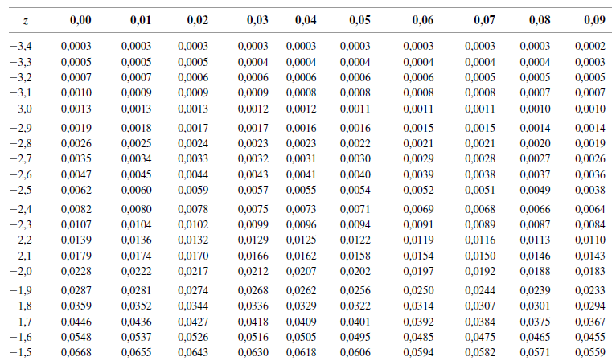
</figure>

## 3.2 Modelos probabilísticos contínuos {.unnumbered .unlisted}

<figure>
  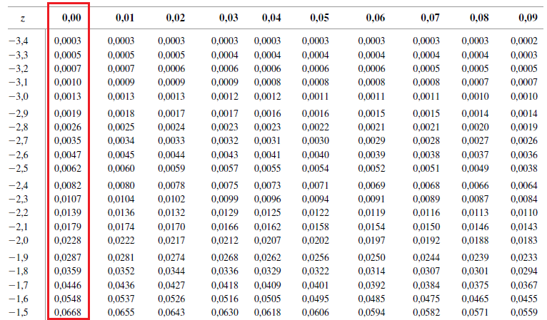
</figure>


## 3.2 Modelos probabilísticos contínuos {.unnumbered .unlisted}

<figure>
  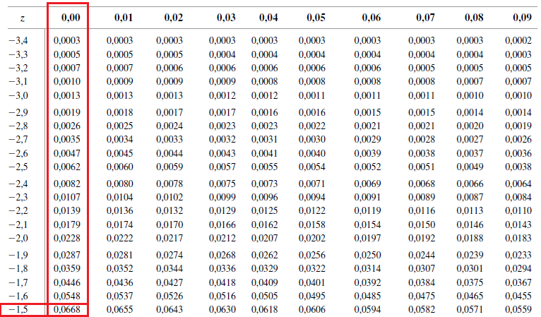
</figure>

## 3.2 Modelos probabilísticos contínuos {.unnumbered .unlisted}

```{r fig.width=8, fig.height=4.5, fig.align='center'}
x <- seq(-5,5,0.01)
mu <- 0;s2 <- 1
z <- 1.5
y <- dnorm(x = x, mean = mu1, sd = sqrt(s2_1))
M_y <- max(y); M_x <- max(x)
par(family = "serif", mar=c(5,4,1,2))
plot(x, y, type='n', xlab='', ylab='', main='', ylim=c(-.09*M_y, 1.07*M_y),
     xlim=c(min(x)-.02*diff(range(x)), max(x)+.04*diff(range(x))))
polygon(x=c(x[1], x[x < z], z, z),
        y=c(0, y[x < z], dnorm(z, mu, sqrt(s2)), 0), col='lightblue', border=NA)
arrows(y0 = -.09*M_y, y1 = 1.07*M_y, x0=0, x1=0, length = .1, lwd=2, col='darkgray')
arrows(y0 = 0, y1 = 0, x0=min(x)-.02*diff(range(x)), x1=max(x)+.04*diff(range(x)), length = .1, lwd=2, col='darkgray')
lines(x, y, lwd=3)
lines(x=c(z, z), y=c(0, dnorm(z, mu, sqrt(s2))), lwd=2)
lines(x=c(z, z), y=c(0, -.025*M_y), lwd=2)
text(x = z, y=-.02*M_y, labels=bquote(italic(z)==.(z)), pos=1)
arrows(x0 = -2, x1 = -3, y0 = dnorm(-2)/2, y1=.2, length=.07)
text(x=-3, y=.2, labels=bquote(Phi*"("*italic(z)*")"%~~%.(round(pnorm(z), 4))), pos=3)
mtext(text = expression(italic(z)), side = 1, line = 2, cex=1.5)
mtext(text = expression(italic(f)[italic(Z)]*"("*italic(z)*")"), side = 2, line = 2, cex=1.5)
```

## 3.2 Modelos probabilísticos contínuos {.unnumbered .unlisted}

<figure>
  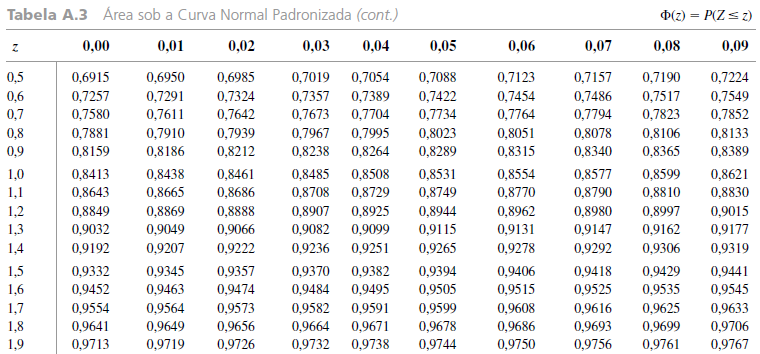
</figure>

## 3.2 Modelos probabilísticos contínuos {.unnumbered .unlisted}

<figure>
  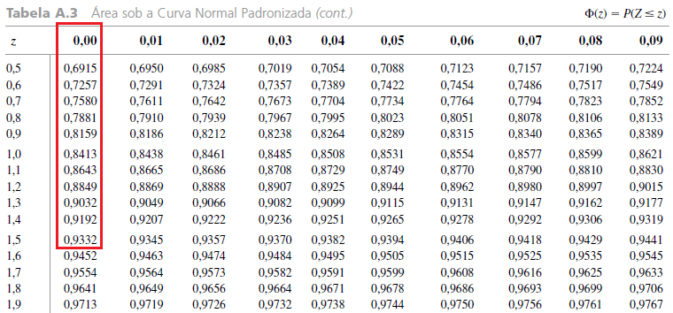
</figure>


## 3.2 Modelos probabilísticos contínuos {.unnumbered .unlisted}

<figure>
  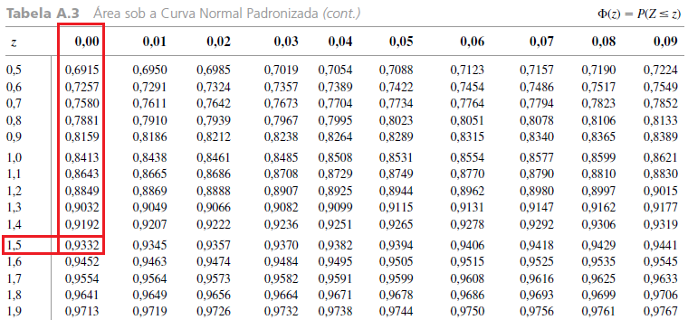
</figure>

## {.unnumbered .unlisted .smaller}

### Exemplo 14 (cont.) {.unnumbered .unlisted}

Vimos que $P(1 \leq X \leq 1.75) = P(-0.54 \leq Z \leq 1.09) = \Phi(1.09) - \Phi(-0.54)$. [Consultando a tabela da normal padrão, temos]{.fragment fragment-index=1}

::: columns

::: {.column #vcenter width=50%}

::: {.fragment fragment-index=2}

<figure>
  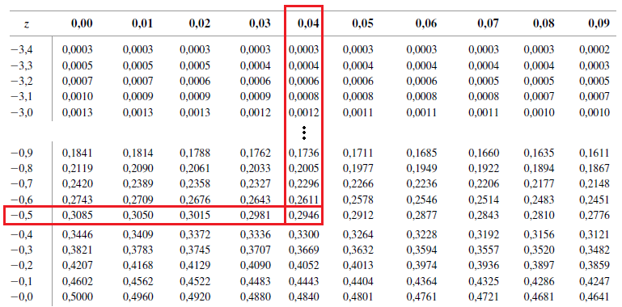
  <figcaption style='text-align:center'>$\Phi(-0.54) = 0.2946$</figcaption>
</figure>

:::

:::

::: {.column #vcenter width=50%}

::: {.fragment fragment-index=3}

<figure>
  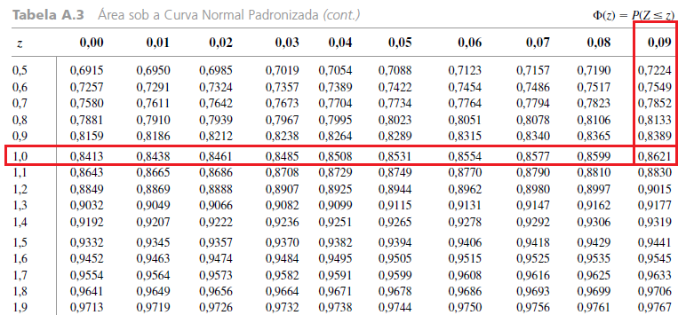
  <figcaption style='text-align:center'>$\Phi(1.09) = 0.8621$</figcaption>
</figure>

:::

:::

:::

[Assim,
$$P(1 \leq X \leq 1.75) = P(-0.54 \leq Z \leq 1.09) = \Phi(1.09) - \Phi(-0.54) = 0.8621 - 0.2946 = 0.5675.$$]{.fragment fragment-index=4}


## {.unnumbered .unlisted .smaller}

### Exemplo 14 (cont.) {.unnumbered .unlisted}

Suponha que desejamos $P(X > 1.75)$. [Utilizando a padronização, temos
$${\textstyle P(X > 1.75) = P(\frac{X-\mu}{\sigma} > \frac{1.75-1.25}{0.46}) = P(Z > 1.09) = 1 - P(Z \leq 1.09) = 1 - \Phi(1.09).}$$]{.fragment fragment-index=1}

::: columns

::: {.column #vcenter width=60%}

::: {.fragment fragment-index=2}

Consultando a tabela da normal padrão, temos

<figure>
  
  <figcaption style='text-align:center'>$\Phi(1.09) = 0.8621$</figcaption>
</figure>

:::

:::

::: {.column #vcenter width=40%}

::: {.fragment fragment-index=3}

Logo,
$$\begin{align*}
P(X > 1.75) &= 1 - \Phi(1.09)\\
&= 1 - 0.8621\\
&= 0.1379.
\end{align*}$$

:::

:::

:::

## 3.2 Modelos probabilísticos contínuos {.unnumbered .unlisted}

::: {.callout-caution}
## Observação

Muitas vezes, é necessário determinar o quantil de ordem $p$ da va $X$, denotado por $Q_{X,p}$, cuja definição é $P(X \leq Q_{X,p}) = p$. Vejas as Figuras abaixo.
:::

::: {style='visibility:hidden'}

```{r fig.width=8, fig.height=4.5, fig.align='center'}
x <- seq(-.5,3,0.01)
a <- 2;b <- 3
p <- 0.5
q_p <- qgamma(p=p, shape = a,rate = b)
y <- dgamma(x = x, shape = a,rate = b)
M_y <- max(y); M_x <- max(x)
par(family = "serif", mar=c(5,4,1,2))
plot(x, y, type='n', xlab='', ylab='', main='', ylim=c(-.09*M_y, 1.07*M_y),
     xlim=c(min(x)-.02*diff(range(x)), max(x)+.04*diff(range(x))))
polygon(x=c(x[1], x[x < q_p], q_p, q_p),
        y=c(0, y[x < q_p], dgamma(x = q_p, shape = a,rate = b), 0), col='lightblue', border=NA)
arrows(y0 = -.09*M_y, y1 = 1.07*M_y, x0=0, x1=0, length = .1, lwd=2, col='darkgray')
arrows(y0 = 0, y1 = 0, x0=min(x)-.02*diff(range(x)), x1=max(x)+.04*diff(range(x)), length = .1, lwd=2, col='darkgray')
lines(x, y, lwd=3)
lines(x=c(q_p, q_p), y=c(0, dgamma(x = q_p, shape = a,rate = b)), lwd=2)
lines(x=c(q_p, q_p), y=c(0, -.025*M_y), lwd=2)
text(x = q_p, y=-.02*M_y, labels=bquote(italic(Q[X*","*p])==.(round(q_p, 4))), pos=1)
arrows(x0 = q_p/2, x1 = 1.5, y0 = dgamma(x = q_p, shape = a,rate = b)/2, y1=.6, length=.07)
text(x=1.5, y=.6, labels=bquote(italic(P)*"("*italic(X)<=italic(Q[X*","*p])*") = "*italic(F[X])*"("*italic(Q[X*","*p])*") = "*.(round(p, 4))), pos=4)
mtext(text = expression(italic(x)), side = 1, line = 2, cex=1.5)
mtext(text = expression(italic(f)[italic(X)]*"("*italic(x)*")"), side = 2, line = 2, cex=1.5)
legend('topright', legend=bquote(italic(p) == .(p)), fill = 'lightblue')
```

:::

## 3.2 Modelos probabilísticos contínuos {.unnumbered .unlisted}

::: {.callout-caution}
## Observação

Muitas vezes, é necessário determinar o quantil de ordem $p$ da va $X$, denotado por $Q_{X,p}$, cuja definição é $P(X \leq Q_{X,p}) = p$. Vejas as Figuras abaixo.
:::


```{r fig.width=8, fig.height=4.5, fig.align='center'}
x <- seq(-.5,3,0.01)
a <- 2;b <- 3
p <- 0.5
q_p <- qgamma(p=p, shape = a,rate = b)
y <- dgamma(x = x, shape = a,rate = b)
M_y <- max(y); M_x <- max(x)
par(family = "serif", mar=c(5,4,1,2))
plot(x, y, type='n', xlab='', ylab='', main='', ylim=c(-.09*M_y, 1.07*M_y),
     xlim=c(min(x)-.02*diff(range(x)), max(x)+.04*diff(range(x))))
polygon(x=c(x[1], x[x < q_p], q_p, q_p),
        y=c(0, y[x < q_p], dgamma(x = q_p, shape = a,rate = b), 0), col='lightblue', border=NA)
arrows(y0 = -.09*M_y, y1 = 1.07*M_y, x0=0, x1=0, length = .1, lwd=2, col='darkgray')
arrows(y0 = 0, y1 = 0, x0=min(x)-.02*diff(range(x)), x1=max(x)+.04*diff(range(x)), length = .1, lwd=2, col='darkgray')
lines(x, y, lwd=3)
lines(x=c(q_p, q_p), y=c(0, dgamma(x = q_p, shape = a,rate = b)), lwd=2)
lines(x=c(q_p, q_p), y=c(0, -.025*M_y), lwd=2)
text(x = q_p, y=-.02*M_y, labels=bquote(italic(Q[X*","*p])==.(round(q_p, 4))), pos=1)
arrows(x0 = q_p/2, x1 = 1.5, y0 = dgamma(x = q_p, shape = a,rate = b)/2, y1=.6, length=.07)
text(x=1.5, y=.6, labels=bquote(italic(P)*"("*italic(X)<=italic(Q[X*","*p])*") = "*italic(F[X])*"("*italic(Q[X*","*p])*") = "*.(round(p, 4))), pos=4)
mtext(text = expression(italic(x)), side = 1, line = 2, cex=1.5)
mtext(text = expression(italic(f)[italic(X)]*"("*italic(x)*")"), side = 2, line = 2, cex=1.5)
legend('topright', legend=bquote(italic(p) == .(p)), fill = 'lightblue')
```

## 3.2 Modelos probabilísticos contínuos {.unnumbered .unlisted}

::: {.callout-caution}
## Observação

Muitas vezes, é necessário determinar o quantil de ordem $p$ da va $X$, denotado por $Q_{X,p}$, cuja definição é $P(X \leq Q_{X,p}) = p$. Vejas as Figuras abaixo.
:::


```{r fig.width=8, fig.height=4.5, fig.align='center'}
x <- seq(-.5,3,0.01)
a <- 2;b <- 3
p <- 0.7
q_p <- qgamma(p=p, shape = a,rate = b)
y <- dgamma(x = x, shape = a,rate = b)
M_y <- max(y); M_x <- max(x)
par(family = "serif", mar=c(5,4,1,2))
plot(x, y, type='n', xlab='', ylab='', main='', ylim=c(-.09*M_y, 1.07*M_y),
     xlim=c(min(x)-.02*diff(range(x)), max(x)+.04*diff(range(x))))
polygon(x=c(x[1], x[x < q_p], q_p, q_p),
        y=c(0, y[x < q_p], dgamma(x = q_p, shape = a,rate = b), 0), col='lightblue', border=NA)
arrows(y0 = -.09*M_y, y1 = 1.07*M_y, x0=0, x1=0, length = .1, lwd=2, col='darkgray')
arrows(y0 = 0, y1 = 0, x0=min(x)-.02*diff(range(x)), x1=max(x)+.04*diff(range(x)), length = .1, lwd=2, col='darkgray')
lines(x, y, lwd=3)
lines(x=c(q_p, q_p), y=c(0, dgamma(x = q_p, shape = a,rate = b)), lwd=2)
lines(x=c(q_p, q_p), y=c(0, -.025*M_y), lwd=2)
text(x = q_p, y=-.02*M_y, labels=bquote(italic(Q[X*","*p])==.(round(q_p, 4))), pos=1)
arrows(x0 = q_p/2, x1 = 1.5, y0 = dgamma(x = q_p, shape = a,rate = b)/2, y1=.6, length=.07)
text(x=1.5, y=.6, labels=bquote(italic(P)*"("*italic(X)<=italic(Q[X*","*p])*") = "*italic(F[X])*"("*italic(Q[X*","*p])*") = "*.(round(p, 4))), pos=4)
mtext(text = expression(italic(x)), side = 1, line = 2, cex=1.5)
mtext(text = expression(italic(f)[italic(X)]*"("*italic(x)*")"), side = 2, line = 2, cex=1.5)
legend('topright', legend=bquote(italic(p) == .(p)), fill = 'lightblue')
```


## 3.2 Modelos probabilísticos contínuos {.unnumbered .unlisted}

::: {.callout-caution}
## Observação

Muitas vezes, é necessário determinar o quantil de ordem $p$ da va $X$, denotado por $Q_{X,p}$, cuja definição é $P(X \leq Q_{X,p}) = p$. Vejas as Figuras abaixo.
:::


```{r fig.width=8, fig.height=4.5, fig.align='center'}
x <- seq(-.5,3,0.01)
a <- 2;b <- 3
p <- 0.9
q_p <- qgamma(p=p, shape = a,rate = b)
y <- dgamma(x = x, shape = a,rate = b)
M_y <- max(y); M_x <- max(x)
par(family = "serif", mar=c(5,4,1,2))
plot(x, y, type='n', xlab='', ylab='', main='', ylim=c(-.09*M_y, 1.07*M_y),
     xlim=c(min(x)-.02*diff(range(x)), max(x)+.04*diff(range(x))))
polygon(x=c(x[1], x[x < q_p], q_p, q_p),
        y=c(0, y[x < q_p], dgamma(x = q_p, shape = a,rate = b), 0), col='lightblue', border=NA)
arrows(y0 = -.09*M_y, y1 = 1.07*M_y, x0=0, x1=0, length = .1, lwd=2, col='darkgray')
arrows(y0 = 0, y1 = 0, x0=min(x)-.02*diff(range(x)), x1=max(x)+.04*diff(range(x)), length = .1, lwd=2, col='darkgray')
lines(x, y, lwd=3)
lines(x=c(q_p, q_p), y=c(0, dgamma(x = q_p, shape = a,rate = b)), lwd=2)
lines(x=c(q_p, q_p), y=c(0, -.025*M_y), lwd=2)
text(x = q_p, y=-.02*M_y, labels=bquote(italic(Q[X*","*p])==.(round(q_p, 4))), pos=1)
arrows(x0 = q_p/2, x1 = 1.5, y0 = dgamma(x = q_p, shape = a,rate = b)/2, y1=.6, length=.07)
text(x=1.5, y=.6, labels=bquote(italic(P)*"("*italic(X)<=italic(Q[X*","*p])*") = "*italic(F[X])*"("*italic(Q[X*","*p])*") = "*.(round(p, 4))), pos=4)
mtext(text = expression(italic(x)), side = 1, line = 2, cex=1.5)
mtext(text = expression(italic(f)[italic(X)]*"("*italic(x)*")"), side = 2, line = 2, cex=1.5)
legend('topright', legend=bquote(italic(p) == .(p)), fill = 'lightblue')
```

## 3.2 Modelos probabilísticos contínuos {.unnumbered .unlisted}

::: {style="border-style: solid; border-width: 3px; padding-bottom: 0px; padding-right: 12px; padding-left: 12px; font-size:70%;"}

**Exemplo 14 (cont.):** Suponha que desejamos encontrar o valor que corresponde ao tempo de reação dos $70\%$ motoristas que reagem mais rapidamente. Na verdade, estamos interessados no quantil de ordem $p=0.7$, isto é, $Q_{X,0.7}$. Para encontrarmos, note que
$${\textstyle 0.7 = P(X \leq Q_{X,0.7}) = P(\frac{X - \mu}{\sigma} \leq \frac{Q_{X,0.7} - \mu}{\sigma})} = P(Z \leq Q_{Z,0.7}),$$
em que $Q_{Z,0.7} = \frac{Q_{X,0.7} - \mu}{\sigma} = \frac{Q_{X,0.7} - 1.25}{0.46}$, ou ainda, $Q_{X,0.7} = 1.25 + 0.46 Q_{Z,0.7}$.

:::

::: {.callout-caution}
## Observação

Note que, novamente, o problema passa do quantil de uma normal qualquer para o quantil de uma normal padrão. Para encontrar $Q_{Z,0.7}$, necessitamos consultar a tabela normal padrão de maneira inversa.

:::

## {.unnumbered .unlisted .smaller}

### Exemplo 14 (cont.) {.unnumbered .unlisted}

<figure>
  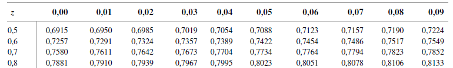
</figure>

## {.unnumbered .unlisted .smaller}

### Exemplo 14 (cont.) {.unnumbered .unlisted}

<figure>
  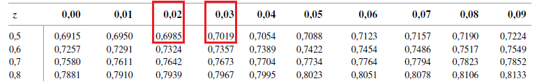
</figure>

## {.unnumbered .unlisted .smaller}

### Exemplo 14 (cont.) {.unnumbered .unlisted}

<figure>
  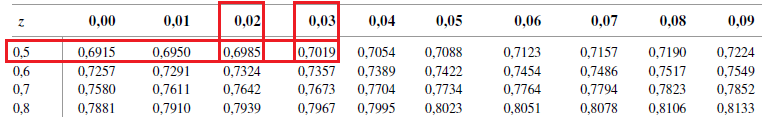
</figure>

[Assim, concluímos que $0.52 < Q_{Z,0.7} < 0.53$. Podemos usar interpolação para aproximar $Q_{Z, 0.7}$.]{.fragment fragment-index=1} [Note que $Q_{Z,0.6985} = 0.52$ e $Q_{Z,0.7019} = 0.53$.]{.fragment fragment-index=2} [Agora, admitindo que $Q_{Z,p}$ tem uma relação aproximadamente linear para $0.6985 \leq p \leq 0.7019$, temos que $Q_{Z,p} = a+bp$, com as restrições]{.fragment fragment-index=3}

:::{.fragment fragment-index=3}

<table>
  <tr style="border-bottom:none;text-align:center;">
    <td>$0.52 = a+0.6985b$</td> <td>([**Eq. 1**]{style='color:red;'})</td> <td></td> <td></td> <td>e</td> <td></td> <td></td> <td>$0.53 = a+0.7019b$.</td> <td>([**Eq. 2**]{style='color:red;'})</td>
  </tr>
</table>

:::

[Pela 1ª equação, $a = 0.52 - 0.6985b$.]{.fragment fragment-index=4} [Substituindo na 2ª equação, vem $b = \frac{0.53 - 0.52}{0.7019 - 0.6985} \approx 2.9412$.]{.fragment fragment-index=5} [Retornando na 1ª equação, temos $a = 0.52 - 0.6985\cdot 2.9412 \approx -1.5344$.]{.fragment fragment-index=6} [Finalmente, temos
$$Q_{Z,0.7} = a+0.7b = -1.5344 + 0.7 \cdot 2.9412 \approx 0.5244 \color{white}{\Rightarrow Q_{X,0.7} = 1.25 + 0.46 Q_{Z,0.7} = 1.4912.}$$]{.fragment fragment-index=7}


## {.unnumbered .unlisted .smaller}

### Exemplo 14 (cont.) {.unnumbered .unlisted}

<figure>
  
</figure>

Assim, concluímos que $0.52 < Q_{Z,0.7} < 0.53$. Podemos usar interpolação para aproximar $Q_{Z, 0.7}$. Note que $Q_{Z,0.6985} = 0.52$ e $Q_{Z,0.7019} = 0.53$. Agora, admitindo que $Q_{Z,p}$ tem uma relação aproximadamente linear para $0.6985 \leq p \leq 0.7019$, temos que $Q_{Z,p} = a+bp$, com as restrições

<table>
  <tr style="border-bottom:none;text-align:center;">
    <td>$0.52 = a+0.6985b$</td> <td>([**Eq. 1**]{style='color:red;'})</td> <td></td> <td></td> <td>e</td> <td></td> <td></td> <td>$0.53 = a+0.7019b$.</td> <td>([**Eq. 2**]{style='color:red;'})</td>
  </tr>
</table>

Pela 1ª equação, $a = 0.52 - 0.6985b$. Substituindo na 2ª equação, vem $b = \frac{0.53 - 0.52}{0.7019 - 0.6985} \approx 2.9412$. Retornando na 1ª equação, temos $a = 0.52 - 0.6985\cdot 2.9412 \approx -1.5344$. Finalmente, temos
$$Q_{Z,0.7} = a+0.7b = -1.5344 + 0.7 \cdot 2.9412 \approx 0.5244 \color{red}{\Rightarrow Q_{X,0.7} = 1.25 + 0.46 Q_{Z,0.7} = 1.4912.}$$ 
**Conclusão:** 70% dos motoristas apresentam tempo de reação inferior a 1,4912 seg.


## 3.2 Modelos probabilísticos contínuos {.unnumbered .unlisted}

::: {.callout-warning}
## Propriedade

De modo geral, podemos encontrar o quantil $Q_{Z,p}$ de uma normal padrão por interpolação da seguinte forma. Sejam $p_L$ e $p_U$, respectivamente, a maior e a menor probabilidades tabeladas tais que $p_L < p < p_U$ e $Q_{Z,p_L}$ e $Q_{Z,p_U}$ os respectivos quantis, então
$$Q_{Z,p} \approx a + bp,$$
em que
<table>
  <tr style="border-bottom:none;text-align:center;">
    <td>$b = \frac{p_U - p_L}{Q_{Z,p_U} - Q_{Z,p_L}}$</td> <td>e</td> <td>$a = p_L - bQ_{Z,p_L}$.</td>
  </tr>
</table>

:::

::: fragment

::: {.callout-caution}
## Observação

No Exemplo 14, obtivemos $p_L = 0.6985$, $p_U = 0.7019$, $Q_{Z,p_L} = 0.52$ e $Q_{Z,p_U} = 0.53$.
:::

:::

## 3.2 Modelos probabilísticos contínuos {.unnumbered .unlisted}

::: {.callout-caution}
## Observações

::: incremental

1. Em inferência, veremos um dos teoremas mais importantes para utilização em aplicações, o **Teorema Central do Limite** (TCL). Basicamente, o TCL afirma que, em grandes amostras, a média amostral tem distribuição aproximadamente normal.
2. Como a média amostral é soma de va's dividida pelo tamanho da amostra, é natural, imaginar que, se uma va $X$ pode ser enxergada como soma de várias va's, então a sua distribuição também será bem aproximada por uma normal. Esse é o caso da distribuição Binomial (soma de Bernoulli's), por exemplo.

:::

:::

::: fragment

::: {style="border-style: solid; border-width: 3px; padding-bottom: 0px; padding-right: 12px; padding-left: 12px; font-size:70%;"}

**Exemplo 15:** Dos motoristas de um estado, 25% não têm seguro. Seja $X =$ "quantidade sem seguro numa amostra de tamanho 50". [Se $s =$ "motorista não ter seguro", então $X \sim \text{Bin}(n = 50, p = 0.25)$.]{.fragment} [Vamos determinar a probabilidade de 20% ou menos da amostra não ter seguro:]{.fragment} [
$$\textstyle P(\frac{X}{n} \leq 0.2) = P(X \leq 10) = \sum_{x=0}^{10} p_X(x) = \sum_{x=0}^{10} {50 \choose x} 0.25^x0.75^{50-x} \approx 0.2622.$$]{.fragment}

:::

:::

## 3.2 Modelos probabilísticos contínuos {.unnumbered .unlisted}

::: {.callout-caution}
## Observações

::: incremental

1. Note que, no Exemplo 15, o cálculo do valor exato de $P(X \leq 10)$ envolveu o cálculo de 11 probabilidades da distribuição binomial, o que pode ser exaustivo se realizado sem auxílio computacional;
2. A alternativa que surge é utilizar $Y \sim \text{N}(\mu, \sigma^2)$ como aproximação para $X \sim \text{Bin}(n,p)$;
3. Os parâmetros $\mu$ e $\sigma^2$ da distribuição de $Y$ utilizada para a aproximação são $\mu = \mu_X = np$ e $\sigma^2 = np(1-p)$, que são a média e a variância da $X \sim \text{Bin}(n,p)$;
4. Tendo em vista que $X$ pode ser representada como soma de $n$ va's $\text{Ber}(p)$, o TCL garante que a aproximação do Item 2 fica melhor a medida que $n$ aumenta;
5. Para ilustração, os gráficos a seguir mostram a fmp de $X \sim \text{Bin}(n,p)$ com a fdp de $Y \sim \text{N}(\mu = np, \sigma^2 = np(1-p))$, para $p=0.05$ e $0.25$, e $n = 5, 10, 50$ e $100$.

:::

:::

## 3.2 Modelos probabilísticos contínuos {.unnumbered .unlisted}


```{r out.width="100%", fig.height=5}
#| layout-ncol: 2

n <- 5
p1 <- 0.05; p2 <- 0.25
mu1 <- n*p1;mu2 <- n*p2
s1 <- sqrt(n*p1*(1-p1)); s2 <- sqrt(n*p2*(1-p2))
qq <- 0:n; qq1 <- seq(-.5, n+.5, by = 0.01)
x1 <- dbinom(qq, n, p1); x2 <- dbinom(qq, n, p2)
y1 <- dnorm(qq1, mu1, s1); y2 <- dnorm(qq1, mu2, s2)
M1 <- max(y1, x1); M2 <- max(y2, x2)

par(family = "serif", mar=c(5,4,2.5,2))
plot(qq, x1, type='h', xlab='', ylab='', main='', lwd=3, xlim=c(-.5, n+.5), ylim=c(0, M1))
lines(qq1, y1, col='red', lwd=3)
mtext(text = expression(italic(x)), side = 1, line = 2, cex=1.5)
mtext(text = expression(italic(p)[italic(X)]*"("*italic(x)*")"), side = 2, line = 2, cex=1.5)
mtext(text = expression(italic(f)[italic(X)]*"("*italic(x)*")"), side = 4, line = 1, cex=1.5, col='red')
mtext(text = bquote(italic(n)==.(n)*","~italic(p)==.(p1)), side = 3, line = .5, cex=2)
legend('topright', legend=c(expression(Bin*"("*italic(n)*","*italic(p)*")"), expression(N*"("*italic(np)*","~italic(np)*"("*italic(1-p)*")"*")")), col=c('black', 'red'), lwd=3)

plot(qq, x2, type='h', xlab='', ylab='', main='', lwd=3, xlim=c(-.5, n+.5), ylim=c(0, M2))
lines(qq1, y2, col='red', lwd=3)
mtext(text = expression(italic(x)), side = 1, line = 2, cex=1.5)
mtext(text = expression(italic(p)[italic(X)]*"("*italic(x)*")"), side = 2, line = 2, cex=1.5)
mtext(text = expression(italic(f)[italic(X)]*"("*italic(x)*")"), side = 4, line = 1, cex=1.5, col='red')
mtext(text = bquote(italic(n)==.(n)*","~italic(p)==.(p2)), side = 3, line = .5, cex=2)
legend('topright', legend=c(expression(Bin*"("*italic(n)*","*italic(p)*")"), expression(N*"("*italic(np)*","~italic(np)*"("*italic(1-p)*")"*")")), col=c('black', 'red'), lwd=3)
```

## 3.2 Modelos probabilísticos contínuos {.unnumbered .unlisted}

```{r out.width="100%", fig.height=5}
#| layout-ncol: 2

n <- 10
p1 <- 0.05; p2 <- 0.25
mu1 <- n*p1;mu2 <- n*p2
s1 <- sqrt(n*p1*(1-p1)); s2 <- sqrt(n*p2*(1-p2))
qq <- 0:n; qq1 <- seq(-.5, n+.5, by = 0.01)
x1 <- dbinom(qq, n, p1); x2 <- dbinom(qq, n, p2)
y1 <- dnorm(qq1, mu1, s1); y2 <- dnorm(qq1, mu2, s2)
M1 <- max(y1, x1); M2 <- max(y2, x2)

par(family = "serif", mar=c(5,4,2.5,2))
plot(qq, x1, type='h', xlab='', ylab='', main='', lwd=3, xlim=c(-.5, n+.5), ylim=c(0, M1))
lines(qq1, y1, col='red', lwd=3)
mtext(text = expression(italic(x)), side = 1, line = 2, cex=1.5)
mtext(text = expression(italic(p)[italic(X)]*"("*italic(x)*")"), side = 2, line = 2, cex=1.5)
mtext(text = expression(italic(f)[italic(X)]*"("*italic(x)*")"), side = 4, line = 1, cex=1.5, col='red')
mtext(text = bquote(italic(n)==.(n)*","~italic(p)==.(p1)), side = 3, line = .5, cex=2)
legend('topright', legend=c(expression(Bin*"("*italic(n)*","*italic(p)*")"), expression(N*"("*italic(np)*","~italic(np)*"("*italic(1-p)*")"*")")), col=c('black', 'red'), lwd=3)

plot(qq, x2, type='h', xlab='', ylab='', main='', lwd=3, xlim=c(-.5, n+.5), ylim=c(0, M2))
lines(qq1, y2, col='red', lwd=3)
mtext(text = expression(italic(x)), side = 1, line = 2, cex=1.5)
mtext(text = expression(italic(p)[italic(X)]*"("*italic(x)*")"), side = 2, line = 2, cex=1.5)
mtext(text = expression(italic(f)[italic(X)]*"("*italic(x)*")"), side = 4, line = 1, cex=1.5, col='red')
mtext(text = bquote(italic(n)==.(n)*","~italic(p)==.(p2)), side = 3, line = .5, cex=2)
legend('topright', legend=c(expression(Bin*"("*italic(n)*","*italic(p)*")"), expression(N*"("*italic(np)*","~italic(np)*"("*italic(1-p)*")"*")")), col=c('black', 'red'), lwd=3)
```


## 3.2 Modelos probabilísticos contínuos {.unnumbered .unlisted}

```{r out.width="100%", fig.height=5}
#| layout-ncol: 2

n <- 50
p1 <- 0.05; p2 <- 0.25
mu1 <- n*p1;mu2 <- n*p2
s1 <- sqrt(n*p1*(1-p1)); s2 <- sqrt(n*p2*(1-p2))
qq <- 0:n; qq1 <- seq(-.5, n+.5, by = 0.01)
x1 <- dbinom(qq, n, p1); x2 <- dbinom(qq, n, p2)
y1 <- dnorm(qq1, mu1, s1); y2 <- dnorm(qq1, mu2, s2)
M1 <- max(y1, x1); M2 <- max(y2, x2)

par(family = "serif", mar=c(5,4,2.5,2))
plot(qq, x1, type='h', xlab='', ylab='', main='', lwd=3, xlim=c(-.5, n+.5), ylim=c(0, M1))
lines(qq1, y1, col='red', lwd=3)
mtext(text = expression(italic(x)), side = 1, line = 2, cex=1.5)
mtext(text = expression(italic(p)[italic(X)]*"("*italic(x)*")"), side = 2, line = 2, cex=1.5)
mtext(text = expression(italic(f)[italic(X)]*"("*italic(x)*")"), side = 4, line = 1, cex=1.5, col='red')
mtext(text = bquote(italic(n)==.(n)*","~italic(p)==.(p1)), side = 3, line = .5, cex=2)
legend('topright', legend=c(expression(Bin*"("*italic(n)*","*italic(p)*")"), expression(N*"("*italic(np)*","~italic(np)*"("*italic(1-p)*")"*")")), col=c('black', 'red'), lwd=3)

plot(qq, x2, type='h', xlab='', ylab='', main='', lwd=3, xlim=c(-.5, n+.5), ylim=c(0, M2))
lines(qq1, y2, col='red', lwd=3)
mtext(text = expression(italic(x)), side = 1, line = 2, cex=1.5)
mtext(text = expression(italic(p)[italic(X)]*"("*italic(x)*")"), side = 2, line = 2, cex=1.5)
mtext(text = expression(italic(f)[italic(X)]*"("*italic(x)*")"), side = 4, line = 1, cex=1.5, col='red')
mtext(text = bquote(italic(n)==.(n)*","~italic(p)==.(p2)), side = 3, line = .5, cex=2)
legend('topright', legend=c(expression(Bin*"("*italic(n)*","*italic(p)*")"), expression(N*"("*italic(np)*","~italic(np)*"("*italic(1-p)*")"*")")), col=c('black', 'red'), lwd=3)
```

## 3.2 Modelos probabilísticos contínuos {.unnumbered .unlisted}

```{r out.width="100%", fig.height=5}
#| layout-ncol: 2

n <- 100
p1 <- 0.05; p2 <- 0.25
mu1 <- n*p1;mu2 <- n*p2
s1 <- sqrt(n*p1*(1-p1)); s2 <- sqrt(n*p2*(1-p2))
qq <- 0:n; qq1 <- seq(-.5, n+.5, by = 0.01)
x1 <- dbinom(qq, n, p1); x2 <- dbinom(qq, n, p2)
y1 <- dnorm(qq1, mu1, s1); y2 <- dnorm(qq1, mu2, s2)
M1 <- max(y1, x1); M2 <- max(y2, x2)

par(family = "serif", mar=c(5,4,2.5,2))
plot(qq, x1, type='h', xlab='', ylab='', main='', lwd=3, xlim=c(-.5, n+.5), ylim=c(0, M1))
lines(qq1, y1, col='red', lwd=3)
mtext(text = expression(italic(x)), side = 1, line = 2, cex=1.5)
mtext(text = expression(italic(p)[italic(X)]*"("*italic(x)*")"), side = 2, line = 2, cex=1.5)
mtext(text = expression(italic(f)[italic(X)]*"("*italic(x)*")"), side = 4, line = 1, cex=1.5, col='red')
mtext(text = bquote(italic(n)==.(n)*","~italic(p)==.(p1)), side = 3, line = .5, cex=2)
legend('topright', legend=c(expression(Bin*"("*italic(n)*","*italic(p)*")"), expression(N*"("*italic(np)*","~italic(np)*"("*italic(1-p)*")"*")")), col=c('black', 'red'), lwd=3)

plot(qq, x2, type='h', xlab='', ylab='', main='', lwd=3, xlim=c(-.5, n+.5), ylim=c(0, M2))
lines(qq1, y2, col='red', lwd=3)
mtext(text = expression(italic(x)), side = 1, line = 2, cex=1.5)
mtext(text = expression(italic(p)[italic(X)]*"("*italic(x)*")"), side = 2, line = 2, cex=1.5)
mtext(text = expression(italic(f)[italic(X)]*"("*italic(x)*")"), side = 4, line = 1, cex=1.5, col='red')
mtext(text = bquote(italic(n)==.(n)*","~italic(p)==.(p2)), side = 3, line = .5, cex=2)
legend('topright', legend=c(expression(Bin*"("*italic(n)*","*italic(p)*")"), expression(N*"("*italic(np)*","~italic(np)*"("*italic(1-p)*")"*")")), col=c('black', 'red'), lwd=3)
```


## {.unnumbered .unlisted .smaller}

### Exemplo 15 (cont.) {.unnumbered .unlisted}

Nesse caso, temos $\mu_X = np = 50 \cdot 0.25 = 12.5$ e $\sigma_X^2 = np(1-p) = 50 \cdot 0.25 \cdot 0.75 = 9.375$. Vamos ilustrar a aproximação de $P(X \leq 10)$ por meio de $Y \sim \text{N}(12.5, 9.375)$. Veja a figura abaixo.


## {.unnumbered .unlisted .smaller}

### Exemplo 15 (cont.) {.unnumbered .unlisted}

Nesse caso, temos $\mu_X = np = 50 \cdot 0.25 = 12.5$ e $\sigma_X^2 = np(1-p) = 50 \cdot 0.25 \cdot 0.75 = 9.375$. Vamos ilustrar a aproximação de $P(X \leq 10)$ por meio de $Y \sim \text{N}(12.5, 9.375)$. Veja a figura abaixo.

```{r fig.width=11, fig.height=5, fig.align='center'}

n <- 50; p <- 0.25; x <- floor(0.2*n); mu <- n*p; s <- sqrt(n*p*(1-p))
qq_bin <- 0:n; qq_nor <- seq(-.5, n+.5, by = 0.01)
dbin <- dbinom(qq_bin, n, p); dnor <- dnorm(qq_nor, mu, s)
My <- max(dbin, dnor)

par(family = "serif", mar=c(5,4,1,2))
plot(qq, x1, type='n', xlab='', ylab='', main='', xlim=range(qq_nor), ylim=c(0, My))
# rect(xleft=(0:x-.5), ybottom=rep(0, x+1), xright=(0:x+.5), ytop=dbin[qq_bin <= x],
# col=rgb(0, 0, 0, .3, maxColorValue = 1), lty=3, lwd=1.2)
# polygon(x=c(qq_nor[1],qq_nor[qq_nor < x+.5], x+.5, x+.5),
#         y=c(0, dnor[qq_nor < x+.5], dnorm(x+.5, mu, s), 0),
# col=rgb(1, 0, 0, .3, maxColorValue = 1), border='red')
for(i in 1:length(qq_bin)) lines(x=c(qq[i],qq[i]), y=c(0, dbin[i]), lwd=1.1)
lines(qq_nor, dnor, col='red', lwd=1.1)
mtext(text = expression(italic(x)), side = 1, line = 2, cex=1.5)
mtext(text = expression(italic(p)[italic(X)]*"("*italic(x)*")"), side = 2, line = 2, cex=1.5)
mtext(text = expression(italic(f)[italic(X)]*"("*italic(x)*")"), side = 4, line = 1, cex=1.5, col='red')
# legend('topright',
#        legend=as.expression(list(
#               bquote(italic(P)*"("*italic(X)<=10*")"~"="~.(round(pbinom(x, n, p),4))),
#               bquote(italic(P)*"("*italic(Y)<=10.5*")"~"="~.(round(pnorm(x+.5, mu, s) - pnorm(-.5, mu, s),4)))
#               )),
#        fill=c(col=rgb(0, 0, 0, .3, maxColorValue = 1),
#               col=rgb(1, 0, 0, .3, maxColorValue = 1))
# )


```


## {.unnumbered .unlisted .smaller}

### Exemplo 15 (cont.) {.unnumbered .unlisted}

Nesse caso, temos $\mu_X = np = 50 \cdot 0.25 = 12.5$ e $\sigma_X^2 = np(1-p) = 50 \cdot 0.25 \cdot 0.75 = 9.375$. Vamos ilustrar a aproximação de $P(X \leq 10)$ por meio de $Y \sim \text{N}(12.5, 9.375)$. Veja a figura abaixo.

```{r fig.width=11, fig.height=5, fig.align='center'}

n <- 50; p <- 0.25; x <- floor(0.2*n); mu <- n*p; s <- sqrt(n*p*(1-p))
qq_bin <- 0:n; qq_nor <- seq(-.5, n+.5, by = 0.01)
dbin <- dbinom(qq_bin, n, p); dnor <- dnorm(qq_nor, mu, s)
My <- max(dbin, dnor)

par(family = "serif", mar=c(5,4,1,2))
plot(qq, x1, type='n', xlab='', ylab='', main='', xlim=range(qq_nor), ylim=c(0, My))
rect(xleft=(0:x-.5), ybottom=rep(0, x+1), xright=(0:x+.5), ytop=dbin[qq_bin <= x],
col=rgb(0, 0, 0, .3, maxColorValue = 1), lty=3, lwd=1.2)
# polygon(x=c(qq_nor[1],qq_nor[qq_nor < x+.5], x+.5, x+.5),
#         y=c(0, dnor[qq_nor < x+.5], dnorm(x+.5, mu, s), 0),
# col=rgb(1, 0, 0, .3, maxColorValue = 1), border='red')
for(i in 1:length(qq_bin)) lines(x=c(qq[i],qq[i]), y=c(0, dbin[i]), lwd=1.1)
lines(qq_nor, dnor, col='red', lwd=1.1)
mtext(text = expression(italic(x)), side = 1, line = 2, cex=1.5)
mtext(text = expression(italic(p)[italic(X)]*"("*italic(x)*")"), side = 2, line = 2, cex=1.5)
mtext(text = expression(italic(f)[italic(X)]*"("*italic(x)*")"), side = 4, line = 1, cex=1.5, col='red')
legend('topright',
       legend=as.expression(list(
              bquote(italic(P)*"("*italic(X)<=10*")"~"="~.(round(pbinom(x, n, p),4)))#,
              # bquote(italic(P)*"("*italic(Y)<=10.5*")"~"="~.(round(pnorm(x+.5, mu, s) - pnorm(-.5, mu, s),4)))
              )),
       fill=c(col=rgb(0, 0, 0, .3, maxColorValue = 1)#,
              # col=rgb(1, 0, 0, .3, maxColorValue = 1)
)
)


```

## {.unnumbered .unlisted .smaller}

### Exemplo 15 (cont.) {.unnumbered .unlisted}

Nesse caso, temos $\mu_X = np = 50 \cdot 0.25 = 12.5$ e $\sigma_X^2 = np(1-p) = 50 \cdot 0.25 \cdot 0.75 = 9.375$. Vamos ilustrar a aproximação de $P(X \leq 10)$ por meio de $Y \sim \text{N}(12.5, 9.375)$. Veja a figura abaixo.

```{r fig.width=11, fig.height=5, fig.align='center'}

n <- 50; p <- 0.25; x <- floor(0.2*n); mu <- n*p; s <- sqrt(n*p*(1-p))
qq_bin <- 0:n; qq_nor <- seq(-.5, n+.5, by = 0.01)
dbin <- dbinom(qq_bin, n, p); dnor <- dnorm(qq_nor, mu, s)
My <- max(dbin, dnor)

par(family = "serif", mar=c(5,4,1,2))
plot(qq, x1, type='n', xlab='', ylab='', main='', xlim=range(qq_nor), ylim=c(0, My))
rect(xleft=(0:x-.5), ybottom=rep(0, x+1), xright=(0:x+.5), ytop=dbin[qq_bin <= x],
col=rgb(0, 0, 0, .3, maxColorValue = 1), lty=3, lwd=1.2)
polygon(x=c(qq_nor[1],qq_nor[qq_nor < x+.5], x+.5, x+.5),
        y=c(0, dnor[qq_nor < x+.5], dnorm(x+.5, mu, s), 0),
col=rgb(1, 0, 0, .3, maxColorValue = 1), border='red')
for(i in 1:length(qq_bin)) lines(x=c(qq[i],qq[i]), y=c(0, dbin[i]), lwd=1.1)
lines(qq_nor, dnor, col='red', lwd=1.1)
mtext(text = expression(italic(x)), side = 1, line = 2, cex=1.5)
mtext(text = expression(italic(p)[italic(X)]*"("*italic(x)*")"), side = 2, line = 2, cex=1.5)
mtext(text = expression(italic(f)[italic(X)]*"("*italic(x)*")"), side = 4, line = 1, cex=1.5, col='red')
legend('topright',
       legend=as.expression(list(
              bquote(italic(P)*"("*italic(X)<=10*")"~"="~.(round(pbinom(x, n, p),4))),
              bquote(italic(P)*"("*italic(Y)<=10.5*")"~"="~"?")
              )),
       fill=c(col=rgb(0, 0, 0, .3, maxColorValue = 1),
              col=rgb(1, 0, 0, .3, maxColorValue = 1))
)


```

## {.unnumbered .unlisted .smaller}

### Exemplo 15 (cont.) {.unnumbered .unlisted}

Assim, a ideia é realizar a aproximação
$$\textstyle P(X \leq 10) \approx P(Y \leq 10.5) = P(Z \leq \frac{10.5 - 12.5}{\sqrt{9.375}}) = P(Z \leq -0.65) = 0.2578.$$

<figure>
  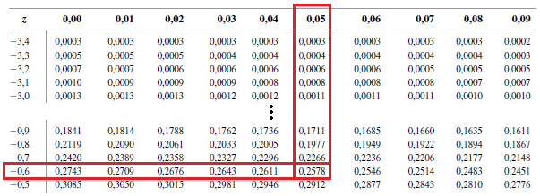
</figure>

## {.unnumbered .unlisted .smaller}

### Exemplo 15 (cont.) {.unnumbered .unlisted}

Nesse caso, temos $\mu_X = np = 50 \cdot 0.25 = 12.5$ e $\sigma_X^2 = np(1-p) = 50 \cdot 0.25 \cdot 0.75 = 9.375$. Vamos ilustrar a aproximação de $P(X \leq 10)$ por meio de $Y \sim \text{N}(12.5, 9.375)$. Veja a figura abaixo.

```{r fig.width=11, fig.height=5, fig.align='center'}

n <- 50; p <- 0.25; x <- floor(0.2*n); mu <- n*p; s <- sqrt(n*p*(1-p))
qq_bin <- 0:n; qq_nor <- seq(-.5, n+.5, by = 0.01)
dbin <- dbinom(qq_bin, n, p); dnor <- dnorm(qq_nor, mu, s)
My <- max(dbin, dnor)

par(family = "serif", mar=c(5,4,1,2))
plot(qq, x1, type='n', xlab='', ylab='', main='', xlim=range(qq_nor), ylim=c(0, My))
rect(xleft=(0:x-.5), ybottom=rep(0, x+1), xright=(0:x+.5), ytop=dbin[qq_bin <= x],
col=rgb(0, 0, 0, .3, maxColorValue = 1), lty=3, lwd=1.2)
polygon(x=c(qq_nor[1],qq_nor[qq_nor < x+.5], x+.5, x+.5),
        y=c(0, dnor[qq_nor < x+.5], dnorm(x+.5, mu, s), 0),
col=rgb(1, 0, 0, .3, maxColorValue = 1), border='red')
for(i in 1:length(qq_bin)) lines(x=c(qq[i],qq[i]), y=c(0, dbin[i]), lwd=1.1)
lines(qq_nor, dnor, col='red', lwd=1.1)
mtext(text = expression(italic(x)), side = 1, line = 2, cex=1.5)
mtext(text = expression(italic(p)[italic(X)]*"("*italic(x)*")"), side = 2, line = 2, cex=1.5)
mtext(text = expression(italic(f)[italic(X)]*"("*italic(x)*")"), side = 4, line = 1, cex=1.5, col='red')
legend('topright',
       legend=as.expression(list(
              bquote(italic(P)*"("*italic(X)<=10*")"~"="~.(round(pbinom(x, n, p),4))),
              bquote(italic(P)*"("*italic(Y)<=10.5*")"~"="~.(round(pnorm(x+.5, mu, s) - pnorm(-.5, mu, s),4)))
       )),
       fill=c(col=rgb(0, 0, 0, .3, maxColorValue = 1),
              col=rgb(1, 0, 0, .3, maxColorValue = 1))
)


```

## 3.2 Modelos probabilísticos contínuos {.unnumbered .unlisted}

::: {.callout-tip}
## Exercícios

Considerando as condições do Exemplo 15 e utilizando $Y \sim \text{N}(12.5, 9.375)$, aproxime as seguintes probabilidades:

1. $P(X < 10)$;
2. $P(X = 10)$;
3. $P(X > 10)$;
4. $P(X \geq 10)$.
:::

::: {.callout-caution}
## Observações

1. É possível notar que a va normal tem fdp simétrica em torno de $\mu$ com formato de sino (a fdp $f_X(x)$ decresce conforme $x$ se afasta de $\mu$).
2. Em muitas situações práticas, a vac é positiva e possui assimetria. Uma família de fdp com essas características é a família **gama**.
:::

## 3.2 Modelos probabilísticos contínuos {.unnumbered .unlisted}

::: {.callout-note}
## Definição

Dizemos que $X$ tem distribuição Gama com parâmetros $\alpha$ e $\beta$, se sua fdp é dada por
$$\textstyle f_X(x) = \frac{1}{\beta^\alpha\Gamma(\alpha)}x^{\alpha - 1}e^{-x/\beta}, \ \ \ \ x > 0, \ \ \ \ \alpha,\beta > 0,$$
em que $\Gamma(\alpha) = \int_0^\infty z^{\alpha-1}e^{-z}dz$ é a função gama. Nesse caso, utilizamos a notação $X \sim \text{Gama}(\alpha, \beta)$.
:::

::: fragment

::: {.callout-warning}
## Propriedades

A função gama possui as seguintes propriedades:

::: incremental

1. Para qualquer $\alpha > 1$, $\Gamma(\alpha) = (\alpha - 1)\Gamma(\alpha - 1)$;
2. Se $n \in \mathbb{N}$, então $\Gamma(n) = (n-1)!$;
3. $\Gamma(\frac{1}{2}) = \sqrt{\pi}$.

:::

:::

:::

## 3.2 Modelos probabilísticos contínuos {.unnumbered .unlisted}

::: {.callout-caution}
## Observação

Se $X \sim \text{Gama}(\alpha, 1)$, isto é, com parâmetro $\beta=1$, dizemos que $X$ tem distribuição [**gama padrão**]{style="color:red;"} de parâmetro de forma $\alpha$.

:::

::: fragment

::: {.callout-warning}
## Propriedades

::: incremental

1. Se $X \sim \text{Gama}(\alpha, \beta)$, então
<table>
  <tr style="border-bottom:none;text-align:center;">
    <td>$E(X) = \alpha\beta$</td> <td>e</td> <td>$V(X) = \alpha\beta^2.$</td>
  </tr>
</table>
2. Se $X \sim \text{Gama}(\alpha, \beta)$, então $\frac{X}{\beta} \sim \text{Gama}(\alpha, 1)$, isto é, $\frac{X}{\beta}$ tem distribuição gama padrão com parâmetro de forma $\alpha$.
3. Assim, os problemas de cálculos de probabilidades de uma $\text{Gama}(\alpha, \beta)$ podem ser transformados nos de uma $\text{Gama}(\alpha, 1)$ por meio da operação $\frac{X}{\beta}$. A probabilidades de uma gama padrão para diferentes valores de $\alpha$ podem ser obtidas por métodos numéricos e seus valores tabelados.

:::

:::

:::


## 3.2 Modelos probabilísticos contínuos {.unnumbered .unlisted}

```{r fig.width=8, fig.height=4.5, fig.align='center'}
x <- seq(0.00001,4,length.out=1000)
a1 <- 0.7; b1 <- 1
a2 <- 1; b2 <- 1
a3 <- 1.5; b3 <- 1

y1 <- dgamma(x = x, shape = a1,scale = b1)
y2 <- dgamma(x = x, shape = a2,scale = b2)
y3 <- dgamma(x = x, shape = a3,scale = b3)

M_y <- max(2, y2, y3)
par(family = "serif", mar=c(5,4,1,2))
plot(x, y1, type='n', xlab='', ylab='', main='', ylim=c(-.09*M_y, 1.07*M_y),
     xlim=c(min(x)-.02*diff(range(x)), max(x)+.04*diff(range(x))))

arrows(y0 = -.09*M_y, y1 = 1.07*M_y, x0=0, x1=0, length = .1, lwd=2, col='darkgray')
arrows(y0 = 0, y1 = 0, x0=min(x)-.02*diff(range(x)), x1=max(x)+.04*diff(range(x)), length = .1, lwd=2, col='darkgray')
lines(x[y1 <= M_y], y1[y1 <= M_y], lwd=2)
lines(x, y2, lwd=2, col='blue')
lines(x, y3, lwd=2, col='red')

mtext(text = expression(italic(x)), side = 1, line = 2, cex=1.5)
mtext(text = expression(italic(f)[italic(X)]*"("*italic(x)*")"), side = 2, line = 2, cex=1.5)
legend('topright',
       legend=as.expression(list(bquote(alpha == .(a1)*','~beta == .(b1)),
                                 bquote(alpha == .(a2)*','~beta == .(b2)),
                                 bquote(alpha == .(a3)*','~beta == .(b3)))),
       col=c('black', 'blue', 'red'), lty=1, lwd=2)
```

## 3.2 Modelos probabilísticos contínuos {.unnumbered .unlisted}

```{r fig.width=8, fig.height=4.5, fig.align='center'}
x <- seq(0.001,4,length.out=1000)
a1 <- 2; b1 <- 0.5
a2 <- 2; b2 <- 1
a3 <- 2; b3 <- 1.5

y1 <- dgamma(x = x, shape = a1,scale = b1)
y2 <- dgamma(x = x, shape = a2,scale = b2)
y3 <- dgamma(x = x, shape = a3,scale = b3)

M_y <- max(y1, y2, y3)
par(family = "serif", mar=c(5,4,1,2))
plot(x, y1, type='n', xlab='', ylab='', main='', ylim=c(-.09*M_y, 1.07*M_y),
     xlim=c(min(x)-.02*diff(range(x)), max(x)+.04*diff(range(x))))

arrows(y0 = -.09*M_y, y1 = 1.07*M_y, x0=0, x1=0, length = .1, lwd=2, col='darkgray')
arrows(y0 = 0, y1 = 0, x0=min(x)-.02*diff(range(x)), x1=max(x)+.04*diff(range(x)), length = .1, lwd=2, col='darkgray')
lines(x, y1, lwd=2)
lines(x, y2, lwd=2, col='blue')
lines(x, y3, lwd=2, col='red')

mtext(text = expression(italic(x)), side = 1, line = 2, cex=1.5)
mtext(text = expression(italic(f)[italic(X)]*"("*italic(x)*")"), side = 2, line = 2, cex=1.5)
legend('topright',
       legend=as.expression(list(bquote(alpha == .(a1)*','~beta == .(b1)),
                                 bquote(alpha == .(a2)*','~beta == .(b2)),
                                 bquote(alpha == .(a3)*','~beta == .(b3)))),
       col=c('black', 'blue', 'red'), lty=1, lwd=2)
```


## 3.2 Modelos probabilísticos contínuos {.unnumbered .unlisted}

<figure>
  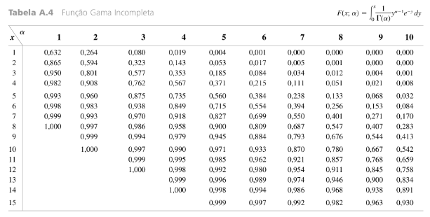
</figure>

## 3.2 Modelos probabilísticos contínuos {.unnumbered .unlisted}

<figure>
  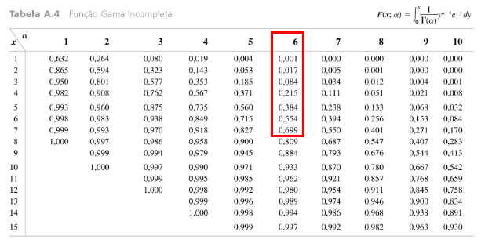
</figure>

## 3.2 Modelos probabilísticos contínuos {.unnumbered .unlisted}

<figure>
  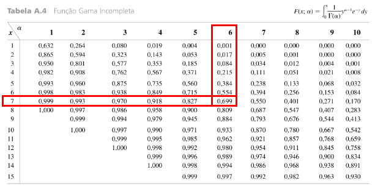
</figure>

## {.unnumbered .unlisted .smaller}

### Exemplo 16 {.unnumbered .unlisted}

O tempo de vida $X$ (semanas) de um camundongo exposto a radiação satisfaz $X \sim \text{Gama}(8, 13)$. Valores originais em *Survival Distributions: Reliability Applications in the Biomedical Services* são $\alpha = 8.5$ e $\beta = 13.3$.

[Temos $E(X) = \alpha\beta = 8\cdot 13 = 104$, $V(X) = 8\cdot 13^2 = 1352$ e $DP(X) = \sqrt{1352} \approx 36.77$. Se $Y = \frac{X}{13}$, então $Y \sim \text{Gama}(8, 1)$.]{.fragment fragment-index=1} [Daí, por exemplo, a probabilidade de um camundongo sobreviver de 60 a 120 semanas é
$$\textstyle P(60 < X < 120) = P(\frac{60}{13} < \frac{X}{13} < \frac{120}{13}) \approx P(4.62 < Y < 9.23) = F_Y(9.23) - F_Y(4.62).$$]{.fragment fragment-index=2}

::: columns

::: {.column #vcenter width=50%}

::: {.fragment fragment-index=3}

<figure>
  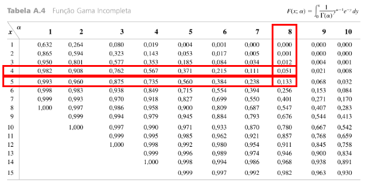
  <figcaption style='text-align:center'>$0.051 = F_Y(4) < F_Y(4.62) < F_Y(5) = 0.133$</figcaption>
</figure>

:::

:::

::: {.column #vcenter width=50%}

::: {.fragment fragment-index=4}

<figure>
  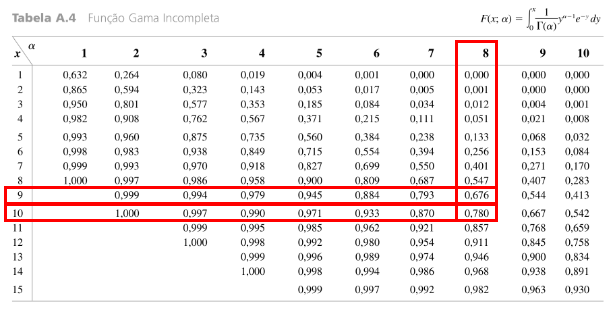
  <figcaption style='text-align:center'>$0.676 = F_Y(9) < F_Y(9.23) < F_Y(10) = 0.780$</figcaption>
</figure>

:::

:::

:::

## 3.2 Modelos probabilísticos contínuos {.unnumbered .unlisted}

::: {style="border-style: solid; border-width: 3px; padding-bottom: 12px; padding-right: 12px; padding-left: 12px; font-size:70%;"}

**Exemplo 16 (cont.):** Podemos aproximar o valor de $F_Y(4.62)$ utilizando interpolação linear. [Assumindo que $F_Y(y) \approx a+by$, $y \in [4,5]$, e notando que $F_Y(4) = 0.051 = a+4b$ e que $F_Y(5) = 0.133 = a + 5b$, obtemos]{.fragment fragment-index=1}

::: {.fragment fragment-index=1}

<table>
  <tr style="border-bottom:none;text-align:center;">
    <td>$5b-4b = b = 0.133 - 0.051 = 0.082$</td> <td>e</td> <td>$a = 0.051 - 4b = 0.051 - 4 \cdot 0.082 = -0.277.$</td>
  </tr>
</table>

:::

[Logo, $F_Y(4.62) \approx -0.277 + 0.082 \cdot 4.62 = 0.1018$ (valor verdadeiro [`r round(pgamma(q = 4.62, shape = 8, rate = 1), 4)`]{style='color:blue;'}).]{.fragment fragment-index=3} [Analogamente, obtemos $F_Y(9.23) \approx -0.26 + 0.104 \cdot 9.23 = 0.6999$ (valor verdadeiro [`r round(pgamma(q = 9.23, shape = 8, rate = 1), 4)`]{style='color:blue;'}).]{.fragment fragment-index=4} [Assim,]{.fragment fragment-index=5}

::: {.fragment fragment-index=5}

<table>
  <tr style="border-bottom:none;text-align:center;">
    <td>$P(60 < X < 120) \approx 0.6999 - 0.1018 = 0.5981$</td> <td>(Valor verdadeiro [`r round(diff(pgamma(q = c(4.62, 9.23), shape = 8, rate = 1)), 4)`]{style='color:blue;'}).</td>
  </tr>
</table>

:::

:::

::: {.fragment fragment-index=6}

::: {.callout-caution}
## Observação

Existe um caso especial da distribuição Gama que é muito útil em inferência, que é a distribuição [**qui-quadrado**]{style='color:red;'}.

:::

:::


## 3.2 Modelos probabilísticos contínuos {.unnumbered .unlisted}

::: {.callout-note}
## Definição

Dizemos que $X$ tem distribuição qui-quadrado com $\nu$ graus de liberdade (gl), denotada por $X \sim \chi^2_\nu$, se
<table>
  <tr style="border-bottom:none;text-align:center;">
    <td>$f_X(x) = \frac{(1/2)^{\nu/2}}{\Gamma(\frac{\nu}{2})}x^{\frac{\nu}{2}-1}e^{-\frac{x}{2}}, \ \ \ \ x > 0, \ \ \ \ \nu = 1, 2, \ldots.$</td>
  </tr>
</table>
:::

::: {.fragment fragment-index=2}

::: {.callout-warning}
## Propriedade

A distribuição $\chi^2_\nu$ é um caso especial da $\text{Gama}(\alpha, \beta)$, com $\alpha = \frac{\nu}{2}$ e $\beta = 2$. Assim, pela esperança e variancia da distribuição gama, se $X \sim \chi^2_\nu$, temos que
<table>
  <tr style="border-bottom:none;text-align:center;">
    <td>$E(X) = \alpha\beta = \nu$</td> <td>e</td> <td>$V(X) = \alpha\beta^2 = 2\nu.$</td>
  </tr>
</table>

:::

:::

::: {.fragment fragment-index=3}

::: {.callout-caution}
## Observação

Embora, em geral, as probabilidades da distribuição Gama não possam ser obtidas analiticamente, quando $\alpha = 1$ isso é possível. Esse caso particular da distribuição Gama, é chamada de distribuição [**exponencial**]{style='color:red;'}.
:::

:::


## 3.2 Modelos probabilísticos contínuos {.unnumbered .unlisted}

::: {.callout-note}
## Definição

Dizemos que $X$ tem distribuição exponencial com taxa $\lambda$, denotada por $X \sim \text{Exp}(\lambda)$, se sua fdp é
<table>
  <tr style="border-bottom:none;text-align:center;">
    <td>$f_X(x) = \lambda e^{-\lambda x}, \ \ \ \ x > 0, \ \ \ \ \lambda > 0.$</td>
  </tr>
</table>
:::

::: fragment

::: {.callout-warning}
## Propriedades

::: incremental

1. A distribuição $\text{Exp}(\lambda)$ é um caso especial da $\text{Gama}(\alpha, \beta)$, com $\alpha = 1$ e $\beta = \frac{1}{\lambda}$;
2. Assim, pela esperança e variancia da distribuição gama, se $X \sim \text{Exp}(\lambda)$, temos que
<table>
  <tr style="border-bottom:none;text-align:center;">
    <td>$\mu = E(X) = \alpha\beta = \frac{1}{\lambda}$</td> <td>e</td> <td>$\sigma^2 = V(X) = \alpha\beta^2 = \frac{1}{\lambda^2}.$</td>
  </tr>
</table>

:::

:::

:::

::: fragment

::: {.callout-caution}
## Observação

Note que, se $X \sim \text{Exp}(\lambda)$, então $\mu = \sigma$.
:::

:::

## 3.2 Modelos probabilísticos contínuos {.unnumbered .unlisted}

```{r fig.width=8, fig.height=4.5, fig.align='center'}
x <- seq(0.001,4,length.out=1000)
a1 <- 1; b1 <- 0.5
a2 <- 1; b2 <- 1
a3 <- 1; b3 <- 2

y1 <- dgamma(x = x, shape = a1,scale = b1)
y2 <- dgamma(x = x, shape = a2,scale = b2)
y3 <- dgamma(x = x, shape = a3,scale = b3)

M_y <- max(y1, y2, y3)
par(family = "serif", mar=c(5,4,1,2))
plot(x, y1, type='n', xlab='', ylab='', main='', ylim=c(-.09*M_y, 1.07*M_y),
     xlim=c(min(x)-.02*diff(range(x)), max(x)+.04*diff(range(x))))

arrows(y0 = -.09*M_y, y1 = 1.07*M_y, x0=0, x1=0, length = .1, lwd=2, col='darkgray')
arrows(y0 = 0, y1 = 0, x0=min(x)-.02*diff(range(x)), x1=max(x)+.04*diff(range(x)), length = .1, lwd=2, col='darkgray')
lines(x, y1, lwd=2)
lines(x, y2, lwd=2, col='blue')
lines(x, y3, lwd=2, col='red')

mtext(text = expression(italic(x)), side = 1, line = 2, cex=1.5)
mtext(text = expression(italic(f)[italic(X)]*"("*italic(x)*")"), side = 2, line = 2, cex=1.5)
legend('topright',
       legend=as.expression(list(bquote(lambda == .(1/b1)),
                                 bquote(lambda == .(1/b2)),
                                 bquote(lambda == .(1/b3)))),
       col=c('black', 'blue', 'red'), lty=1, lwd=2)
```


## 3.2 Modelos probabilísticos contínuos {.unnumbered .unlisted}

::: {.callout-warning}
## Propriedade

Se $X \sim \text{Exp}(\lambda)$, então sua fda é dada por
<table>
  <tr style="border-bottom:none;text-align:center;">
    <td>$F_X(x) = 1 - e^{-\lambda x}.$</td>
  </tr>
</table>
:::

::: {.fragment style="border-style: solid; border-width: 3px; padding-bottom: 0px; padding-right: 12px; padding-left: 12px; font-size:70%;"}

**Exemplo 17:** O tempo de resposta $X$ em um terminal de computador on-line satisfaz $X \sim \text{Exp}(\lambda)$. Suponha que o tempo de resposta esperado é de 5 segundos. [Então $E(X) = 5 = 1/\lambda$, com $\lambda = 0.2$.]{.fragment}

[A probabilidade de o tempo de resposta ser maior que 10 segundos é
$$P(X > 10) = 1- P(X \leq 10) = 1 - F_X(10) = 1 - (1-e^{-0.2\cdot 10}) = e^{-2} \approx 0.1353.$$]{.fragment}

[Seja $\tilde{\mu}$ o tempo de resposta mediano. Como $F_X(\tilde{\mu}) = 1-e^{-0.2\cdot \tilde{\mu}} = 0.5$,]{.fragment} [temos que a mediana é $\tilde{\mu} = -5\log(0.5) \approx 3.4657$.]{.fragment} [Note que $\tilde{\mu} \approx 3.4657 > 5 = \mu$, o que reflete a assimetria à direita da distribuição exponencial.]{.fragment}

::: 


## 3.2 Modelos probabilísticos contínuos {.unnumbered .unlisted}

::: {.callout-caution}
## Observações

1. A distribuição exponencial é muito utilizada para modelar o tempo de vida de componentes em geral;
2. Uma propriedade importante da distribuição exponencial nessas aplicações é a **falta de memória**.
:::

::: fragment

::: {.callout-warning}
## Propriedade - Fala de memória da distribuição exponencial

Se $X \sim \text{Exp}(\lambda)$, então $P(X > t + s⏐ X > s) = P(X > t) = e^{-\lambda t}$, ou seja, se sabemos que $X$ já ultrapassou $s$, a probabilidade de $X$ ultrapassar $t+s$ é a mesma de $X$ ultrapassar $t$. Em outras palavras, após $s$ instantes, o componente não apresenta sinais de desgaste/melhora.
:::

:::

::: fragment

::: {.callout-caution}
## Observação

Embora a falta de memória possa ser admitida em algumas aplicações, em outras os componentes se deterioram ou ocasionalmente melhoram com o passar do tempo (ao menos até certo ponto). Modelos mais gerais de tempo de vida são fornecidos pelas distribuições Gama, Weibull e Lognormal.
:::

:::


## 3.2 Modelos probabilísticos contínuos {.unnumbered .unlisted}

::: {.callout-caution}
## Observação

Além das diversas aplicações práticas, a distribuição exponencial é utilizada na construção de uma nova distribuição **discreta**, a distribuição [**Poisson**]{style="color:red;"}.
:::


::: {.fragment style="border-style: solid; border-width: 3px; padding-bottom: 0px; padding-right: 12px; padding-left: 12px; font-size:70%;"}

**Exemplo 18:** Um processo é monitorado continuamente em busca de falhas. Para qualquer instante $t \geq 0$, seja $X_t =$ "quantidade de falhas até o instante $t$". Suponha que $X_t$ satisfaz os seguintes requisitos:

::: incremental

- o tempo entre falhas tem distribuição exponencial com taxa $\lambda$;
- as falhas acontecem independentemente;
- no instante inicial, temos $X_0 = 0$.

:::

[Dizemos $\{X_t, t \geq 0\}$ é um processo de **Poisson** com taxa $\lambda$.]{.fragment} [Para cada $t$, $X_t$ é uma vad.]{.fragment} [A fmp $X$ é]{.fragment}
<table class=fragment>
  <tr style="border-bottom:none;text-align:center;">
    <td>$p_{X_t}(x) = P(X_t = x) = \frac{e^{-\lambda t}(\lambda t)^x}{x!}, \ \ \ x=0,1,2,\ldots.$</td>
  </tr>
</table>


[O número de falhas até $t=1$ define a distribuição **Poisson**.]{.fragment}

::: 

## 3.2 Modelos probabilísticos contínuos {.unnumbered .unlisted}

::: {.callout-note}
## Definição

Dizemos que $X$ tem distribuição Poisson com taxa $\lambda$, denotada por $X \sim \text{Pois}(\lambda)$ se sua fmp é
<table>
  <tr style="border-bottom:none;text-align:center;">
    <td>$p_X(x) = P(X = x) = \frac{e^{-\lambda}\lambda^x}{x!}, \ \ \ x=0,1,2,\ldots.$</td>
  </tr>
</table>
:::

::: fragment

::: {.callout-warning}
## Propriedade

Se $X \sim \text{Pois}(\lambda)$, temos que
<table>
  <tr style="border-bottom:none;text-align:center;">
    <td>$\mu = E(X) = \lambda$</td> <td>e</td> <td>$\sigma^2 = V(X) = \lambda.$</td>
  </tr>
</table>
:::

:::

::: fragment

::: {.callout-caution}
## Observação

A distribuição Poisson é muito utilizada para modelar o número de ocorrências de eventos, não somente no tempo, mas também por unidades de medida, como áreas, por exemplo.

:::

:::

## 3.2 Modelos probabilísticos contínuos {.unnumbered .unlisted}

::: {style="border-style: solid; border-width: 3px; padding-bottom: 0px; padding-right: 12px; padding-left: 12px; font-size:70%;"}

**Exemplo 19:** Em determinada cidade, o número de casos de dengue tem distribuição de Poisson com $100$ ocorrências por $\text{km}^2$ **em média**, ou seja, $\mu = \lambda = 100$. Qual a probabilidade de se observar menos que 3 ocorrências em uma região de $10000\text{m}^2$?

[Primeiramente, temos que $10000\text{m}^2 = 100\text{m} \cdot 100\text{m} = 0.1\text{km} \cdot 0.1\text{km} = 0.01\text{km}^2$.]{.fragment} [Logo, o número de ocorrências $X$ na região especificada deve satisfazer $X \sim \text{Pois}(\lambda t)$, com $\lambda = 100$
e $t = 0.01$, ou seja $\lambda t = 1$.]{.fragment} [Assim,
$$\textstyle P(X < 3) = p_X(0) + p_X(1) + p_X(2) = \frac{e^{-1}1^0}{0!} + \frac{e^{-1}1^1}{1!} + \frac{e^{-1}1^2}{2!} = e^{-1}[1+1+\frac{1}{2}] \approx 0.9197.$$]{.fragment}

:::

::: fragment

::: {.callout-caution}
## Observação

Vimos que $X \sim \text{Exp}(\lambda)$ possui a característica de perda de memória. [Em algumas aplicações, essa propriedade não é razoável.]{.fragment} [A distribuição gama em geral não possui essa propriedade.]{.fragment} [Outros exemplos que também não têm essa restrição são as distribuições Weibull e Lognormal.]{.fragment}
:::

:::

## 3.2 Modelos probabilísticos contínuos {.unnumbered .unlisted}

::: {.callout-note}
## Definição

A vac $X$ tem distribuição Weibull com parâmetros $\alpha$ e $\beta$, denotada por $X \sim \text{Weibull}(\alpha, \beta)$ se sua fdp é
<table>
  <tr style="border-bottom:none;text-align:center;">
    <td>$f_X(x) = \frac{\alpha}{\beta^\alpha} x^{\alpha-1}e^{-(\frac{x}{\beta})^\alpha}, \ \ \ x > 0, \ \ \ \alpha,\beta > 0.$</td>
  </tr>
</table>
:::

::: fragment

::: {.callout-warning}
## Propriedade

Se $X \sim \text{Weibull}(\alpha, \beta)$, temos que
<table>
  <tr style="border-bottom:none;text-align:center;">
    <td>$\mu = E(X) = \beta\Gamma(1+\frac{1}{\alpha})$</td> <td>e</td> <td>$\sigma^2 = V(X) = \beta^2\{\Gamma(1+\frac{2}{\alpha})-[\Gamma(1+\frac{1}{\alpha})]^2\}.$</td>
  </tr>
</table>
:::

:::

::: fragment

::: {.callout-caution}
## Observação

Note que $E(X)$ e $V(X)$ dependem da função gama, $\Gamma(\cdot)$, e frequentemente são obtidas por métodos numéricos.
:::

:::

## 3.2 Modelos probabilísticos contínuos {.unnumbered .unlisted}

```{r out.width="100%", fig.height=5}
#| layout-ncol: 2

x <- seq(0.00001, 5, length.out=1000)

a1 <- 1; b1 <- 1
a2 <- 2; b2 <- 1
a3 <- 0.5; b3 <- 1
y1 <- dweibull(x, a1, b1)
y2 <- dweibull(x, a2, b2)
y3 <- dweibull(x, a3, b3)
Max <- max(y1, y2, min(max(y3), 1.5))

par(family = "serif", mar=c(5,4,2.5,2))
plot(x, y1, type='n', xlab='', ylab='', main='', lwd=3, ylim=c(-.03*Max, 1.07*Max),
     xlim=c(min(x)-.03*diff(range(x)), max(x)+.07*diff(range(x))))

arrows(y0 = -.03*Max, y1 = 1.07*Max, x0=0, x1=0, length = .1, lwd=2, col='darkgray')
arrows(y0 = 0, y1 = 0, x0=min(x)-.03*diff(range(x)), x1=max(x)+.07*diff(range(x)), length = .1, lwd=2, col='darkgray')

lines(x, y1, col='blue', lwd=3)
lines(x, y2, col='red', lwd=3)
lines(x[y3<1.5], y3[y3<1.5], col='black', lwd=3)
mtext(text = expression(italic(t)), side = 1, line = 2, cex=1.5)
mtext(text = expression(italic(f)[italic(X)]*"("*italic(x)*")"), side = 2, line = 2, cex=1.5)
mtext(text = expression(Weibull(alpha, beta)), side = 3, line = .5, cex=2)
legend('topright',
       legend=as.expression(list(bquote(alpha*" = "*.(a3)*"; "*beta*" = "*.(b3)),
                                 bquote(alpha*" = "*.(a1)*"; "*beta*" = "*.(b1)),
                                 bquote(alpha*" = "*.(a2)*"; "*beta*" = "*.(b2)))),
       col=c('black', 'blue', 'red'), lwd=3)


x <- seq(0, 2.5, length.out=1000)
a1 <- 10; b1 <- 0.5
a2 <- 10; b2 <- 1
a3 <- 10; b3 <- 2
y1 <- dweibull(x, a1, b1)
y2 <- dweibull(x, a2, b2)
y3 <- dweibull(x, a3, b3)
Max <- max(y1, y2, y3)

par(family = "serif", mar=c(5,4,2.5,2))
plot(x, y1, type='n', xlab='', ylab='', main='', lwd=3, ylim=c(-.03*Max, 1.07*Max),
     xlim=c(min(x)-.03*diff(range(x)), max(x)+.07*diff(range(x))))

arrows(y0 = -.03*Max, y1 = 1.07*Max, x0=0, x1=0, length = .1, lwd=2, col='darkgray')
arrows(y0 = 0, y1 = 0, x0=min(x)-.03*diff(range(x)), x1=max(x)+.07*diff(range(x)), length = .1, lwd=2, col='darkgray')

lines(x, y1, col='black', lwd=3)
lines(x, y2, col='blue', lwd=3)
lines(x, y3, col='red', lwd=3)
mtext(text = expression(italic(t)), side = 1, line = 2, cex=1.5)
mtext(text = expression(italic(f)[italic(X)]*"("*italic(x)*")"), side = 2, line = 2, cex=1.5)
mtext(text = expression(Weibull(alpha, beta)), side = 3, line = .5, cex=2)
legend('topright',
       legend=as.expression(list(bquote(alpha*" = "*.(a1)*"; "*beta*" = "*.(b1)),
                                 bquote(alpha*" = "*.(a2)*"; "*beta*" = "*.(b2)),
                                 bquote(alpha*" = "*.(a3)*"; "*beta*" = "*.(b3)))),
       col=c('black', 'blue', 'red'), lwd=3)
```

## 3.2 Modelos probabilísticos contínuos {.unnumbered .unlisted}

::: {.callout-warning}
## Propriedades

::: incremental

1. Se $X \sim \text{Weibull}(\alpha, \beta)$ é possível mostrar que $Y = (\frac{X}{\beta})^\alpha$ satisfaz $Y \sim \text{Exp}(1)$. De modo análogo, se $Y \sim \text{Exp}(1)$, então $X = \beta Y^{1/\alpha}$ satisfaz $X \sim \text{Weibull}(\alpha, \beta)$;
2. Se $X \sim \text{Weibull}(\alpha, \beta)$, a fda de $X$ é
<table>
  <tr style="border-bottom:none;text-align:center;">
    <td>$F_X(x) = 1- e^{-(\frac{x}{\beta})^{\alpha}}$;</td>
  </tr>
</table>
3. Se $X \sim \text{Weibull}(1, \frac{1}{\lambda})$, isto é, $\alpha = 1$ e $\beta = \frac{1}{\lambda}$, então $X \sim \text{Exp}(\lambda)$.

:::

:::

::: fragment

::: {.callout-caution}
## Observação

A função $S(t) = P(X > t) = 1-F_X(t)$ é denominada de função **sobrevivência**. As funções sobrevivência de uma $\text{Exp}(\lambda)$ e de uma $\text{Weibull}(\alpha, \beta)$ são, respectivamente:
<table>
  <tr style="border-bottom:none;text-align:center;">
    <td>$S_E(t) = e^{-\lambda t}$</td> <td>e</td> <td>$S_W(t) = e^{-(\frac{t}{\beta})^{\alpha}}.$</td>
  </tr>
</table>
:::

:::

## 3.2 Modelos probabilísticos contínuos {.unnumbered .unlisted}

```{r out.width="100%", fig.height=5}
#| layout-ncol: 2

x <- seq(0.0001, 3, length.out=1000)
lam1 <- 1
lam2 <- 3
ye1 <- 1-pexp(x, lam1)
ye2 <- 1-pexp(x, lam2)
a1 <- .5; b1 <- 1
a2 <- 3; b2 <- 1.5
yw1 <- 1-pweibull(x, a1, b1)
yw2 <- 1-pweibull(x, a2, b2)
Max <- max(ye1, ye2, yw1, yw2)

par(family = "serif", mar=c(5,4,2.5,2))
plot(x, ye1, type='n', xlab='', ylab='', main='', lwd=3, xlim=c(0, 3), ylim=c(0, Max))
lines(x, ye1, col='black', lwd=3)
lines(x, ye2, col='blue', lwd=3)
mtext(text = expression(italic(t)), side = 1, line = 2, cex=1.5)
mtext(text = expression(italic(S)[italic(E)]*"("*italic(t)*")"), side = 2, line = 2, cex=1.5)
mtext(text = expression(Exp(lambda)), side = 3, line = .5, cex=2)
legend('topright',
       legend=as.expression(list(bquote(lambda == .(lam1)),
                                 bquote(lambda == .(lam2)))),
       col=c('black', 'blue'), lwd=3)

par(family = "serif", mar=c(5,4,2.5,2))
plot(x, ye1, type='n', xlab='', ylab='', main='', lwd=3, xlim=c(0, 3), ylim=c(0, Max))
lines(x, yw1, col='black', lwd=3)
lines(x, yw2, col='blue', lwd=3)
mtext(text = expression(italic(t)), side = 1, line = 2, cex=1.5)
mtext(text = expression(italic(S)[italic(W)]*"("*italic(t)*")"), side = 2, line = 2, cex=1.5)
mtext(text = expression(Weibull(alpha, beta)), side = 3, line = .5, cex=2)
legend('topright',
       legend=as.expression(list(bquote(alpha*" = "*.(a1)*"; "*beta*" = "*.(b1)),
                                 bquote(alpha*" = "*.(a2)*"; "*beta*" = "*.(b2)))),
       col=c('black', 'blue'), lwd=3)

```

## 3.2 Modelos probabilísticos contínuos {.unnumbered .unlisted}

::: {.callout-caution}
## Observação

Note que, para $X \sim \text{Weibull}(\alpha, \beta)$, a função sobrevivência $S(t)$ possui uma forma mais flexível, o que permite modelar fenômenos mais complexos.
:::

::: {.fragment style="border-style: solid; border-width: 3px; padding-bottom: 0px; padding-right: 12px; padding-left: 12px; font-size:70%;"}

**Exemplo 20:** Um mesmo produto é montado por três fábricas diferentes. Sejam $T_1, T_2$ e $T_3$ os tempos de vida (em anos) do referido produto quando montado nas Fábricas 1, 2 e 3, respectivamente, e suponha que $T_i \sim \text{Weibull}(\alpha_i, 1)$, com $\alpha_1 = 0.5$, $\alpha_2 = 1$ e $\alpha_3 = 2$.

[Determinemos $S_i(0.5) = P(T_i > 0.5)$ e $S_i(2) = P(T_i > 2)$, para $i=1, 2, 3$.]{.fragment} [Temos que
$$S_i(0.5) = e^{-0.5^{\alpha_i}} = \begin{cases}
e^{-0.5^{0.5}} = 0.4931, & i=1;\\
e^{-0.5^{1}} = 0.6065, & i=2;\\
e^{-0.5^{2}} = 0.7788, & i=3.\\
\end{cases}\ \ \ \ \text{e}\ \ \ \ S_i(2) = e^{-2^{\alpha_i}} = \begin{cases}
e^{-2^{0.5}} = 0.2431, & i=1;\\
e^{-2^{1}} = 0.1353, & i=2;\\
e^{-2^{2}} = 0.0183, & i=3.\\
\end{cases}$$]{.fragment}

:::

## 3.2 Modelos probabilísticos contínuos {.unnumbered .unlisted}

::: {.callout-note}
## Definição

A vac $X$ tem distribuição lognormal com parâmetros $\mu$ e $\sigma^2$, denotada por $X \sim \text{LogN}(\mu, \sigma^2)$ se sua fdp é
<table>
  <tr style="border-bottom:none;text-align:center;">
    <td>$f_X(x) = \frac{1}{x\sqrt{2\pi\sigma^2}}e^{-\frac{[\ln(x) - \mu]^2}{2\sigma^2}}, \ \ \ x \geq 0.$</td>
  </tr>
</table>
:::

::: fragment

::: {.callout-warning}
## Propriedades

::: incremental

1. É possível mostrar que, se $X \sim \text{LogN}(\mu, \sigma^2)$, então $Y = \ln(X)$ satisfaz $Y \sim \text{N}(\mu, \sigma^2)$;
2. Se $X \sim \text{LogN}(\mu, \sigma^2)$, então
<table>
  <tr style="border-bottom:none;text-align:center;">
    <td>$E(X) = e^{\mu + \frac{\sigma^2}{2}}$</td> <td>e</td> <td>$V(X) = e^{2\mu + \sigma^2}(e^{\sigma^2} - 1).$</td>
  </tr>
</table>

:::

:::

:::

::: fragment

::: {.callout-caution}
## Observação

Note que, se $X \sim \text{LogN}(\mu, \sigma^2)$, então $\mu$ e $\sigma^2$ não são a esperança e variância de $X$, mas sim de $\ln(X)$.
:::

:::

## 3.2 Modelos probabilísticos contínuos {.unnumbered .unlisted}

```{r fig.width=8, fig.height=4.5, fig.align='center'}
x <- seq(0, 10,length.out=1000)
mu1 <- -0.5; s1 <- 1
mu2 <- 1; s2 <- 1
mu3 <- 1; s3 <- 2
mu4 <- 1; s4 <- 0.3

y1 <- dlnorm(x = x, meanlog = mu1, sdlog = s1)
y2 <- dlnorm(x = x, meanlog = mu2, sdlog = s2)
y3 <- dlnorm(x = x, meanlog = mu3, sdlog = s3)
y4 <- dlnorm(x = x, meanlog = mu4, sdlog = s4)

M_y <- max(y1, y2, y3, y4)
par(family = "serif", mar=c(5,4,1,2))
plot(x, y1, type='n', xlab='', ylab='', main='', ylim=c(-.09*M_y, 1.07*M_y),
     xlim=c(min(x)-.02*diff(range(x)), max(x)+.04*diff(range(x))))

arrows(y0 = -.09*M_y, y1 = 1.07*M_y, x0=0, x1=0, length = .1, lwd=2, col='darkgray')
arrows(y0 = 0, y1 = 0, x0=min(x)-.02*diff(range(x)), x1=max(x)+.04*diff(range(x)), length = .1, lwd=2, col='darkgray')
lines(x, y1, lwd=2)
lines(x, y2, lwd=2, col='blue')
lines(x, y3, lwd=2, col='red')
lines(x, y4, lwd=2, col='purple')

mtext(text = expression(italic(x)), side = 1, line = 2, cex=1.5)
mtext(text = expression(italic(f)[italic(X)]*"("*italic(x)*")"), side = 2, line = 2, cex=1.5)
legend('topright',
       legend=as.expression(list(bquote(mu*" = "*.(mu1)*";"~sigma^2*" = "*.(s1^2)),
                                 bquote(mu*" = "*.(mu2)*";"~sigma^2*" = "*.(s2^2)),
                                 bquote(mu*" = "*.(mu3)*";"~sigma^2*" = "*.(s3^2)),
                                 bquote(mu*" = "*.(mu4)*";"~sigma^2*" = "*.(s4^2)))),
       col=c('black', 'blue', 'red', 'purple'), lty=1, lwd=2)
```

## 3.2 Modelos probabilísticos contínuos {.unnumbered .unlisted}

::: {style="border-style: solid; border-width: 3px; padding-top: 12px; padding-bottom: 0px; padding-right: 12px; padding-left: 12px; font-size:70%;"}

**Exemplo 21:** O artigo *Reliability of Wood Joist Floor Systems with Creep* sugere que a vac $X =$ "módulo da elasticidade de sistemas de vigas de madeira" satisfaz $X \sim \text{LogN}(0.375, 0.25^2)$. [Assim,]{.fragment fragment-index=1}
<table class="fragment" data-fragment-index="1">
  <tr style="border-bottom:none;text-align:center;">
    <td>$E(X) = e^{0.375 + \frac{0.25^2}{2}} \approx 1.5012$</td> <td>e</td>  <td>$V(X) = e^{2\cdot0.375 + 0.25^2}(e^{0.25^2} - 1) \approx 0.1453.$</td>
  </tr>
</table>
[Para obter a probabilidade do módulo da elasticidade estar entre 1 e 2, por exemplo, podemos recorrer à transformação logarítmica ($\ln(X) \sim \text{N}(\mu, \sigma^2)$) e transformar o problema no cálculo de probabilidades de uma normal padrão:]{.fragment fragment-index=2}
[$$\begin{align*}
P(1 \leq X \leq 2) &= \textstyle P(\ln(1) \leq \ln(X) \leq \ln(2)) = P(\frac{0-0.375}{0.25} \leq \frac{\ln(X)-0.375}{0.25} \leq \frac{0.6932-0.375}{0.25})\\
&= \textstyle P(-1.5 \leq Z \leq 1.27) = \Phi(1.27) - \Phi(-1.5) = 0.8980 - 0.0668 = 0.8312.
\end{align*}$$]{.fragment fragment-index=3}

:::

::: fragment

::: {.callout-caution}
## Observação

Todos modelos contínuos que vimos atribuem densidade em intervalos ilimitados (nos reais ou nos reais não negativos). A distribuição [**Beta**]{style="color:red;"} permite modelar vac's com suporte limitado a um intervalo $(A,B)$.
:::

:::

## 3.2 Modelos probabilísticos contínuos {.unnumbered .unlisted}

::: {.callout-note}
## Definição

A vac $X$ possui distribuição Beta com parâmetros $\alpha, \beta > 0$ no intervalo $(A,B)$, denotada por $X \sim \text{Beta}(\alpha, \beta)$, se sua fdp é
<table>
  <tr style="border-bottom:none;text-align:center;">
    <td>$f_X(x) = \frac{1}{B-A}\frac{\Gamma(\alpha + \beta)}{\Gamma(\alpha)\Gamma(\beta)}(\frac{x-A}{B-A})^{\alpha-1}(\frac{B-x}{B-A})^{\beta-1},\ \ \ \ A < X < B$.</td>
  </tr>
</table>
:::

::: fragment

::: {.callout-warning}
## Propriedade

Se $X \sim \text{Beta}(\alpha, \beta)$ em $(A,B)$, então
<table>
  <tr style="border-bottom:none;text-align:center;">
    <td>$E(X) = \mu = A + (B-A)\frac{\alpha}{\alpha+\beta}$</td> <td>e</td> <td>$V(X) = \sigma^2 = \frac{(B-A)^2\alpha\beta}{(\alpha+\beta)^2(\alpha+\beta+1)}.$</td>
  </tr>
</table>
:::

:::

::: fragment

::: {.callout-caution}
## Observação

O caso $A = 0$ e $B=1$ fornece a **Beta padrão**, isto é, o suporte é o intervalo $(0,1)$. Veja a figura a seguir.
:::

:::

## 3.2 Modelos probabilísticos contínuos {.unnumbered .unlisted}

```{r out.width="100%", fig.height=5}
#| layout-ncol: 2

x <- seq(0.0001, 0.9999, length.out=1000)
a1 <- 0.5; b1 <- 0.5
a2 <- 0.5; b2 <- 3
a3 <- 1; b3 <- 1
a4 <- 2; b4 <- 2
a5 <- 2; b5 <- 3

y1 <- dbeta(x, a1, b1)
y2 <- dbeta(x, a2, b2)
y3 <- dbeta(x, a3, b3)
y4 <- dbeta(x, a4, b4)
y5 <- dbeta(x, a5, b5)

Max <- min(max(y1, y2, y3, y4, y5), 4)

par(family = "serif", mar=c(5,4,2.5,2))
plot(x[y1 < 4], y1[y1 < 4], type='n', xlab='', ylab='', main='', lwd=3, ylim=c(-.07*Max, 1.07*Max), xlim=c(min(x)-.04*diff(range(x)), max(x)+.07*diff(range(x))))
arrows(y0 = -.07*Max, y1 = 1.07*Max, x0=0, x1=0, length = .1, lwd=2, col='darkgray')
arrows(y0 = 0, y1 = 0, x0=min(x)-.04*diff(range(x)), x1=max(x)+.07*diff(range(x)), length = .1, lwd=2, col='darkgray')
lines(c(1, 1), c(0, 1.05*Max), lty=3, lwd=1.5)
lines(x[y1 < 4], y1[y1 < 4], col='black', lwd=3)
lines(x[y2 < 4], y2[y2 < 4], col='blue', lwd=3)
lines(x[y3 < 4], y3[y3 < 4], col='red', lwd=3)
lines(x[y4 < 4], y4[y4 < 4], col='purple', lwd=3)
lines(x[y5 < 4], y5[y5 < 4], col='darkgreen', lwd=3)
mtext(text = expression(italic(x)), side = 1, line = 2, cex=1.5)
mtext(text = expression(italic(f)[italic(X)]*"("*italic(x)*")"), side = 2, line = 2, cex=1.5)
# mtext(text = expression(Exp(lambda)), side = 3, line = .5, cex=2)
legend('top',
       legend=as.expression(list(bquote(alpha*" = "*.(a1)*"; "*beta*" = "*.(b1)),
                                 bquote(alpha*" = "*.(a2)*"; "*beta*" = "*.(b2)),
                                 bquote(alpha*" = "*.(a3)*"; "*beta*" = "*.(b3)),
                                 bquote(alpha*" = "*.(a4)*"; "*beta*" = "*.(b4)),
                                 bquote(alpha*" = "*.(a5)*"; "*beta*" = "*.(b5)))),
       col=c('black', 'blue', 'red', 'purple', 'darkgreen'), lwd=3)

a1 <- 0.5; b1 <- 0.5
a2 <- 3; b2 <- 0.5
a3 <- 1; b3 <- 1
a4 <- 2; b4 <- 2
a5 <- 3; b5 <- 2

y1 <- dbeta(x, a1, b1)
y2 <- dbeta(x, a2, b2)
y3 <- dbeta(x, a3, b3)
y4 <- dbeta(x, a4, b4)
y5 <- dbeta(x, a5, b5)

Max <- min(max(y1, y2, y3, y4, y5), 4)

par(family = "serif", mar=c(5,4,2.5,2))
plot(x[y1 < 4], y1[y1 < 4], type='n', xlab='', ylab='', main='', lwd=3, ylim=c(-.07*Max, 1.07*Max), xlim=c(min(x)-.04*diff(range(x)), max(x)+.07*diff(range(x))))
arrows(y0 = -.07*Max, y1 = 1.07*Max, x0=0, x1=0, length = .1, lwd=2, col='darkgray')
arrows(y0 = 0, y1 = 0, x0=min(x)-.04*diff(range(x)), x1=max(x)+.07*diff(range(x)), length = .1, lwd=2, col='darkgray')
lines(c(1, 1), c(0, 1.05*Max), lty=3, lwd=1.5)
lines(x[y1 < 4], y1[y1 < 4], col='black', lwd=3)
lines(x[y2 < 4], y2[y2 < 4], col='blue', lwd=3)
lines(x[y3 < 4], y3[y3 < 4], col='red', lwd=3)
lines(x[y4 < 4], y4[y4 < 4], col='purple', lwd=3)
lines(x[y5 < 4], y5[y5 < 4], col='darkgreen', lwd=3)
mtext(text = expression(italic(x)), side = 1, line = 2, cex=1.5)
mtext(text = expression(italic(f)[italic(X)]*"("*italic(x)*")"), side = 2, line = 2, cex=1.5)
# mtext(text = expression(Exp(lambda)), side = 3, line = .5, cex=2)
legend('top',
       legend=as.expression(list(bquote(alpha*" = "*.(a1)*"; "*beta*" = "*.(b1)),
                                 bquote(alpha*" = "*.(a2)*"; "*beta*" = "*.(b2)),
                                 bquote(alpha*" = "*.(a3)*"; "*beta*" = "*.(b3)),
                                 bquote(alpha*" = "*.(a4)*"; "*beta*" = "*.(b4)),
                                 bquote(alpha*" = "*.(a5)*"; "*beta*" = "*.(b5)))),
       col=c('black', 'blue', 'red', 'purple', 'darkgreen'), lwd=3)

```

## 3.2 Modelos probabilísticos contínuos {.unnumbered .unlisted}

::: {.callout-caution}
## Observações

::: incremental 

1. Note que $\alpha=\beta$ fornece fdp's simétricas;
2. Se $\alpha=\beta=1$, dizemos que $X$ tem distribuição uniforme em $(A,B)$, denotada por $X \sim \text{U}(A,B)$;
3. Ao trocar o valor de $\alpha$ pelo de $\beta$ e o de $\beta$ pelo de $\alpha$, a fdp é refletida em torno de $\frac{A+B}{2}$;
4. O cálculo de probabilidades da distribuição Beta, em geral, requer o uso de métodos numéricos. Mas, para uma Beta padrão com $\alpha, \beta \in \mathbb{N}$, é possível a sua obtenção analítica ($\Gamma(n) = (n-1)!$, $n \in \mathbb{N}$).

:::

:::

::: {.fragment style="border-style: solid; border-width: 3px; padding-top: 12px; padding-bottom: 0px; padding-right: 12px; padding-left: 12px; font-size:70%;"}

**Exemplo 22:** Suponha que o tempo $X \in (2,5)$ (em dias) para a construção da fundação de uma casa satisfaz $X \sim \text{Beta}(2, 3)$. [Nesse caso, temos $A=2$ (tempo mínimo) e $B=5$ (tempo máximo).]{.fragment} [Assim,]{.fragment}
<table class="fragment">
  <tr style="border-bottom:none;text-align:center;">
    <td>$P(X < 3) = \int_2^3\frac{1}{5-2}\frac{\Gamma(2 + 3)}{\Gamma(2)\Gamma(3)}(\frac{x-2}{5-2})^{2-1}(\frac{5-x}{5-2})^{3-1}dx = 12\int_{0}^{\frac{1}{3}}u(1-u)^2du = \frac{4}{3}(\frac{1}{2} - \frac{2}{9} + \frac{1}{36}) \approx 0.407,$</td>
  </tr>
</table>
[em que fizemos a transformação $u = \frac{x-2}{3}$ na igualdade entre o 2º e o 3º termos.]{.fragment}
:::

# Vetores Aleatórios Bidimensionais

## 4 Vetores Aleatórios Bidimensionais {.unnumbered .unlisted}

::: {.callout-caution}
## Observação

Até agora, tratamos uma va isoladamente, por meio de sua fmp (se discreta), de sua fdp (se contínua), ou ainda de sua fda. Em vários casos, é de interesse estudar o comportamento conjunto de duas va's.
:::

::: fragment

::: {.callout-note}
## Definição

Em um experimento aleatório com espaço amostral $\Omega$, considere duas va's $X = X(\omega)$ e $Y = Y(\omega)$, $\omega \in \Omega$. Dizemos que $(X,Y)$ é um **vetor aleatório (bidimensional)**. Sejam $A_x = \{\omega \in \Omega : X(\omega) \leq x\}$ e $B_y = \{\omega \in \Omega : Y(\omega) \leq y\}$, então a fda conjunta (fdac) de $(X,Y)$ é definida por
<table>
  <tr style="border-bottom:none;text-align:center;">
    <td>$F_{X,Y}(x,y) = P(A_x \cap B_y) = P(X \leq x, Y \leq y), \ \ \ \ x,y \in \mathbb{R}.$</td>
  </tr>
</table>
:::

:::

::: fragment

::: {.callout-caution}
## Observação

Se estiver claro a qual vetor aleatório nos referimos, podemos escrever $F(x,y)$ em vez de $F_{X,Y}(x,y)$.
:::

:::

## 4 Vetores Aleatórios Bidimensionais {.unnumbered .unlisted}

::: {.callout-caution}
## Observação

Um vetor aleatório pode ser:

::: incremental

- discreto, quando ambas coordenadas são discretas;
- contínuo, quando ambas coordenadas são contínuas;
- misto, quando uma coordenada é discreta e a outra contínua.

:::

:::

::: fragment

::: {.callout-note}
## Definição

Para um vetor aleatório $(X, Y)$ discreto, a fmp conjunta (fmpc) é definida por
<table>
  <tr style="border-bottom:none;text-align:center;">
    <td>$p_{X,Y}(x,y) = p(x,y) = P(X = x, Y = y), \ \ \ \ x \in \text{Im}(X), \ \ \ \ y \in \text{Im}(Y).$</td>
  </tr>
</table>

:::

:::


## {.unnumbered .unlisted .smaller}

### Exemplo 23 {.unnumbered .unlisted}

Dois dados honestos de 4 faces são arremessados. [Note que $\Omega = \{\omega = (z_1,z_2) : z_1, z_2 = 1,2,3,4\}$.]{.fragment fragment-index="1"} [Seja $X(\omega) = z_1 + z_2$ e $Y(\omega) = |z_1 - z_2|$. Identifiquemos $\text{Im}(X)$ e $\text{Im}(Y)$.]{style="visibility:hidden"}

::: columns

::: {.column #vcenter width=33.4%}

::: {.fragment fragment-index="1"}

<figure>
  
</figure>

:::

:::

::: {.column #vcenter width=33.3%}

<figure>
  
</figure>

:::

::: {.column #vcenter width=33.3%}

<figure>
  
</figure>

:::

:::

[Assim, notamos que $\text{Im}(X) = \{2, 3, \ldots, 8\}$ e $\text{Im}(Y) = \{0,1, 2, 3\}$.]{style="visibility:hidden"}


## {.unnumbered .unlisted .smaller}

### Exemplo 23 {.unnumbered .unlisted}

Dois dados honestos de 4 faces são arremessados. Note que $\Omega = \{\omega = (z_1,z_2) : z_1, z_2 = 1,2,3,4\}$. Seja $X(\omega) = z_1 + z_2$ e $Y(\omega) = |z_1 - z_2|$. [Identifiquemos $\text{Im}(X)$ e $\text{Im}(Y)$.]{.fragment}

::: columns

::: {.column #vcenter width=33.4%}

<figure>
  
</figure>

:::

::: {.column #vcenter width=33.3%}

<figure>
  
</figure>

:::

::: {.column #vcenter width=33.3%}

<figure>
  
</figure>

:::

:::

[Assim, notamos que $\text{Im}(X) = \{2, 3, \ldots, 8\}$ e $\text{Im}(Y) = \{0,1, 2, 3\}$.]{style="visibility:hidden"}


## {.unnumbered .unlisted .smaller}

### Exemplo 23 {.unnumbered .unlisted}

Dois dados honestos de 4 faces são arremessados. Note que $\Omega = \{\omega = (z_1,z_2) : z_1, z_2 = 1,2,3,4\}$. Seja $X(\omega) = z_1 + z_2$ e $Y(\omega) = |z_1 - z_2|$. Identifiquemos $\text{Im}(X)$ e $\text{Im}(Y)$.

::: columns

::: {.column #vcenter width=33.4%}

<figure>
  
</figure>

:::

::: {.column #vcenter width=33.3%}

<figure>
  
</figure>

:::

::: {.column #vcenter width=33.3%}

<figure>
  
</figure>

:::

:::

[Assim, notamos que $\text{Im}(X) = \{2, 3, \ldots, 8\}$ e $\text{Im}(Y) = \{0,1, 2, 3\}$.]{style="visibility:hidden"}


## {.unnumbered .unlisted .smaller}

### Exemplo 23 {.unnumbered .unlisted}

Dois dados honestos de 4 faces são arremessados. Note que $\Omega = \{\omega = (z_1,z_2) : z_1, z_2 = 1,2,3,4\}$. Seja $X(\omega) = z_1 + z_2$ e $Y(\omega) = |z_1 - z_2|$. Identifiquemos $\text{Im}(X)$ e $\text{Im}(Y)$.

::: columns

::: {.column #vcenter width=33.4%}

<figure>
  
</figure>

:::

::: {.column #vcenter width=33.3%}

<figure>
  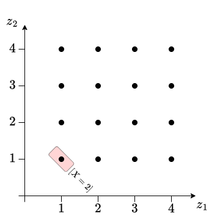
</figure>

:::

::: {.column #vcenter width=33.3%}

<figure>
  
</figure>

:::

:::

[Assim, notamos que $\text{Im}(X) = \{2, 3, \ldots, 8\}$ e $\text{Im}(Y) = \{0,1, 2, 3\}$.]{style="visibility:hidden"}


## {.unnumbered .unlisted .smaller}

### Exemplo 23 {.unnumbered .unlisted}

Dois dados honestos de 4 faces são arremessados. Note que $\Omega = \{\omega = (z_1,z_2) : z_1, z_2 = 1,2,3,4\}$. Seja $X(\omega) = z_1 + z_2$ e $Y(\omega) = |z_1 - z_2|$. Identifiquemos $\text{Im}(X)$ e $\text{Im}(Y)$.

::: columns

::: {.column #vcenter width=33.4%}

<figure>
  
</figure>

:::

::: {.column #vcenter width=33.3%}

<figure>
  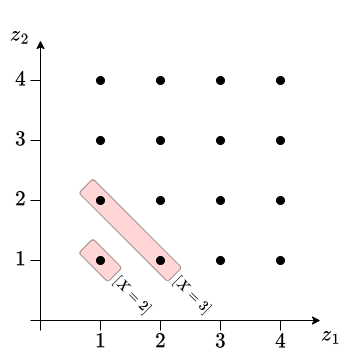
</figure>

:::

::: {.column #vcenter width=33.3%}

<figure>
  
</figure>

:::

:::

[Assim, notamos que $\text{Im}(X) = \{2, 3, \ldots, 8\}$ e $\text{Im}(Y) = \{0,1, 2, 3\}$.]{style="visibility:hidden"}


## {.unnumbered .unlisted .smaller}

### Exemplo 23 {.unnumbered .unlisted}

Dois dados honestos de 4 faces são arremessados. Note que $\Omega = \{\omega = (z_1,z_2) : z_1, z_2 = 1,2,3,4\}$. Seja $X(\omega) = z_1 + z_2$ e $Y(\omega) = |z_1 - z_2|$. Identifiquemos $\text{Im}(X)$ e $\text{Im}(Y)$.

::: columns

::: {.column #vcenter width=33.4%}

<figure>
  
</figure>

:::

::: {.column #vcenter width=33.3%}

<figure>
  
</figure>

:::

::: {.column #vcenter width=33.3%}

<figure>
  
</figure>

:::

:::

[Assim, notamos que $\text{Im}(X) = \{2, 3, \ldots, 8\}$ e $\text{Im}(Y) = \{0,1, 2, 3\}$.]{style="visibility:hidden"}


## {.unnumbered .unlisted .smaller}

### Exemplo 23 {.unnumbered .unlisted}

Dois dados honestos de 4 faces são arremessados. Note que $\Omega = \{\omega = (z_1,z_2) : z_1, z_2 = 1,2,3,4\}$. Seja $X(\omega) = z_1 + z_2$ e $Y(\omega) = |z_1 - z_2|$. Identifiquemos $\text{Im}(X)$ e $\text{Im}(Y)$.

::: columns

::: {.column #vcenter width=33.4%}

<figure>
  
</figure>

:::

::: {.column #vcenter width=33.3%}

<figure>
  
</figure>

:::

::: {.column #vcenter width=33.3%}

<figure>
  
</figure>

:::

:::

[Assim, notamos que $\text{Im}(X) = \{2, 3, \ldots, 8\}$ e $\text{Im}(Y) = \{0,1, 2, 3\}$.]{style="visibility:hidden"}


## {.unnumbered .unlisted .smaller}

### Exemplo 23 {.unnumbered .unlisted}

Dois dados honestos de 4 faces são arremessados. Note que $\Omega = \{\omega = (z_1,z_2) : z_1, z_2 = 1,2,3,4\}$. Seja $X(\omega) = z_1 + z_2$ e $Y(\omega) = |z_1 - z_2|$. Identifiquemos $\text{Im}(X)$ e $\text{Im}(Y)$.

::: columns

::: {.column #vcenter width=33.4%}

<figure>
  
</figure>

:::

::: {.column #vcenter width=33.3%}

<figure>
  
</figure>

:::

::: {.column #vcenter width=33.3%}

<figure>
  
</figure>

:::

:::

[Assim, notamos que $\text{Im}(X) = \{2, 3, \ldots, 8\}$ e $\text{Im}(Y) = \{0,1, 2, 3\}$.]{style="visibility:hidden"}


## {.unnumbered .unlisted .smaller}

### Exemplo 23 {.unnumbered .unlisted}

Dois dados honestos de 4 faces são arremessados. Note que $\Omega = \{\omega = (z_1,z_2) : z_1, z_2 = 1,2,3,4\}$. Seja $X(\omega) = z_1 + z_2$ e $Y(\omega) = |z_1 - z_2|$. Identifiquemos $\text{Im}(X)$ e $\text{Im}(Y)$.

::: columns

::: {.column #vcenter width=33.4%}

<figure>
  
</figure>

:::

::: {.column #vcenter width=33.3%}

<figure>
  
</figure>

:::

::: {.column #vcenter width=33.3%}

<figure>
  
</figure>

:::

:::

[Assim, notamos que $\text{Im}(X) = \{2, 3, \ldots, 8\}$ e $\text{Im}(Y) = \{0,1, 2, 3\}$.]{style="visibility:hidden"}


## {.unnumbered .unlisted .smaller}

### Exemplo 23 {.unnumbered .unlisted}

Dois dados honestos de 4 faces são arremessados. Note que $\Omega = \{\omega = (z_1,z_2) : z_1, z_2 = 1,2,3,4\}$. Seja $X(\omega) = z_1 + z_2$ e $Y(\omega) = |z_1 - z_2|$. Identifiquemos $\text{Im}(X)$ e $\text{Im}(Y)$.

::: columns

::: {.column #vcenter width=33.4%}

<figure>
  
</figure>

:::

::: {.column #vcenter width=33.3%}

<figure>
  
</figure>

:::

::: {.column #vcenter width=33.3%}

<figure>
  
</figure>

:::

:::

[Assim, notamos que $\text{Im}(X) = \{2, 3, \ldots, 8\}$ e $\text{Im}(Y) = \{0,1, 2, 3\}$.]{style="visibility:hidden"}


## {.unnumbered .unlisted .smaller}

### Exemplo 23 {.unnumbered .unlisted}

Dois dados honestos de 4 faces são arremessados. Note que $\Omega = \{\omega = (z_1,z_2) : z_1, z_2 = 1,2,3,4\}$. Seja $X(\omega) = z_1 + z_2$ e $Y(\omega) = |z_1 - z_2|$. Identifiquemos $\text{Im}(X)$ e $\text{Im}(Y)$.

::: columns

::: {.column #vcenter width=33.4%}

<figure>
  
</figure>

:::

::: {.column #vcenter width=33.3%}

<figure>
  
</figure>

:::

::: {.column #vcenter width=33.3%}

<figure>
  
</figure>

:::

:::

[Assim, notamos que $\text{Im}(X) = \{2, 3, \ldots, 8\}$ e $\text{Im}(Y) = \{0,1, 2, 3\}$.]{style="visibility:hidden"}


## {.unnumbered .unlisted .smaller}

### Exemplo 23 {.unnumbered .unlisted}

Dois dados honestos de 4 faces são arremessados. Note que $\Omega = \{\omega = (z_1,z_2) : z_1, z_2 = 1,2,3,4\}$. Seja $X(\omega) = z_1 + z_2$ e $Y(\omega) = |z_1 - z_2|$. Identifiquemos $\text{Im}(X)$ e $\text{Im}(Y)$.

::: columns

::: {.column #vcenter width=33.4%}

<figure>
  
</figure>

:::

::: {.column #vcenter width=33.3%}

<figure>
  
</figure>

:::

::: {.column #vcenter width=33.3%}

<figure>
  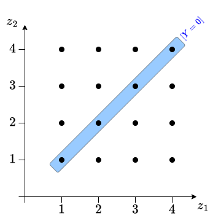
</figure>

:::

:::

[Assim, notamos que $\text{Im}(X) = \{2, 3, \ldots, 8\}$ e $\text{Im}(Y) = \{0,1, 2, 3\}$.]{style="visibility:hidden"}


## {.unnumbered .unlisted .smaller}

### Exemplo 23 {.unnumbered .unlisted}

Dois dados honestos de 4 faces são arremessados. Note que $\Omega = \{\omega = (z_1,z_2) : z_1, z_2 = 1,2,3,4\}$. Seja $X(\omega) = z_1 + z_2$ e $Y(\omega) = |z_1 - z_2|$. Identifiquemos $\text{Im}(X)$ e $\text{Im}(Y)$.

::: columns

::: {.column #vcenter width=33.4%}

<figure>
  
</figure>

:::

::: {.column #vcenter width=33.3%}

<figure>
  
</figure>

:::

::: {.column #vcenter width=33.3%}

<figure>
  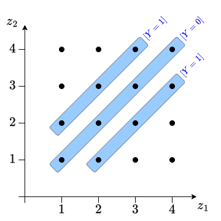
</figure>

:::

:::

[Assim, notamos que $\text{Im}(X) = \{2, 3, \ldots, 8\}$ e $\text{Im}(Y) = \{0,1, 2, 3\}$.]{style="visibility:hidden"}


## {.unnumbered .unlisted .smaller}

### Exemplo 23 {.unnumbered .unlisted}

Dois dados honestos de 4 faces são arremessados. Note que $\Omega = \{\omega = (z_1,z_2) : z_1, z_2 = 1,2,3,4\}$. Seja $X(\omega) = z_1 + z_2$ e $Y(\omega) = |z_1 - z_2|$. Identifiquemos $\text{Im}(X)$ e $\text{Im}(Y)$.

::: columns

::: {.column #vcenter width=33.4%}

<figure>
  
</figure>

:::

::: {.column #vcenter width=33.3%}

<figure>
  
</figure>

:::

::: {.column #vcenter width=33.3%}

<figure>
  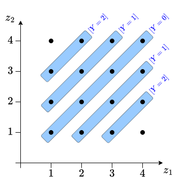
</figure>

:::

:::

[Assim, notamos que $\text{Im}(X) = \{2, 3, \ldots, 8\}$ e $\text{Im}(Y) = \{0,1, 2, 3\}$.]{style="visibility:hidden"}


## {.unnumbered .unlisted .smaller}

### Exemplo 23 {.unnumbered .unlisted}

Dois dados honestos de 4 faces são arremessados. Note que $\Omega = \{\omega = (z_1,z_2) : z_1, z_2 = 1,2,3,4\}$. Seja $X(\omega) = z_1 + z_2$ e $Y(\omega) = |z_1 - z_2|$. Identifiquemos $\text{Im}(X)$ e $\text{Im}(Y)$.

::: columns

::: {.column #vcenter width=33.4%}

<figure>
  
</figure>

:::

::: {.column #vcenter width=33.3%}

<figure>
  
</figure>

:::

::: {.column #vcenter width=33.3%}

<figure>
  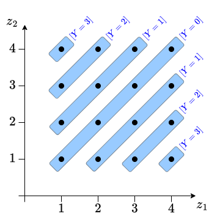
</figure>

:::

:::

[Assim, notamos que $\text{Im}(X) = \{2, 3, \ldots, 8\}$ e $\text{Im}(Y) = \{0,1, 2, 3\}$.]{.fragment}


## 4. Vetores Aleatórios Bidimensionais {.unnumbered .unlisted}


::: {style="border-style: solid; border-width: 3px; padding-bottom: 0px; padding-right: 12px; padding-left: 12px; font-size:70%;"}

::: columns

::: {.column #vcenter width=30%}

<figure>
  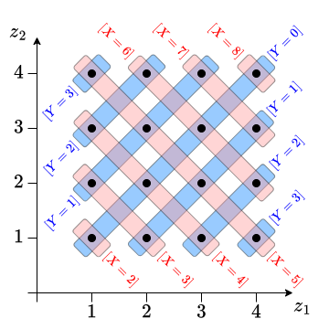
</figure>

:::

::: {.column #vcenter width=70%}

::: fragment

**Exemplo: 23 (cont.)** A fmpc $p(x,y)$ pode ser representada pela tabela:

<table class="tblcenter" style="margin-left: auto; margin-right: auto;">
  <tr style="border-top:solid 3pt; border-bottom:solid 1pt; text-align:center;">
    <td style="border-right:solid 1pt">$y\backslash x$</td> <td> $2$ </td> <td> $3$ </td> <td> $4$ </td> <td> $5$ </td> <td> $6$ </td> <td> $7$ </td> <td> $8$ </td>
  </tr>
  <tr class='fragment' style="text-align:center;">
    <td style="border-right:solid 1pt">$0$</td> <td> $\frac{1}{16}$ </td> <td> $0$ </td> <td> $\frac{1}{16}$ </td> <td> $0$ </td> <td> $\frac{1}{16}$ </td> <td> $0$ </td> <td> $\frac{1}{16}$ </td>
  </tr>
  <tr class='fragment' style="text-align:center;">
    <td style="border-right:solid 1pt">$1$</td> <td> $0$ </td> <td> $\frac{2}{16}$ </td> <td> $0$ </td> <td> $\frac{2}{16}$ </td> <td> $0$ </td> <td> $\frac{2}{16}$ </td> <td> $0$ </td>
  </tr>
  <tr class='fragment' style="text-align:center;">
    <td style="border-right:solid 1pt">$2$</td> <td> $0$ </td> <td> $0$ </td> <td> $\frac{2}{16}$ </td> <td> $0$ </td> <td> $\frac{2}{16}$ </td> <td> $0$ </td> <td> $0$ </td>
  </tr>
  <tr class='fragment' style="border-bottom:solid 3pt; text-align:center;">
    <td style="border-right:solid 1pt">$3$</td> <td> $0$ </td> <td> $0$ </td> <td> $0$ </td> <td> $\frac{2}{16}$ </td> <td> $0$ </td> <td> $0$ </td> <td> $0$ </td>
  </tr>
</table>

:::

:::

:::

:::

::: fragment

::: {.callout-caution}
## Observação

Pela fmpc, fica evidente que os valores de $X$ alteram o comportamento probabilístico de $Y$ e vice-versa. Isto é, que essas variáveis são **dependentes**!
:::

:::

## 4. Vetores Aleatórios Bidimensionais {.unnumbered .unlisted}

::: {.callout-caution}
## Observações

1. Pela fmpc, podemos obter probabilidades conjuntas para eventos de interesse;
2. A fmp de apenas uma va é obtida da fmpc somando $p(x,y)$ em todos os valores da outra variável;
3. Nesse contexto, essa fmp univariada é chamada de fmp **marginal**.

:::

::: {.fragment style="border-style: solid; border-width: 3px; padding-top: 12px; padding-bottom: 12px; padding-right: 12px; padding-left: 12px; font-size:70%;"}

**Exemplo 23 (cont.):** A probabilidade $P(X \geq 7, Y \leq 1)$ pode ser obtida como
<table style="margin-left: auto; margin-right: auto;">
  <tr style="border-bottom:none">
    <td>$P(X \geq 7, Y \leq 1)$ </td> <td> $=$ </td> <td> $\sum_{x\geq 7}\sum_{y\leq 1} p(x,y) = p(7, 0) + p(7, 1) + p(8, 0) + p(8, 1)$</td>
  </tr>
  <tr style="border-bottom:none">
    <td> </td> <td> $=$ </td> <td> $0 + \frac{1}{16} + \frac{2}{16} + 0 = \frac{3}{16}.$</td>
  </tr>
</table>

::: fragment

As fmp's marginais de $X$ e $Y$ são

::: columns

::: {.column #vcenter width=57%}

<table class="tblcenter" style="margin-left: auto; margin-right: auto;">
  <tr style="border-bottom:solid 1pt; border-top:solid 3pt">
    <td style="border-right:solid 1pt">$x$</td> <td>$2$</td> <td>$3$</td> <td>$4$</td> <td>$5$</td> <td>$6$</td> <td>$7$</td> <td>$8$</td>
  </tr>
  <tr style="border-bottom:solid 3pt">
    <td style="border-right:solid 1pt">$p_X(x)$</td> <td>$\frac{1}{16}$</td> <td>$\frac{2}{16}$</td> <td>$\frac{3}{16}$</td> <td>$\frac{4}{16}$</td> <td>$\frac{3}{16}$</td> <td>$\frac{2}{16}$</td> <td>$\frac{1}{16}$</td>
  </tr>
</table>

:::

::: {.column #vcenter width=5%}

e

:::

::: {.column #vcenter width=38%}

<table class="tblcenter" style="margin-left: auto; margin-right: auto;">
  <tr style="border-bottom:solid 1pt; border-top:solid 3pt">
    <td style="border-right:solid 1pt">$y$</td> <td>$0$</td> <td>$1$</td> <td>$2$</td> <td>$3$</td>
  </tr>
  <tr style="border-bottom:solid 3pt">
    <td style="border-right:solid 1pt">$p_Y(y)$</td> <td>$\frac{4}{16}$</td> <td>$\frac{6}{16}$</td> <td>$\frac{4}{16}$</td> <td>$\frac{2}{16}$</td>
  </tr>
</table>

:::

:::

:::

:::


## 4. Vetores Aleatórios Bidimensionais {.unnumbered .unlisted}

::: {.callout-warning}
## Propriedades

Seja $(X,Y)$ vetor aleatório discreto com fmpc $p(x,y)$, então:

1. $p(x,y) \geq 0$, $\forall\ x,y$;
2. $\sum_{x \in \text{Im}(X)}\sum_{y \in \text{Im}(Y)} p(x,y) = 1$.
:::

::: fragment

::: {.callout-caution}
## Observações

::: incremental

1. A fmpc pode ser obtida da fdac e vice-versa. A fmpc $p(x,y) = F(x,y) - F(x^-, y^-)$, que é a altura do salto de $F(\cdot,\cdot)$ em $(x,y)$ e a fdac $F(x,y)$ é obtida por $\sum_{s \leq x}\sum_{t \leq y}p(s,t)$;
2. Toda função que satisfaça as propriedades acima será denominada fmpc. Assim, podemos especificar diretamente a fmpc, contornando a necessidade de criar um modelo probabilístico em $\Omega$.

:::

:::

:::

## 4. Vetores Aleatórios Bidimensionais {.unnumbered .unlisted}

::: {.callout-note}
## Definição

Se a fdac $F(x,y)$ do vetor aleatório $(X,Y)$ é absolutamente contínua em ambas coordenadas, isto é, se existir $f(x,y)$ tal que
<table style="margin-left: auto; margin-right: auto;">
  <tr style="border-bottom:none">
    <td>$F(x,y) = \int_{-\infty}^x\int_{-\infty}^y f(s,t) dt ds,$</td>
  </tr>
</table>
dizemos que $(x,y)$ é **vetor aleatório contínuo** e que $f(x,y)$ é a sua **fdp conjunta** (fdpc).
:::

::: fragment

::: {.callout-caution}
## Observações

::: incremental

1. A probabilidade de $(X,Y)$ pertencer a uma região de $\mathbb{R}^2$ é a integral dupla de $f(x,y)$ nessa região. Por exemplo, $P(a < X \leq b, c < Y \leq d) = \int_a^b\int_c^d f(x,y) dy dx$;
2. A fdpc pode ser obtida da fdac por derivação $f(x,y) = \frac{\partial^2}{\partial x \partial y} F(x,y)$;
3. As fdp's marginais são obtidas por integração da coordenada correspondente a outra variável:
<table style="margin-left: auto; margin-right: auto;">
  <tr style="border-bottom:none">
    <td>$f_X(x) = \int_{-\infty}^\infty f(x,y) dy$</td> <td>e</td> <td>$f_Y(y) = \int_{-\infty}^\infty f(x,y) dx$.</td>
  </tr>
</table>
:::

:::

:::


## {.unnumbered .unlisted .smaller}

### Exemplo 24 {.unnumbered .unlisted}

Sejam $X$ e $Y$ os pesos (em kg), respectivamente, de amêndoas e castanhas de caju em uma embalagem de luxo de 1 kg que ainda pode conter amendoins. O peso dos amendoins é dado por $1-X-Y$. Assim, $(X,Y)$ pertence a $D = \{(x,y) : 0 \leq x,y \leq 1, 0 \leq y \leq 1-x\}$. Suponha $f(x,y) = 24xy$, $(x,y) \in D$.

```{r out.width="80%", fig.height=4}
#| layout-ncol: 2

par(family = "serif", mar=c(5,4,.3,.3))
plot(0, 0, type='n', xlim = c(-.04,1+.07), ylim=c(-.04,1+.07), xlab='', ylab='')
polygon(x=c(0,0,1), y=c(0,1,0), border=NA, col="lightblue")
arrows(y0 = -.04, y1 = 1+0.07, x0=0, x1=0, length = .1, lwd=2, col='darkgray')
arrows(x0 = -.04, x1 = 1+0.07, y0=0, y1=0, length = .1, lwd=2, col='darkgray')
lines(x=c(1,0), y=c(0,1), lty=3, lwd=2)
mtext(text = expression(italic(x)), side = 1, line = 2, cex=1.5)
mtext(text = expression(italic(y)), side = 2, line = 2, cex=1.5)
text(x=1, y=1, labels = expression(italic(D)), adj=1)

x <- y <- seq(0,1,length.out=100)
z <- matrix(0, ncol=length(y), nrow=length(x))
for (i in 1:length(x)) {
  for (j in 1:length(y)) z[i,j] <- ifelse(y[j] <= 1-x[i], 24*x[i]*y[j], 0)
}
persp(x,y,z, xlab="x", ylab="y", zlab="f(x,y)", col = rgb(.8,0,0,alpha=.6), theta=20, phi=10, ticktype='detailed')

```

## {.unnumbered .unlisted .smaller}

### Exemplo 24 (cont.) {.unnumbered .unlisted}

A probabilidade $P(X \leq 0.75, Y \leq 0.75)$ pode ser obtida por
<table style="margin-left: auto; margin-right: auto;">
  <tr style="border-bottom:none">
    <td>$P(X \leq 0.75, Y \leq 0.75)$ </td> <td> $=$ </td> <td> $\int_0^{0.75}\int_0^{0.75} f(x,y) dy dx$ </td>
  </tr>
  <tr class="fragment" style="border-bottom:none">
    <td> </td> <td> $=$ </td> <td> $\int_0^{0.25}\int_0^{0.75} [24xy] dy dx + \int_{0.25}^{0.75}\int_0^{1-x} [24xy] dy dx$</td>
  </tr>
  <tr class="fragment" style="border-bottom:none">
    <td> </td> <td> $=$ </td> <td> $\int_0^{0.25}24x [\frac{y^2}{2}|_0^{0.75}] dx + \int_{0.25}^{0.75}24x [\frac{y^2}{2}|_0^{1-x}] dx$</td>
  </tr>
  <tr class="fragment" style="border-bottom:none">
    <td> </td> <td> $=$ </td> <td> $\frac{27}{4}\int_0^{0.25}x dx + 12\int_{0.25}^{0.75}x(1-x)^2 dx$</td>
  </tr>
  <tr class="fragment" style="border-bottom:none">
    <td> </td> <td> $=$ </td> <td> $\frac{27}{4}[\frac{x^2}{2}|_0^{0.25}] + 12[\frac{x^2}{2} - \frac{2x^3}{3} + \frac{x^4}{4}|_{0.25}^{0.75}]$</td>
  </tr>
  <tr class="fragment" style="border-bottom:none">
    <td> </td> <td> $\approx$ </td> <td> $0.2109 + 0.6875 = 0.8984$.</td>
  </tr>
</table>

::: fragment

A marginal de $X$ é
<table style="margin-left: auto; margin-right: auto;">
  <tr style="border-bottom:none">
    <td>$f_X(x)$ </td> <td> $=$ </td> <td> $\int_{-\infty}^{\infty} f(x,y) dy = \int_{0}^{1-x} [24xy] dy = 24x[\frac{y^2}{2}|_{0}^{1-x}] = 12x(1-x)^2, \ \ \ 0 \leq x \leq 1.$ </td>
  </tr>
</table>

:::

::: fragment

A marginal de $Y$ é
<table style="margin-left: auto; margin-right: auto;">
  <tr style="border-bottom:none">
    <td>$f_Y(y)$ </td> <td> $=$ </td> <td> $\int_{-\infty}^{\infty} f(x,y) dx = \int_{0}^{1-y} [24xy] dx = 24y[\frac{x^2}{2}|_{0}^{1-y}] = 12y(1-y)^2, \ \ \ 0 \leq y \leq 1.$ </td>
  </tr>
</table>

:::

## {.unnumbered .unlisted .smaller}

### Exemplo 24 (cont.) {.unnumbered .unlisted}

```{r out.width="75%", fig.height=3.8}
#| layout-ncol: 2

x <- seq(0,1, length.out=1000)
fx <- 12*x*(1-x)^2

par(family = "serif", mar=c(3,3.5,.3,.3))
plot(0, 0, type='n', xlim = c(-.04,1+.07), ylim=c(-.04,1.07*max(fx)), xlab='', ylab='')
arrows(y0 = -.04, y1 = 1.07*max(fx), x0=0, x1=0, length = .1, lwd=2, col='darkgray')
arrows(x0 = -.04, x1 = 1+0.07, y0=0, y1=0, length = .1, lwd=2, col='darkgray')
lines(x=x, y=fx, lwd=3)
mtext(text = expression(italic(x)), side = 1, line = 2, cex=1.5)
mtext(text = expression(italic(f[X](x))), side = 2, line = 2, cex=1.5)

x <- seq(0,1, length.out=1000)
fx <- 12*x*(1-x)^2

par(family = "serif", mar=c(3,3.5,.3,.3))
plot(0, 0, type='n', xlim = c(-.04,1+.07), ylim=c(-.04,1.07*max(fx)), xlab='', ylab='')
arrows(y0 = -.04, y1 = 1.07*max(fx), x0=0, x1=0, length = .1, lwd=2, col='darkgray')
arrows(x0 = -.04, x1 = 1+0.07, y0=0, y1=0, length = .1, lwd=2, col='darkgray')
lines(x=x, y=fx, lwd=3)
mtext(text = expression(italic(y)), side = 1, line = 2, cex=1.5)
mtext(text = expression(italic(f[Y](y))), side = 2, line = 2, cex=1.5)

```

::: {.callout-tip}
## Exercícios

Qual seria a distribuição de $Z = 1-X-Y$, o peso dos amendoins?
:::


## 4. Vetores Aleatórios Bidimensionais {.unnumbered .unlisted}

::: {.callout-caution}
## Observação

Da mesma forma que vimos em probabilidade de eventos, a distribuição conjunta de um vetor aleatório $(X,Y)$ nos permite estudar o efeito de uma coordenada na distribuição da outra.
:::

::: {.callout-note}
## Definições

1. Seja $(X,Y)$ vetor aleatório discreto com fmpc $p(x,y)$, então a fmp condicional de $Y$ dado que $X = x$ é dada  pela fmpc de $(X,Y)$ dividida pela fmp marginal de $X$:
<table style="margin-left: auto; margin-right: auto;">
  <tr style="border-bottom:none">
    <td>$p_{Y|X}(y|x) = \frac{p(x,y)}{p_X(x)}$.</td>
  </tr>
</table>
2. Seja $(X,Y)$ vetor aleatório contínuo com fdpc $f(x,y)$, então a fdp condicional de $Y$ dado que $X = x$ é dada pela fdpc de $(X,Y)$ dividida pela fdp marginal de $X$:
<table style="margin-left: auto; margin-right: auto;">
  <tr style="border-bottom:none">
    <td>$f_{Y|X}(y|x) = \frac{f(x,y)}{f_X(x)}$.</td>
  </tr>
</table>
:::

## 4. Vetores Aleatórios Bidimensionais {.unnumbered .unlisted}

::: {style="border-style: solid; border-width: 3px; padding-top: 6px; padding-bottom: 12px; padding-right: 12px; padding-left: 12px; font-size:70%;"}

**Exemplo 23 (cont.):** Considerando a fmpc de $(X,Y)$ e as fmp's marginais de $X$ e $Y$, temos que $p_{Y|X}(y|x)$ e $p_{X|Y}(x|y)$ são dadas, respectivamente, por

::: columns

::: {.column #vcenter width=45%}

::: fragment

<table class="tblcenter" style="margin-left: auto; margin-right: auto;">
  <tr style="border-top:solid 3pt; border-bottom:solid 1pt; text-align:center;">
    <td style="border-right:solid 1pt">$y\backslash x$</td> <td> $2$ </td> <td> $3$ </td> <td> $4$ </td> <td> $5$ </td> <td> $6$ </td> <td> $7$ </td> <td> $8$ </td>
  </tr>
  <tr style="text-align:center;">
    <td style="border-right:solid 1pt">$0$</td> <td> $1$ </td> <td> $0$ </td> <td> $\frac{1}{3}$ </td> <td> $0$ </td> <td> $\frac{1}{3}$ </td> <td> $0$ </td> <td> $1$ </td>
  </tr>
  <tr style="text-align:center;">
    <td style="border-right:solid 1pt">$1$</td> <td> $0$ </td> <td> $1$ </td> <td> $0$ </td> <td> $\frac{1}{2}$ </td> <td> $0$ </td> <td> $1$ </td> <td> $0$ </td>
  </tr>
  <tr style="text-align:center;">
    <td style="border-right:solid 1pt">$2$</td> <td> $0$ </td> <td> $0$ </td> <td> $\frac{2}{3}$ </td> <td> $0$ </td> <td> $\frac{2}{3}$ </td> <td> $0$ </td> <td> $0$ </td>
  </tr>
  <tr style="border-bottom:solid 3pt; text-align:center;">
    <td style="border-right:solid 1pt">$3$</td> <td> $0$ </td> <td> $0$ </td> <td> $0$ </td> <td> $\frac{1}{2}$ </td> <td> $0$ </td> <td> $0$ </td> <td> $0$ </td>
  </tr>
</table>

:::

:::

::: {.column #vcenter width=10%}

<p class="fragment" style="text-align:center !important;">e</p>


:::

::: {.column #vcenter width=45%}

::: fragment

<table class="tblcenter" style="margin-left: auto; margin-right: auto;">
  <tr style="border-top:solid 3pt; border-bottom:solid 1pt; text-align:center;">
    <td style="border-right:solid 1pt">$y\backslash x$</td> <td> $2$ </td> <td> $3$ </td> <td> $4$ </td> <td> $5$ </td> <td> $6$ </td> <td> $7$ </td> <td> $8$ </td>
  </tr>
  <tr style="text-align:center;">
    <td style="border-right:solid 1pt">$0$</td> <td> $\frac{1}{4}$ </td> <td> $0$ </td> <td> $\frac{1}{4}$ </td> <td> $0$ </td> <td> $\frac{1}{4}$ </td> <td> $0$ </td> <td> $\frac{1}{4}$ </td>
  </tr>
  <tr style="text-align:center;">
    <td style="border-right:solid 1pt">$1$</td> <td> $0$ </td> <td> $\frac{1}{3}$ </td> <td> $0$ </td> <td> $\frac{1}{3}$ </td> <td> $0$ </td> <td> $\frac{1}{3}$ </td> <td> $0$ </td>
  </tr>
  <tr style="text-align:center;">
    <td style="border-right:solid 1pt">$2$</td> <td> $0$ </td> <td> $0$ </td> <td> $\frac{1}{2}$ </td> <td> $0$ </td> <td> $\frac{1}{2}$ </td> <td> $0$ </td> <td> $0$ </td>
  </tr>
  <tr style="border-bottom:solid 3pt; text-align:center;">
    <td style="border-right:solid 1pt">$3$</td> <td> $0$ </td> <td> $0$ </td> <td> $0$ </td> <td> $1$ </td> <td> $0$ </td> <td> $0$ </td> <td> $0$ </td>
  </tr>
</table>

:::

:::

:::

:::

::: fragment

::: {.callout-caution}
## Observação

Para $p_{Y|X}(y|x)$ (tabela da esquerda), temos uma fmp de $Y$ para cada valor $x$, isto é, para cada **coluna**. Para $p_{X|Y}(x|y)$ (tabela da direita), temos uma fmp de $X$ para cada valor $Y$, isto é, para cada **linha**.
:::

:::

## 4. Vetores Aleatórios Bidimensionais {.unnumbered .unlisted}

::: {style="border-style: solid; border-width: 3px; padding-top: 6px; padding-bottom: 12px; padding-right: 12px; padding-left: 12px; font-size:70%;"}

**Exemplo 24 (cont.):** Considerando a fdpc de $(X,Y)$ e as fdp's marginais de $X$ e $Y$, temos que $f_{Y|X}(y|x)$ e $f_{X|Y}(x|y)$ são dadas, respectivamente, por

<table class="tblcenter" style="margin-left: auto; margin-right: auto;">
  <tr style="border-bottom:none;">
    <td>$f_{Y|X}(y|x) = \frac{f(x,y)}{f_X(x)} = \frac{24xy}{12x(1-x)^2} = \frac{2y}{(1-x)^2}, \ \ \ 0 < y < 1-x$ </td>
  </tr>
</table>

e

<table class="tblcenter" style="margin-left: auto; margin-right: auto;">
  <tr style="border-bottom:none;">
    <td>$f_{X|Y}(x|y) = \frac{f(x,y)}{f_Y(y)} = \frac{24xy}{12y(1-y)^2} = \frac{2x}{(1-y)^2}, \ \ \ 0 < x < 1-y.$ </td>
  </tr>
</table>

:::

::: fragment

::: {.callout-caution}
## Observação

Observe que $f_{Y|X}(y|x)$ é fdp em $y$, afinal $f_{Y|X}(y|x)\geq0$ e
<table class="tblcenter" style="margin-left: auto; margin-right: auto;">
  <tr style="border-bottom:none;">
    <td>$\int_{-\infty}^\infty f_{Y|X}(y|x) dy = \int_{0}^{1-x} \frac{2y}{(1-x)^2} dy = [\frac{y^2}{(1-x)^2} |_0^{1-x}] = \frac{(1-x)^2}{(1-x)^2} = 1.$ </td>
  </tr>
</table>
No entanto, $f_{Y|X}(y|x)$ não é fdp em $x$! Da mesma forma, $f_{X|Y}(x|y)$ é fdp em $x$, mas não em $y$.

:::

:::

## 4. Vetores Aleatórios Bidimensionais {.unnumbered .unlisted}


::: {.callout-caution}
## Observação

As distribuições condicionais nos mostram como a distribuição de uma coordenada depende do valor da outra. Se a distribuição não for afetada, dizemos que as variáveis são **independentes**.
:::

::: fragment

::: {.callout-note}
## Definições

1. Se $(X, Y)$ é vetor aleatório discreto. Dizemos que as vad's $X$ e $Y$ são independentes se
$$p_{Y|X}(y|x) = p_Y(y),\ \forall\ y \ \ \ \text{ou} \ \ \ p_{X|Y}(x|y) = p_X(x),\ \forall\ x.$$
2. Se $(X, Y)$ é vetor aleatório contínuo. Dizemos que as vac's $X$ e $Y$ são independentes se
$$f_{Y|X}(y|x) = f_Y(y),\ \forall\ y \ \ \ \text{ou} \ \ \ f_{X|Y}(x|y) = f_X(x),\ \forall\ x.$$
:::

:::

## 4. Vetores Aleatórios Bidimensionais {.unnumbered .unlisted}

::: {.callout-warning}
## Propriedades

1. Duas vad's $X$ e $Y$ são independentes se, e somente, se $p(x,y) = p_X(x)\cdot p_Y(y)$, para todo $x,y$;
2. Duas vac's $X$ e $Y$ são independentes se, e somente, se $f(x,y) = f_X(x)\cdot f_Y(y)$, para todo $x,y$.

:::

::: {.fragment style="border-style: solid; border-width: 3px; padding-top: 6px; padding-bottom: 12px; padding-right: 12px; padding-left: 12px; font-size:70%;"}

**Exemplo 23 (cont.):** Note que, por exemplo, $p_{Y|X}(0|2) = 1 \neq \frac{4}{16} = p_Y(0)$. Como existem $x$ e $y$ tal que $p_{Y|X}(y|x) \neq p_Y(y)$, concluímos que $X$ e $Y$ são **dependentes**.

O mesmo poderia ser verificado notando, por exemplo, que $p(2,0) = \frac{1}{16} \neq \frac{1}{16}\cdot \frac{4}{16} = \frac{1}{64} = p_X(2)\cdot p_Y(0)$. Como existem $x$ e $y$ tal que $p(x,y) \neq p_X(x)\cdot p_Y(y)$, concluímos que $X$ e $Y$ são **dependentes**.

:::

::: fragment

::: {.callout-tip}
## Exercícios

Verifique se as vac's $X$ e $Y$ do Exemplo 24 são independentes ou não.
:::

:::


## {.unnumbered .unlisted .smaller}

### Exemplo 25 {.unnumbered .unlisted}

Sejam $X$ e $Y$ os tempos de vida de duas lâmpadas. Suponha que $X$ e $Y$ sejam **independentes** e que $X\sim \text{Exp}(\lambda)$ e $Y\sim \text{Exp}(\lambda)$. Vamos encontrar a fdp de $S = X+Y$.

[Note que $f_X(x) = \lambda e^{-\lambda x}$ e $f_Y(y) = \lambda e^{-\lambda y}$ e, ainda, $f(x,y) = f_X(x)\cdot f_Y(y) = \lambda^2e^{-\lambda(x+y)}$, pela suposição de independência.]{.fragment} [Se $D = \{(x,y):x+y \leq s,\ x>0,\ y>0\}$, então]{.fragment}
<table style="margin-left: auto; margin-right: auto;">
  <tr class="fragment" style="border-bottom:none">
    <td> $F_S(s)$ </td> <td> $=$ </td> <td> $P(S \leq s) = \int\int_D f(x,y) dy dx = \int_0^s\int_0^{s-x} \lambda^2e^{-\lambda(x+y)} dy dx = \int_0^s\lambda^2e^{-\lambda x}\int_0^{s-x} e^{-\lambda y} dy dx$ </td>
  </tr>
  <tr class="fragment" style="border-bottom:none">
    <td> </td> <td> $=$ </td> <td> $\int_0^s\lambda e^{-\lambda x} [-e^{-\lambda y}|_0^{s-x}] dx = \int_0^s\lambda e^{-\lambda x} [1-e^{-\lambda (s-x)}] dx = \int_0^s\lambda e^{-\lambda x} dx - \int_0^s\lambda e^{-\lambda s} dx$</td>
  </tr>
  <tr class="fragment" style="border-bottom:none">
    <td> </td> <td> $=$ </td> <td> $[-e^{-\lambda x}|_0^s] - [x\lambda e^{-\lambda s}|_0^s] = 1 - e^{-\lambda s} - \lambda s e^{-\lambda s}.$</td>
  </tr>
</table>
[Agora, derivando em $s$, obtemos]{.fragment}
<table style="margin-left: auto; margin-right: auto;">
  <tr class="fragment" style="border-bottom:none">
    <td> $f_S(s) = \frac{d}{ds}F_S(s) = \lambda e^{-\lambda s} - \lambda e^{-\lambda s} + \lambda^2 s e^{-\lambda s} = \frac{1}{(1/\lambda)^2\Gamma(2)} s^{2-1} e^{-s/\lambda^{-1}}.$      </td>
  </tr>
</table>
[Logo, $S \sim \text{Gama}(2, \frac{1}{\lambda})$.]{.fragment}


## 4. Vetores Aleatórios Bidimensionais {.unnumbered .unlisted}

::: {.callout-caution}
## Observação

Os conceitos vistos até o momento podem ser extendidos para casos com dimensão maior que dois.
:::

::: fragment

::: {.callout-note}
## Definições

Se $X_1, X_2,\ldots , X_n$ são vad's, a sua fmpc é a função $n$-variada definida por
$$p(x_1, x_2, \ldots, x_n) = P(X_1 = x_1, X_2 = x_2, \ldots , X_n = x_n)$$
Se $X_1, X_2,\ldots , X_n$ são vac's com fdac $F(x_1, \ldots, x_n) = P(X_1 \leq x_1, \ldots, X_n \leq x_n)$ a sua fdpc é a função $n$-variada $f(t_1, \ldots, t_n)$ tal que
$$F(x_1, \ldots, x_n) = \int_{-\infty}^{x_1} \cdots \int_{-\infty}^{x_n} f(t_1, \ldots, t_n) dt_n \cdots dt_1.$$
:::

:::

## 4. Vetores Aleatórios Bidimensionais {.unnumbered .unlisted}

::: {.callout-note}
## Definições

1. Um experimento **Multinomial** consiste de $n$ repetições independentes de um experimento com $r$ resultados possíveis, que denominamos de categorias.
2. Em um experimento Multinomial, seja $X_j$ a quantidade das $n$ repetições que resultaram na categoria $j$, $j=1, \ldots, r$. Dizemos que o vetor aleatório $(X_1, \ldots, X_r)$ tem distribuição **Multinomial** e sua fmpc é
<table style="margin-left: auto; margin-right: auto;">
  <tr style="border-bottom:none">
    <td> $p(x_1, \ldots, x_r) = \frac{n!}{x_1!\cdots x_r!}p_1^{x_1} \cdots p_r^{x_r}, \ \ \ x_j = 0,1,\ldots,n, \ \ \ x_1+\cdots+x_r = n,$ </td>
  </tr>
</table>
em que $p_j$ é a probabilidade de uma repetição resultar na categoria $j$, $j=1, \ldots, r$. Notação $(X_1, \ldots, X_r) \sim \text{MultiNom}(n, p_1, \ldots, p_r)$.
:::

::: fragment

::: {.callout-caution}
## Observação

A distribuição Binomial é um caso especial da Multinomial, onde $r=2$, $p_1 = p$ e $p_2 = 1-p$.
:::

:::

## 4. Vetores Aleatórios Bidimensionais {.unnumbered .unlisted}

::: {style="border-style: solid; border-width: 3px; padding-top: 6px; padding-bottom: 12px; padding-right: 12px; padding-left: 12px; font-size:70%;"}

**Exemplo 26:** Uma loja de venda de automóveis vende um veículo em três categorias: (1) básico; (2) intermediário; e (3) premium. De experiências anteriores, sabe-se que as categorias 1, 2 e 3 correspondem, respectivamente, a 50%, 40% e 10% das vendas desse veículo.

[Dos próximos 15 compradores, qual a probabilidade de exatamente 5 compras de cada categoria?]{.fragment} [Seja $X_j$ a quantidade de compras da categoria $j = 1, 2, 3$.]{.fragment} [Então $(X_1, X_2, X_3) \sim \text{MultiNom}(15, 0.5, 0.4, 0.1)$.]{.fragment} [Logo]{.fragment}
<table class="fragment" style="margin-left: auto; margin-right: auto;">
  <tr style="border-bottom:none">
    <td> $p(5, 5, 5) = \frac{15!}{5!5!5!}0.5^{5}0.4^{5}0.1^{5} = 0.0024.$ </td>
  </tr>
</table>

:::

::: fragment

::: {.callout-caution}
## Observação

O conceito de independência também pode ser extendido para $n$ variáveis.
:::

:::

## 4. Vetores Aleatórios Bidimensionais {.unnumbered .unlisted}

::: {.callout-note}
## Definição

As va's $X_1, \ldots, X_n$ são independentes se, para cada subconjunto $X_{i_1}, \ldots, X_{i_k}$ (cada par, cada trio e assim por diante), a fmpc ou fdpc conjuntas do subconjunto for igual ao produto das fmp's ou fdp's marginais.
:::

::: {.fragment style="border-style: solid; border-width: 3px; padding-top: 6px; padding-bottom: 12px; padding-right: 12px; padding-left: 12px; font-size:70%;"}

**Exemplo 27:** Sejam $X_1, \ldots, X_n$ as vidas úteis de $n$ componentes independentes, tais que $X_i \sim \text{Exp}(\lambda)$. [Assim, a fdpc é]{.fragment}
<table class="fragment" style="margin-left: auto; margin-right: auto;">
  <tr style="border-bottom:none">
    <td> $f(x_1, \ldots, x_n) = f_{X_1}(x_1) \cdots f_{X_n}(x_n) = \lambda e^{-\lambda x_1} \cdots \lambda e^{-\lambda x_n} = \lambda^n e^{-\lambda \sum_ix_i}.$ </td>
  </tr>
</table>
[Suponha que um sistema montado com esses componentes deixa de operar assim que o primeiro falha.]{.fragment} [Se $T$ é o tempo de vida do sistema, vamos determinar $P(T > t)$.]{.fragment} [De fato,]{.fragment}
<table style="margin-left: auto; margin-right: auto;">
  <tr class="fragment" style="border-bottom:none">
    <td> $P(T>t)$ </td> <td> $=$ </td> <td> $P(X_1 > t, \ldots, X_n > t) = \int_t^\infty \cdots \int_t^\infty f(x_1, \ldots, x_n) d x_n \cdots d x_1$ </td>
  </tr>
  <tr class="fragment" style="border-bottom:none">
    <td> </td> <td> $=$ </td> <td> $\int_t^\infty\lambda e^{-\lambda x_1}dx_1 \cdots \int_t^\infty\lambda e^{-\lambda x_n}dx_n = [-e^{-\lambda x_1}|_t^\infty]\cdots [-e^{-\lambda x_n}|_t^\infty] = (e^{-\lambda t})^n = e^{-n \lambda t}.$ </td>
  </tr>
</table>
[Logo, $F_T(t) = P(T\leq t) = 1-e^{-n \lambda t}$ e $f_T(t) = n\lambda e^{-n \lambda t}$.]{.fragment} [Assim, $T \sim \text{Exp}(n\lambda)$.]{.fragment}
:::

## Covariância e Correlação

::: {.callout-note}
## Definição

Seja $(X,Y)$ vetor aleatório. Para qualquer $h(\cdot,\cdot)$, se $(X,Y)$ é discreto com fmpc $p(x,y)$ ou contínuo com fdpc $f(x,y)$, o valor esperado $E[h(X,Y)]$ é definido respectivamente por
$$E[h(X,Y)] = \sum_x\sum_y h(x,y)p(x,y) \ \ \ \text{ou} \ \ \ E[h(X,Y)] = \int_{-\infty}^\infty\int_{-\infty}^\infty h(x,y)f(x,y) dy dx.$$
:::

::: fragment

::: {.callout-caution}
## Observação

A **covariância** é uma medida importante que surge do conceito acima, considerando $h(x,y) = (x-\mu_X)(y-\mu_Y)$.
:::

:::


## 4.1 Covariância e Correlação {.unnumbered .unlisted}

::: {.callout-note}
## Definição

Seja $(X,Y)$ vetor aleatório. A **covariância** entre $X$ e $Y$ é definida por
$$\text{Cov}(X,Y) = E[(X-\mu_X)(Y-\mu_Y)].$$
:::

::: fragment

::: {.callout-caution}
## Observações

::: incremental

1. A covariância é o coeficiente angular esperado da reta que passa pelos pontos $(\mu_X,\mu_Y)$ e $(X,Y)$;
2. $\text{Cov}(X,Y) \gg 0$ indica relação **linear** positiva forte;
3. $\text{Cov}(X,Y) \ll 0$ indica relação **linear** negativa forte;
4. $\text{Cov}(X,Y) \approx 0$ indica ausência de relação **linear**.

:::

:::

:::

## 4.1 Covariância e Correlação {.unnumbered .unlisted}

```{r out.width="90%", fig.height=3.8}
#| layout-ncol: 2

x <- c(0:4, 0:4)
y <- c(0:4, 1:5)
prs <- 1/10

cov_xy <- sum(x*y*prs) - sum(x*prs)*sum(y*prs)

par(family = "serif", mar=c(3,3.5,3,.3))
plot(x, y, type='n', xlim = c(-.04,1.07*max(x)), ylim=c(-.04,1.10*max(y)), xlab='', ylab='')
arrows(y0 = -.04, y1 = 1.10*max(y), x0=0, x1=0, length = .1, lwd=2, col='darkgray')
arrows(x0 = -.04, x1 = 1.07*max(x), y0=0, y1=0, length = .1, lwd=2, col='darkgray')
points(x=x, y=y, cex=1, pch=19)
mtext(text = expression(italic(x)), side = 1, line = 2, cex=1.5)
mtext(text = expression(italic(y)), side = 2, line = 2, cex=1.5)
mtext(text = bquote(Cov(italic(X),italic(Y)) == .(cov_xy)), side = 3, line = .3, cex=1.5)

x <- c(0:4, 0:4)
y <- c(4:0, 5:1)
prs <- 1/10

cov_xy <- sum(x*y*prs) - sum(x*prs)*sum(y*prs)

par(family = "serif", mar=c(3,3.5,3,.3))
plot(x, y, type='n', xlim = c(-.04,1.07*max(x)), ylim=c(-.04,1.10*max(y)), xlab='', ylab='')
arrows(y0 = -.04, y1 = 1.10*max(y), x0=0, x1=0, length = .1, lwd=2, col='darkgray')
arrows(x0 = -.04, x1 = 1.07*max(x), y0=0, y1=0, length = .1, lwd=2, col='darkgray')
points(x=x, y=y, cex=1, pch=19)
mtext(text = expression(italic(x)), side = 1, line = 2, cex=1.5)
mtext(text = expression(italic(y)), side = 2, line = 2, cex=1.5)
mtext(text = bquote(Cov(italic(X),italic(Y)) == .(cov_xy)), side = 3, line = .3, cex=1.5)


```

## 4.1 Covariância e Correlação {.unnumbered .unlisted}

```{r out.width="90%", fig.height=3.8}
#| layout-ncol: 2

x <- c(0:4, 0:4, 0:4)
y <- c(rep(0,5), rep(1,5), rep(2,5))
prs <- 1/15

cov_xy <- sum(x*y*prs) - sum(x*prs)*sum(y*prs)

par(family = "serif", mar=c(3,3.5,3,.3))
plot(x, y, type='n', xlim = c(-.04,1.07*max(x)), ylim=c(-.04,1.15*max(y)), xlab='', ylab='')
arrows(y0 = -.04, y1 = 1.15*max(y), x0=0, x1=0, length = .1, lwd=2, col='darkgray')
arrows(x0 = -.04, x1 = 1.07*max(x), y0=0, y1=0, length = .1, lwd=2, col='darkgray')
points(x=x, y=y, cex=1, pch=19)
mtext(text = expression(italic(x)), side = 1, line = 2, cex=1.5)
mtext(text = expression(italic(y)), side = 2, line = 2, cex=1.5)
mtext(text = bquote(Cov(italic(X),italic(Y)) == .(cov_xy)), side = 3, line = .3, cex=1.5)

x <- c(0:2, 0:2, (-1):(-2), (-1):(-2))
y <- c((0:2)^2, (0:2)^2+1, ((-1):(-2))^2, ((-1):(-2))^2+1)
prs <- 1/10

cov_xy <- sum(x*y*prs) - sum(x*prs)*sum(y*prs)

par(family = "serif", mar=c(3,3.5,3,.3))
plot(x, y, type='n', xlim = c(1.04*min(x), 1.07*max(x)), ylim=c(-.04,1.10*max(y)), xlab='', ylab='')
arrows(y0 = -.04, y1 = 1.10*max(y), x0=0, x1=0, length = .1, lwd=2, col='darkgray')
arrows(x0 = 1.04*min(x), x1 = 1.07*max(x), y0=0, y1=0, length = .1, lwd=2, col='darkgray')
points(x=x, y=y, cex=1, pch=19)
mtext(text = expression(italic(x)), side = 1, line = 2, cex=1.5)
mtext(text = expression(italic(y)), side = 2, line = 2, cex=1.5)
mtext(text = bquote(Cov(italic(X),italic(Y)) == .(cov_xy)), side = 3, line = .3, cex=1.5)


```


## 4.1 Covariância e Correlação {.unnumbered .unlisted}

::: {.callout-warning}
## Propriedade

Se $(X,Y)$ é vetor aleatório, então
<table style="margin-left: auto; margin-right: auto;">
  <tr style="border-bottom:none">
    <td> $\text{Cov}(X,Y) = E(XY) - \mu_X\mu_Y.$ </td>
  </tr>
</table>
:::

::: {.fragment style="border-style: solid; border-width: 3px; padding-top: 6px; padding-bottom: 12px; padding-right: 12px; padding-left: 12px; font-size:70%;"}

**Exemplo 23 (cont.):** Vamos calcular $\text{Cov}(X,Y)$. [Temos que]{.fragment}

<table style="margin-left: auto; margin-right: auto;">
  <tr class="fragment" style="border-bottom:none">
    <td> $E(XY)$ </td> <td> $=$ </td> <td> $\sum_{y=0}^{3}\sum_{x=2}^{8} xy p(x,y) = \sum_{y=1}^{3}\sum_{x=2}^{8} xy p(x,y)$ </td>
  </tr>
  <tr class="fragment" style="border-bottom:none">
    <td> </td> <td> $=$ </td> <td> $1\cdot(3+5+7)\cdot\frac{2}{16} + 2\cdot(4+6)\cdot\frac{2}{16} + 3\cdot 5\cdot\frac{2}{16} = (15+20+15)\cdot\frac{2}{16} = \frac{100}{16}.$ </td>
  </tr>
</table>

[É possível verificar que $\mu_X = 5$ e $\mu_Y = \frac{20}{16}$.]{.fragment} [Logo,]{.fragment}

<table style="margin-left: auto; margin-right: auto;">
  <tr class="fragment" style="border-bottom:none">
    <td> $\text{Cov}(X,Y) = E(XY) - \mu_X\mu_Y = \frac{100}{16} - 5\cdot\frac{20}{16} = 0.$ </td>
  </tr>
</table>

:::

## 4.1 Covariância e Correlação {.unnumbered .unlisted}

::: {.callout-caution}
## Observações

::: incremental

1. O Exemplo 23 mostra que, mesmo $X$ e $Y$ sendo [**dependentes**]{style="color:red"}, podemos obter $\text{Cov}(X,Y) = 0$. Por isso, $\text{Cov}(X,Y) = 0$ não significa independência, mas apenas indica a ausência de relação [**linear**]{style="color:red"};
2. A covariância não é limitada, podendo assumir qualquer valor real. Assim, é difícil classificarmos o que seria uma covariância (positiva ou negativa) forte;
3. Uma medida mais apropriada seria o **coeficiente de correlação**.

:::

:::

::: fragment

::: {.callout-note}
## Definição

Sejam $X$ e $Y$ va's com variâncias $\sigma_X^2$ e $\sigma_Y^2$, respectivamente, e seja $\text{Cov}(X,Y)$ a covariância entre $X$ e $Y$. O **coeficiente de correlação** entre $X$ e $Y$, representado por $\text{Cor}(X,Y)$, $\rho_{X,Y}$, ou apenas $\rho$, é definido por
<table style="margin-left: auto; margin-right: auto;">
  <tr style="border-bottom:none">
    <td> $\rho = \rho_{X,Y} = \text{Cor}(X,Y) = \frac{\text{Cov}(X,Y)}{\sigma_X\sigma_Y}.$ </td>
  </tr>
</table>
:::

:::

## 4.1 Covariância e Correlação {.unnumbered .unlisted}

::: columns

::: {.column #vcenter width=40%}

::: {.callout-caution}
## Observação

O coeficiente de correlação está relacionado com o ângulo formado entre as variáveis centralizas pelas respectivas médias.
:::

<!-- Container principal com posição relativa -->
::: {style="position: relative; width: 90%; height: 350px; margin: 0 auto;"}

::: {.fragment .fade-in-then-out fragment-index=2}
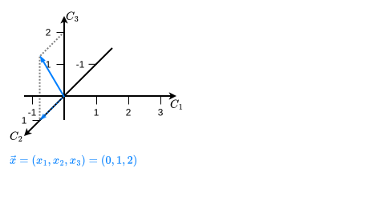{style="display: block; width: 100%; height: 100%; position: absolute; top: 0; left: 0;"}
:::

::: {.fragment .fade-in-then-out fragment-index=3}
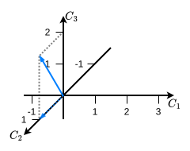{style="display: block; width: 100%; height: 100%; position: absolute; top: 0; left: 0;"}
:::

::: {.fragment .fade-in fragment-index=4}
::: {.fragment .fade-out fragment-index=6}
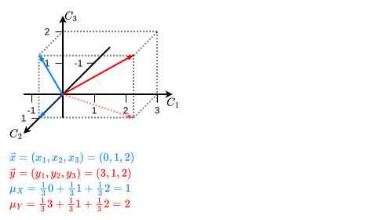{style="display: block; width: 100%; height: 100%; position: absolute; top: 0; left: 0;"}
:::
:::

::: {.fragment .fade-in-then-out fragment-index=6}
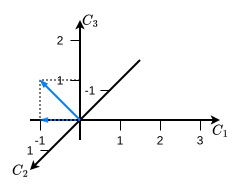{style="display: block; width: 100%; height: 100%; position: absolute; top: 0; left: 0;"}
:::

::: {.fragment .fade-in fragment-index=7}
::: {.fragment .fade-out fragment-index=10}
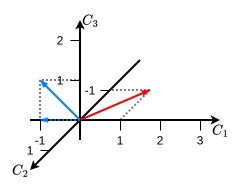{style="display: block; width: 100%; height: 100%; position: absolute; top: 0; left: 0;"}
:::
:::

::: {.fragment .fade-in fragment-index=10}
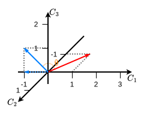{style="display: block; width: 100%; height: 100%; position: absolute; top: 0; left: 0;"}
:::

:::

:::

::: {.column #vcenter width=60%}

::: {.fragment fragment-index=1}

::: {style="border-style: solid; border-width: 3px; padding-bottom: 0px; padding-right: 12px; padding-left: 12px; font-size:70%;"}

**Exemplo 27:** Para ilustrar esse fato, suponha $X$ e $Y$ va's com distribuição conjunta dada por $p(x,y) = \frac{1}{3}$, para $(x,y) = \{(0,3), (1,1), (2,2)\}$.

[Represente os possíveis valores de $X$ e $Y$ pelos vetores tridimensionais]{.fragment fragment-index=2} [$\vec{X} = (0,1,2)$ [[(azul)]{.fragment .highlight-current-blue fragment-index=4}]{.fragment .highlight-current-blue fragment-index=3}]{.fragment fragment-index=3} [e $\vec{Y} = (3,1,2)$ [(vermelho)]{.fragment .highlight-current-red fragment-index=4}.]{.fragment fragment-index=4}

[As médias de $X$ e $Y$ são $\mu_X = \frac{1}{3}[0+1+3] = 1$ e $\mu_Y = \frac{1}{3}[3+1+2] = 1$.]{.fragment fragment-index=5} [Os vetores centralizados são $(-1,0,1)$ [[(azul)]{.fragment .highlight-current-blue fragment-index=7}]{.fragment .highlight-current-blue fragment-index=6}]{.fragment fragment-index=6} [e $(1,-1,0)$ [(vermelho)]{.fragment .highlight-current-red fragment-index=7}.]{.fragment fragment-index=7} [Os desvios-padrão são $\sigma_X = \sigma_Y = \sqrt{\frac{2}{3}}$.]{.fragment fragment-index=8}

[Por fim, a covariância é $\text{Cov}(X,Y) = \frac{1}{3}(-1+0+0) = -\frac{1}{3}$]{.fragment fragment-index=9} [e a correlação é $\rho = \cos\color{orange}\theta = \frac{\text{Cov}(X,Y)}{\sigma_X\sigma_Y} = \frac{-1/3}{2/3} = -\frac{1}{2}$.]{.fragment fragment-index=10} [Logo, $\color{orange}{\theta = \frac{2\pi}{3} = 120^{\circ}}$.]{.fragment fragment-index=11}

:::

:::

:::

:::

## 4.1 Covariância e Correlação {.unnumbered .unlisted}

::: {.callout-warning}
## Propriedade

Para quaisquer duas va's $X$ e $Y$, o coeficiente de correlação satisfaz $-1 \leq \text{Cor}(X, Y) \leq 1.$
:::

::: {.fragment style="border-style: solid; border-width: 3px; padding-top: 6px; padding-bottom: 6; padding-right: 12px; padding-left: 12px; font-size:70%;"}

**Exemplo 24 (cont.):** Temos que
<table style="margin-left: auto; margin-right: auto;">
  <tr class="fragment" style="border-bottom:none">
    <td> $E(XY)$ </td> <td> $=$ </td> <td> $\int_0^1\int_0^{1-x}xy\cdot 24xy\ dy dx = 8\int_0^1 x^2(1-x)^3 dx = 8 \frac{\Gamma(3)\Gamma(4)}{\Gamma(7)}\int_0^1 \frac{\Gamma(7)}{\Gamma(3)\Gamma(4)} x^{3-1}(1-x)^{4-1} dx$ </td>
  </tr>
  <tr class="fragment" style="border-bottom:none">
    <td> </td> <td> $=$ </td> <td> $8\cdot \frac{2!3!}{6!} = \frac{8}{5\cdot 4\cdot 3} = \frac{2}{15}$. </td>
  </tr>
</table>
[Notando que as marginais de $X$ e $Y$ mostraram que $X\sim\text{Beta}(2,3)$ e $Y\sim\text{Beta}(2,3)$, temos que $\mu_X = \mu_Y =\frac{2}{5}$ e $\sigma_X = \sigma_Y = \frac{1}{5}$.]{.fragment} [Logo,]{.fragment}
<table style="margin-left: auto; margin-right: auto;">
  <tr class="fragment" style="border-bottom:none">
    <td> $\text{Cov}(X, Y) = \frac{2}{15} - \frac{2}{5}\cdot \frac{2}{5} = \frac{2}{15} - \frac{4}{25} = \frac{10 - 12}{75} = -\frac{2}{75}$. </td>
  </tr>
</table>
[Assim, $\text{Cor}(X,Y) = \frac{-2/75}{1/25} = -\frac{50}{75} = -\frac{2}{3} \approx -0.6667$.]{.fragment}

:::


## 4.1 Covariância e Correlação {.unnumbered .unlisted}


::: {.callout-caution}
## Observação

Para fins descritivos, a relação será descrita como:

- forte se $|\rho|\geq 0.8$;
- moderada se $0.5 < |\rho| < 0.8$; e
- fraca se $|\rho| \leq 0.5$.

:::

::: {.fragment style="border-style: solid; border-width: 3px; padding-top: 6px; padding-bottom: 6; padding-right: 12px; padding-left: 12px; font-size:70%;"}

**Exemplo 24 (cont.):** Assim, embora $\text{Cov}(X,Y) = -\frac{2}{75} \approx 0.0267$ possa parecer um valor pequeno, obtemos $\text{Cor}(X,Y) \approx -0.6667$, indicando uma relação linear negativa **moderada** entre $X$ e $Y$.

:::

## 4.1 Covariância e Correlação {.unnumbered .unlisted}

::: {.callout-warning}
## Propriedades

::: incremental

1. Se $X$ e $Y$ são independentes, então $\text{Cov}(X, Y) = 0$ (e também $\rho = 0$). Entretanto, como visto anteriormente, $\text{Cov}(X, Y) = 0$ não implica independência entre $X$ e $Y$;
2. $\text{Cov}(X, X) = E[(X-\mu_X)(X-\mu_X)] = E[(X-\mu_X)^2] = V(X) = \sigma^2_X$;
3. $\text{Cov}(X, Y) = \text{Cov}(Y, X)$;
4. $\text{Cov}(\sum_{i=1}^n X_i, \sum_{j=1}^m Y_j) = \sum_{i=1}^n\sum_{j=1}^m\text{Cov}(X_i, Y_j)$;
5. $V(\sum_{i=1}^n X_i) = \sum_{i=1}^n \sum_{j=1}^n \text{Cov}(X_i, X_j)$.
:::

:::

::: fragment

::: {.callout-tip}
## Exercício

Mostre que, se $X_1, \ldots, X_n$ são va's independentes com $V(X_i) = \sigma^2$, para todo $i$, então $V(\bar{X}) = \frac{\sigma^2}{n}$.
:::

:::

# FIM {.unnumbered .unlisted}

