# Distribuições Amostrais

## Funções de Variáveis Aleatórias

::: {.callout-caution}
## Observação

Muitas vezes é de interesse determinar a distribuição de uma função de va's $X_1, \ldots, X_n$.
:::

::: {style="border-style: solid; border-width: 3px; padding-bottom: 0px; padding-right: 12px; padding-left: 12px; font-size:70%;"}

**Exemplo 1:** Um sistema de transações é composto por dois componentes idênticos independentes. Quando o primeiro falha (com probabilidade $p$), é imediatamente substituido pelo outro. Seja $X_i$ o número de transações até a falha do componente $i$. Então $X_i\sim\text{Geo}(p)$. Qual a distribuição de $Y = X_1 + X_2$?

::: 

::: {.callout-note}
## Definição - Caso discreto

Sejam $X_1, \ldots, X_n$ vad's com fmp conjunta $p(x_1, \ldots, x_n)$ e $Y = h(X_1, \ldots, X_n)$ uma função dessas variáveis. A fmp de $Y$ é dada por
<table>
  <tr style="border-bottom:none;text-align:center;">
    <td>$\displaystyle p_Y(y) = \underset{x_i\ :\ h(x_1,\ldots, x_n)\ =\ y}{\sum \cdots \sum} p(x_1, \ldots, x_n)$.</td>
  </tr>
</table>
:::

## 1.1 Funções de Variáveis Aleatórias {.unnumbered .unlisted}

::: {style="border-style: solid; border-width: 3px; padding-top: 6px; padding-bottom: 0px; padding-right: 12px; padding-left: 12px; font-size:70%;"}

**Exemplo 1 (cont):** Note que $Y$ representa a quantidade de total de transações. Pela independência de $X_1$ e $X_2$, temos que $p(x_1,x_2) = (1-p)^{x_1-1}p(1-p)^{x_2-1}p = (1-p)^{x_1+x_2-2}p^2$. Logo,
<table>
  <tr style="border-bottom:none;text-align:center;">
    <td>$p_Y(y)$ </td> <td> $=$ </td> <td> ${\displaystyle\underset{x_1,\ x_2\ :\ x_1\ +\ x_2\ =\ y}{\sum \sum} p(x_1, x_2) = \sum_{x_1 = 1}^{y-1} \sum_{x_2 = y-x_1}^{y-x_1} (1-p)^{x_1+x_2-2}p^2 = \sum_{x_1 = 1}^{y-1} (1-p)^{y-2}p^2}$</td>
  </tr>
  <tr style="border-bottom:none;text-align:center;">
    <td> </td> <td> $=$ </td> <td> ${\displaystyle (y-1)(1-p)^{y-2}p^2 = {y-1 \choose 1} (1-p)^{y-2}p^2}$.</td>
  </tr>
</table>
Portanto, $Y \sim \text{BN}(2,p)$.
:::

::: {.callout-caution}
## Observação

O Exemplo 1 pode ser generalizado. Mais precisamente, se $X_1, \ldots, X_k$ são vad's independentes com $X_i \sim \text{Geo}(p)$ e $Y = \sum_{i=1}^k X_i$, então é possível mostrar que $Y \sim \text{BN}(k, p)$. Isto é, soma de va's geométricas independentes tem distribuição binomial negativa.
:::

## 1.1 Funções de Variáveis Aleatórias {.unnumbered .unlisted}

::: {style="border-style: solid; border-width: 3px; padding-top: 6px; padding-bottom: 0px; padding-right: 12px; padding-left: 12px; font-size:70%;"}

**Exemplo 2:** Uma pessoa chega no caixa em um tempo $X_1$ após o instante 0 e uma segunda $X_2$ instantes após a primeira. Se $X_1$ e $X_2$ são independentes e $X_i \sim \text{Exp}(\lambda)$, qual é distribuição de $Y = X_1 + X_2$?

:::

::: {.callout-note}
## Definição - Caso contínuo

Sejam $X_1, \ldots, X_n$ vac's com fdp conjunta $f(x_1, \ldots, x_n)$ e $Y = h(X_1, \ldots, X_n)$ uma função dessas variáveis. A fdp de $Y$ é dada por $f_Y(y) = \frac{d}{dy}F_Y(y)$ em que $F_Y(y)$ é a fda de $Y$ definida por
<table>
  <tr style="border-bottom:none;text-align:center;">
    <td>$\displaystyle F_Y(y) = P(Y \leq y) = P(h(X_1, \ldots, X_n) \leq y) = \underset{x_i\ :\ h(x_1,\ldots, x_n)\ \leq\ y}{\int \cdots \int} f(x_1, \ldots, x_n) dx_1 \cdots dx_n$.</td>
  </tr>
</table>
:::

::: {.callout-caution}
## Observação

Pela definição, não obtemos diretamente $f_Y(y)$. Devemos obter $F_Y(y)$ e então calcular $f_Y(y) = \frac{d}{dy}F_Y(y)$.
:::

## 1.1 Funções de Variáveis Aleatórias {.unnumbered .unlisted}

::: {style="border-style: solid; border-width: 3px; padding-top: 6px; padding-bottom: 0px; padding-right: 12px; padding-left: 12px; font-size:70%;"}

**Exemplo 2 (cont.):** Note que $Y$ o momento em que o segundo cliente chega à loja. Pela independência de $X_1$ e $X_2$, temos que $f(x_1,x_2) = \lambda e^{-\lambda x_1} \lambda e^{-\lambda x_2} = \lambda^2 e^{-\lambda (x_1 + x_2)}$. Logo,
<table>
  <tr style="border-bottom:none;text-align:center;">
    <td>$F_Y(y)$ </td> <td> $=$ </td> <td> ${\underset{x_1\ +\ x_2\ \leq\ y}{\int \int} f(x_1, x_2) dx_1 dx_2 = \int_{0}^{y} \int_{0}^{y-x_2} \lambda^2 e^{-\lambda (x_1 + x_2)} dx_1 dx_2 = \int_{0}^{y} \lambda e^{-\lambda x_2} [-e^{-\lambda x_1}|_{0}^{y-x_2}] dx_2}$</td>
  </tr>
  <tr style="border-bottom:none;text-align:center;">
    <td> </td> <td> $=$ </td> <td> ${ \int_{0}^{y} \lambda e^{-\lambda x_2} [1-e^{-\lambda (y-x_2)}] dx_2 = \int_{0}^{y} \lambda e^{-\lambda x_2} - \lambda e^{-\lambda y} dx_2 = [-e^{-\lambda x_2} - \lambda x_2 e^{-\lambda y}|_{0}^{y}]}$</td>
  </tr>
  <tr style="border-bottom:none;text-align:center;">
    <td> </td> <td> $=$ </td> <td> ${-e^{-\lambda y} - \lambda ye^{-\lambda y} + 1 - 0}$.</td>
  </tr>
</table>
Agora, derivando $F_Y(y)$, obtemos
<table>
  <tr style="border-bottom:none;text-align:center;">
    <td>$f_Y(y) = \frac{d}{dy}F_Y(y) = \frac{d}{dy}[-e^{-\lambda y} - \lambda ye^{-\lambda y} + 1] = \lambda e^{-\lambda y} - \lambda e^{-\lambda y} + \lambda^2 y e^{-\lambda y} = \frac{1}{(\frac{1}{\lambda})^2\Gamma(2)}y^{2-1}e^{-\frac{y}{\lambda^{-1}}}$. </td>
  </tr>
</table>
Portanto, $Y \sim \text{Gama}(2, \lambda^{-1})$.
:::

::: {.callout-caution}
## Observação

O Ex. 2 pode ser extendido. Se $X_1, \ldots, X_n$ são vac's independentes com $X_i \sim \text{Exp}(\lambda)$ e $Y = \sum_{i=1}^n X_i$, então $Y \sim \text{Gama}(n, \lambda^{-1})$. Isto é, soma de exponenciais independentes tem distribuição gama.
:::

## Distribuição Amostral

::: {.callout-caution}
## Observações

1. As definições anteriores nos permitem obter a distribuição de funções de va's de maneira genérica. Existem diversas ferramentas que podem facilitar essa tarefa: convolução, funções geradora de momentos e característica, método do jacobiano, entre outras. Elas não serão vistas aqui;
2. No contexto de inferência, dois conceitos importantes são o de amostra aleatória e de estatística.
:::

::: {.callout-note}
## Definição - Amostra Aleatória

Seja $X$ va e $X_1, \ldots, X_n$ va's independentes com a mesma distribuição que $X$. Dizemos que $X_1, \ldots, X_n$ é uma **amostra aleatória** (aa) de $X$. Nesse caso, podemos dizer que $X$ descreve a variável na **população**.
:::

::: {.callout-note}
## Definição - Estatística

Seja $X_1, \ldots, X_n$ aa de $X$. Uma estatística $T$ é qualquer função $T = T(X_1, \ldots, X_n)$ da referida amostra.
:::

## 1.2 Distribuição Amostral {.unnumbered .unlisted}

::: {.callout-note}
## Definição - Distribuição Amostral

Seja $X_1, \ldots, X_n$ aa de $X$ e $T = T(X_1, \ldots, X_n)$ uma estatística. Dizemos que a fda $F_T(t) = P(T \leq t) = P(T(X_1,\ldots, X_n) \leq t)$ é a **distribuição amostral** de $T$.
:::

::: {.callout-caution}
## Observações

1. O termo distribuição amostral também poderá ser utilizado para nos referirmos a fmp $p_T(t)$ ou a fdp $f_T(t)$ da estatística $T$ se ela for discreta ou contínua, respectivamente;
2. As generalizações dos Exemplos 1 e 2 se tratavam de aa's das populações $X \sim \text{Geo}(p)$ e $X \sim \text{Exp}(\lambda)$, respectivamente. A estatística considerada nos dois exemplos era o **total amostral** $Y = \sum_i X_i$;
3. Por esses exemplos, fica claro que a distribuição amostral de uma estatística depende da distribuição da população $X$: binomial negativa no Exemplo 1; e gama no Exemplo 2.
:::

## 1.2 Distribuição Amostral {.unnumbered .unlisted}

::: {.callout-caution}
## Observação

Se a distribuição populacional e/ou se a estatística for muito complicada, a obtenção analítica da distribuição populacional pode ser muito difícil. Nesses casos, podemos utilizar métodos de **Monte Carlo** (técnica computacional) para obter uma aproximação da distribuição amostral da estatística de interesse.
:::

::: {style="border-style: solid; border-width: 3px; padding-top: 12px; padding-bottom: 0px; padding-right: 12px; padding-left: 12px; font-size:70%;"}

**Exemplo 3:** Seja $X_1, \ldots, X_n$ aa de $X \sim \text{Weibull}(10, 2)$, isto é $\alpha=10$ e $\beta=2$. Considere a estatística
<table>
  <tr style="border-bottom:none;text-align:center;">
    <td>$\tilde{X} = T(X_1, \ldots, X_n) = \begin{cases} \frac{X_{(n/2)} + X_{(n/2+1)}}{2}, & n \text{ par}; \\ X_{(n+1)/2}, & n \text{ par}. \end{cases}$. </td>
  </tr>
</table>
Isto é, $\tilde{X}$ é a mediana amostral. Qual a distribuição amostral de $\tilde{X}$ se $n=20$ e $n=40$? A estatística e a distribuição populacional são complexas para uma análise analítica. Podemos usar métodos de Monte Carlo.
:::

## {.unnumbered .unlisted .smaller}

### Exemplo 3 (cont.) {.unnumbered .unlisted}

::: columns

::: {.column #vcenter width=65%}

```{.r code-line-numbers="|1-8|9-15|11-12|13-14|16-17|18-21|18-19|20-21|22-23"}
# parâmetros da Weibull(a,b)
a <- 10; b<- 2
# Quantidade de réplicas
R <- 1000
# Tamanho da aa
n <- 20
# Vetor vazio para armazenar as medianas amostrais de cada réplica
med <- NULL
# Inicia as réplicas de Monte Carlo
for(r in 1:R){
  # Gera uma aa de tamanho n da Weibull(a, b)
  x <- rweibull(n=n, shape = a, scale = b)
  # Calcula a mediana amostral da amostra x
  med[r] <- median(x)                      
}
# Mediana populacional
med_pop <- b*(log(2))^(1/a)
# Histograma da distribuição amostral da mediana amostral
hist(med)
# Traça a mediana da população e intervalo +0.1 ou -0.1 desse valor
abline(v = med_pop + c(-.1,0,.1), col = 'red', lty = c(2,1,2), lwd = 2)
# Prop. das medianas amostrais entre med_pop - 0.1 e med_pop + 0.1
mean(med > med_pop-.1 & med < med_pop+.1)
```

:::

::: {.column #vcenter width=35%}

::: fragment

```{r}

a <- 10; b<- 2 # parâmetros da Weibull(a,b)
R <- 1000      # Quantidade de réplicas
n <- 20        # Tamanho da aa
med <- NULL    # Vetor vazio para armazenar as medianas
               # amostrais de cada réplica
for(r in 1:R){ # Inicia as réplicas de Monte Carlo
  x <- rweibull(n=n, shape = a, scale = b) # Gera uma aa de tamanho n
                                           # da Weibull(a, b)
  med[r] <- median(x)                      # Calcula a mediana amostral
}
med_pop <- b*(log(2))^(1/a) # Mediana populacional
hist(med)                   # Histograma da distribuição
                            # amostral da mediana amostral
abline(v = med_pop + c(-.1,0,.1),
       col = 'red', lty = c(2,1,2),
       lwd = 2) # Traça a mediana da população e intervalo
                # +0.1 ou -0.1 desse valor
prp <- mean(med > med_pop-.1 & med < med_pop+.1)
cat("P[Med. Amost. \u2208 (Med. Pop. \u00b1 0.1)] \u2248 ", prp, sep='') 
```

:::

:::

:::

## {.unnumbered .unlisted .smaller}

### Exemplo 3 (cont.) {.unnumbered .unlisted}

::: columns

::: {.column #vcenter width=65%}

```{.r code-line-numbers="|5-6"}
# parâmetros da Weibull(a,b)
a <- 10; b<- 2
# Quantidade de réplicas
R <- 1000
# Tamanho da aa
n <- 40
# Vetor vazio para armazenar as medianas amostrais de cada réplica
med <- NULL
# Inicia as réplicas de Monte Carlo
for(r in 1:R){
  # Gera uma aa de tamanho n da Weibull(a, b)
  x <- rweibull(n=n, shape = a, scale = b)
  # Calcula a mediana amostral da amostra x
  med[r] <- median(x)                      
}
# Mediana populacional
med_pop <- b*(log(2))^(1/a)
# Histograma da distribuição amostral da mediana amostral
hist(med)
# Traça a mediana da população e intervalo +0.1 ou -0.1 desse valor
abline(v = med_pop + c(-.1,0,.1), col = 'red', lty = c(2,1,2), lwd = 2)
# Prop. das medianas amostrais entre med_pop - 0.1 e med_pop + 0.1
mean(med > med_pop-.1 & med < med_pop+.1)
```

:::

::: {.column #vcenter width=35%}

::: fragment

```{r}

a <- 10; b<- 2 # parâmetros da Weibull(a,b)
R <- 1000      # Quantidade de réplicas
n <- 40        # Tamanho da aa
med <- NULL    # Vetor vazio para armazenar as medianas
               # amostrais de cada réplica
for(r in 1:R){ # Inicia as réplicas de Monte Carlo
  x <- rweibull(n=n, shape = a, scale = b) # Gera uma aa de tamanho n
                                           # da Weibull(a, b)
  med[r] <- median(x)                      # Calcula a mediana amostral
}
med_pop <- b*(log(2))^(1/a) # Mediana populacional
hist(med)                   # Histograma da distribuição
                            # amostral da mediana amostral
abline(v = med_pop + c(-.1,0,.1),
       col = 'red', lty = c(2,1,2),
       lwd = 2) # Traça a mediana da população e intervalo
                # +0.1 ou -0.1 desse valor
prp <- mean(med > med_pop-.1 & med < med_pop+.1)
cat("P[Med. Amost. \u2208 (Med. Pop. \u00b1 0.1)] \u2248 ", prp, sep='') 
```

:::

:::

:::

## Distribuição Amostral da Média Amostral

::: {.callout-caution}
## Observação

Embora a distribuição amostral dependa da distribuição da população, no caso da estatística **média amostral**, $\bar{X} = \frac{1}{n}\sum_{i=1}^n X_i$, o Teorema Central do Limite nos fornece a sua [**distribuição amostral limite**]{style='color:red;'}, independente da distribuição populacional.
:::

::: {.callout-warning}
## Propriedade - Teorema Central do Limite (TCL)

Seja $X_1, \ldots, X_n$ aa de $X$, onde $E(X) = \mu$ e $V(X) = \sigma^2 < \infty$. Então a estatística
<table>
  <tr style="border-bottom:none;text-align:center;">
    <td>${\displaystyle Z_n = \frac{\bar{X} - \mu}{\sigma/\sqrt{n}}}$ </td>
  </tr>
</table>
tem distribuição aproximadamente normal padrão. A aproximação fica melhor com o aumento de $n$.
:::

## 1.3 Distribuição Amostral da Média Amostral {.unnumbered .unlisted}


::: {.callout-caution}
## Observações

1. A média amostral tem distribuição aproximadamente $\text{N}(\mu, \frac{\sigma^2}{n})$, em que $\mu$ e $\sigma^2$ são a média e a variância da população $X$ da qual a amostra será observada;
2. A aproximação se torna melhor com o aumento do tamanho amostral $n$;
3. O valor de $n$ necessário para que a aproximação seja ''boa'' depende da distribuição da população;
4. Por exemplo, dados provenientes de populações assimétricas exigem o valor de $n$ maior.
:::

::: {.callout-warning}
## Propriedades - Corolário do TCL

Seja $X_1, \ldots, X_n$ aa de $X$, onde $E(X) = \mu$ e $V(X) = \sigma^2 < \infty$ e $S_n = \sum_{i=1}^n X_i$ o total amostral. Então
<table>
  <tr style="border-bottom:none;text-align:center;">
    <td>${\displaystyle Z_n = \frac{S_n - n\mu}{\sigma\sqrt{n}}}$ </td>
  </tr>
</table>
tem distribuição aproximadamente normal padrão.
:::

## 1.3 Distribuição Amostral da Média Amostral {.unnumbered .unlisted}

::: columns

::: {.column #vcenter width=65%}

```{.r code-line-numbers="|1|2-3|4|5-11|12|13-19"}
R <- 1000; nn <- c(15, 30, 100)
a <- 0; b <- 10
mu <- (a+b)/2; sig2 <- (b-a)^2/12
medias <- matrix(NA, ncol=length(nn), nrow=R)
for(i in 1:length(nn)){
  n <- nn[i]
  for(r in 1:R){
    x <- runif(n = n, min = 0, max = 10)
    medias[r, i] <- mean(x)
  }
}
rng <- range(medias); xx <- seq(rng[1], rng[2], length.out=1000)
for(i in 1:length(nn)){
  par(family = "serif", mar=c(5,4,1,2))
  hist(medias[, i], probability=TRUE, xlim = rng, xlab = '', main='', ylab='')
  mtext(text = paste('n = ',nn[i],sep=''), side = 1, line = 2)
  mtext(text = 'Densidade', side = 2, line = 2)
  lines(xx, dnorm(xx, mu, sqrt(sig2/nn[i])), col='red', lwd=2)
}
```

:::

::: {.column #vcenter width=35%}

```{r}
a <- 0; b <- 10
x <- seq(a-0.05*(b-a), b+0.05*(b-a), length.out=1000)
fx <- dunif(x, a, b)
par(family = "serif", mar=c(5,4,1,2))
plot(x, fx, type='n', xlab='', ylab='', main='', lwd=3,
     ylim=range(fx)+c(-.1*diff(range(fx)),.13*diff(range(fx))),
     xlim=range(x)+c(-.02*diff(range(x)),.08*diff(range(x))))
arrows(y0 = min(fx)-.1*diff(range(fx)), y1 = max(fx)+.13*diff(range(fx)), x0=0, x1=0, length = .1)
arrows(x0 = min(x)-.02*diff(range(x)), x1 = max(x)+.08*diff(range(x)), y0=0, y1=0, length = .1)
lines(x[x > b], fx[x > b], lwd=3)
lines(x[x < a], fx[x < a], lwd=3)
lines(c(a,a), c(0, 1/(b-a)), lwd=3, lty=2)
lines(c(b,b), c(0, 1/(b-a)), lwd=3, lty=2)
lines(x[x >= a & x <= b], fx[x >= a & x <= b], lwd=3)
points(c(a,a,b,b), c(0, 1/(b-a), 0, 1/(b-a)), cex=1.5, pch=21, bg=c('white','black', 'white','black'))
```

:::

:::

## 1.3 Distribuição Amostral da Média Amostral {.unnumbered .unlisted}

```{r fig.ncol=3}
R <- 1000; nn <- c(15, 30, 100)
a <- 0; b <- 10
mu <- (a+b)/2; sig2 <- (b-a)^2/12
medias <- matrix(NA, ncol=length(nn), nrow=R)
for(i in 1:length(nn)){
  n <- nn[i]
  for(r in 1:R){
    x <- runif(n = n, min = 0, max = 10)
    medias[r, i] <- mean(x)
  }
}
rng <- range(medias); xx <- seq(rng[1], rng[2], length.out=1000)
for(i in 1:length(nn)){
  par(family = "serif", mar=c(5,4,1,2))
  hist(medias[, i], probability=TRUE, xlim = rng, xlab = '', main='', ylab='')
  mtext(text = paste('n = ',nn[i],sep=''), side = 1, line = 2)
  mtext(text = 'Densidade', side = 2, line = 2)
  lines(xx, dnorm(xx, mu, sqrt(sig2/nn[i])), col='red', lwd=2)
}
```


## 1.3 Distribuição Amostral da Média Amostral {.unnumbered .unlisted}

::: columns

::: {.column #vcenter width=65%}

```{.r code-line-numbers="|1|2-3|4|5-11|12|13-19"}
R <- 1000; nn <- c(15, 30, 100)
lambda <- 0.5
mu <- 1/lambda; sig2 <- 1/(lambda^2)
medias <- matrix(NA, ncol=length(nn), nrow=R)
for(i in 1:length(nn)){
  n <- nn[i]
  for(r in 1:R){
    x <- rexp(n = n, rate = lambda)
    medias[r, i] <- mean(x)
  }
}
rng <- range(medias); xx <- seq(rng[1], rng[2], length.out=1000)
for(i in 1:length(nn)){
  par(family = "serif", mar=c(5,4,1,2))
  hist(medias[, i], probability=TRUE, xlim = rng, xlab = '', main='', ylab='')
  mtext(text = paste('n = ',nn[i],sep=''), side = 1, line = 2)
  mtext(text = 'Densidade', side = 2, line = 2)
  lines(xx, dnorm(xx, mu, sqrt(sig2/nn[i])), col='red', lwd=2)
}
```

:::

::: {.column #vcenter width=35%}

```{r}
lambda = 0.5; M <- 10
x <- seq(0-0.05*(M), M+0.05*(M), length.out=1000)
fx <- dexp(x = x, rate = lambda)
par(family = "serif", mar=c(5,4,1,2))
plot(x, fx, type='n', xlab='', ylab='', main='', lwd=3,
     ylim=range(fx)+c(-.1*diff(range(fx)),.13*diff(range(fx))),
     xlim=range(x)+c(-.02*diff(range(x)),.08*diff(range(x))))
arrows(y0 = min(fx)-.1*diff(range(fx)), y1 = max(fx)+.13*diff(range(fx)), x0=0, x1=0, length = .1)
arrows(x0 = min(x)-.02*diff(range(x)), x1 = max(x)+.08*diff(range(x)), y0=0, y1=0, length = .1)
lines(x[x < 0], fx[x < 0], lwd=3)
lines(c(0,0), c(0, lambda), lwd=3, lty=2)
lines(x[x >= 0], fx[x >= 0], lwd=3)
points(c(0,0), c(0, lambda), cex=1.5, pch=21, bg=c('white','black'))
```

:::

:::

## 1.3 Distribuição Amostral da Média Amostral {.unnumbered .unlisted}

```{r fig.ncol=3}
R <- 1000; nn <- c(15, 30, 100)
lambda <- 0.5
mu <- 1/lambda; sig2 <- 1/(lambda^2)
medias <- matrix(NA, ncol=length(nn), nrow=R)
for(i in 1:length(nn)){
  n <- nn[i]
  for(r in 1:R){
    x <- rexp(n = n, rate = lambda)
    medias[r, i] <- mean(x)
  }
}
rng <- range(medias); xx <- seq(rng[1], rng[2], length.out=1000)
for(i in 1:length(nn)){
  par(family = "serif", mar=c(5,4,1,2))
  hist(medias[, i], probability=TRUE, xlim = rng, xlab = '', main='', ylab='')
  mtext(text = paste('n = ',nn[i],sep=''), side = 1, line = 2)
  mtext(text = 'Densidade', side = 2, line = 2)
  lines(xx, dnorm(xx, mu, sqrt(sig2/nn[i])), col='red', lwd=2)
}
```


## 1.3 Distribuição Amostral da Média Amostral {.unnumbered .unlisted}

::: {style="border-style: solid; border-width: 3px; padding-top: 0px; padding-bottom: 12px; padding-right: 12px; padding-left: 12px; font-size:70%;"}

**Exemplo 2 (cont.):** Tinhamos uma aa de uma população $X \sim \text{Exp}(\lambda)$. Note que $\mu = E(X) = \frac{1}{\lambda}$ e $\sigma^2 = V(X) = \frac{1}{\lambda^2}$. Vimos que a distribuição exata do total amostral era uma $\text{Gama}(n, \frac{1}{\lambda})$.

Suponha que temos $\lambda = 0.5$ e desejamos encontrar $P(\bar{X} \leq \mu - 0.5) = P(S_n \leq n\mu - 0.5n)$, cujo valor exato pela gama é `r round(pgamma(20*(2-0.5), shape = 20, scale=2), 4)`, se $n=20$ e `r round(pgamma(40*(2-0.5), shape = 40, scale=2), 4)`, se $n=40$, por exemplo.

Agora, temos que
<table>
  <tr style="border-bottom:none;text-align:center;">
    <td>$P(S_n \leq n\mu - 0.5n)$ </td> <td>$=$ </td> <td> $P(\frac{\bar{X} - \mu}{\sigma/\sqrt{n}} \leq \frac{\mu - 0.5 - \mu}{\sigma/\sqrt{n}}) = P(Z_n \leq -\frac{\lambda\sqrt{n}}{2})$ </td>
  </tr>
  <tr style="border-bottom:none;text-align:center;">
    <td> </td> <td>$\approx$ </td> <td> ${\displaystyle \begin{cases} P(Z \leq -1.12) = 0.1314, & n=20;\\ P(Z \leq -1.58) = 0.0571, & n=40. \end{cases}}$ </td>
  </tr>
</table>

:::

::: {.callout-caution}
## Observação

Note que, considerando a assimetria da população ($X\sim\text{Exp}(0.5)$), as probabilidades exatas e a aproximadas são relativamente próximas, mesmo para valores de $n$ moderados.
:::

## 1.3 Distribuição Amostral da Média Amostral {.unnumbered .unlisted}

::: {style="border-style: solid; border-width: 3px; padding-top: 0px; padding-bottom: 12px; padding-right: 12px; padding-left: 12px; font-size:70%;"}

**Exemplo 3:** A resistência à ruptura de um rebite possui valor médio de 10000 psi e desvio padrão de 500 psi. Qual é a probabilidade de a resistência à ruptura média de uma amostra aleatória de 40 rebites estar entre 9900 e 10200?

::: fragment

Note que o enunciado nos fornece que $\mu = E(X) = 10000$, $\sigma = 500$ e $n = 40$. Desejamos obter $P(9900 < \bar{X} < 10200)$.

:::

::: fragment

<table>
  <tr style="border-bottom:none;text-align:center;">
    <td>$P(9900 < \bar{X} < 10200)$ </td> <td>$=$ </td> <td> $P(\frac{9900 - 10000}{500/\sqrt{40}} < \frac{\bar{X} - \mu}{\sigma/\sqrt{n}} < \frac{10200 - 10000}{500/\sqrt{40}}) \approx P(-1.27 < Z < 2.53)$ </td>
  </tr>
  <tr style="border-bottom:none;text-align:center;">
    <td> </td> <td>$=$ </td> <td> $\Phi(2.53) - \Phi(-1.27) = 0.9943 - 0.1020 = 0.8923$. </td>
  </tr>
</table>

:::

:::

::: fragment

::: {.callout-caution}
## Observação

Note que sequer foi necessário o conhecimento da distribuição da população. Apenas especificamos sua média $\mu$ e desvio-padrão $\sigma$. Claro que estamos supondo que $n = 40$ é suficientemente grande para o TCL fornecer boa aproximação.
:::

:::

# Estimação

## 2 Estimação {.unnumbered .unlisted}

::: {.callout-caution}
## Observação

Normalmente, usamos estatísticas para aproximar o valor de algum parâmetro populacional. Nesse caso, elas recebem um nome especial.
:::

::: fragment

::: {.callout-note}
## Definição

Um **estimador** é uma estatística utilizada para aproximar o valor de um parâmetro populacional.
:::

:::

::: fragment

::: {.callout-caution}
## Observação

Podemos dividir a tarefa de estimação de parâmetros em:

- Estimação pontual: lida com a avaliação do desempenho de um estimador;
- Estimação intervalar: lida com a construção de intervalos que englobam a variabilidade do
estimador no processo de estimação.
:::

:::


## Estimação Pontual

::: {.callout-note}
## Definição

Sejam $X_1, \ldots, X_n$ uma aa de uma população $X$ e $\theta$ um parâmetro. Um estimador $\hat\theta$ de $\theta$ é qualquer função da aa $\hat\theta = \hat\theta(X_1, \ldots, X_n)$ utilizada para aproximar o valor de $\theta$. Uma **Estimativa** é o valor observado de um estimador para uma amostra $x_1, \ldots, x_n$ específica.
:::

::: fragment

::: {.callout-important}
## Problema

Sendo possível definir diversos estimadores para $\theta$, como avaliar a qualidade de diferentes estimadores?
:::

:::

::: fragment

::: {.callout-caution}
## Observação

Existem diferentes medidas. Veremos: Vício; Erro-padrão; e Erro Quadrático Médio (EQM).
:::

:::

## 2.1 Estimação Pontual (Vício) {.unnumbered .unlisted}

::: {.callout-caution}
## Observação

Deve ser **esperado** de um bom estimador que ele forneça o verdadeiro valor do parâmetro.
:::

::: fragment

::: {.callout-note}
## Definição

Seja $\theta$ um parâmetro e $\hat\theta$ um estimador de $\theta$. O vício (ou viés) de $\hat\theta$ é definido por
<table>
  <tr style="border-bottom:none;text-align:center;">
    <td>$B(\hat\theta) = E(\hat\theta) - \theta = \mu_{\hat\theta} - \theta;$ </td>
  </tr>
</table>
onde $\mu_{\hat\theta} = E(\hat\theta)$ é o valor esperado de $\hat\theta$.
:::

:::

::: fragment

::: {.callout-caution}
## Observações

1. O vício de um estimador mede, em média, quanto o estimador se distância do parâmetro;
2. Dizemos que $\hat\theta$ é **não viciado** (ou não viesado) se seu vício $B(\hat\theta) = 0$.

:::

:::

## 2.1 Estimação Pontual (Vício) {.unnumbered .unlisted}

::: columns

::: {.column #vcenter width=50%}

```{r}
n <- 25; i <- 0
th0 <- th1 <- NULL
while(i < n){
  x0 <- runif(1,-1,1); y0 <- runif(1,-1,1)
  x1 <- runif(1,-1,1); y1 <- runif(1,-1,1)
  if(x0^2 + y0^2 < 1 & x1^2 + y1^2 < 1){
    th0 <- rbind(th0, c(x0, y0))
    th1 <- rbind(th1, c(x1+1, y1+1))
    i <- i+1
  }
}
rngX <- range(th0[,1], th1[,1])
rngY <- range(th0[,2], th1[,2])
par(family = "serif", mar=c(5,4,1,2))
plot(0, type='n', xlab='', ylab='', main ='', frame.plot=FALSE,
     axes = FALSE, xlim=rngX, ylim=rngY)
points(x = th0[,1], y = th0[,2], pch=21, bg='blue', cex=1.5)
points(x = th1[,1], y = th1[,2], pch=21, bg='red', cex=1.5)
points(x = 0, y = 0, pch=21, bg='black', cex=2)
text(x = 0, y = 0, labels=expression(theta), adj=c(2,2), cex=2)
```

:::

::: {.column #vcenter width=50%}

::: {.callout-caution}
## Observação
Ilustração de estimativas fornecidas por um estimador [**não viesado**]{style="color:blue;"} e um [**viesado**]{style="color:red;"} de um parâmetro $\theta$.
:::

:::

:::

## {.unnumbered .unlisted .smaller}

### Exemplo 4 {.unnumbered .unlisted}

Suponha que serão observadas $n − 1 \geq 1$ observações $X_1, \ldots, X_{n-1}$ de $X$, com $E(X) = \mu$. Defina a média dessas $n-1$ observações por $\bar{X}_{n-1} = \frac{1}{n-1}\sum_{i=1}^{n-1}$.

::: fragment

Suponha que uma nova observação $X_n$ ficará disponível. Considere os seguintes estimadores de $\mu$:
<table>
  <tr style="border-bottom:none;text-align:center;">
    <td>$\hat{\mu}_1 = \frac{n-1}{n}\bar{X}_{n-1} + \frac{1}{n}X_n$ </td> <td> e </td> <td>$\hat{\mu}_2 = \frac{\bar{X}_{n-1} + X_n}{2}$. </td>
  </tr>
</table>

:::

::: fragment

Qual é o vício de $\hat{\mu}_1$ e $\hat{\mu}_2$?

:::

::: fragment

Temos que
<table>
  <tr style="border-bottom:none;text-align:center;">
    <td>$E(\hat{\mu}_1) = E\left[\frac{n-1}{n}\bar{X}_{n-1} + \frac{1}{n}X_n\right] = \frac{n-1}{n}E(\bar{X}_{n-1}) + \frac{1}{n}E(X_n) = \frac{n-1}{n}\mu + \frac{1}{n}\mu = \mu.$</td>
  </tr>
</table>

:::

::: fragment

e que

<table>
  <tr style="border-bottom:none;text-align:center;">
    <td>$E(\hat{\mu}_2) = E\left[\frac{\bar{X}_{n-1} + X_n}{2}\right] = \frac{E(\bar{X}_{n-1}) + E(X_n)}{2} = \frac{\mu + \mu}{2} = \mu.$</td>
  </tr>
</table>

:::

::: fragment

Assim, $B(\hat{\mu}_1) = B(\hat{\mu}_2) = \mu-\mu = 0$. Portanto, ambos são **não viesados**.

:::

## 2.1 Estimação Pontual (Vício) {.unnumbered .unlisted}

::: {style="border-style: solid; border-width: 3px; padding-top: 0px; padding-bottom: 12px; padding-right: 12px; padding-left: 12px; font-size:70%;"}

**Exemplo 5:** Verifiquemos que $\hat{\sigma}^2 = \frac{1}{n}\sum_{i=1}^n(X_i - \bar{X})^2$ é um estimador viesado de $\sigma^2$. De fato,

<table>
  <tr class="fragment" style="border-bottom:none;text-align:center;">
    <td>$E(\hat{\sigma}^2)$ </td> <td> $=$ </td> <td> $\frac{1}{n}\sum_{i=1}^nE[(X_i-\bar{X})^2]=\frac{1}{n}\sum_{i=1}^n
E[(X_i-\mu-(\bar{X}-\mu))^2]$</td>
  </tr>
  <tr class="fragment" style="border-bottom:none;text-align:center;">
    <td> </td> <td> $=$ </td> <td> $\frac{1}{n} \sum_{i=1}^n E[(X_i-\mu)^2-2(X_i-\mu)(\bar{X}-\mu)+(\bar{X}-\mu)^2]$</td>
  </tr>
  <tr class="fragment" style="border-bottom:none;text-align:center;">
    <td> </td> <td> $=$ </td> <td> $\frac{1}{n}\sum_{i=1}^n\left\{\sigma^2-2E\left[(X_i-\mu)\left(\frac{1}{n}\sum_j(X_j-\mu)\right)\right] + E[(\bar{X}-\mu)^2]\right\}$</td>
  </tr>
  <tr class="fragment" style="border-bottom:none;text-align:center;">
    <td> </td> <td> $=$ </td> <td> $\frac{1}{n}\sum_{i=1}^n\left\{\sigma^2-\frac{2}{n}\sum_jE[(X_i-\mu)(X_j-\mu)] + \frac{\sigma^2}{n}\right\}$</td>
  </tr>
  <tr class="fragment" style="border-bottom:none;text-align:center;">
    <td> </td> <td> $=$ </td> <td> $\frac{1}{n}\sum_{i=1}^n\left\{\sigma^2-\frac{2}{n}\sum_j\text{Cov}(X_i, X_j) + \frac{\sigma^2}{n}\right\}$</td>
  </tr>
  <tr class="fragment" style="border-bottom:none;text-align:center;">
    <td> </td> <td> $=$ </td> <td> $\frac{1}{n}\sum_{i=1}^n\left\{\sigma^2-\frac{2\sigma^2}{n}+\frac{\sigma^2}{n}\right\}=\sigma^2 \color{red}{-\frac{\sigma^2}{n}}$.</td>
  </tr>
</table>

:::

::: fragment

::: {.callout-tip}
## Exercício

Tendo em vista o Exemplo 5, mostre que $S^2 = \frac{1}{n-1}\sum_{i=1}^n(X_i - \bar{X})^2$ é um estimador **não** viesado de $\sigma^2$.
:::

:::

## 2.1 Estimação Pontual (Erro-Padrão) {.unnumbered .unlisted}

::: {.callout-caution}
## Observações

- Estimadores são va;
- Além do vício, é importante saber a sua variabilidade;
- Podemos comparar dois estimadores não viesados pelo seu **erro-padrão**.

:::

::: fragment

::: {.callout-note}
## Definição

Seja $\hat{\theta}$ estimador de $\theta$. O erro-padrão ($EP(\hat{\theta})$) de $\hat{\theta}$ é o desvio-padrão de $\hat{\theta}$, isto é, $EP(\hat{\theta})=\sqrt{V(\hat{\theta})}$.

:::

:::

::: fragment

::: {.callout-note}
## Definição

Sejam $\hat{\theta}_1$ e $\hat{\theta}_2$ estimadores não viesados de $\theta$. Dizemos que $\hat{\theta}_1$ é mais eficiente que $\hat{\theta}_2$ se $EP(\hat{\theta}_1) < EP(\hat{\theta}_2)$.

:::

:::

## 2.1 Estimação Pontual (Erro-Padrão) {.unnumbered .unlisted}

::: columns

::: {.column #vcenter width=50%}

```{r}
n <- 30; i <- 0
th0 <- th1 <- NULL
while(i < n){
  x0 <- runif(1,-1,1); y0 <- runif(1,-1,1)
  x1 <- runif(1,-2,2); y1 <- runif(1,-2,2)
  if(x0^2 + y0^2 < 1 & x1^2 + y1^2 < 2^2){
    th0 <- rbind(th0, c(x0, y0))
    th1 <- rbind(th1, c(x1, y1))
    i <- i+1
  }
}
rngX <- range(th0[,1], th1[,1])
rngY <- range(th0[,2], th1[,2])
par(family = "serif", mar=c(5,4,1,2))
plot(0, type='n', xlab='', ylab='', main ='', frame.plot=FALSE,
     axes = FALSE, xlim=rngX, ylim=rngY)
points(x = th1[,1], y = th1[,2], pch=21, bg='red', cex=1.5)
points(x = th0[,1], y = th0[,2], pch=21, bg='blue', cex=1.5)
points(x = 0, y = 0, pch=21, bg='black', cex=2)
text(x = 0, y = 0, labels=expression(theta), adj=c(2,2), cex=2)
```

:::

::: {.column #vcenter width=50%}

::: {.callout-caution}
## Observação
Ilustração de estimativas fornecidas por dois estimadores [$\hat\theta_1$]{style="color:blue;"} e [$\hat\theta_2$]{style="color:red;"} de um parâmetro $\theta$, em que [$\hat\theta_1$]{style="color:blue;"} é mais eficiente que [$\hat\theta_2$]{style="color:red;"}.
:::

:::

:::

## {.unnumbered .unlisted .smaller}

### Exemplo 4 (cont.) {.unnumbered .unlisted}

Verifiquemos os Erros-Padrão de $\hat{\mu}_1$ e de $\hat{\mu}_2$. [Temos que]{.fragment fragment-index=1}
<table class="fragment" data-fragment-index="1">
  <tr style="border-bottom:none;text-align:center;">
    <td>${\displaystyle V(\hat{\mu}_1) = V\left(\frac{n-1}{n}\bar{X}_{n-1}+\frac{1}{n}X_n\right) = \left(\frac{n-1}{n}\right)^2\frac{\sigma^2}{n-1}+\frac{1}{n^2}\sigma^2 = \frac{n-1+1}{n^2}\sigma^2=\frac{1}{n}\sigma^2}$</td>
  </tr>
</table>
[e]{.fragment fragment-index=2}
<table class="fragment" data-fragment-index="2">
  <tr style="border-bottom:none;text-align:center;">
    <td>${\displaystyle V(\hat{\mu}_2) = V\left(\frac{\bar{X}_{n-1}+X_n}{2}\right) = \frac{1}{4}(V(\bar{X}_{n-1})+V(X_n)) = \frac{1}{4} \left(\frac{\sigma^2}{n-1} + \sigma^2\right)=\frac{n}{4(n-1)}\sigma^2}$.</td>
  </tr>
</table>

[Vejamos quando $\hat{\mu}_1$ é mais eficiente do que $\hat{\mu}_2$.]{.fragment fragment-index=3} [De fato,]{.fragment fragment-index=4}
<table class="fragment" data-fragment-index="4">
  <tr style="border-bottom:none;text-align:center;">
    <td>${\displaystyle V(\hat{\mu}_1) < V(\hat{\mu}_2) \Rightarrow \frac{\sigma^2}{n} < \frac{n\sigma^2}{4(n-1)} \Rightarrow n^2-4n+4>0 \Rightarrow (n-2)^2>0}$.</td>
  </tr>
</table>

[Assim, $\hat{\mu}_1$ é mais eficiente do que $\hat{\mu}_2$ se $(n-2)^2>0 \Rightarrow n > 2$.]{.fragment fragment-index=5} [Se $n = 2$ ambos estimadores são igualmente eficientes.]{.fragment fragment-index=6}

## 2.1 Estimação Pontual (Erro Quadrático Médio) {.unnumbered .unlisted}

::: {.callout-caution}
## Observação

Vimos que o Erro-Padrão nos permite comparar a eficiência de estimadores não viesados. Para comparar estimadores com vícios diferentes, podemos usar o [**Erro Quadrático Médio**]{style='color:red;'}.
:::

::: fragment

::: {.callout-note}
## Definição

Seja $\hat{\theta}$ estimador de $\theta$. Definimos o **Erro Quadrático Médio** (EQM) de
$\hat{\theta}$ por
<table>
  <tr style="border-bottom:none;text-align:center;">
    <td>$EQM(\hat{\theta})=E[(\hat{\theta}-\theta)^2]$.</td>
  </tr>
</table>
:::

:::

::: fragment

::: {.callout-tip}
## Exercícios

Mostre que o EQM de $\hat\theta$ pode ser escrito como a soma do quadrado do vício e da variância
de $\hat\theta$, isto é,
<table>
  <tr style="border-bottom:none;text-align:center;">
    <td>$EQM(\hat{\theta})=[B(\hat{\theta})]^2+V(\hat{\theta})$.</td>
  </tr>
</table>

:::

:::

## {.unnumbered .unlisted .smaller}

### Exemplo 5 (cont.) {.unnumbered .unlisted}

No Exemplo 5, mostramos que $B(\hat{\sigma}^2)=-\frac{\sigma^2}{n}$. É possível mostrar
que $B(S^2)=0$ e que, se $X\sim N(\mu,\sigma^2)$, então

<table>
  <tr style="border-bottom:none;text-align:center;">
    <td>${\displaystyle V(S^2)=\frac{2\sigma^4}{n-1}}$</td> <td> e </td> <td> ${\displaystyle V(\hat{\sigma}^2) = \left( \frac{n-1}{n} \right)^2 \frac{2\sigma^4}{n-1}}$. </td>
  </tr>
</table>

::: fragment

Logo, os EQM's de $S^2$ e de $\hat{\sigma}^2$ são, respectivamente,

<table>
  <tr style="border-bottom:none;text-align:center;">
    <td>${\displaystyle EQM(S^2)=\frac{2\sigma^4}{n-1}}$</td> <td> e </td> <td> ${\displaystyle EQM(\hat{\sigma}^2)=\left(\frac{\sigma^2}{n}\right)^2 + \frac{(n-1)2\sigma^4}{n^2} = \frac{2\sigma^4}{n}-\frac{\sigma^4}{n^2}}$. </td>
  </tr>
</table>

:::

::: fragment

Assim, em termos de EQM, vemos que $\hat{\sigma}^2$ é melhor do que $S^2$.

:::

## 2.1 Estimação Pontual (Consistência) {.unnumbered .unlisted}

::: {.callout-note}
## Definição

Seja $\hat{\theta}$ um estimador do parâmetro $\theta$. Dizemos que $\hat{\theta}$ é **consistente** se seu EQM tende a zero quando o tamanho da amostra tende a infinito. Isto é, se
<table>
  <tr style="border-bottom:none;text-align:center;">
    <td>${\displaystyle \lim_{n\to\infty}EQM(\hat{\theta})=0}$. </td>
  </tr>
</table>

:::

::: fragment

::: {.callout-caution}
## Observação

::: incremental

1. A definição acima implica que $\hat{\theta}$ é consistente se seu vício e sua variância tendem a 0;
2. Em poucas palavras, quando um estimador é consistente suas estimativas tendem a ser próximas do verdadeiro valor do parâmetro

:::

:::

:::

::: fragment

::: {style="border-style: solid; border-width: 3px; padding-top: 0px; padding-bottom: 0px; padding-right: 12px; padding-left: 12px; font-size:70%;"}

**Exemplo 5 (cont.):** Como ${\displaystyle \lim_{n\to\infty} EQM(S^2) = \lim_{n\to\infty} EQM(\hat\sigma^2) = 0}$, ambos são consistentes para $\sigma^2$.
:::

:::

## 2.1 Estimação Pontual (Consistência) {.unnumbered .unlisted}

::: columns

::: {.column #vcenter width=50%}

```{r out.width="95%"}
x <- seq(0, 10, length.out=1000)
f1 <- dgamma(x, shape=2, scale = 2)
f2 <- dgamma(x, shape=4, scale = 1)
f3 <- dgamma(x, shape=8, scale = 0.5)
par(family = "serif", mar=c(5,4,1,2))
rngY <- range(f1, f2, f3)
rngX <- range(x)
plot(x, f1, type='n', xlab='', ylab='', main='', lwd=3,
     ylim=rngY+c(-.1*diff(rngY),.13*diff(rngY)),
     xlim=rngX+c(-.02*diff(rngX),.08*diff(rngX)))
arrows(y0 = rngY[1]-.1*diff(rngY), y1 = rngY[2]+.13*diff(rngY), x0=0, x1=0, length = .1)
arrows(x0 = rngX[1]-.02*diff(rngX), x1 = rngX[2]+.08*diff(rngX), y0=0, y1=0, length = .1)
lines(x, f1, lwd=3, col='red')
lines(x, f2, lwd=3, col='blue')
lines(x, f3, lwd=3, col='darkgreen')
lines(c(4.2,4.2), rngY+c(0,.13*diff(rngY)), lwd=2.5, lty=3)
lines(c(4.2,4.2), rngY[1]+c(-0.03*diff(rngY),0), lwd=1.5)
text(x=4.2, y=rngY[1]-0.05*diff(rngY), labels=expression(theta), adj=c(.5, 1.2))
```

:::

::: {.column #vcenter width=50%}

::: {.callout-caution}
## Observação

Ilustração da distribuição amostral de um estimador consistente com
<table>
  <tr style="border-bottom:none;text-align:center;">
    <td>${\displaystyle \color{red}{n}< \color{blue}{n} < \color{darkgreen}{n}}$. </td>
  </tr>
</table>
:::

:::

:::

## Métodos de Obtenção de Estimadores

::: {.callout-caution}
## Observações

Em alguns casos, o estimador é escolhido por seu apelo intuitivo. Por exemplo, é natural usar

::: incremental

- $\bar{X}$ (média amostral) para estimar $\mu$ (média populacional);
- $\hat{p}$ (proporção amostral) para estimar $p$ (proporção populacional);
- $S^2$ (variância amostral) para estimar $\sigma^2$ (variância populacional).

:::

:::

::: fragment

::: {style="border-style: solid; border-width: 3px; padding-top: 0px; padding-bottom: 0px; padding-right: 12px; padding-left: 12px; font-size:70%;"}

**Exemplo 6:** Qual o estimador mais apropriado para a taxa $\lambda$ de uma população $X \sim \text{Exp}(\lambda)$?

:::

:::

::: fragment

::: {.callout-caution}
## Observação

No Exemplo 6, não há um candidato natural para $\hat\lambda$. Veremos dois métodos de obtenção de estimadores: o **método dos momentos**; e o **método da máxima verossimilhança**.

:::

:::

## 2.2 Métodos de Obtenção de Estimadores {.unnumbered .unlisted}

::: {.callout-caution}
## Observação

Nosso objetivo é encontrar um estimador $\hat\theta$ do vetor de parâmetros $\theta = (\theta_1,\ldots, \theta_\kappa)'$ por meio de uma aa $X_1,\ldots,X_n$ de uma população $X$.

:::

::: fragment

::: {.callout-note}
## Definições

1. Fixado $k\in\{1,2,\ldots\}$, o **momento populacional** de ordem $k$ de uma população $X$ é definido por $\mu^{(k)}=E(X^k)$;
2. Dada uma aa $X_1,\ldots,X_n$ de uma população $X$ e fixado $k\in\{1,2, \ldots\}$, o **momento amostral** de ordem $k$ é definido por $\hat{\mu}^{(k)}=\frac{1}{n}\sum_{i=1}^{n}X^k_i$.

:::

:::

::: fragment

::: {.callout-caution}
## Observação

Note que $\mu^{(k)}=\mu^{(k)}(\theta)$

:::

:::

## 2.2 Métodos de Obtenção de Estimadores {.unnumbered .unlisted}

::: {.callout-note}
## Definição

Se o vetor paramétrico $\theta = (\theta_1,\ldots, \theta_\kappa)'$ tem dimensão $\kappa$ e os momentos populacionais até a ordem $\kappa$ são $\mu^{(1)} = \mu^{(1)}(\theta), \ldots, \mu^{(\kappa)} = \mu^{(\kappa)}(\theta)$. O Estimador de Método dos Momentos (EMM), $\hat\theta_{\text{MM}}$, é o vetor $\theta$ que soluciona o sistema de equações
$$
\begin{cases}
  \mu^{(1)}(\theta) &=& \hat{\mu}^{(1)}\\
	&\vdots&\\
	\mu^{(\kappa)}(\theta) &=& \hat{\mu}^{(\kappa)}
\end{cases}
$$
:::

::: fragment

::: {.callout-caution}
## Observação

Caso o sistema acima não seja bijetivo (por exemplo, se $\theta = (\theta_1, \theta_2)'$, mas $\mu^{(1)}=\mu^{(2)}=\theta_1$), podemos utilizar momentos populacionais de ordens superiores.

:::

:::

## 2.2 Métodos de Obtenção de Estimadores {.unnumbered .unlisted}

::: {style="border-style: solid; border-width: 3px; padding-top: 0px; padding-bottom: 0px; padding-right: 12px; padding-left: 12px; font-size:70%; margin-bottom:24px;"}

**Exemplo 6 (cont.):** Temos que, para a população $X \sim \text{Exp}(\lambda)$, o momento populacional de ordem 1 é $\mu^{(1)} = E(X) = \frac{1}{\lambda}$. Como o momento amostral de ordem 1 é $\hat\mu^{(1)} = \bar{X}$, o EMM de $\lambda$ é o valor $\hat\lambda_{\text{MM}}$ tal que $\frac{1}{\hat\lambda_{\text{MM}}} = \bar{X}$. Logo, $\hat\lambda_{\text{MM}} = \frac{1}{\bar{X}}$.

:::

::: fragment

::: {style="border-style: solid; border-width: 3px; padding-top: 12px; padding-bottom: 12px; padding-right: 12px; padding-left: 12px; font-size:70%;"}

**Exemplo 7:** Se a população for $X\sim \text{N}(\mu,\sigma^2)$, então $\mu^{(1)} = E(X) = \mu$ e $\mu^{(2)} = E(X^2) = \sigma^2 + \mu^2$. Como $\hat\mu^{(1)} = \bar{X}$ e $\hat\mu^{(2)} = \frac{1}{n}\sum_i X_i^2$, os EMM's de $\mu$ e $\sigma$ são dados, respectivamente, por
<table>
  <tr style="border-bottom:none;text-align:center;">
    <td>${\displaystyle \hat\mu_{\text{MM}} = \bar{X}}$ </td> <td> e </td> <td>${\displaystyle \hat\sigma_{\text{MM}} = \left(\frac{1}{n}\sum_i X_i^2 - \hat\mu_{\text{MM}}^2\right)^{1/2}}$. </td>
  </tr>
</table>

:::

:::

::: fragment

::: {.callout-tip}
## Exercício

Encontre o EMM do parâmetro $\theta$ se a população $X$ tem fdp $f(x)=\frac{\theta}{x^{\theta+1}}$, $x>1$.
:::

:::

## 2.2 Métodos de Obtenção de Estimadores {.unnumbered .unlisted}

::: {.callout-note}
## Definição

Seja $X_1,\ldots,X_n$ aa de uma vad $X$ com fmp $p(x;\theta)$. A função de verossimilhança é definida por
<table>
  <tr style="border-bottom:none;text-align:center;">
    <td>$\displaystyle L(\theta;x_1,\ldots,x_n) = p(x_1, \ldots, x_n; \theta) = p(x_1;\theta)\cdots p(x_n;\theta) = \prod_{i=1}^n p(x_i;\theta)$. </td>
  </tr>
</table>

Seja $X_1,\ldots,X_n$ aa de uma vac $X$ com fdp $f(x;\theta)$. A função de verossimilhança é definida por
<table>
  <tr style="border-bottom:none;text-align:center;">
    <td>$\displaystyle  L(\theta;x_1,\ldots,x_n) = f(x_1, \ldots, x_n; \theta) = f(x_1;\theta)\cdots f(x_n;\theta) = \prod_{i=1}^n f(x_i;\theta)$. </td>
  </tr>
</table>

:::

::: fragment

::: {.callout-caution}
## Observações

1. A função de verossimilhança tem a mesma definição de fmp conjunta (se a população $X$ é discreta) ou fdp conjunta (se a população $X$ é contínua), mas é função de $\theta$ e não de $x_1, \ldots, x_n$;
2. $L(\theta; x_1, \ldots, x_n)$ mede a **plausabilidade** de $\theta$ com respeito a amostra observada $x_1, \ldots, x_n$.
:::

:::

## 2.2 Métodos de Obtenção de Estimadores {.unnumbered .unlisted} 

::: {.callout-note}
## Definição

O Estimador de Máxima Verossimilhança (EMV) de $\theta$ é definido por
<table>
  <tr style="border-bottom:none;text-align:center;">
    <td>$\DeclareMathOperator*{\aM}{argmax}\hat\theta_{\text{MV}}=\aM_{\theta}[L(\theta;x_1,\ldots,x_n)]$.</td>
  </tr>
</table>
:::

::: fragment

::: {.callout-caution}
## Observações

::: incremental

1. No caso discreto, pela independência, temos $L(\theta;x_1,\ldots,x_n)= P(X_1=x_1,\ldots,X_n=x_n|\theta),$ de modo que $\hat{\theta}_{\text{MV}}$ maximiza essa probabilidade, tornando a amostra $x_1,\ldots,x_n$ mais **plausível** ou **verossímil**;
2. Se $L$ é diferenciável em $\theta$, o EMV é o valor $\hat{\theta}_{\text{MV}}$ que satisfaz:
<table>
  <tr style="border-bottom:none;text-align:center;">
    <td>$\left[\left.\frac{\partial}{\partial\theta} \ell(\theta) \right|_{\theta=\hat{\theta}_{\text{MV}}} \right] = \left[\left.\frac{\partial}{\partial\theta}\log\left[L(\theta;x_1,\ldots,x_n) \right]\right|_{\theta=\hat{\theta}_{\text{MV}}} \right] = \sum_{i=1}^{n} \left[ \left.\frac{\partial}{\partial\theta}\log f(x_i;\theta)\right|_{\theta=\hat{\theta}_{\text{MV}}} \right]=0$,</td>
  </tr>
</table>
em que $\ell(\theta) = \log\left[L(\theta;x_1,\ldots,x_n) \right]$ é a [**log-verossimilhança**]{style='color:red;'}, desde que $\hat{\theta}_{\text{MV}}$ seja ponto de máximo;
3. Sob algumas suposições de regularidade, é possível mostrar que o EMV é consistente.

:::

:::

:::

## 2.2 Métodos de Obtenção de Estimadores {.unnumbered .unlisted} 

::: {style="border-style: solid; border-width: 3px; padding-top: 12px; padding-bottom: 0px; padding-right: 12px; padding-left: 12px; font-size:70%; margin-bottom:24px;"}

**Exemplo 6 (cont.):** Se a população $X\sim \text{Exp}(\lambda)$, a função de verossimilhança é
<table>
  <tr style="border-bottom:none;text-align:center;">
    <td>$L(\lambda; x_1, \ldots, x_n) = \prod_{i=1}^n[\lambda e^{-\lambda x_i}] = \lambda^n e^{-\lambda \sum_ix_i} = \lambda^n e^{-\lambda n\bar{x}}$.</td>
  </tr>
</table>

::: fragment

Assim, $\ell(\lambda) = n\log(\lambda)-\lambda n \bar{x}$ e $\frac{\partial\ell(\lambda)}{\partial\lambda} = \frac{n}{\lambda} - n\bar{x}$. [Como $\hat\lambda_{\text{MV}}$ satisfaz $\frac{n}{\hat\lambda_{\text{MV}}} - n\bar{x} = 0$, temos $\hat\lambda_{\text{MV}} = \frac{1}{\bar{X}}$.]{.fragment}

:::

:::

::: fragment

::: {style="border-style: solid; border-width: 3px; padding-top: 12px; padding-bottom: 0px; padding-right: 12px; padding-left: 12px; font-size:70%;"}

**Exemplo 7 (cont.):** Vamos determinar o EMV de $(\mu, \sigma)$. Podemos mostrar que a log-verossimilhança é
<table>
  <tr style="border-bottom:none;text-align:center;">
    <td>$\ell(\mu,\sigma) = -\frac{n}{2}\log(2\pi) - n\log(\sigma) -\frac{1}{2}\sum_i\left(\frac{x_i-\mu}{\sigma}\right)^2$.</td>
  </tr>
</table>

::: fragment

Assim,
<table>
  <tr style="border-bottom:none;text-align:center;">
    <td> $\frac{\partial\ell}{\partial\mu} = \sum_i\left(\frac{x_i-\mu}{\sigma^2}\right) = \frac{n\bar{x} - n\mu}{\sigma^2}$ </td> <td> e </td> <td> $\frac{\partial\ell}{\partial\sigma} = -\frac{n}{\sigma} + \frac{1}{\sigma^3}\sum_i(x_i-\mu)^2$. </td>
  </tr>
</table>

:::

::: fragment

Logo, os EMV's $\hat\mu_{\text{MV}}$ e $\hat\sigma_{\text{MV}}$ devem satisfazer
<table>
  <tr style="border-bottom:none;text-align:center;">
    <td> $\frac{n\bar{x} - n\hat\mu_{\text{MV}}}{\hat\sigma^2_{\text{MV}}} = 0$ </td> <td> e </td> <td> $-\frac{n}{\hat\sigma_{\text{MV}}} + \frac{1}{\hat\sigma^3_{\text{MV}}}\sum_i(x_i-\hat\mu_{\text{MV}})^2 = 0$, </td>
  </tr>
</table>
[o que fornece $\hat\mu_{\text{MV}} = \bar{X}$ e $\hat\sigma_{\text{MV}} = \left[\frac{1}{n}\sum_i(X_i - \hat\mu_{\text{MV}})^2\right]^{1/2}$.]{.fragment}

:::

:::

:::

## 2.2 Métodos de Obtenção de Estimadores {.unnumbered .unlisted} 


::: {.callout-tip}
## Exercício

Determine EMV do parâmetro $\theta$ se a população $X$ tem fdp $f(x)=\frac{\theta}{x^{\theta+1}}$, $x>1$.
:::

::: fragment

::: {.callout-caution}
## Observações

::: incremental

1. Em alguns casos, não podemos realizar analiticamente a maximização de $L(\theta; x_1, \ldots, x_n)$, ou equivalentemente de $\ell(\theta)$;
2. Nesses casos, podemos recorrer é métodos numéricos. Por exemplo, podemos utilizar o algoritmo de Newton-Raphson para encontrar as raízes
<table>
  <tr style="border-bottom:none;text-align:center;">
    <td> $\left[\left.\frac{\partial \ell(\theta)}{\partial \theta}\right|_{\theta = \hat\theta_{\text{MV}}}\right] = 0$. </td>
  </tr>
</table>

:::

:::

:::

## Estimação Intervalar

::: {.callout-caution}
## Observações

<ol>
  <li>
    Mesmo que o estimador tenha boas características, é possível que a estimativa fornecida seja muito diferente do parâmetro;
  </li>
  <li class="fragment">
    Esse erro amostral pode ser muito grande caso o estimador tenha alta variabilidade;
  </li>
  <li class="fragment">
    **Idéia:** utilizar estimador intervalar para associar a estimativa pontual com a precisão correspondente.
  </li>
</ol>

:::

::: {.callout-note .fragment}
## Definição

Um Intervalo de Confiança (IC) para $\theta$ com coeficiente de confiança $\gamma$ é qualquer intervalo $[L;U]$, com $L = L(X_1, \ldots, X_n)$ e $U = U(X_1, \ldots, X_n)$, tal que
<table>
  <tr style="border-bottom:none;text-align:center;">
    <td> $P([L,U] \supset \{\theta\}) = P(L < \theta < U) = \gamma$. </td>
  </tr>
</table>

:::

## 2.3 Estimação Intervalar {.unnumbered .unlisted} 

::: {.callout-caution}
## Observações

<ol>
  <li>
    O intervalo é aleatório e o parâmetro é fixo (mas desconhecido).
  </li>
  <li class="fragment">
    Assim, $\gamma$ **não** é a probabilidade do parâmetro pertencer ao intervalo, mas a probabilidade (pré-coleta) de o intervalo conter o verdadeiro parâmetro.
  </li>
  <li class="fragment">
    Se o experimento de coleta fosse repetido várias vezes, e em cada réplica fosse construído o IC com o mesmo coeficiente de confiança $\gamma$, então 100$\gamma$\% desses IC conteriam o verdadeiro valor de $\theta$.
  </li>
  <li class="fragment">
    Em resumo, após coletar uma amostra não saberemos se o intervalo calculado cobrirá o parâmetro. Entretanto, a construção do intervalo garante que isso ocorre em 100$\gamma$\% das vezes.
  </li>
  <li class="fragment">
    Em alguns casos, os limites do intervalo são escritos em termos de um estimator $\hat\theta$ de $\theta$, isto é $L = L(\hat\theta)$ e $U = U(\hat\theta)$.
  </li>
  <li class="fragment">
    Utilizamos como notação $\text{IC}(\theta; \gamma) = [L,U]$.
  </li>
</ol>

:::

## 2.3 Estimação Intervalar {.unnumbered .unlisted} 

```{r}
#| fig-width: 8
#| fig-height: 5
#| fig-align: center
#| echo: false

# 1. Configurações da Simulação de Monte Carlo
set.seed(12345)              # Garante que a simulação gere os mesmos dados sempre
n_amostras <- 40            # Número de réplicas (intervalos)
n_obs <- 30                 # Tamanho de cada amostra aleatória
theta_verdadeiro <- 5       # Parâmetro genérico theta real
sigma_pop <- 2              # Desvio padrão populacional presumido
conf_level <- 0.95          # Nível de confiança (95%)

# Valor crítico z para 95% de confiança
z_critico <- qnorm(1 - (1 - conf_level) / 2)

# Vetores para armazenar os resultados da simulação
medias <- numeric(n_amostras)
li <- numeric(n_amostras)
ls <- numeric(n_amostras)

# Executando a simulação de Monte Carlo
for (i in 1:n_amostras) {
  # Gera uma amostra aleatória da população
  dados_amostra <- rnorm(n = n_obs, mean = theta_verdadeiro, sd = sigma_pop)
  
  # Calcula a média amostral
  medias[i] <- mean(dados_amostra)
  
  # Margem de erro do IC
  erro <- z_critico * (sigma_pop / sqrt(n_obs))
  
  # Limites inferior e superior
  li[i] <- medias[i] - erro
  ls[i] <- medias[i] + erro
}

amostras <- 1:n_amostras

# 2. Construção do gráfico de forma dinâmica
# Definimos os limites de Y dinamicamente com base nos intervalos gerados
ylim_inf <- floor(min(li))
ylim_sup <- ceiling(max(ls))

plot(
  x = amostras, 
  y = medias, 
  type = "n",             # Não plota os pontos centrais
  ylim = c(ylim_inf, ylim_sup), 
  xlim = c(-1, (n_amostras + 1)),
  xlab = "", 
  ylab = "", 
  axes = FALSE,           # Remove eixos para customização idêntica ao original
  cex.lab = 1.3
)

mtext(text = bquote("Amostra"~(n==.(n_obs)*";"~gamma==.(conf_level))), side = 1, line = 3, cex = 1.5)

# 3. Customização dos eixos
axis(1, at = seq(0, n_amostras, by = 5), labels = seq(0, n_amostras, by = 5), cex.axis = 1.3)
axis(2, at = ylim_inf:ylim_sup, labels = ylim_inf:ylim_sup, las = 1, cex.axis = 1.3)
box() # Borda externa

# 4. Linha de referência do parâmetro real (Modificado para theta)
abline(h = theta_verdadeiro, lty = 3, col = "black")
text(x = -1.5, y = theta_verdadeiro, labels = expression(theta), pos = 3, cex = 1.1)

# 5. Desenho das barras dos Intervalos de Confiança obtidos via Monte Carlo
arrows(
  x0 = amostras, y0 = li, 
  x1 = amostras, y1 = ls, 
  code = 3,               # Setas em ambas as direções
  angle = 90,             # Transforma a ponta da seta em um limitador plano
  length = 0.05,          # Comprimento do limitador horizontal
  col = "black"
)
```


## 2.3 Estimação Intervalar {.unnumbered .unlisted} 

```{r}
#| fig-width: 8
#| fig-height: 5
#| fig-align: center
#| echo: false

# 1. Configurações da Simulação de Monte Carlo
set.seed(12345)              # Garante que a simulação gere os mesmos dados sempre
n_amostras <- 40            # Número de réplicas (intervalos)
n_obs <- 30                # Tamanho de cada amostra aleatória
theta_verdadeiro <- 5       # Parâmetro genérico theta real
sigma_pop <- 2              # Desvio padrão populacional presumido
conf_level <- 0.9          # Nível de confiança (95%)

# Valor crítico z para 95% de confiança
z_critico <- qnorm(1 - (1 - conf_level) / 2)

# Vetores para armazenar os resultados da simulação
medias <- numeric(n_amostras)
li <- numeric(n_amostras)
ls <- numeric(n_amostras)

# Executando a simulação de Monte Carlo
for (i in 1:n_amostras) {
  # Gera uma amostra aleatória da população
  dados_amostra <- rnorm(n = n_obs, mean = theta_verdadeiro, sd = sigma_pop)
  
  # Calcula a média amostral
  medias[i] <- mean(dados_amostra)
  
  # Margem de erro do IC
  erro <- z_critico * (sigma_pop / sqrt(n_obs))
  
  # Limites inferior e superior
  li[i] <- medias[i] - erro
  ls[i] <- medias[i] + erro
}

amostras <- 1:n_amostras

# 2. Construção do gráfico de forma dinâmica
# Definimos os limites de Y dinamicamente com base nos intervalos gerados
ylim_inf <- floor(min(li))
ylim_sup <- ceiling(max(ls))

plot(
  x = amostras, 
  y = medias, 
  type = "n",             # Não plota os pontos centrais
  ylim = c(ylim_inf, ylim_sup), 
  xlim = c(-1, (n_amostras + 1)),
  xlab = "", 
  ylab = "", 
  axes = FALSE,           # Remove eixos para customização idêntica ao original
  cex.lab = 1.3
)

mtext(text = bquote("Amostra"~(n==.(n_obs)*";"~gamma==.(conf_level))), side = 1, line = 3, cex = 1.5)

# 3. Customização dos eixos
axis(1, at = seq(0, n_amostras, by = 5), labels = seq(0, n_amostras, by = 5), cex.axis = 1.3)
axis(2, at = ylim_inf:ylim_sup, labels = ylim_inf:ylim_sup, las = 1, cex.axis = 1.3)
box() # Borda externa

# 4. Linha de referência do parâmetro real (Modificado para theta)
abline(h = theta_verdadeiro, lty = 3, col = "black")
text(x = -1.5, y = theta_verdadeiro, labels = expression(theta), pos = 3, cex = 1.1)

# 5. Desenho das barras dos Intervalos de Confiança obtidos via Monte Carlo
arrows(
  x0 = amostras, y0 = li, 
  x1 = amostras, y1 = ls, 
  code = 3,               # Setas em ambas as direções
  angle = 90,             # Transforma a ponta da seta em um limitador plano
  length = 0.05,          # Comprimento do limitador horizontal
  col = "black"
)
```


## 2.3 Estimação Intervalar {.unnumbered .unlisted} 

```{r}
#| fig-width: 8
#| fig-height: 5
#| fig-align: center
#| echo: false

# 1. Configurações da Simulação de Monte Carlo
set.seed(12345)              # Garante que a simulação gere os mesmos dados sempre
n_amostras <- 40            # Número de réplicas (intervalos)
n_obs <- 400                 # Tamanho de cada amostra aleatória
theta_verdadeiro <- 5       # Parâmetro genérico theta real
sigma_pop <- 2              # Desvio padrão populacional presumido
conf_level <- 0.9           # Nível de confiança (95%)

# Valor crítico z para 95% de confiança
z_critico <- qnorm(1 - (1 - conf_level) / 2)

# Vetores para armazenar os resultados da simulação
medias <- numeric(n_amostras)
li <- numeric(n_amostras)
ls <- numeric(n_amostras)

# Executando a simulação de Monte Carlo
for (i in 1:n_amostras) {
  # Gera uma amostra aleatória da população
  dados_amostra <- rnorm(n = n_obs, mean = theta_verdadeiro, sd = sigma_pop)
  
  # Calcula a média amostral
  medias[i] <- mean(dados_amostra)
  
  # Margem de erro do IC
  erro <- z_critico * (sigma_pop / sqrt(n_obs))
  
  # Limites inferior e superior
  li[i] <- medias[i] - erro
  ls[i] <- medias[i] + erro
}

amostras <- 1:n_amostras

# 2. Construção do gráfico de forma dinâmica
# Definimos os limites de Y dinamicamente com base nos intervalos gerados
ylim_inf <- floor(min(li))
ylim_sup <- ceiling(max(ls))

plot(
  x = amostras, 
  y = medias, 
  type = "n",             # Não plota os pontos centrais
  ylim = c(ylim_inf, ylim_sup), 
  xlim = c(-1, (n_amostras + 1)),
  xlab = "", 
  ylab = "", 
  axes = FALSE,           # Remove eixos para customização idêntica ao original
  cex.lab = 1.3
)

mtext(text = bquote("Amostra"~(n==.(n_obs)*";"~gamma==.(conf_level))), side = 1, line = 3, cex = 1.5)

# 3. Customização dos eixos
axis(1, at = seq(0, n_amostras, by = 5), labels = seq(0, n_amostras, by = 5), cex.axis = 1.3)
axis(2, at = ylim_inf:ylim_sup, labels = ylim_inf:ylim_sup, las = 1, cex.axis = 1.3)
box() # Borda externa

# 4. Linha de referência do parâmetro real (Modificado para theta)
abline(h = theta_verdadeiro, lty = 3, col = "black")
text(x = -1.5, y = theta_verdadeiro, labels = expression(theta), pos = 3, cex = 1.1)

# 5. Desenho das barras dos Intervalos de Confiança obtidos via Monte Carlo
arrows(
  x0 = amostras, y0 = li, 
  x1 = amostras, y1 = ls, 
  code = 3,               # Setas em ambas as direções
  angle = 90,             # Transforma a ponta da seta em um limitador plano
  length = 0.05,          # Comprimento do limitador horizontal
  col = "black"
)
```

## {.unnumbered .unlisted .smaller} 

###  Exemplo 8: IC para $\mu$ ($\sigma^2$ conhecida) {.unnumbered .unlisted}

Encontremos um IC para $\mu$ em função de $\bar{X}$, assumindo $\sigma$ conhecido. Seja $z_{\frac{\gamma}{2}}$ o número tal que $P\left(-z_{\frac{\gamma}{2}} < Z < z_{\frac{\gamma}{2}}\right) = \gamma$, onde $Z \sim N(0,1)$. De fato, pelo TCL:

$$
\begin{aligned}
\gamma &= P\left(-z_{\frac{\gamma}{2}} < Z < z_{\frac{\gamma}{2}}\right) \approx P\left(-z_{\frac{\gamma}{2}} < Z_n < z_{\frac{\gamma}{2}}\right) \\
&= P\left(-z_{\frac{\gamma}{2}} < \frac{\bar{X} - \mu}{\sigma/\sqrt{n}} < z_{\frac{\gamma}{2}}\right) = P\left(-z_{\frac{\gamma}{2}}\frac{\sigma}{\sqrt{n}} < \bar{X} - \mu < z_{\frac{\gamma}{2}}\frac{\sigma}{\sqrt{n}}\right) \\
&= P\left(\bar{X} - z_{\frac{\gamma}{2}}\frac{\sigma}{\sqrt{n}} < \mu < \bar{X} + z_{\frac{\gamma}{2}}\frac{\sigma}{\sqrt{n}}\right)
\end{aligned}
$$

Logo um IC para $\mu$ com coeficiente de confiança $\gamma$ é dado por:

$$
\text{IC}(\mu; \gamma) = \left[ \bar{X} - z_{\frac{\gamma}{2}}\frac{\sigma}{\sqrt{n}} \; ; \; \bar{X} + z_{\frac{\gamma}{2}}\frac{\sigma}{\sqrt{n}} \right].
$$

## {.unnumbered .unlisted .smaller} 

###  Exemplo 8 (cont.) {.unnumbered .unlisted}

Uma máquina estava regulada para encher pacotes de café com peso médio de $500\text{g}$ e variância de $196\text{g}^2$. Uma a.a. de $49$ pacotes forneceu média de $485\text{g}$. O que podemos dizer sobre a verdadeira média com confiança de $95\%$?

Temos que $\bar{x} = 485$, $n = 49$, $\sigma^2 = 196$ e $\gamma = 0.95$. Primeiramente, $z_{\frac{\gamma}{2}} = z_{0.475} = 1.96$. Logo,

$$
\text{IC}(\mu; 0.95) = \left[ 485 - 1.96 \times \frac{14}{7}; \; 485 + 1.96 \times \frac{14}{7} \right] = [481.08; 488.92].
$$

Com confiança de $95\%$ podemos afirmar que a máquina está desregulada.


## 2.3 Estimação Intervalar {.unnumbered .unlisted} 

::: {.callout-caution}
## Observações

<ol>
  <li>
    No exemplo anterior, supomos que a desregulagem afeta apenas a média com que os pacotes são preenchidos.
  </li>
  <li class="fragment">
    Em outras palavras, a variância populacional não foi alterada com a desregulagem da máquina e pôde ser tratada como conhecida.
  </li>
  <li class="fragment">
    No entanto, parece ser irrazoável admitir que a desregulagem afeta apenas o volume médio dos pacotes, mas não a variabilidade com que eles são preenchidos.
  </li>
</ol>

:::

::: {.callout-important .fragment}
## Problema

E se $\sigma^2$ for desconhecida?
:::


## 2.3 Estimação Intervalar {.unnumbered .unlisted} 

::: {.callout-caution}
## Observações

<ol>
  <li>
    Já vimos que $S^2$ é estimador consistente de $\sigma^2$.
  </li>
  <li class="fragment">
    Essa é a justificativa teórica para garantir que, para $n$ **suficientemente grande**, a estimativa fornecida por $S^2$ seria próxima do valor verdadeiro de $\sigma^2$.
  </li>
  <li class="fragment">
    Nesse caso, no IC anterior, podemos aproximar o valor desconhecido de $\sigma^2$ por $S^2$. 
  </li>
  <li class="fragment">
    Isso fornece o seguinte IC aproximado
    $$
\text{IC}(\mu; \gamma) = \left[ \bar{X} - z_{\frac{\gamma}{2}}\frac{S}{\sqrt{n}} \; ; \; \bar{X} + z_{\frac{\gamma}{2}}\frac{S}{\sqrt{n}} \right].
$$
  </li>
  <li class="fragment">
    Nesse caso, temos duas aproximações envolvidas na construção do IC: a aproximação da distribuição de $\bar{X}$ pela normal (TCL); e a substituição de $\sigma^2$ por $S^2$.
  </li>
</ol>

:::

## 2.3 Estimação Intervalar {.unnumbered .unlisted} 

::: {.callout-caution}
## Observações

<ol>
  <li>
    Se a população for normal a distribuição de $Z_n = \frac{\bar{X}-\mu}{\sigma/\sqrt{n}}$ não é aproximada, mas exatamante normal, independente do tamanho da amostra $n$.
  </li>
  <li class="fragment">
    No entanto, ainda que haja normalidade da população, ao aproximar $\sigma^2$ por $S^2$, se o tamanho amostral não for grande o suficiente, a variabilidade extra de $S^2$ não pode ser negligenciada. 
  </li>
  <li class="fragment">
    Mesmo com população normal, em pequenas amostras, $T = \frac{\bar{X} - \mu}{S/\sqrt{n}}$ não será normal-padrão.
  </li>
</ol>

:::

::: {.callout-warning .fragment}
## Propriedade

Se a população tem distribuição normal com média $\mu$, é possível mostrar que:
$$
T = \frac{\bar{X} - \mu}{S/\sqrt{n}} \sim t_{n-1},
$$
onde $T \sim t_\nu$ indica que a v.a. $T$ segue uma distribuição $t$-Student com $\nu$ graus de liberdade (g.l.).
:::


## 2.3 Estimação Intervalar {.unnumbered .unlisted} 

::: columns

::: {.column #vcenter width=30%}

::: {.callout-caution}
## Observações

<ol>
  <li>
    Assim como a normal-padrão, os valores da $t_\nu$ são tabelados.
  </li>
  <li class="fragment" data-fragment-index="2">
    O livro texto apresenta duas tabelas.
  </li>
  <li class="fragment" data-fragment-index="3">
    A primeira apresenta os quantis em função do g.l. e da probabilidade caudal.
  </li>
  <li class="fragment" data-fragment-index="7">
    A segunda utiliza o g.l. e o quantil para fornecer as probabilidades caudais.
  </li>
</ol>

:::

:::

::: {.column #vcenter width=70%}

::: {.r-stack}

::: {.fragment .fade-in fragment-index=3}
::: {.fragment .fade-out fragment-index=4}
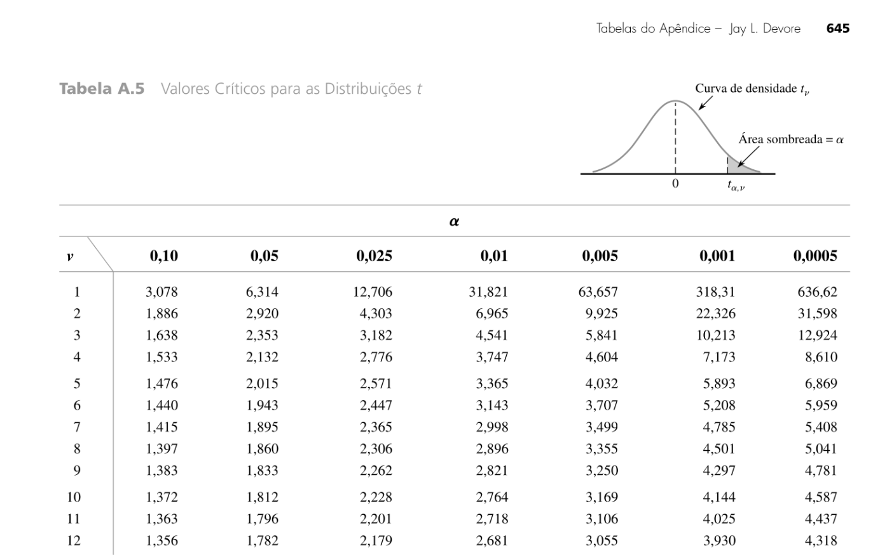{width="100%"}
:::
:::

::: {.fragment .fade-in fragment-index=4}
::: {.fragment .fade-out fragment-index=5}
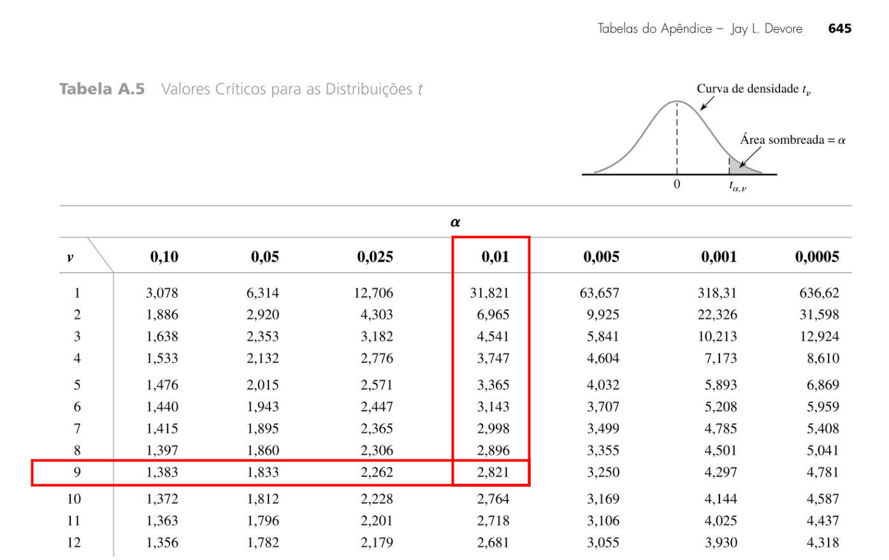{width="100%"}
:::
:::

::: {.fragment .fade-in fragment-index=5}
::: {.fragment .fade-out fragment-index=6}
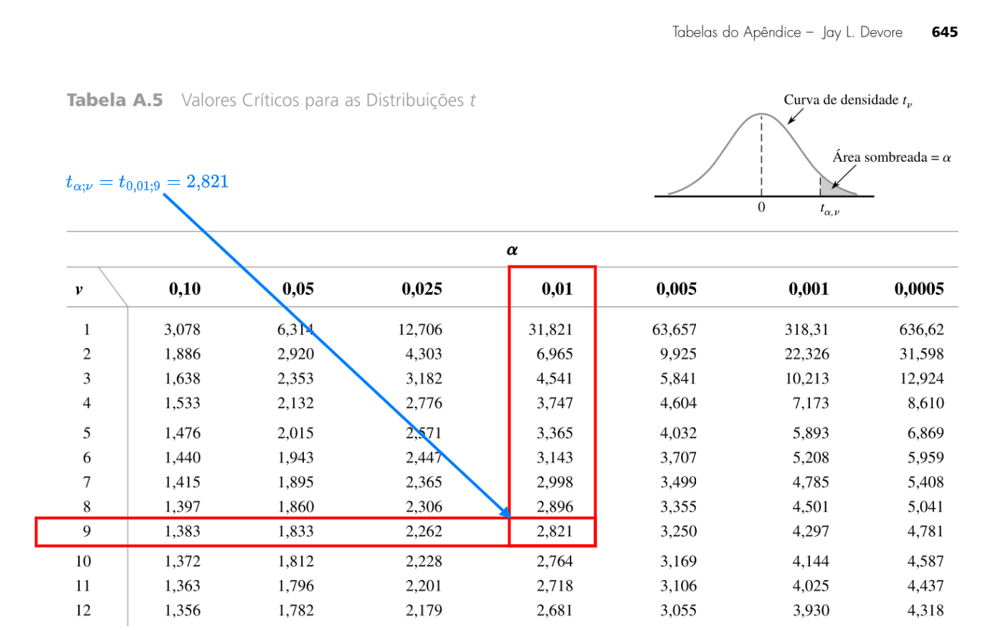{width="100%"}
:::
:::

::: {.fragment .fade-in fragment-index=6}
::: {.fragment .fade-out fragment-index=7}
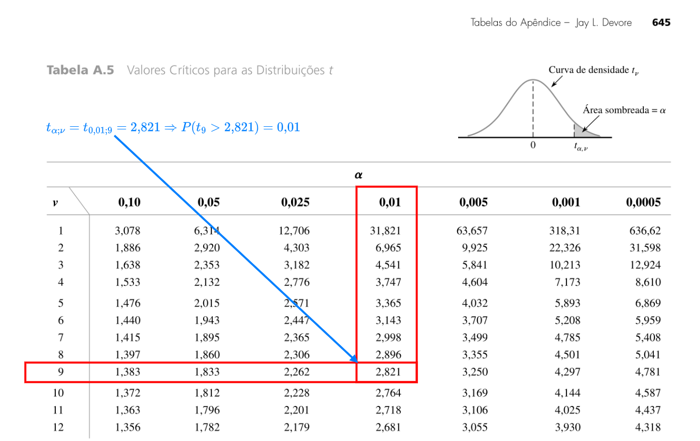{width="100%"}
:::
:::

::: {.fragment .fade-in fragment-index=7}
::: {.fragment .fade-out fragment-index=8}
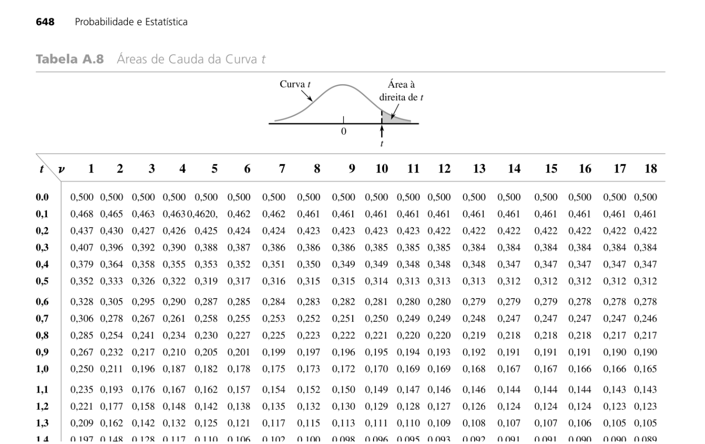{width="100%"}
:::
:::

::: {.fragment .fade-in fragment-index=8}
::: {.fragment .fade-out fragment-index=9}
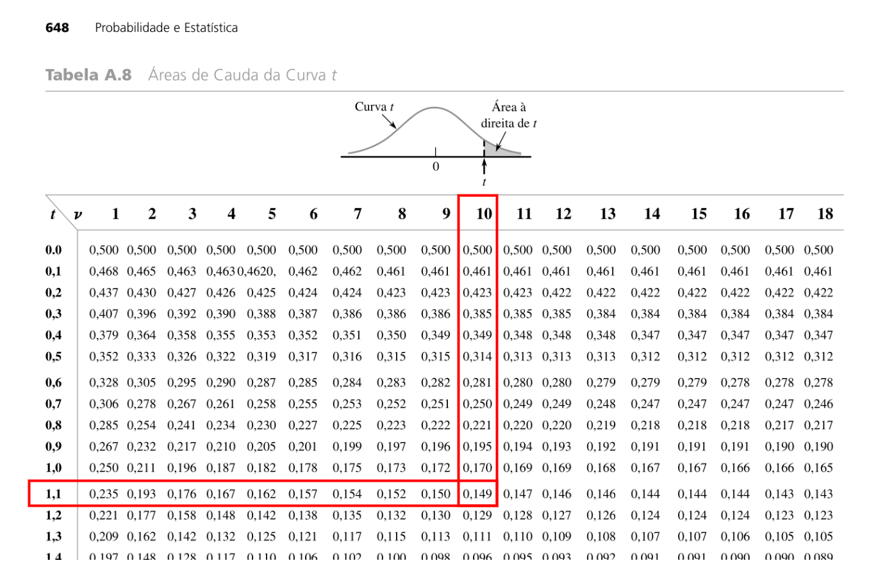{width="100%"}
:::
:::

::: {.fragment .fade-in fragment-index=9}
::: {.fragment .fade-out fragment-index=10}
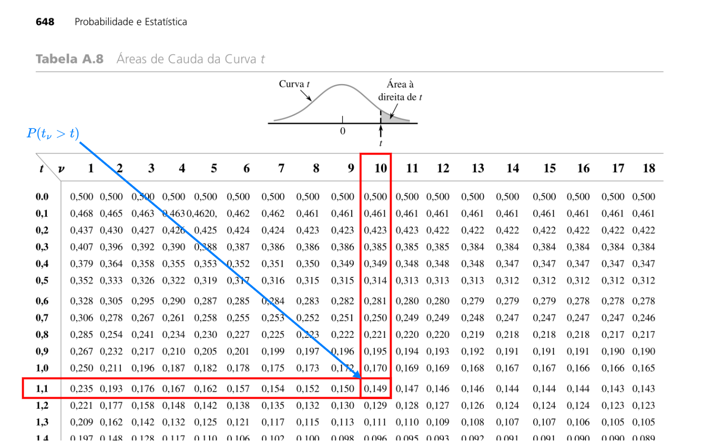{width="100%"}
:::
:::

::: {.fragment .fade-in fragment-index=10}
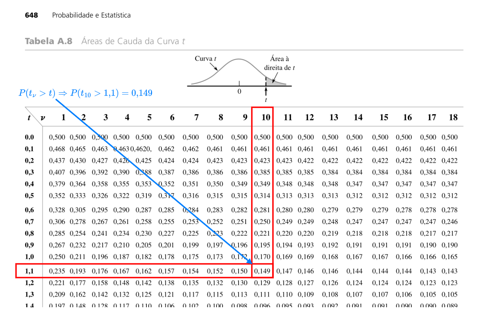{width="100%"}
:::


:::

:::

:::

## {.unnumbered .unlisted .smaller} 

###  Exemplo 9: IC para $\mu$ ($\sigma^2$ desconhecida e pop. normal) {.unnumbered .unlisted}

::: columns

::: {.column #vcenter width=67%}

Utilizando o resultado anterior, encontremos um IC para $\mu$ em função de $\bar{X}$ e $S$. [Seja $t_{\alpha,\ \nu}$ o valor tal que $P(T > t_{\alpha,\ \nu}) = \alpha$, onde $T \sim t_{\nu}$.]{.fragment fragment-index=2} [Daí,
$$
\begin{aligned}
\gamma &= P(-t_{\alpha,\ \nu} < T < t_{\alpha,\ \nu}) = P\left(-t_{\alpha,\ \nu} < \frac{\bar{X} - \mu}{S/\sqrt{n}} < t_{\alpha,\ \nu}\right) \\
&= P\left(\bar{X} - t_{\alpha,\ \nu} \frac{S}{\sqrt{n}} < \mu < \bar{X} + t_{\alpha,\ \nu} \frac{S}{\sqrt{n}}\right),
\end{aligned}
$$]{.fragment fragment-index=3}
[em que $\alpha = \frac{1-\gamma}{2}$ e $\nu = n-1$.]{.fragment fragment-index=4}

::: 

::: {.column #vcenter width=33%}

::: {style="position: relative; height: 250px;"}

::: {.fragment .fade-in fragment-index=2 style="position: absolute; top: 0; left: 0; width: 100%;"}
::: {.fragment .fade-out fragment-index=4 style="position: absolute; top: 0; left: 0; width: 100%;"}
```{r, echo=FALSE, fig.height=4, fig.width=5}
xx <- seq(from = -4, to = 4, by = 0.001)
alp <- 0.1; df <- 9
ff <- dt(x = xx, df = df)
tt <- qt(p = 1-alp, df = df)
xx1 <- xx[xx > tt]
ff1 <- ff[xx > tt]
par(mar = c(3,3,1,1))
plot(xx, ff, type="l", xlab="", ylab="")
polygon(x = c(min(xx1), xx1, max(xx1)), c(0, ff1, 0), col = "lightblue")
text(x = 1.9, y = 0.015, labels = bquote(italic("\u03B1")),adj = c(0,0))
text(x = -2, y = 0.15, labels = bquote(italic(t)[italic("\u03B1")*","~nu]),pos = 2,cex = 1.5)
arrows(x0 = -2, y0 = 0.15, x1 = tt, y1 = 0, length = 0.1)
abline(h = 0, col="darkgray")
points(tt, 0, pch=19)
mtext(text = "Densidade", side = 2, line = 2.2)
mtext(text = expression(italic(T)), side = 1, line = 2.2)
```
:::
:::

::: {.fragment .fade-in fragment-index=4 style="position: absolute; top: 0; left: 0; width: 100%;"}
::: {.fragment .fade-out fragment-index=5 style="position: absolute; top: 0; left: 0; width: 100%;"}
```{r, echo=FALSE, fig.height=4, fig.width=5}
xx <- seq(from = -4, to = 4, by = 0.001)
alp <- 0.1; df <- 9
ff <- dt(x = xx, df = df)
tt <- qt(p = 1-alp, df = df)
xx2 <- xx[xx >= -tt & xx <= tt]
ff2 <- ff[xx >= -tt & xx <= tt]
par(mar = c(3,3,1,1))
plot(xx, ff, type="l", xlab="", ylab="")
polygon(x = c(min(xx2), xx2, max(xx2)), c(0, ff2, 0), col = "lightgreen")
text(x = 0, y = 0.1, labels = bquote(italic("\u03B3")))
abline(h = 0, col="darkgray")
mtext(text = "Densidade", side = 2, line = 2.2)
mtext(text = expression(italic(T)), side = 1, line = 2.2)
```
:::
:::

::: {.fragment .fade-in fragment-index=5 style="position: absolute; top: 0; left: 0; width: 100%;"}
```{r, echo=FALSE, fig.height=4, fig.width=5}
xx <- seq(from = -4, to = 4, by = 0.001)
alp <- 0.1; df <- 9
ff <- dt(x = xx, df = df)
tt <- qt(p = 1-alp, df = df)
xx2 <- xx[xx >= -tt & xx <= tt]
ff2 <- ff[xx >= -tt & xx <= tt]
par(mar = c(3,3,1,1))
plot(xx, ff, type="l", xlab="", ylab="")
polygon(x = c(min(xx2), xx2, max(xx2)), c(0, ff2, 0), col = "lightgreen")
text(x = 0, y = 0.1, labels = bquote(italic("\u03B3")))
polygon(x = c(min(xx1), xx1, max(xx1)), c(0, ff1, 0), col = "lightblue")
text(x = 1.9, y = 0.025, labels = bquote(frac(1 - italic("\u03B3"), 2)),adj = c(0.5,0.5), cex=.7)
text(x = -2, y = 0.15, labels = bquote(italic(t)[frac(1 - italic("\u03B3"), 2)*","~n-1]),pos = 2,cex = 1.5)
arrows(x0 = -2, y0 = 0.15, x1 = tt, y1 = 0, length = 0.1)
abline(h = 0, col="darkgray")
points(tt, 0, pch=19)
mtext(text = "Densidade", side = 2, line = 2.2)
mtext(text = expression(italic(T)), side = 1, line = 2.2)
```
:::

:::

::: 

::: 

::: {.fragment .fade-in fragment-index=6}

Logo quando $\sigma^2$ é desconhecida e o tamanho amostral não é grande, se os dados vierem de uma v.a. normal, um IC para $\mu$ com coeficiente de confiança $\gamma$ é dado por

$$
\text{IC}(\mu;\; \gamma) = \left[ \bar{X} - t_{\alpha,\ \nu} \frac{S}{\sqrt{n}} \; ; \; \bar{X} + t_{\alpha,\ \nu} \frac{S}{\sqrt{n}} \right].
$$

:::

## {.unnumbered .unlisted .smaller} 

###  Exemplo 8 (cont.) {.unnumbered .unlisted}

Continuando o exemplo dos sacos de café, suponha que:

- em vez de $49$, apenas $9$ sacos tivessem sido coletados;
- os pesos dos sacos de café seguem uma distribuição normal;
- há suspeita de que a variância também possa ter sido alterada;
- como $\sigma^2$ é desconhecida, a variância amostral foi calculada e também forneceu $S^2 = 196$ ($S = 14$).

::: columns

::: {.column #vcenter width=65%}

[Como $\sigma^2$ é desconhecida e $n$ é pequeno ($n < 30$), não é razoável recorrer a consistência de $S^2$. Mas, pela normalidade da população, utilizamos a $t$-Student com $\nu = n-1 = 8$ graus de liberdade.]{.fragment fragment-index=2}

[Para uma confiança de $\gamma = 0\text{,}95$, temos $\frac{1-\gamma}{2} = 0\text{,}025$]{.fragment fragment-index=3} [e $t_{\alpha,\ \nu} = t_{\frac{1-\gamma}{2},\ n-1} = t_{0\text{,}025,\ 8} = 2\text{,}306$.]{.fragment fragment-index=4}

:::

::: {.column #vcenter width=35%}

::: {style="position: relative; height: 250px;"}

::: {.fragment .fade-in fragment-index=2}
::: {.fragment .fade-out fragment-index=4}
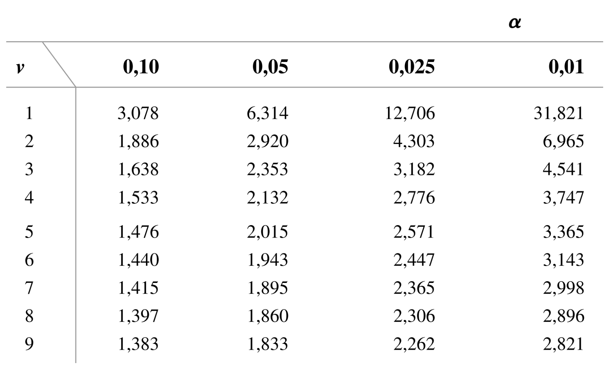{style="position: absolute; top: 0; left: 0; width: 100%;"}
:::
:::

::: {.fragment .fade-in fragment-index=4}
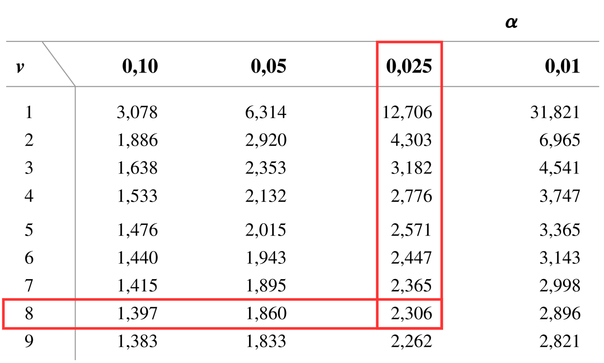{style="position: absolute; top: 0; left: 0; width: 100%;"}
:::

:::

:::

:::

## {.unnumbered .unlisted .smaller} 

###  Exemplo 8 (cont.) {.unnumbered .unlisted}

Logo,
$$
\begin{aligned}
\text{IC}(\mu; \gamma) &= \left[ \bar{X} - t_{\alpha,\ \nu} \frac{S}{\sqrt{n}} \; ; \; \bar{X} + t_{\alpha,\ \nu} \frac{S}{\sqrt{n}} \right]\\
&= \left[ 485 - 2\text{,}306 \times \frac{14}{3}; \; 485 + 2\text{,}306 \times \frac{14}{3} \right]\\
&= [474\text{,}24;\ 495\text{,}76]
\end{aligned}
$$

Comparando com o IC anterior ($n = 49$ e $\sigma^2 = 196$ conhecida), onde $[481\text{,}08;\ 488\text{,}92]$, percebemos que a amplitude do intervalo aumentou consideravelmente.

Esse aumento é reflexo do menor tamanho amostral e da variabilidade extra desencadeada pela aproximação de $\sigma^2$ por $S^2$.

Entretanto, as conclusões obtidas não foram alteradas. Isto é, como o IC obtido não cobre o valor original de $\mu = 500$, com confiança de 95\%, podemos afirmar que a máquina se desregulou.

## {.unnumbered .unlisted .smaller} 

###  Exemplo 10 {.unnumbered .unlisted}

Seja $X_1, \ldots, X_n$ uma aa de uma população $\text{Exp}(\lambda)$. Vimos que o EMV de $\lambda$ é $\hat\lambda = \frac{1}{\bar{X}}$. Vamos utilizar $\hat\lambda$ para criar dois IC para $\lambda$.

No caso de grandes amostras, como $\hat\lambda$ depende de $\bar{X}$, podemos utilizar o TCL para aproximar a distribuição de $Z_n = \frac{\bar{X} - \mu}{\sigma/\sqrt{n}}$ pela normal-padrão. Considerando que $\mu = \sigma = \frac{1}{\lambda}$, temos
$$
\begin{aligned}
\gamma &\approx P\left(-z_{\frac{\gamma}{2}} < \frac{\bar{X} - 1/\lambda}{1/(\lambda\sqrt{n})} < z_{\frac{\gamma}{2}}\right) = P\left(-z_{\frac{\gamma}{2}}\frac{1}{\sqrt{n}} < \lambda\bar{X} - 1 < z_{\frac{\gamma}{2}}\frac{1}{\sqrt{n}}\right)\\
&= P\left(\frac{1}{\bar{X}}\left[1-z_{\frac{\gamma}{2}}\frac{1}{\sqrt{n}}\right] < \lambda < \frac{1}{\bar{X}}\left[1+z_{\frac{\gamma}{2}}\frac{1}{\sqrt{n}}\right]\right) = P\left(\hat\lambda\left[1-z_{\frac{\gamma}{2}}\frac{1}{\sqrt{n}}\right] < \lambda < \hat\lambda\left[1+z_{\frac{\gamma}{2}}\frac{1}{\sqrt{n}}\right]\right)
\end{aligned}
$$
Logo, um IC para $\lambda$ com confiança (aproximadamente) $\gamma$ é
$$
\text{IC}(\lambda, \gamma) = \left[ \hat\lambda\left(1-z_{\frac{\gamma}{2}}\frac{1}{\sqrt{n}}\right);\ \hat\lambda\left(1+z_{\frac{\gamma}{2}}\frac{1}{\sqrt{n}}\right) \right].
$$

## {.unnumbered .unlisted .smaller} 

###  Exemplo 10 (cont.) {.unnumbered .unlisted}

Em pequenas amostras, o TCL pode fornecer uma aproximação imprecisa. Nesse caso, podemos recorrer ao fato que $\sum_{i=1}^nX_i \sim \text{Gama}(n, \frac{1}{\lambda})$ e que $\sum_{i=1}^nX_i = n\bar{X} = \frac{n}{\hat\lambda}$. Além disso, das propriedades da distribuição Gama, podemos concluir que $\lambda \frac{n}{\hat\lambda} \sim \text{Gama}(n, 1)$, a distribuição gama-padrão.

::: columns

::: {.column #vcenter width=55%}

[Definindo $g_{p,n}$ tal que $P(\text{Gama}(\alpha,1) \leq g_{p,\alpha}) = p$]{.fragment fragment-index=2}[, temos que]{.fragment fragment-index=3}

<div style="display: flex; justify-content: center;">

<table>
    <tr class="fragment" data-fragment-index="3">
      <td>$\gamma$</td>
      <td>$=$</td>
      <td>$P\left(g_{\frac{1-\gamma}{2},\ n} < \lambda \frac{n}{\hat\lambda} < g_{\frac{1+\gamma}{2},\ n}\right)$</td>
    </tr>
    <tr class="fragment" data-fragment-index="4" style="border-style: none;">
      <td></td>
      <td>$=$</td>
      <td>$P\left(g_{\frac{1-\gamma}{2},\ n}\frac{\hat\lambda}{n} < \lambda < g_{\frac{1+\gamma}{2},\ n}\frac{\hat\lambda}{n}\right)$</td>
    </tr>
</table>

</div>

[Assim, outro IC para $\lambda$ com confiança $\gamma$ é
$$
\text{IC}(\lambda, \gamma) = \left[g_{\frac{1-\gamma}{2},\ n}\frac{\hat\lambda}{n};\ g_{\frac{1+\gamma}{2},\ n}\frac{\hat\lambda}{n}\right].
$$]{.fragment fragment-index=5}

:::

::: {.column #vcenter width=45%}

::: {style="position: relative; height: 400px;"}

::: {.fragment .fade-in fragment-index=2 style="position: absolute; top: 0; left: 0; width: 100%;"}
::: {.fragment .fade-out fragment-index=3 style="position: absolute; top: 0; left: 0; width: 100%;"}

```{r, echo=FALSE, fig.height=4, fig.width=5, fig.align = 'center'}
xx <- seq(from = 0, to = 30, by = 0.001)
p <- 0.8; alp <- 9
ff <- dgamma(x = xx, shape = alp, rate = 1)
qq <- qgamma(p = p, shape = alp, rate = 1)
xx1 <- xx[xx <= qq]
ff1 <- ff[xx <= qq]
par(mar = c(3,3,1,1))
plot(xx, ff, type="l", xlab="", ylab="")
polygon(x = c(min(xx1), xx1, max(xx1)), c(0, ff1, 0), col = "lightblue")
text(x = 8, y = 0.05, labels = bquote(italic(p)))
text(x = 25, y = 0.05, labels = bquote(italic(g)[italic(p)*","~italic("\u03B1")]), pos = 4,cex = 1.5)
arrows(x0 = 25, y0 = 0.05, x1 = qq, y1 = 0, length = 0.1)
abline(h = 0, col="darkgray")
points(qq, 0, pch=19)
mtext(text = "Densidade", side = 2, line = 2.2)
mtext(text = expression("Gama"*(italic("\u03B1")*","~1)), side = 1, line = 2.2)
```

:::
:::

::: {.fragment .fade-in fragment-index=3 style="position: absolute; top: 0; left: 0; width: 100%;"}

```{r, echo=FALSE, fig.height=4, fig.width=5, fig.align = 'center'}
xx <- seq(from = 0, to = 30, by = 0.001)
p1 <- 0.1; p2 <- 0.9; alp <- 9
ff <- dgamma(x = xx, shape = alp, rate = 1)
qq1 <- qgamma(p = p1, shape = alp, rate = 1)
qq2 <- qgamma(p = p2, shape = alp, rate = 1)
xx1 <- xx[xx <= qq1]; ff1 <- ff[xx <= qq1]
xx2 <- xx[xx >= qq2]; ff2 <- ff[xx >= qq2]
xx3 <- xx[xx >= qq1 & xx <= qq2]; ff3 <- ff[xx >= qq1 & xx <= qq2]
par(mar = c(3,3,1,1))
plot(xx, ff, type="l", xlab="", ylab="")
polygon(x = c(min(xx3), xx3, max(xx3)), c(0, ff3, 0), col = "lightgreen")
polygon(x = c(min(xx1), xx1, max(xx1)), c(0, ff1, 0), col = "#FF7F7F")
polygon(x = c(min(xx2), xx2, max(xx2)), c(0, ff2, 0), col = "lightblue")
text(x = 2.5, y = 0.08, labels = bquote(italic(g)[frac(1-italic("\u03B3"),2)*","~italic(n)]), pos = 3,cex = 1.5)
text(x = 23, y = 0.04, labels = bquote(italic(g)[frac(1+italic("\u03B3"),2)*","~italic(n)]), pos = 4,cex = 1.5)
arrows(x0 = 2.5, y0 = 0.08, x1 = qq1, y1 = 0, length = 0.1)
arrows(x0 = 23, y0 = 0.04, x1 = qq2, y1 = 0, length = 0.1)
abline(h = 0, col="darkgray")
points(qq1, 0, pch=19)
points(qq2, 0, pch=19)
mtext(text = "Densidade", side = 2, line = 2.2)
mtext(text = expression("Gama"*(italic(n)*","~1)), side = 1, line = 2.2)
legend("topright", legend = c(expression(italic("\u03B3")), expression((1-italic("\u03B3"))/2), expression((1-italic("\u03B3"))/2)), fill = c("lightgreen", "#FF7F7F", "lightblue"), bty = "n")
```

:::

:::

:::

:::


## {.unnumbered .unlisted .smaller} 

###  Exemplo 10 (cont.) {.unnumbered .unlisted}

::: columns

::: {.column #vcenter width=60%}

Determinado tipo de bomba de aquecimento tem distribuição $\text{Exp}(\lambda)$. Uma aa de $n = 9$ bombas produziu $\hat\lambda = 0\text{,}237$.

[Para uma confiança $\gamma = 0\text{,}95$, temos o quantil da normal-padrão $z_{\frac{\gamma}{2}} = z_{0\text{,}475} = 1\text{,}96$]{.fragment fragment-index=2}[, e os da Gama]{.fragment fragment-index=3} [$g_{\frac{1-\gamma}{2},\ n} = g_{0\text{,}025,\ 9} \approx 4$ (valor exato `r format(round(qgamma(0.025, shape = 9, rate = 1), 3), decimal.mark = ",")`) e $g_{\frac{1+\gamma}{2},\ n} = g_{0\text{,}975,\ 9} \approx 15$ (valor exato `r format(round(qgamma(0.975, shape = 9, rate = 1), 3), decimal.mark = ",")`).]{.fragment fragment-index=4}

:::

::: {.column #vcenter width=40%}

::: {style="position: relative; height: 300px;"}

::: {.fragment .fade-in fragment-index=3}
::: {.fragment .fade-out fragment-index=4}
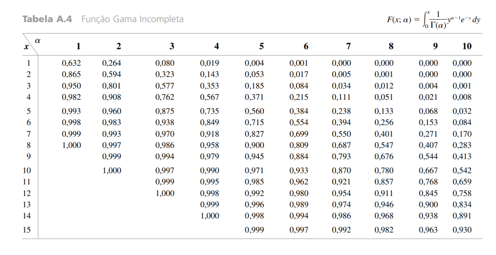{style="position: absolute; top: 0; left: 0; width: 100%;"}
:::
:::

::: {.fragment .fade-in fragment-index=4}
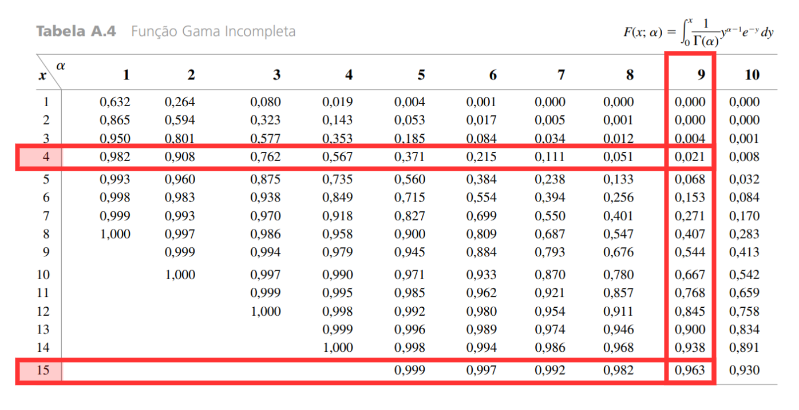{style="position: absolute; top: 0; left: 0; width: 100%;"}
:::


:::

:::

:::

[Com confiança $\gamma = 0\text{,}95$, os IC aproximado pelo TCL e "exato" são dados, respectivamente, por
$$
\textstyle \text{IC}(0\text{,}95; \lambda) = \left[ \hat\lambda\left(1\pm z_{\frac{\gamma}{2}}\frac{1}{\sqrt{n}}\right)\right] = \left[0\text{,}237\left(1\pm \frac{1\text{,}96}{3}\right)\right] = [0\text{,}082;\ 0\text{,}392],
$$]{.fragment fragment-index=5}
[$$
\textstyle \text{IC}(0\text{,}95; \lambda) = \left[g_{\frac{1-\gamma}{2},\ n}\frac{\hat\lambda}{n};\ g_{\frac{1+\gamma}{2},\ n}\frac{\hat\lambda}{n}\right] = \left[4\frac{0\text{,}237}{9};\ 15\frac{0\text{,}237}{9}\right] = [0\text{,}105;\ 0\text{,}395].
$$]{.fragment fragment-index=6}

# Testes de Hipóteses

## 3 Testes de Hipóteses {.unnumbered .unlisted}

::: {.callout-note}
## Definição

Seja $\theta$ um parâmetro populacional associado a uma v.a. $X$. Uma hipótese é qualquer afirmação feita com relação a $\theta$ que pode ser submetida a teste.
:::

::: {.callout-caution}
## Observação
Seja $\theta$ um parâmetro populacional. Os exemplos mais usuais de hipóteses com respeito a $\theta$ são:

- Simples: $\theta = \theta_0$;
- Compostas:
  + $\theta \geq \theta_0$ e $\theta > \theta_0$ (unilateral);
  + $\theta \leq \theta_0$ e $\theta < \theta_0$ (unilateral); e
  + $\theta \neq \theta_0$ (bilateral).
:::


## 3 Testes de Hipóteses {.unnumbered .unlisted}

::: {.callout-note}
## Definição

Para realizar um teste de hipóteses estatístico devemos estabelecer corretamente as hipóteses:

- Nula: é aquela que será submetida a teste. Pode ser, ou não, rejeitada; e
- Alternativa: é aquela que é aceita quando rejeitamos $H_0$.

:::

::: {.callout-caution}
## Observações

- As hipóteses nula e alternativa serão denotadas por $H_0$ e $H_1$, respectivamente;
- As hipóteses $H_0$ e $H_1$ devem ser escolhidas de modo que sejam mutuamente excludentes;
- Geralmente, mas nem sempre, $H_1$ é escolhida como o complementar de $H_0$.

:::


::: {.callout-note}
## Definição

Um teste de hipóteses é o procedimento de tomada de decisão sobre rejeitar, ou não, $H_0$.
:::

## 3 Testes de Hipóteses {.unnumbered .unlisted}

::: {.callout-important}
## Problema

Como construir um procedimento para testar entre $H_0$ e $H_1$?
:::

::: {.callout-caution}
## Observações

1. Iniciamos pela escolha de um estimador $\hat{\theta}$ do parâmetro $\theta$;
2. A partir de $\hat{\theta}$, o próximo passo é estabelecer a Região Crítica (RC) do teste.

:::

::: {.callout-note}
## Definição

A região crítica de um teste de hipóteses é um conjunto de valores que, se fornecidos pelo estimador, levam à rejeição de $H_0$. Formalmente,
$$
\text{RC}_{H_0} = \{x : \text{se } \hat{\theta} = x, H_0 \text{ é rejeitada}\}.
$$

:::

## 3 Testes de Hipóteses {.unnumbered .unlisted}

::: {style="border-style: solid; border-width: 3px; padding-bottom: 0px; padding-right: 12px; padding-left: 12px; font-size:70%;"}

**Exemplo 11:**  Suponha que desejamos testar $H_0 : \mu \geq \mu_0$. [Uma RC natural para rejeitar $H_0$ seria $RC_{H_0} = \{\bar{X} < x_c\}$.]{.fragment} [Isto é, valores muito pequenos de $\bar{X}$ suportam a rejeição de $H_0$.]{.fragment} [Determinada a forma da RC, resta determinar o **valor crítico** $x_c$, o limiar que delimita a RC.]{.fragment}

:::

::: {.callout-caution .fragment}
## Observações

1. Decidir entre rejeitar, ou não, $H_0$ pode acarretar em dois tipos de erros: o Erro tipo 1 (rejeitar $H_0$, quando $H_0$ é verdadeira); e o Erro tipo 2 (rejeitar $H_0$, quando $H_0$ é falsa);
2. Como a decisão se baseia em um estimador, ela é aleatória e, portanto, podemos atribuir probabilidades a cada tipo de erro:
  - $P(\text{Erro Tipo 1}) = P(\text{Rejeitar } H_0 \mid H_0 \text{ é verdadeira}) := \alpha(\theta)$;
  - $P(\text{Erro Tipo 2}) = P(\text{Não Rejeitar } H_0 \mid H_0 \text{ é falsa}) := \beta(\theta)$.

:::

::: {.callout-note .fragment}
## Definição

As funções $\alpha(\theta)$ e $1 - \beta(\theta)$ são denominadas de tamanho e poder do teste.
:::


## Teste para $\mu$

## $p$-valor 

::: {.callout-caution}
## Observação

Relatar o resultado de um teste de hipóteses simplesmente dizendo se a hipótese nula foi rejeitada ao nível de significância especificado pode ser inadequado, pois não mensura a quantidade de evidência obtida da amostra e impõe o mesmo nível de significância a todos os tomadores de decisão.
:::

::: {style="border-style: solid; border-width: 3px; padding-bottom: 0px; padding-right: 12px; padding-left: 12px; font-size:70%;"}

**Exemplo 12:** O tempo médio de alivio das dores do medicamento mais vendido no mercado é de 10 min. Uma empresa desenvolveu um medicamento e colocou a venda afirmando que um teste estatístico rejeitou $H_0 : \mu \geq 10$ em favor de $H_1 : \mu < 10$ ao nível de 0.1.

::: 

::: {.callout-caution}
## Observação

Uma pessoa que costuma comprar o medicamento mais vendido pode optar por nível de significância menor de 0.01, por exemplo. Isso tornaria a rejeição de $H_0$ "mais difícil". O resultado como divulgado não permite aos compradores tomarem sua própria decisão.
:::

## {.unnumbered .unlisted .smaller} 

###  Exemplo 12 (cont.) {.unnumbered .unlisted} 

::: columns

::: {.column #vcenter width=55%}

Suponha que a empresa tenha feito o teste com $n=49$ e obteve $\bar{x} = 9$ e $s^2 = 10.89$. A região crítica é da forma $\text{RC} = \{\bar{X} < x_c\}$, por meio da padronização podemos reescrevê-la como

<table style="margin-left: auto; margin-right: auto;">
  <tr style="border-bottom:none;text-align:center;">
    <td>$\text{RC} = \left\{\frac{\bar{X}-\mu_0}{S/\sqrt{n}} < \frac{x_c-\mu_0}{S/\sqrt{n}}\right\} \approx \{Z < -z_\alpha\}$,</td>
  </tr>
</table>

em que $Z = \frac{\bar{X}-\mu_0}{S/\sqrt{n}}$ e $z_\alpha$ é o valor tal que $P(Z > z_\alpha) = \alpha$. Assim, a amostra resulta em um $Z$ observado de $Z_{\text{obs}} = \frac{9-10}{3.3/\sqrt{49}} \approx -2.12$.

As figuras ao lado mostram as regiões críticas do teste para diferentes níveis de significância $\alpha$.

:::

::: {.column #vcenter width=45%}

::: fragment

```{r}
xb <- 9; s <- 3.3; n <-49; mu0 <- 10; zo <- (xb-mu0)/(s/sqrt(n))
alp <- .1; zc <- qnorm(alp)
x <- seq(-4.5, 4.5, length.out=1000)
fx <- dnorm(x = x)
par(family = "serif", mar=c(5,4,1,2))
plot(x, fx, type='n', xlab='', ylab='', main='', lwd=3,
     ylim=range(fx)+c(-.1*diff(range(fx)),.13*diff(range(fx))),
     xlim=range(x)+c(-.02*diff(range(x)),.08*diff(range(x))))
polygon(c(x[1], x[x < zc], max(x[x < zc])), c(0, fx[x<zc], 0), col = 'lightblue')
arrows(y0 = min(fx)-.1*diff(range(fx)), y1 = max(fx)+.13*diff(range(fx)), x0=0, x1=0, length = .1)
arrows(x0 = min(x)-.02*diff(range(x)), x1 = max(x)+.08*diff(range(x)), y0=0, y1=0, length = .1)
lines(x, fx, lwd=3)
arrows(x0 = 1, y0 = 0.4, x1 = zc, y1 = 0, length = .1)
points(x = zc, y = 0, pch=19, cex=.8)
text(x = 1, y=0.4, labels = bquote(-z[alpha]~"="~-z[.(alp)]~"="~-.(-round(zc, 2))), pos = 4)
points(x = zo, y = 0, pch=19, cex=.8, col='red')
text(x = zo, y=0, labels = bquote(z[obs]==.(round(zo, 2))), pos = 1, col='red')
text(x = -4.5, y=0.4, labels = bquote(Rejeitar~italic(H)[0]), pos = 4)
```
:::

:::

:::

## {.unnumbered .unlisted .smaller} 

###  Exemplo 12 (cont.) {.unnumbered .unlisted} 

::: columns

::: {.column #vcenter width=55%}

Suponha que a empresa tenha feito o teste com $n=49$ e obteve $\bar{x} = 9$ e $s^2 = 10.89$. A região crítica é da forma $\text{RC} = \{\bar{X} < x_c\}$, por meio da padronização podemos reescrevê-la como

<table style="margin-left: auto; margin-right: auto;">
  <tr style="border-bottom:none;text-align:center;">
    <td>$\text{RC} = \left\{\frac{\bar{X}-\mu_0}{S/\sqrt{n}} < \frac{x_c-\mu_0}{S/\sqrt{n}}\right\} \approx \{Z < -z_\alpha\}$,</td>
  </tr>
</table>

em que $Z = \frac{\bar{X}-\mu_0}{S/\sqrt{n}}$ e $z_\alpha$ é o valor tal que $P(Z > z_\alpha) = \alpha$. Assim, a amostra resulta em um $Z$ observado de $Z_{\text{obs}} = \frac{9-10}{3.3/\sqrt{49}} \approx -2.12$.

As figuras ao lado mostram as regiões críticas do teste para diferentes níveis de significância $\alpha$.

:::

::: {.column #vcenter width=45%}

```{r}
xb <- 9; s <- 3.3; n <-49; mu0 <- 10; zo <- (xb-mu0)/(s/sqrt(n))
alp <- .05; zc <- qnorm(alp)
x <- seq(-4.5, 4.5, length.out=1000)
fx <- dnorm(x = x)
par(family = "serif", mar=c(5,4,1,2))
plot(x, fx, type='n', xlab='', ylab='', main='', lwd=3,
     ylim=range(fx)+c(-.1*diff(range(fx)),.13*diff(range(fx))),
     xlim=range(x)+c(-.02*diff(range(x)),.08*diff(range(x))))
polygon(c(x[1], x[x < zc], max(x[x < zc])), c(0, fx[x<zc], 0), col = 'lightblue')
arrows(y0 = min(fx)-.1*diff(range(fx)), y1 = max(fx)+.13*diff(range(fx)), x0=0, x1=0, length = .1)
arrows(x0 = min(x)-.02*diff(range(x)), x1 = max(x)+.08*diff(range(x)), y0=0, y1=0, length = .1)
lines(x, fx, lwd=3)
arrows(x0 = 1, y0 = 0.4, x1 = zc, y1 = 0, length = .1)
points(x = zc, y = 0, pch=19, cex=.8)
text(x = 1, y=0.4, labels = bquote(-z[alpha]~"="~-z[.(alp)]~"="~-.(-round(zc, 2))), pos = 4)
points(x = zo, y = 0, pch=19, cex=.8, col='red')
text(x = zo, y=0, labels = bquote(z[obs]==.(round(zo, 2))), pos = 1, col='red')
text(x = -4.5, y=0.4, labels = bquote(Rejeitar~italic(H)[0]), pos = 4)
```

:::

:::

## {.unnumbered .unlisted .smaller} 

###  Exemplo 12 (cont.) {.unnumbered .unlisted} 

::: columns

::: {.column #vcenter width=55%}

Suponha que a empresa tenha feito o teste com $n=49$ e obteve $\bar{x} = 9$ e $s^2 = 10.89$. A região crítica é da forma $\text{RC} = \{\bar{X} < x_c\}$, por meio da padronização podemos reescrevê-la como

<table style="margin-left: auto; margin-right: auto;">
  <tr style="border-bottom:none;text-align:center;">
    <td>$\text{RC} = \left\{\frac{\bar{X}-\mu_0}{S/\sqrt{n}} < \frac{x_c-\mu_0}{S/\sqrt{n}}\right\} \approx \{Z < -z_\alpha\}$,</td>
  </tr>
</table>

em que $Z = \frac{\bar{X}-\mu_0}{S/\sqrt{n}}$ e $z_\alpha$ é o valor tal que $P(Z > z_\alpha) = \alpha$. Assim, a amostra resulta em um $Z$ observado de $Z_{\text{obs}} = \frac{9-10}{3.3/\sqrt{49}} \approx -2.12$.

As figuras ao lado mostram as regiões críticas do teste para diferentes níveis de significância $\alpha$.

:::

::: {.column #vcenter width=45%}

```{r}
xb <- 9; s <- 3.3; n <-49; mu0 <- 10; zo <- (xb-mu0)/(s/sqrt(n))
alp <- .01; zc <- qnorm(alp)
x <- seq(-4.5, 4.5, length.out=1000)
fx <- dnorm(x = x)
par(family = "serif", mar=c(5,4,1,2))
plot(x, fx, type='n', xlab='', ylab='', main='', lwd=3,
     ylim=range(fx)+c(-.1*diff(range(fx)),.13*diff(range(fx))),
     xlim=range(x)+c(-.02*diff(range(x)),.08*diff(range(x))))
polygon(c(x[1], x[x < zc], max(x[x < zc])), c(0, fx[x<zc], 0), col = 'lightblue')
arrows(y0 = min(fx)-.1*diff(range(fx)), y1 = max(fx)+.13*diff(range(fx)), x0=0, x1=0, length = .1)
arrows(x0 = min(x)-.02*diff(range(x)), x1 = max(x)+.08*diff(range(x)), y0=0, y1=0, length = .1)
lines(x, fx, lwd=3)
arrows(x0 = 1, y0 = 0.4, x1 = zc, y1 = 0, length = .1)
points(x = zc, y = 0, pch=19, cex=.8)
text(x = 1, y=0.4, labels = bquote(-z[alpha]~"="~-z[.(alp)]~"="~-.(-round(zc, 2))), pos = 4)
points(x = zo, y = 0, pch=19, cex=.8, col='red')
text(x = zo, y=0, labels = bquote(z[obs]==.(round(zo, 2))), pos = 1, col='red')
text(x = -4.5, y=0.4, labels = bquote(Não~rejeitar~italic(H)[0]), pos = 4)
```

:::

:::

## 3.2 $p$-valor {.unnumbered .unlisted}

::: columns

::: {.column #vcenter width=55%}

::: {.callout-note}
## Definição

O $p$-valor é o menor nível de significância em que $H_0$ é rejeitada, quando um teste é usado em um determinado conjunto de dados.
:::

::: {.callout-caution}
## Observação

Uma vez que o $p$-valor foi determinado, a conclusão no nível $\alpha$, resulta da seguinte comparação: se $p$-valor $\leq \alpha$ implica rejeição de $H_0$ no nível $\alpha$; se $p$-valor $> \alpha$ implica não-rejeição de $H_0$ no nível $\alpha$.
:::

:::

::: {.column #vcenter width=45%}

::: fragment

```{r}
xb <- 9; s <- 3.3; n <-49; mu0 <- 10; zo <- (xb-mu0)/(s/sqrt(n))
alp <- .01; zc <- qnorm(alp)
x <- seq(-4.5, 4.5, length.out=1000)
pv <- pnorm(q = zo)
fx <- dnorm(x = x)
par(family = "serif", mar=c(5,4,1,2))
plot(x, fx, type='n', xlab='', ylab='', main='', lwd=3,
     ylim=range(fx)+c(-.1*diff(range(fx)),.13*diff(range(fx))),
     xlim=range(x)+c(-.02*diff(range(x)),.08*diff(range(x))))
polygon(c(x[1], x[x < zo], max(x[x < zo])), c(0, fx[x<zo], 0), col = rgb(red=1,green = 0, blue = 0, alpha = .3))
arrows(y0 = min(fx)-.1*diff(range(fx)), y1 = max(fx)+.13*diff(range(fx)), x0=0, x1=0, length = .1)
arrows(x0 = min(x)-.02*diff(range(x)), x1 = max(x)+.08*diff(range(x)), y0=0, y1=0, length = .1)
lines(x, fx, lwd=3)
arrows(x0 = 1.5, y0 = 0.25, x1 = -2.35, y1 = 0.012, length = .05)
text(x = 1.5, y=0.25, labels = bquote(italic(p)-valor==.(round(pv, 4))), pos = 4)
points(x = zo, y = 0, pch=19, cex=.8, col='red')
text(x = zo, y=0, labels = bquote(z[obs]==.(round(zo, 2))), pos = 1, col='red')
```

:::

:::

:::

## 3.2 $p$-valor {.unnumbered .unlisted}

::: {.callout-caution}
## Observações

1. Nos testes para $\mu$ em que usamos as estatísticas $Z = \frac{\bar{X}-\mu_0}{\sigma/\sqrt{n}}$ (ou $S$ no lugar de $\sigma$ se $n$ grande) e $T = \frac{\bar{X}-\mu_0}{S/\sqrt{n}}$ (se $n$ pequeno numa população normal), o cálculo do $p$-valor depende da forma de $H_1$;
2. No teste $Z$, temos
<table style="margin-left: auto; margin-right: auto;">
  <tr style="border-bottom:none;text-align:center;">
    <td>$p$-valor $= \begin{cases}1-\Phi(z_{\text{obs}}), & H_1 : \mu > \mu_0\\ \Phi(z_{\text{obs}}), & H_1 : \mu < \mu_0\\ 2[1-\Phi(|z_{\text{obs}}|)], & H_1 : \mu \neq \mu_0\end{cases}$;</td>
  </tr>
</table>
3. No teste $T$, temos
<table style="margin-left: auto; margin-right: auto;">
  <tr style="border-bottom:none;text-align:center;">
    <td>$p$-valor $= \begin{cases}1-F_T(t_{\text{obs}}), & H_1 : \mu > \mu_0\\ F_T(t_{\text{obs}}), & H_1 : \mu < \mu_0\\ 2[1-F_T(|t_{\text{obs}}|)], & H_1 : \mu \neq \mu_0\end{cases}$,</td>
  </tr>
</table>
em que $F_T(\cdot)$ é a fda da distribuição $t$-student com $n-1$ graus de liberdade e $t_{\text{obs}} = \frac{\bar{x}_{\text{obs}}-\mu_0}{s_{\text{obs}}/\sqrt{n}}$.
:::

# FIM {.unnumbered .unlisted}

# APAGAR DPS 1 {.unnumbered .unlisted}

::: {.callout-caution}
## Observação

:::

::: {.callout-note}
## Definição

:::

::: {.callout-warning}
## Propriedade

:::

::: {.callout-tip}
## Exercício

:::

::: {.callout-important}
## Problema

:::


::: {style="border-style: solid; border-width: 3px; padding-bottom: 0px; padding-right: 12px; padding-left: 12px; font-size:70%;"}

**Exemplo:** 

::: 

# APAGAR DPS 2 {.unnumbered .unlisted}

::: columns

::: {.column #vcenter width=45%}
1
:::

::: {.column #vcenter width=55%}
2

3

4
:::

:::


```{=latex}
\begin{align*}
\Omega &= \{(1,1), (1,2), \ldots, (4,4)\}\\
       &= \{(x,y) : x,y = 1,\ldots,4\}.
\end{align*}
```


# FIM {.unnumbered .unlisted}
